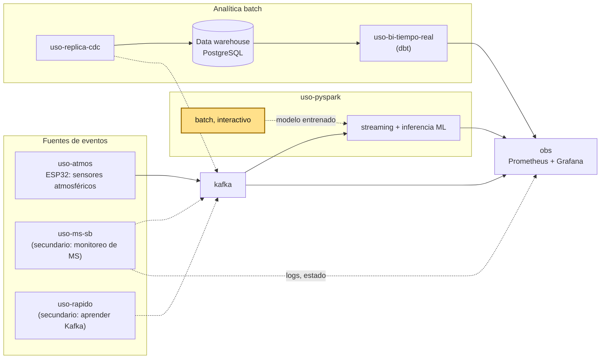
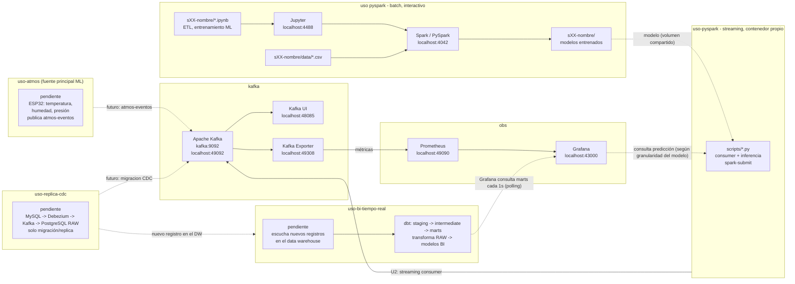

# Big Data 2026-2

Curso teórico-práctico de Big Data: arquitecturas Lambda/Kappa, procesamiento batch y streaming, observabilidad, analítica/ML distribuida y visualización BI.

[`lambda26`](https://github.com/262bigdata/lambda26) es un entorno integrado de procesamiento distribuido en batch y streaming con Spark y Kafka, con laboratorios reproducibles basados en Docker. El curso construye pipelines de datos, gestiona almacenamiento analítico en Parquet, aplica observabilidad y desarrolla soluciones BI/ML distribuidas.

## Producto del curso

Producto del curso = Producto U3:

```text
Sistema Big Data distribuido end-to-end para procesamiento batch y streaming,
analítica/ML, observabilidad y visualización BI para la toma de decisiones.
```

Resultado esperado del curso:

Al finalizar el curso, el estudiante implementa, integra y sustenta una solución Big Data end-to-end que combina pipelines batch distribuidos, ingesta y procesamiento de eventos en tiempo real, analítica/ML a escala, observabilidad técnica y una capa de visualización BI, demostrando valor para la toma de decisiones. El producto se presenta en equipo, pero cada estudiante evidencia y defiende su aporte individual.

## Contenido

### U1: Arquitecturas Big Data y ETL batch distribuido

Producto U1: pipeline batch de ETL distribuido con salidas analíticas en Parquet listas para BI/ML.

Resultado esperado U1: el estudiante construye un pipeline batch reproducible con procesamiento distribuido, aplica transformaciones sobre datos a escala, valida la calidad básica de los datos, organiza salidas en formatos analíticos como Parquet y deja un dataset preparado para consumo BI/ML.

| Sesión | Tema (sílabo) | Módulo `lambda26` | Trabajo principal |
|---|---|---|---|
| [S1](sesiones/S01_Arquitectura_Big_Data_Lambda_Kappa.md) | Arquitectura Big Data: arquitecturas Lambda y Kappa, batch vs. streaming. | `uso-pyspark` | Arquitectura Big Data seleccionada y justificada (Lambda o Kappa) para un caso de negocio propio. |
| [S2](sesiones/S02_Fundamentos_PySpark_Transformaciones_Lazy_Evaluation.md) | Fundamentos PySpark: extracción, transformaciones, funciones, agrupaciones, agregaciones, RDD y evaluación perezosa (lazy evaluation). | `uso-pyspark` | Transformaciones distribuidas documentadas, con evidencia del plan de ejecución (`explain()`). |
| [S3](sesiones/S03_Procesamiento_Calidad_Datos_Particionamiento.md) | Procesamiento distribuido y carga de datos particionada en HDFS y formatos analíticos, con validación de calidad de datos. | `uso-pyspark` | Salida analítica particionada en formato columnar, con controles de calidad (esquema, nulos, duplicados). |
| S4 | ML distribuido con Spark MLlib (Regresión). | `uso-pyspark` | Modelo de regresión distribuida entrenado, con métricas iniciales documentadas. |
| S5 | Integración del procesamiento batch distribuido: arquitectura, PySpark, HDFS, formatos analíticos, particionamiento y ML distribuido. | — | **Producto U1:** pipeline batch de ETL distribuido con salidas analíticas en Parquet listas para BI/ML. |

### U2: Sistema Big Data en tiempo real: ingesta, streaming, observabilidad y BI/ML

Producto U2: pipeline en tiempo real con ingesta de eventos empresariales e IoT/sensores, procesamiento streaming con Spark, observabilidad/costos y salidas BI/ML distribuidas.

Resultado esperado U2: el estudiante implementa un pipeline Big Data en tiempo real que integra ingesta de eventos mediante Kafka, procesamiento distribuido con Spark Structured Streaming, observabilidad con Grafana y estimación de costos operacionales, y prepara salidas BI/ML distribuidas con series de tiempo e inferencia.

| Sesión | Tema (sílabo) | Módulo `lambda26` | Trabajo principal |
|---|---|---|---|
| S6 | Ingesta de eventos empresariales en tiempo real. | `uso-rapido` / `uso-ms-sb` + `kafka` | Publicación y consumo de eventos empresariales por Kafka, con contrato de evento documentado. |
| S7 | Ingesta de eventos IoT/sensores en tiempo real. | `uso-atmos` + `kafka` | Simulación de eventos de sensores integrada al pipeline de Kafka. |
| S8 | Procesamiento en streaming con Spark: ventanas, watermarking y semántica de entrega. | `uso-pyspark` (consumidor) + `kafka` | Pipeline streaming con ventanas, watermarking y checkpointing. |
| S9 | Observabilidad con Grafana y costos. | `obs` | Tablero de observabilidad con métricas, umbrales y estimación de costos. |
| S10 | Series de tiempo e inferencia en streaming. | `uso-pyspark` | Modelo o inferencia de series de tiempo aplicado sobre datos batch y/o streaming. |
| S11 | BI/ML distribuido con Spark: KPIs del BI y visualización de la predicción de series de tiempo. | `uso-pyspark` + `obs` | KPIs del flujo de eventos y predicción de series de tiempo visualizados en Grafana. |
| S12 | Integración del procesamiento en tiempo real: Kafka, eventos empresariales e IoT, Spark Structured Streaming, observabilidad, costos y salidas BI/ML. | — | **Producto U2:** pipeline en tiempo real con ingesta, streaming, observabilidad/costos y salidas BI/ML distribuidas. |

### U3: Integración, DataOps y despliegue del sistema final

Producto U3 / producto del curso: sistema Big Data distribuido end-to-end para procesamiento batch y streaming, analítica/ML, observabilidad y visualización BI para la toma de decisiones.

Resultado esperado U3: el estudiante integra los componentes desarrollados en las unidades anteriores, despliega o empaqueta el sistema mediante prácticas de DataOps/DevOps, prepara una demo end-to-end, documenta la operación del sistema, valida resultados técnicos y analíticos, y sustenta una solución final orientada a la toma de decisiones.

| Sesión | Tema (sílabo) | Módulo `lambda26` | Trabajo principal |
|---|---|---|---|
| S13 | Integración del sistema, DataOps y BI. | todos | Demo end-to-end de batch, streaming, observabilidad y BI/ML integrados. |
| S14 | Revisión técnica final y hardening. | todos | Checklist de hardening, guion de demostración y documentación operativa. |
| S15 | Integración del sistema Big Data end-to-end: procesamiento batch y streaming, DataOps, observabilidad, BI/ML, documentación y despliegue. | — | **Producto final:** sistema Big Data distribuido end-to-end, defendido técnicamente. |
| S16 | Integración de sistemas Big Data: evaluación final. | — | Evaluación final individual: demostración y preguntas técnicas pendientes. |

## Arquitectura `lambda26`

### Nivel 1: Contexto (vista simple)



`uso-pyspark` (batch) es el único componente activo en S1 — el resto se retoma progresivamente desde S6 en adelante. `uso-atmos` es la fuente principal de la inferencia ML en streaming de S10: un ESP32 con sensores captura variables atmosféricas (temperatura, humedad, presión) y las publica como `atmos-eventos` en Kafka; `uso-pyspark` (streaming) las consume, les aplica el modelo entrenado en S4 (`.transform()` por micro-batch) y genera la predicción del siguiente paso de tiempo, que Grafana muestra por polling. Predecir el siguiente valor de una variable continua es un caso de series de tiempo natural. `uso-rapido` y `uso-ms-sb` son casos de uso secundarios: el primero para aprender Kafka, el segundo para monitorear logs/estado de microservicios en Grafana — ninguno es la fuente de la predicción. El detalle completo de cada módulo, puertos y conexiones internas está en el Nivel 2.

### Nivel 2: Detalle de contenedores


 
- `uso-pyspark` tiene dos partes, en **contenedores separados** (no se mezcla lo interactivo con lo que corre en producción): la parte batch/interactiva (U1) — notebooks, Jupyter y Spark local, con datos y salidas dentro de la carpeta de cada sesión (`sXX-nombre/`) — y la parte streaming (`scripts/*.py`, S8 y S10), un contenedor propio que reutiliza la misma imagen con PySpark pero ejecuta `spark-submit` en vez de Jupyter, como proceso persistente. Un notebook no es apto para un job que debe correr sin parar; y un job de producción no debería competir por recursos con el contenedor de exploración. El entrenamiento de un modelo ML es siempre batch (MLlib no soporta aprendizaje incremental) y ocurre en el contenedor interactivo (S4); la *inferencia* sí puede aplicarse en streaming — el contenedor de `scripts/*.py` monta como volumen compartido (de solo lectura) el modelo ya entrenado en S4, y le aplica `.transform()` a cada micro-batch que llega por Kafka, sin reentrenar.
- La predicción de `scripts/*.py` (S10) se escribe en una tabla de Postgres (no en un archivo ni en memoria del proceso), para que Grafana la consulte igual que consulta `marts`. Grafana muestra la predicción del siguiente paso de tiempo (minuto, hora, u otra granularidad, según con qué haya sido entrenado el modelo en S4) — no un valor fijo, se actualiza en cada corrida del script. No se usa Streamlit para esto: Streamlit sirve para una app ML interactiva (carga el modelo, tiene incluso una nube gratuita para desplegarla), pero no es un dashboard en vivo — no encaja con el requisito de mostrar la inferencia en streaming.
- `uso-rapido` y `uso-ms-sb` son casos de uso **secundarios**, con propósitos distintos entre sí: `uso-rapido` (`ec-orden-py`) es el ejercicio más simple para aprender Kafka — publicar y consumir eventos sin la complejidad de microservicios completos. `uso-ms-sb` (`ec-orden-ms`, `ec-pago-ms`) es para **monitorear la aplicación**: logs y estado de los microservicios, expuestos vía Actuator + Micrometer y scrapeados por el mismo Prometheus de `obs`, visualizados en Grafana — no es solo un ejemplo de eventos de negocio, es el caso de uso de observabilidad a nivel de aplicación (`obs` observa Kafka; `uso-ms-sb` observa los propios microservicios). Ninguno de los dos alimenta la inferencia ML de S10.
- `uso-atmos` es el caso de uso **principal para la inferencia ML en streaming** (S10): sensores de variables atmosféricas (temperatura, humedad, presión) publicando `atmos-eventos` — predecir el siguiente valor de una serie de tiempo continua encaja de forma natural con este tipo de dato, a diferencia de eventos de negocio discretos. `uso-replica-cdc` (solo migración/replica CDC) también queda pendiente. Ambos se retoman según el alcance de cada equipo.
- `uso-bi-tiempo-real` es un módulo aparte de `uso-replica-cdc`: `uso-replica-cdc` únicamente replica (MySQL -> Debezium -> Kafka -> PostgreSQL RAW), no transforma. `uso-bi-tiempo-real` escucha los nuevos registros que llegan al data warehouse (por ejemplo con `LISTEN`/`NOTIFY` de PostgreSQL) y dispara un proyecto dbt (mismas capas que BI: `staging` → `intermediate` como views, `marts` como tables, con su propio `profile: lambda26` apuntando por `type: postgres` al mismo RAW) para generar los modelos BI — sin esto, las tablas `marts` quedarían desactualizadas. Grafana no recibe un aviso de dbt: **consulta** (polling) las tablas `marts` en su propio intervalo de refresco (configurable, hasta cada 1 segundo), así que ve el dato transformado en cuanto dbt termina de correr.
- `kafka` es la columna vertebral de ingesta y `obs` (Prometheus/Grafana) da observabilidad sobre el Kafka Exporter — ambos se integran desde U2.
- El curso no usa una herramienta de BI aparte (como Power BI): **Grafana** cumple ese rol — además de observabilidad técnica, visualiza los KPIs de negocio (ya transformados por `uso-bi-tiempo-real`) en tiempo real (refresco configurable, hasta cada 1 segundo).

## Flujo de trabajo

1. El equipo decide la arquitectura Big Data (Lambda o Kappa) para su propio caso de negocio, apoyándose en el módulo `uso-pyspark` para reconocer el ecosistema (S1).
2. El procesamiento batch se construye con PySpark sobre `uso-pyspark`: extracción, transformaciones, particionamiento, formatos analíticos y un primer modelo ML distribuido (S2-S5).
3. La ingesta en tiempo real se activa sobre `kafka`: primero con eventos de negocio (`uso-rapido`/`uso-ms-sb`, S6 — caso secundario, práctica del patrón pub/sub) y luego con eventos IoT/sensores de variables atmosféricas (`uso-atmos`, S7 — caso principal, es la fuente que alimenta la inferencia ML de S10).
4. El procesamiento streaming con Spark Structured Streaming corre como `scripts/*.py` (`spark-submit`, proceso persistente, no notebook) sobre `uso-pyspark`: el consumer de Kafka (S8) y la inferencia en vivo sobre los `atmos-eventos` de `uso-atmos`, con el modelo entrenado en S4 (S10). La observabilidad (`obs`) y las salidas BI/ML distribuidas se integran en el resto de U2 (S9, S11-S12).
5. El sistema completo se integra, se estabiliza con prácticas DataOps/DevOps y se defiende técnicamente en U3 (S13-S16).

## Enlaces

- [Sílabo 2026-2](silabo_bigdata_2026_2.md)
- [S1 - Arquitectura Big Data: Lambda y Kappa, batch vs. streaming](sesiones/S01_Arquitectura_Big_Data_Lambda_Kappa.md)
- [S2 - Fundamentos PySpark: transformaciones, funciones, agrupaciones y evaluación perezosa](sesiones/S02_Fundamentos_PySpark_Transformaciones_Lazy_Evaluation.md)
- [S3 - Procesamiento y Calidad de Datos: filtrado, duplicados, nulos y particionamiento analítico](sesiones/S03_Procesamiento_Calidad_Datos_Particionamiento.md)
- [Guía de Proyecto Sello](proyecto-sello/index.md)
