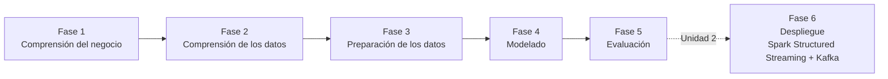

# Aplicación de CRISP-DM al Proyecto

Los cuatro notebooks del Producto U1 (uno por integrante, uno por dimensión) siguen la misma metodología estándar de minería de datos, **CRISP-DM**, aplicada de forma consistente sobre el dataset común de flujos de red del campus (~400 000 registros, 83 columnas, capturado vía Suricata). Cada notebook cubre las **Fases 1 a 5**; la **Fase 6 (Despliegue)** queda para Unidad 2, donde el modelo entrenado en batch se pone a inferir en vivo sobre flujos Kafka (dimensión U2 de cada integrante, ver el [Brief técnico-analítico](../proyecto-sello/brief.md)).

## Fase 1 — Comprensión del negocio

Cada integrante parte de **una dimensión** de la pregunta central del brief (¿cómo caracterizar el comportamiento de los flujos de tráfico del campus para anticipar carga y detectar patrones atípicos?), la redacta como pregunta de negocio propia, define el **objetivo de minería de datos** (qué tipo de modelo entrenar), la **decisión que habilita** la respuesta y un **criterio de éxito** cuantitativo definido *antes* de entrenar, frente a una **línea base ingenua**:

| Integrante | Objetivo de minería de datos | Línea base ingenua | Criterio de éxito (orientativo) |
|---|---|---|---|
| Nick | Regresión de `bytes_per_s` | Promedio histórico de `bytes_per_s` | RMSE por debajo de la línea base con margen; R² > 0.5 |
| Jhan | Regresión de `flow_duration` | Mediana histórica de `flow_duration` | Reducción de RMSE ≥ 20% frente a la línea base |
| Henyelrey | Clasificación de tipo de servicio (vs. catálogo IANA) | Clase más frecuente (accuracy de la clase mayoritaria) | Accuracy y F1 ponderado 15-20 pp por encima de la línea base |
| David | Clasificación de dirección dominante (`down_up_ratio` en 3 categorías por cuantiles) | Clase mayoritaria (~33-34% por construcción) | Accuracy > 50% |

## Fase 2 — Comprensión de los datos

Los cuatro notebooks parten del **mismo esquema explícito** (`StructType` con las 83 columnas del dataset Suricata) y de la misma disciplina de extracción, heredada del hallazgo documentado en S03 del curso: con `header=True` + `StructType` explícito, Spark asigna los campos **por posición**, no por nombre — si el orden de `StructField` no coincide con el orden físico del CSV, los valores se corrompen en silencio. Por eso cada notebook valida el header real del archivo contra el esquema declarado antes de continuar (`assert`).

La exploración inicial (EDA) es específica de cada dimensión: describe la variable objetivo (`bytes_per_s`, `flow_duration`, distribución de `dst_port`, `down_up_ratio`), cuenta nulos en las columnas clave, calcula cuantiles/percentiles y establece la línea base ingenua definida en la Fase 1 con los datos reales.

## Fase 3 — Preparación de los datos

Cada integrante deriva su variable de análisis (columna `protocolo` a partir de `ip_prot`; `categoria_servicio_ref` cruzando `dst_port` contra un catálogo IANA simplificado; `categoria_direccion` discretizando `down_up_ratio` por cuantiles 33/66), confirma con `.explain(True)` en qué punto Spark deja de ser perezoso, y aplica control de calidad: deduplicación por `flow_id` (`dropDuplicates`) y relleno o descarte de nulos en las columnas clave (`na.fill` / `na.drop`).

La salida de esta fase se persiste como **Parquet particionado** (`partitionBy` sobre la variable derivada de cada dimensión: `protocolo`, `categoria_servicio_ref` o `categoria_direccion`), y se relee para verificar el conteo de filas y confirmar `PartitionFilters` en el plan de ejecución — el mismo patrón de particionamiento analítico visto en S03, aplicado ahora sobre el dataset propio.

Después, cada notebook ensambla su **vector de features** con `VectorAssembler`, eligiendo predictores relevantes a su dimensión y **excluyendo a propósito** las columnas que causarían fuga de información (`dst_port`/`src_port` en la dimensión de Henyelrey, porque son la fuente de la propia etiqueta de referencia; las columnas de tamaño/bytes en la dimensión de David, porque `down_up_ratio` se deriva directamente de ellas). Los datos de clasificación pasan además por `StringIndexer` para convertir la categoría en `label_idx`.

## Fase 4 — Modelado

Los notebooks de regresión (Nick, Jhan) comparan `LinearRegression` — con y sin regularización (Ridge/L2, Lasso/L1, Elastic Net) — contra `RandomForestRegressor`. Los notebooks de clasificación (Henyelrey, David) comparan `LogisticRegression` — base y regularizada — contra `RandomForestClassifier`. Todos parten de la misma partición `randomSplit([0.8, 0.2], seed=42)` sobre el Parquet limpio de la Fase 3.

## Fase 5 — Evaluación

Cada modelo se evalúa contra la línea base ingenua de la Fase 1 con `RegressionEvaluator` (RMSE, R², MAE) o `MulticlassClassificationEvaluator` (accuracy, F1, precisión ponderada), y los notebooks de clasificación añaden una matriz de confusión (predicción vs. categoría real). El notebook deja explícito el criterio para elegir el modelo ganador (menor RMSE / mayor F1 que además cumpla el criterio de éxito de la Fase 1) y el punto donde se persiste (`model.write().overwrite().save(...)`).

De los cuatro, el notebook de **Nick** (volumen de tráfico) ya fue ejecutado en S04 con el dataset real, con `RandomForestRegressor` guardado como modelo ganador. Los notebooks de **Jhan, Henyelrey y David** están completos de punta a punta pero con los resultados numéricos (RMSE/R²/accuracy/F1 reales y la elección del ganador) pendientes de ejecución contra el corte completo del dataset — ver el detalle en las páginas de [contribución por integrante](../index.md#contenido-del-sitio) y en el [Informe de Unidad 1](Informe_Unidad_1.md).

## Fase 6 — Despliegue (fuera de alcance de U1)

Ningún notebook de U1 implementa la Fase 6: poner el modelo entrenado a inferir sobre flujos en vivo es, por diseño de la arquitectura Lambda del equipo, la dimensión **U2** de cada integrante — Spark Structured Streaming consumiendo el tópico Kafka de Suricata, con el modelo de series de tiempo/clasificación calibrado en el histórico de esta unidad. Esa capa de velocidad se construye en Unidad 2, sobre la misma base de datos y modelos que documenta este producto.
