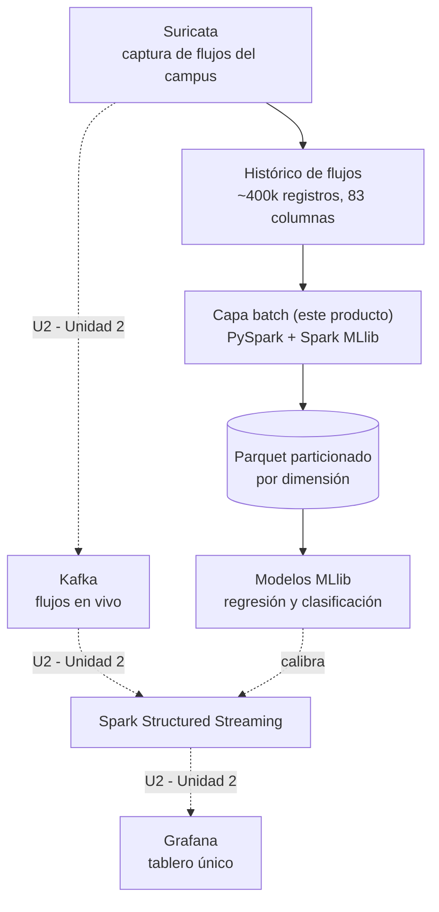

# u1-producto.md — Pipeline batch de ETL distribuido con salidas analíticas en Parquet listas para BI/ML

Producto de Unidad 1 del sílabo, evaluado en **S5**, para el equipo **LLSW3** (sección GU), instrumento propio: tráfico de red del campus universitario (~400 000 flujos, 83 columnas, capturado vía Suricata). Este documento sigue la estructura exigida por la guía de evaluación de S5 (4 secciones + rúbrica), con el contenido real construido por el equipo entre S1 y S4 sobre su propio instrumento — no sobre los datasets de ejemplo del docente (H&M, campo eléctrico/magnético).

La sustentación de S5 es **individual**: cada integrante defiende su propia dimensión U1 (ver [Brief técnico-analítico](../proyecto-sello/brief.md), sección 3, y la [página de contribución](../index.md#contenido-del-sitio) de cada uno). Este documento consolida las cuatro dimensiones a nivel de equipo, tal como lo pide la plantilla.

## 1. Arquitectura Big Data seleccionada

**Arquitectura: Lambda.**

- **Justificación (S1):** el corpus histórico (~400 000 flujos) requiere reprocesamiento batch para control de calidad, consistencia de features y, sobre todo, para la asignación definitiva de la columna `label` (hoy `NeedLabel` en todos los registros), que se valida por lotes cuando el criterio de etiquetado se ajusta — no dato por dato. Kappa no resuelve bien esa recomputación diferida sobre el histórico completo; Lambda separa capa batch (este producto) y capa de velocidad (Kafka, Unidad 2) precisamente para eso.
- **Tecnologías propuestas:** PySpark (extracción, transformación, MLlib) sobre Docker/Jupyter para la capa batch; Kafka + Spark Structured Streaming + Grafana para la capa de velocidad en Unidad 2.
- **Supuestos:** el esquema de 83 columnas del dataset Suricata es estable entre capturas; el catálogo IANA de puertos usado como referencia externa no cambia con frecuencia; los cuatro integrantes comparten el mismo archivo histórico como fuente batch.
- **Riesgos:** la columna `label` sin asignar limita cualquier análisis de seguridad hasta que se complete el etiquetado por lotes; un cambio en el orden de columnas del CSV real rompería el `StructType` explícito en silencio (mitigado con el `assert` contra el header real, ver sección 2); el volumen de ~400 000 filas exige verificar que el particionamiento (sección 3) no genere demasiados archivos pequeños.

## 2. Transformaciones distribuidas con PySpark

Los cuatro notebooks parten del **mismo esquema explícito** (`StructType` con las 83 columnas del dataset) y de la misma disciplina de extracción documentada en S03: con `header=True` + esquema explícito, Spark asigna los campos **por posición**, no por nombre — si el orden de `StructField` no coincide con el orden físico del CSV, los valores se corrompen en silencio. Cada notebook valida el header real contra el esquema declarado (`assert`) antes de continuar.

Cada integrante deriva y transforma una variable propia de su dimensión, y confirma con `.explain(True)` el punto en que Spark deja de ser perezoso (lazy evaluation):

| Integrante | Transformación principal (`withColumn`/`join`/`when`) | Agregación (`groupBy`/`agg`) |
|---|---|---|
| Nick | Deriva `protocolo` (TCP/UDP/OTRO) desde `ip_prot`; filtra `bytes_per_s` no nulo | `bytes_per_s` promedio y máximo por protocolo |
| Jhan | Deriva `protocolo` desde `ip_prot`; filtra `flow_duration` no nulo y > 0 | Duración promedio y mediana (`percentile_approx`) por protocolo |
| Henyelrey | `join` contra catálogo IANA por `dst_port` → deriva `categoria_servicio_ref` | Distribución de flujos por categoría de servicio |
| David | Calcula cuantiles (p33/p66) de `down_up_ratio` → deriva `categoria_direccion` | Distribución de flujos por categoría de dirección |

El detalle completo de extracción, funciones y evidencia de plan de ejecución de cada dimensión vive en su propio notebook (`pyspark/producto/u1_producto_<integrante>.ipynb`) y en su página de contribución individual.

## 3. Calidad de datos y particionamiento analítico

Los cuatro notebooks aplican el mismo patrón de control de calidad sobre su propio recorte del histórico:

| Integrante | Duplicados | Nulos | Partición Parquet | Verificación |
|---|---|---|---|---|
| Nick | `dropDuplicates(["flow_id"])` | `na.fill` en `bytes_per_s`, `pkt_len_mean`, `iat_mean`, `active_mean`, `idle_mean` | `partitionBy("protocolo")` | Relectura del Parquet + `PartitionFilters` en `.explain(True)` filtrando por `protocolo` |
| Jhan | `dropDuplicates(["flow_id"])` | `na.fill` en `flow_duration`, `iat_mean`, `fwd_iat_mean`, `bwd_iat_mean`, conteos fwd/bwd | `partitionBy("protocolo")` | Relectura del Parquet + `PartitionFilters` |
| Henyelrey | `dropDuplicates(["flow_id"])` | `na.drop(subset=["categoria_servicio_ref"])` | `partitionBy("categoria_servicio_ref")` | Relectura del Parquet + `PartitionFilters` filtrando por `web` |
| David | `dropDuplicates(["flow_id"])` | `na.drop(subset=["down_up_ratio", "categoria_direccion"])` | `partitionBy("categoria_direccion")` | Relectura del Parquet + `PartitionFilters` filtrando por `descarga_dominante` |

Cada salida se escribe en `artifacts/<integrante>/flujos_particionado` (Parquet), con el conteo de filas confirmado antes y después de la deduplicación/limpieza, y el plan de ejecución (`.explain(True)`) usado para confirmar que el filtro por columna de partición evita leer particiones innecesarias.

## 4. Componente ML distribuido

Los 4 notebooks fueron ejecutados de punta a punta contra el dataset real (`TRCU.csv`, 397 354 flujos) dentro del laboratorio Docker:

| Integrante | Variable objetivo | Configuraciones comparadas | Línea base | Modelo ganador y métricas | Modelo guardado |
|---|---|---|---|---|---|
| Nick | `bytes_per_s` | `LinearRegression` (base, Ridge, Lasso, Elastic Net) + `RandomForestRegressor` | Promedio histórico → RMSE=34.2M | `RandomForestRegressor`: R²=0.7784, RMSE=16.1M (-53%) | `artifacts/nick/modelo_volumen` |
| Jhan | `flow_duration` | `LinearRegression` (base, Elastic Net) + `RandomForestRegressor` | Mediana histórica → RMSE=24.7M | `RandomForestRegressor`: R²=0.8986, RMSE=7.39M (-70.0%) | `artifacts/jhan/modelo_duracion` |
| Henyelrey | `categoria_servicio_ref` (vs. IANA) | `LogisticRegression` (base, Elastic Net) + `RandomForestClassifier` | Clase mayoritaria → Accuracy=0.9696 | `RandomForestClassifier`: Accuracy=0.9931, F1=0.9927 (+2.4 pp) | `artifacts/henyelrey/modelo_servicio` |
| David | `categoria_direccion` (de `down_up_ratio`) | `LogisticRegression` (base, Elastic Net) + `RandomForestClassifier` | Clase mayoritaria → Accuracy=0.9958 | `RandomForestClassifier`: Accuracy=0.9978, F1=0.9974 (+0.20 pp) | `artifacts/david/modelo_direccion` |

`RandomForestRegressor`/`RandomForestClassifier` ganó en las 4 dimensiones frente a los modelos lineales/logísticos — la relación entre las features del flujo y las 4 variables objetivo es marcadamente no lineal. Todos usan `VectorAssembler` para ensamblar el vector de features, excluyendo a propósito columnas que causarían fuga de información (`dst_port`/`src_port` en la dimensión de Henyelrey; las columnas de tamaño/bytes en la dimensión de David), y evalúan con `RegressionEvaluator` (RMSE/R²/MAE) o `MulticlassClassificationEvaluator` (accuracy/F1/precisión ponderada) frente a la línea base ingenua definida en la Fase 1 de CRISP-DM de cada notebook (ver [Aplicación de CRISP-DM al proyecto](Aplicacion_de_CRISPDM_al_Proyecto.md)). El modelo guardado en cada notebook coincide con el de mejor desempeño (selección automática por menor RMSE / mayor F1, no manual).

**Dos hallazgos condicionan la lectura de "cumple/no cumple" el criterio de éxito:** la dimensión de Henyelrey no alcanza el margen de +15-20 pp definido en su Fase 1 porque el catálogo IANA simplificado solo etiqueta al 1.7% de los flujos en una categoría conocida; y la dimensión de David tiene un accuracy nominal muy alto porque el diseño de 3 categorías por cuantiles colapsó a 2 (99.85% de los flujos cae en "balanceado"), no porque el modelo prediga bien la dirección dominante real. Ambos casos están documentados con el detalle completo en sus respectivos notebooks y páginas de contribución.

## 5. Rúbrica de evaluación

Tabla 3. Rúbrica de evaluación de la Unidad 1 — cita literal del sílabo de Big Data (el séptimo criterio, Sustentación, es transversal — Competencia General, no CE04). Evidencia del equipo en la columna derecha; la casilla "Calificación obtenida" queda para el docente.

| Criterio | Peso | CE / Nivel | A (20 pts) | B (15 pts) | C (10 pts) | D (5 pts) | Evidencia del equipo |
|---|---|---|---|---|---|---|---|
| 1. Arquitectura Big Data seleccionada y justificada | 12% | CE042-N3 | Arquitectura (Lambda o Kappa) elegida con justificación clara frente al caso de negocio del Proyecto Sello. | Arquitectura elegida, con justificación parcial. | Arquitectura mencionada, sin justificación clara. | No presenta una arquitectura elegida. | Sección 1 de este documento + [Brief técnico-analítico](../proyecto-sello/brief.md), sección 2 (Lambda, justificada por la validación por lotes de `label`). |
| 2. Uso correcto de Spark/PySpark para extracción, transformación, agregación y procesamiento distribuido | 16% | CE042-N3 | Extracción, transformaciones, agregaciones y RDD aplicados correctamente, con evidencia del plan de ejecución. | La mayoría de estos elementos funciona, con detalles menores. | Uso parcial o con errores de PySpark. | No evidencia procesamiento distribuido funcional. | Sección 2 + los 4 notebooks, cada uno con `.explain(True)` mostrando el plan antes/después del filtro. |
| 3. Datos cargados y particionados en formatos analíticos | 16% | CE042-N3 | Salida Parquet particionada, verificada con lectura de vuelta y `PartitionFilters` confirmado. | Salida particionada y verificada, con algún detalle menor. | Escritura particionada incompleta o sin verificación. | No escribe salida particionada. | Sección 3 — Parquet particionado por dimensión, releído y verificado con `PartitionFilters` en las 4 dimensiones. |
| 4. Pipeline batch reproducible | 12% | CE042-N3 | El notebook corre de punta a punta sin intervención manual, sobre el instrumento real de tu propia dimensión. | El notebook corre con ajustes menores necesarios. | El notebook corre solo parcialmente. | El notebook no es reproducible. | Los 4 notebooks (+ el [notebook consolidado](../../pyspark/producto/u1_producto_consolidado.ipynb)) ejecutados de punta a punta contra `TRCU.csv` real, sin intervención manual — selección y guardado del modelo ganador automáticos. |
| 5. Primer componente ML distribuido con métricas básicas | 16% | CE043-N3 (parcial) | Modelo entrenado, evaluado con al menos tres métricas, comparado contra una configuración alternativa, y el ganador guardado. | Modelo entrenado y evaluado, con comparación o guardado incompletos. | Modelo entrenado, sin comparación clara. | No presenta un modelo entrenado. | Sección 4 — 8 modelos (3-5 configuraciones × 4 dimensiones), evaluados con 3 métricas cada uno, ganador guardado en `artifacts/<integrante>/modelo_*`. |
| 6. Evidencias técnicas y documentación de ejecución | 8% | CE042-N3 (apoyo) | Evidencias completas, reproducibles por otra persona, con documentación clara y reloj/usuario visibles. | Evidencias suficientes, con vacíos menores de documentación. | Evidencias parciales o poco reproducibles. | No presenta evidencias ni documentación. | Notebooks ejecutados + logs de ejecución reales (Docker) documentados en las [páginas de contribución](../index.md#contenido-del-sitio). **Falta la captura de pantalla con reloj del sistema y usuario/perfil visibles** — ver nota más abajo. |
| 7. Sustentación | 20% | CG | Sustenta con claridad y profesionalismo su aporte individual, respondiendo con precisión las preguntas del jurado. | Sustenta con solvencia, con detalles menores en claridad, orden o precisión. | Sustenta con dificultad; claridad, orden o precisión insuficientes. | No sustenta adecuadamente ni demuestra su aporte individual. | Pendiente — requiere defensa en vivo, no autoevaluable desde el repositorio. |

Nota final = suma de (Peso × Puntos de la calificación obtenida) / 100 × 20.

Tabla 4. Subaspectos de la sustentación (Unidad 1) — mismos 6 subaspectos de la sustentación integral del Proyecto Sello, exigibles desde esta primera sustentación:

| Subaspecto | Qué observa en Unidad 1 | Estado en el repositorio |
|---|---|---|
| 1. Aporte individual | Cada integrante demuestra su propia dimensión U1 — no el trabajo del resto del equipo. | Cubierto: 4 notebooks + 4 páginas de contribución, uno por integrante y dimensión. |
| 2. Comunicación y orden | Claridad, estructura, tiempo y lenguaje técnico durante la presentación. | Pendiente — se evalúa en vivo. |
| 3. Presentación personal y actitud | Puntualidad, vestimenta, actitud profesional durante la sustentación. | Pendiente — se evalúa en vivo. |
| 4. Repositorio y estándares | Topics académicos configurados desde S2, organización, commits y reproducibilidad del notebook. | Cubierto: topics declarados en el brief (sección 1); pendiente confirmar que estén configurados en GitHub. |
| 5. MkDocs o equivalente | Documentación de tu dimensión U1 publicada, navegable y alineada con `u1-producto.md`. | Cubierto: sitio MkDocs con brief, informe, CRISP-DM, este documento y las 4 páginas de contribución. |
| 6. Pitch/demo ejecutiva | Introducción breve con apoyo visual (no reemplaza la demo técnica). | Cubierto: pitch ejecutivo HTML del equipo (fuera de este repositorio de código, enlazado desde la presentación). |

## 6. Trazabilidad y procedencia de la rúbrica

Los primeros seis criterios son cita literal de los criterios de evaluación del producto de la Unidad I en el sílabo de Big Data; el séptimo (Sustentación) corresponde a la sustentación exigida por el mismo sílabo (sesión 5, actividad 2).

Con la malla curricular: los criterios 1-4 (arquitectura, PySpark, particionamiento, pipeline reproducible) son la evidencia completa del **Nivel 3 de CE042** ("Construye Dataset"). El criterio 5 (primer componente ML) es la **primera mitad del Nivel 3 de CE043** ("Genera Modelos") — la segunda mitad ("entrena y visualiza un modelo de predicción de series de tiempo") se completa en Unidad 2 (S10). **El Nivel 3 de CE044 ("Analiza y Define Estrategias") todavía no se evidencia aquí** — a propósito: requiere visualizar la predicción junto a KPIs de negocio, contenido de S11 (Unidad 2), y este producto es exclusivamente la ruta batch de Unidad 1. El criterio 7 (Sustentación) es transversal y no forma parte de la definición de ninguna competencia CE04.
