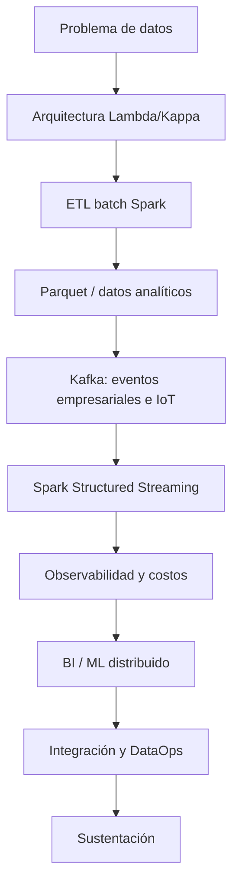

# Guía del Proyecto Sello de Big Data

## 1. Propósito

El Proyecto Sello integra las sesiones de **Big Data** alrededor de un sistema de datos distribuido construido de manera progresiva. Cada sesión agrega una capacidad real de arquitectura, procesamiento o analítica de datos hasta llegar a un producto end-to-end reproducible, observable, orientado a decisiones y defendible técnicamente.

### Competencia o capacidad del proyecto

Al finalizar el Proyecto Sello, el estudiante demuestra que puede construir y defender una solución Big Data distribuida end-to-end, aplicando arquitecturas Lambda/Kappa, ETL batch con Spark, almacenamiento analítico, ingesta y procesamiento streaming con Kafka, observabilidad, prácticas de DataOps, analítica/ML distribuida y sustentación integral de la solución.

### Competencias relacionadas

| Código | Competencia | Relación con el proyecto |
|---|---|---|
| CE042 | Diseño de dataset y pipeline analítico | Evidencia el diseño de arquitecturas Lambda/Kappa, esquemas analíticos y pipelines batch/streaming reproducibles. |
| CE043 | Construcción y experimentación | Evidencia la implementación de ETL batch con Spark, ingesta y procesamiento streaming con Kafka. |
| CE044 | Evaluación, monitoreo y mejora | Evidencia observabilidad, DataOps, monitoreo y mejora continua del sistema en producción. |

Fuente oficial de los códigos: [Línea de Ciencia de Datos e IA — Competencias y evidencias (CE04)](https://upeuoficial.github.io/planb/lineas/cd-ia/).

```text
Arquitectura -> ETL batch -> Almacenamiento analítico -> Streaming -> Observabilidad -> BI/ML -> DataOps -> Sustentación
```

## 2. El Proyecto

Durante el semestre desarrollarás un **sistema Big Data distribuido end-to-end** aplicado a un problema de datos real, con procesamiento batch, procesamiento en tiempo real, observabilidad y una salida analítica o de aprendizaje automático orientada a decisiones.

El proyecto debe integrar arquitectura de datos, procesamiento distribuido con Spark, almacenamiento analítico en formatos como Parquet, ingesta y procesamiento streaming con Kafka, observabilidad, prácticas de DataOps y evidencias de ejecución reproducible en el laboratorio.

No se busca solo ejecutar notebooks o jobs aislados. Se espera un sistema de datos que pueda explicar por qué existe cada componente, cómo procesa la información, cómo se observa, cómo se integra y qué valor analítico genera para la toma de decisiones.

No se considera Proyecto Sello:

- Notebooks o jobs Spark aislados sin un flujo de datos común.
- Transformaciones batch sin un problema analítico real detrás.
- Streaming que solo consume mensajes sin generar una salida útil.
- Modelos ML sin evaluación, guardado ni reutilización.
- Métricas u observabilidad sin interpretación ni valor para el negocio.
- Un pipeline integrado sin prácticas de DataOps ni documentación operativa.
- Una solución que el estudiante no pueda reproducir ni defender técnicamente.

## 3. Evolución del Proyecto

| Unidad | Temas principales | Evolución del proyecto |
|---|---|---|
| Unidad 1: Arquitecturas Big Data y ETL batch distribuido | Arquitecturas Lambda/Kappa, fundamentos PySpark, procesamiento distribuido, carga particionada en HDFS/formatos analíticos y ML distribuido con MLlib. | Pipeline batch de ETL distribuido con salidas analíticas en Parquet listas para BI/ML. |
| Unidad 2: Sistema Big Data en tiempo real: ingesta, streaming, observabilidad y BI/ML | Ingesta de eventos empresariales e IoT/sensores con Kafka, Spark Structured Streaming, observabilidad con Grafana, costos, series de tiempo e inferencia. | Pipeline en tiempo real con ingesta, streaming, observabilidad/costos y salidas BI/ML distribuidas. |
| Unidad 3: Integración, DataOps y despliegue del sistema final | Integración end-to-end, prácticas DataOps/DevOps, hardening, documentación operativa y sustentación. | Sistema Big Data distribuido end-to-end integrado, validado, documentado y defendido. |



### Alineamiento por sesiones

Este alineamiento muestra cómo el sistema Big Data crece desde el procesamiento batch distribuido hasta la integración streaming, la observabilidad y la analítica/ML, cerrando con la integración final y la sustentación.

| Sesiones | Contenido central | Avance del proyecto |
|---|---|---|
| S1-S2 | Arquitectura Big Data (Lambda/Kappa) y fundamentos PySpark: extracción, transformaciones, RDD y evaluación perezosa. | Brief técnico-analítico, entorno reproducible (`lambda26`) y primeras transformaciones distribuidas validadas. |
| S3-S4 | Procesamiento distribuido con carga particionada en HDFS/formatos analíticos, validación de calidad de datos y ML distribuido con Spark MLlib (regresión). | Pipeline batch con datos transformados, validados, almacenados en Parquet y primer modelo de regresión distribuida. |
| S5 | Evaluación U1. | Producto U1: pipeline batch de ETL distribuido con salidas analíticas en Parquet listas para BI/ML. |
| S6-S7 | Ingesta de eventos empresariales y de eventos IoT/sensores en tiempo real con Kafka. | Contratos de evento, tópicos y flujo de ingesta publicando y consumiendo datos reales del proyecto. |
| S8-S9 | Procesamiento streaming con Spark Structured Streaming (ventanas, watermarking, checkpointing) y observabilidad con Grafana y costos. | Pipeline streaming con agregaciones en ventana y panel de observabilidad con métricas y costos estimados. |
| S10-S11 | Series de tiempo e inferencia en streaming; BI/ML distribuido con Spark: KPIs y visualización de la predicción. | Modelo o inferencia de series de tiempo integrado a un tablero BI con los KPIs del flujo de eventos. |
| S12 | Evaluación U2. | Producto U2: pipeline en tiempo real con ingesta, streaming, observabilidad/costos y salidas BI/ML distribuidas. |
| S13-S14 | Integración del sistema, DataOps y BI; revisión técnica final y hardening. | Sistema ensamblado end-to-end, estabilizado y con documentación operativa preparada para sustentación. |
| S15-S16 | Sustentación y evaluación final de la Unidad III. | Sistema Big Data final integrado, validado y defendido; cierre individual de competencias pendientes. |

## 4. Cronograma

| Hito | Momento | Producto esperado |
|---|---|---|
| S2 | Brief técnico-analítico | Problema de datos, fuentes, arquitectura prevista, salidas esperadas y alcance. |
| S5 | Producto U1 | Pipeline batch distribuido con datos transformados, validados y almacenados en formato analítico. |
| S12 | Producto U2 | Pipeline streaming con Kafka/Spark, observabilidad, costos y salida BI/ML o inferencia. |
| S15 | Producto final | Sistema Big Data end-to-end integrado, validado y sustentado con demo reproducible. |
| S16 | Cierre individual | Evaluación final y recuperación de sustentaciones o competencias pendientes. |

## 5. Producto Final

### Repositorio académico y topics

Desde la primera presentación del proyecto, el repositorio debe estar creado y configurado con los topics académicos mínimos. Esta configuración es obligatoria porque permite identificar campus, semestre, línea, tipo de proyecto, curso, sección y grupo.

El detalle oficial del estándar se encuentra en [Estándar transversal de topics para repositorios académicos](https://upeuoficial.github.io/planb/anexos/estandar-topics-repositorios/).

Ejemplo base para Big Data:

```text
campus-juliaca
semestre-2026-2
linea-cdia
tipo-ps
bigdata
seccion-g1
grupo-<numero>-<nombre-proyecto>
```

Componentes mínimos:

- Problema de datos delimitado y arquitectura Big Data justificada (Lambda o Kappa).
- Pipeline batch con Spark: extracción, transformaciones, agregaciones y validación básica de calidad.
- Salida analítica en formato eficiente, particionada, como Parquet.
- Ingesta de eventos empresariales e IoT/sensores con Kafka.
- Procesamiento streaming con Spark Structured Streaming (ventanas, watermarking).
- Observabilidad técnica con métricas, paneles y estimación de costos.
- Modelo ML, inferencia de series de tiempo o salida BI según el alcance del proyecto.
- Prácticas de DataOps/DevOps para la integración, empaquetado o despliegue del sistema.
- Evidencias reproducibles de ejecución en el laboratorio.
- Documentación técnica, operativa y demo final end-to-end.

## 6. Evaluación por competencias

Los criterios se organizan según una matriz común de evaluación de proyectos académicos: problema, arquitectura, implementación, datos, integración y calidad, validación y sustentación. Cada criterio se adapta al enfoque de Big Data y se verifica mediante evidencias del producto, el repositorio y la demostración.

| Dimensión común | Criterio del PS | Capacidad evaluada | Evidencias esperadas |
|---|---|---|---|
| 1. Problema y alcance | Problema y alcance de datos | Formula una necesidad como problema de datos viable y delimitado. | Problema, fuentes, alcance, usuarios, resultados esperados y restricciones. |
| 2. Requerimientos o funcionalidad esperada | Resultados analíticos esperados | Define salidas analíticas o inteligentes alineadas al problema. | Salidas batch, streaming, BI o ML, criterios de aceptación y ejemplos de uso. |
| 3. Diseño, modelo o arquitectura | Arquitectura Big Data | Diseña una arquitectura distribuida (Lambda o Kappa) para ingesta, procesamiento, almacenamiento y consumo. | Diagrama de arquitectura, componentes, flujo de datos, herramientas y decisiones. |
| 4. Implementación técnica | Procesamiento batch y streaming | Implementa procesamiento distribuido reproducible para datos históricos y eventos en tiempo real. | Notebooks, jobs Spark, streaming, salidas generadas, pruebas o capturas de ejecución. |
| 5. Datos, persistencia o procesamiento | Almacenamiento analítico | Organiza datos y salidas para análisis posterior y consumo confiable. | Datasets, formatos, particiones o carpetas, evidencias de almacenamiento y lectura. |
| 6. Integración del producto y calidad técnica | Integración analítica, DataOps y calidad técnica | Integra batch, streaming, observabilidad y analítica como un flujo común, reproducible, versionado y documentado. | Demo o evidencias end-to-end, trazabilidad entre componentes, comandos, entorno, logs, métricas, hardening y documentación. |
| 7. Validación, pruebas o resultados | BI/ML distribuido | Valida resultados analíticos, inferencias o salidas BI con valor para decisiones. | Métricas, resultados, análisis, salidas BI/ML, validaciones y conclusiones. |
| 8. Sustentación técnica y profesional | Sustentación integral | Defiende técnica y profesionalmente la solución Big Data, evidenciando autoría, comprensión y responsabilidad académica. | Pitch, demo end-to-end, defensa técnica, aporte individual, repositorio, topics y MkDocs o equivalente. |

### Rúbrica

| Criterios | % | A (20) | B (15) | C (10) | D (5) |
|---|---:|---|---|---|---|
| 1. Problema y alcance | 10% | Problema claro, viable y bien delimitado; el alcance responde al contexto y está justificado. | Problema y alcance comprensibles, con algunos límites o justificaciones por precisar. | Problema poco delimitado o alcance parcialmente viable. | Problema confuso, sin alcance definido o sin relación clara con el producto. |
| 2. Requerimientos o funcionalidad esperada | 10% | Funcionalidades o requerimientos completos, coherentes y verificables según la necesidad planteada. | Funcionalidades principales cubiertas, con detalles menores pendientes o poco precisos. | Funcionalidades incompletas o parcialmente alineadas al problema. | Funcionalidades ausentes, inconexas o sin relación verificable con la necesidad. |
| 3. Diseño, modelo o arquitectura | 10% | Diseño, modelo o arquitectura coherente, aplicado y alineado al producto; muestra estructura y decisiones claras. | Diseño funcional con limitaciones menores o decisiones parcialmente justificadas. | Diseño poco claro, incompleto o aplicado de forma parcial. | No presenta diseño, modelo o arquitectura verificable. |
| 4. Implementación técnica | 10% | Implementación correcta, funcional y alineada a los contenidos centrales del curso. | Implementación funcional con detalles técnicos menores por corregir. | Implementación parcial, con errores o uso limitado de los contenidos del curso. | Implementación insuficiente, no funcional o no relacionada con los contenidos del curso. |
| 5. Datos, persistencia o procesamiento | 10% | Los datos se gestionan, almacenan, consultan o procesan correctamente según el tipo de proyecto. | Gestión de datos funcional con detalles menores de consistencia, estructura o procesamiento. | Gestión de datos parcial, limitada o con errores relevantes. | No hay manejo de datos verificable o este impide el funcionamiento del producto. |
| 6. Integración del producto y calidad técnica | 10% | El producto funciona como sistema integrado, ordenado, documentado y reproducible. | Integración funcional con detalles menores de organización, documentación o reproducibilidad. | Integración parcial; existen componentes aislados, desorden o evidencias incompletas. | Componentes desconectados, sin organización técnica ni evidencia reproducible. |
| 7. Validación, pruebas o resultados | 10% | Presenta pruebas, evidencias o resultados claros que comprueban el funcionamiento y el valor del producto. | Presenta evidencias suficientes, con algunos casos o resultados por completar. | Evidencias limitadas, poco claras o con validación parcial. | No presenta pruebas, evidencias ni resultados verificables. |
| 8. Sustentación técnica y profesional | 30% | Explica y defiende el producto con solvencia; demuestra aporte individual, dominio técnico, comunicación clara, repositorio, documentación y actitud profesional. | Sustentación clara y funcional, con detalles menores en defensa técnica, evidencias, comunicación o documentación. | Sustentación parcial; dominio, evidencias, comunicación o aporte individual insuficientemente demostrados. | No sustenta adecuadamente, no demuestra autoría o no presenta evidencias mínimas del producto. |

### Subaspectos de la sustentación integral

La sustentación integral debe representar como mínimo el 30% de la evaluación del proyecto. Se revisa mediante los siguientes subaspectos:

| Subaspecto | Qué observa |
|---|---|
| 1. Defensa técnica | Explicación del problema, arquitectura, flujo batch/streaming, decisiones técnicas, validaciones, resultados, limitaciones y evidencias generadas. |
| 2. Comunicación y orden | Claridad, estructura, tiempo y lenguaje técnico. |
| 3. Presentación personal y actitud | Puntualidad, vestimenta limpia y adecuada, higiene, cabello ordenado, actitud profesional, respeto, honestidad y coherencia con los valores y principios cristianos de la institución. |
| 4. Aporte individual | Cada integrante demuestra lo que hizo. |
| 5. Repositorio y estándares | Topics, organización, commits, documentación y reproducibilidad. |
| 6. MkDocs o equivalente | Documentación publicada, navegable y alineada al producto. |
| 7. Pitch/demo ejecutiva | Introducción clara del problema, solución y valor, seguida de una demo funcional. |

La sustentación profesional forma parte de la evaluación porque el producto final no solo debe funcionar; también debe ser presentado, explicado y defendido con responsabilidad académica, ética, respeto, honestidad y coherencia con los valores y principios cristianos de la institución.

## 7. Sustentación

La sustentación inicia con un video pitch breve o introducción ejecutiva de 1 a 3 minutos para presentar el problema, la solución, el valor del producto y la participación del equipo o estudiante.

| Momento | Tiempo sugerido | Propósito |
|---|---:|---|
| Exposición técnica | 10 minutos | Presentar problema, arquitectura, fuentes, pipelines, observabilidad, resultados y valor analítico. |
| Demostración end-to-end | 5 minutos | Ejecutar o evidenciar el flujo batch/streaming, salidas generadas, métricas y resultados BI/ML. |

Cada integrante debe demostrar una parte verificable: arquitectura, Spark batch, Kafka, streaming, observabilidad, ML/BI, DataOps, documentación o pruebas. La demo debe mostrar ejecución o evidencias reproducibles, no solo explicación conceptual.

## 8. Resultado Esperado

Al finalizar el curso, el estudiante debe demostrar que puede construir y defender una solución Big Data distribuida, observable y orientada a decisiones.

```text
Datos -> Procesamiento distribuido -> Streaming -> Observabilidad -> Analítica/ML -> DataOps -> Decisión -> Sustentación
```

## Anexo. Secuencia sugerida de presentación

La presentación puede organizarse con una secuencia breve de apoyo visual. El video pitch o introducción ejecutiva abre la sustentación y no reemplaza la demo ni la defensa técnica.

| Orden | Slide o momento | Propósito | Competencia evidenciada |
|---:|---|---|---|
| 1 | Título del proyecto y equipo | Identificar el proyecto, integrantes y dominio de datos elegido. | CE044 |
| 2 | Video pitch o introducción ejecutiva | Presentar problema, solución, valor y participación del equipo. | CE044 |
| 3 | 1. Problema y alcance | Explicar la necesidad analítica, las fuentes de datos y el alcance del sistema. | CE042 |
| 4 | Arquitectura Big Data | Mostrar ingesta, procesamiento, almacenamiento, consumo y observabilidad. | CE042 |
| 5 | Procesamiento batch | Explicar el pipeline Spark, transformaciones, calidad de datos y salidas en Parquet. | CE043 |
| 6 | Ingesta y streaming | Mostrar el flujo de eventos con Kafka y el procesamiento con Spark Structured Streaming. | CE043 |
| 7 | Observabilidad y costos | Presentar métricas, paneles, logs y estimación de costos operacionales. | CE044 |
| 8 | Resultados BI/ML | Mostrar el modelo, la inferencia o el tablero BI generado para la toma de decisiones. | CE043 + CE044 |
| 9 | Demo end-to-end | Ejecutar o evidenciar el flujo batch/streaming completo del sistema. | CE043 + CE044 |
| 10 | 4. Aporte individual | Indicar qué hizo cada integrante. | CE044 |
| 11 | 5. Repositorio y estándares | Mostrar repositorio, topics, estructura, documentación publicada en MkDocs o equivalente, y forma de ejecución. | CE044 |
| 12 | Limitaciones y mejoras | Reconocer límites del producto y mejoras posibles. | CE044 |

## Anexo. Plantilla mínima de documentación MkDocs o equivalente

La documentación publicada no reemplaza al informe. Su función es permitir que otra persona comprenda, ejecute, revise y verifique el producto desde el repositorio.

| Página o sección | Contenido mínimo | Evidencia esperada |
|---|---|---|
| Inicio | Nombre del proyecto, problema, solución, curso o cursos, integrantes y enlace al repositorio. | Presentación clara del producto. |
| Instalación o ejecución | Requisitos, dependencias, configuración y comandos para ejecutar el proyecto. | Instrucciones reproducibles. |
| Uso del sistema | Flujo principal, pantallas, comandos, endpoints, notebooks o casos de uso según corresponda. | Guía breve para probar el producto. |
| Arquitectura o estructura | Diagrama, componentes, carpetas principales y decisiones técnicas. | Vista técnica comprensible. |
| Módulos o funcionalidades | Descripción de las funciones principales del producto. | Relación entre funcionalidades y problema. |
| Datos | Modelo, archivos, base de datos, datasets, fuentes o estructura de almacenamiento según el curso. | Evidencia de gestión de datos. |
| Pruebas y evidencias | Casos de prueba, capturas, resultados, métricas, validaciones o salidas generadas. | Verificación del funcionamiento. |
| Equipo y aporte individual | Integrantes, responsabilidades, aportes y evidencias de participación. | Autoría verificable. |
| 5. Repositorio y estándares | Topics académicos, estructura, commits, ramas si aplica y criterios de reproducibilidad. | Cumplimiento de estándares técnicos. |
| Limitaciones y mejoras | Restricciones del producto y mejoras futuras priorizadas. | Cierre reflexivo y realista. |

La documentación debe estar disponible desde las primeras presentaciones y crecer con el proyecto. Para Big Data debe evidenciar arquitectura, pipelines, observabilidad y resultados analíticos con evidencia reproducible.

## Anexo. Plantilla sugerida de informe del proyecto

El informe debe documentar el producto de manera breve, verificable y alineada a las competencias evaluadas. No reemplaza la demo ni la sustentación; organiza las evidencias del proyecto.

| Sección | Contenido mínimo | Evidencia esperada |
|---|---|---|
| Portada | Nombre del proyecto, curso, sección, integrantes, docente y semestre. | Datos completos del equipo. |
| Resumen del proyecto | Problema de datos, solución Big Data y valor analítico. | Síntesis de 8 a 12 líneas. |
| Competencia y alcance | Competencia/capacidad del proyecto y competencias relacionadas. | CE042, CE043 y CE044 vinculadas al producto. |
| Problema y datos | Necesidad analítica, fuentes, alcance y restricciones. | Descripción del problema y dataset. |
| Arquitectura Big Data | Componentes de ingesta, procesamiento, almacenamiento, consumo y observabilidad. | Diagrama y decisiones técnicas. |
| Procesamiento batch | Jobs, transformaciones, validaciones de calidad y salidas en Parquet. | Notebooks, comandos, salidas y capturas. |
| Ingesta y streaming | Flujo de eventos empresariales e IoT, procesamiento con Spark Structured Streaming y resultados. | Evidencias de ejecución o simulación. |
| Observabilidad y costos | Métricas, paneles, logs y estimación de costos operacionales. | Capturas, instrucciones y resultados reproducibles. |
| Resultados BI/ML | Modelo, inferencia, series de tiempo o tablero BI generado. | Métricas, tablas o visualizaciones. |
| Integración y DataOps | Prácticas de integración, empaquetado o despliegue del sistema final. | Evidencias de hardening y ejecución end-to-end. |
| Repositorio y documentación | Repositorio, topics, estructura, notebooks y documentación publicada. | URL del repositorio y MkDocs o equivalente. |
| 4. Aporte individual | Responsabilidad de cada integrante. | Tabla de tareas, commits o evidencias por integrante. |
| Limitaciones y mejoras | Límites técnicos y mejoras posibles. | Lista priorizada y realista. |
