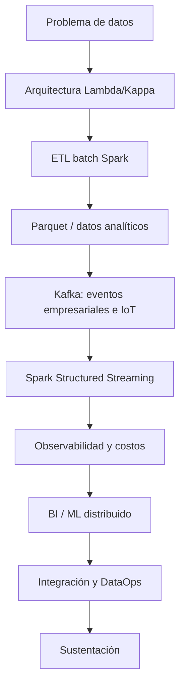

# Guía del Proyecto Sello de Big Data

## 1. Propósito

El Proyecto Sello integra las sesiones de **Big Data** alrededor de un sistema de datos distribuido construido de manera progresiva. Cada sesión agrega una capacidad real de arquitectura, procesamiento o analítica de datos hasta llegar a un producto end-to-end reproducible, observable, orientado a decisiones y defendible técnicamente.

### Competencia o capacidad del proyecto

Al finalizar el Proyecto Sello, el estudiante demuestra que puede construir y defender una solución Big Data distribuida end-to-end, aplicando arquitecturas Lambda/Kappa, ETL batch con Spark, almacenamiento analítico, ingesta y procesamiento streaming con Kafka, observabilidad, prácticas de DataOps, analítica/ML distribuida y sustentación integral de la solución.

### Competencias relacionadas

| Código | Competencia | Relación con el proyecto |
|---|---|---|
| CE042 | Diseño de dataset y pipeline analítico | Evidencia el diseño de arquitecturas Lambda/Kappa, esquemas analíticos y pipelines batch/streaming reproducibles. |
| CE043 | Construcción y experimentación | Evidencia la implementación de ETL batch con Spark, ingesta y procesamiento streaming con Kafka. |
| CE044 | Evaluación, monitoreo y mejora | Evidencia observabilidad, DataOps, monitoreo y mejora continua del sistema en producción. |

Fuente oficial de los códigos: [Línea de Ciencia de Datos e IA — Competencias y evidencias (CE04)](https://upeuoficial.github.io/planb/lineas/cd-ia/).

```text
Arquitectura -> ETL batch -> Almacenamiento analítico -> Streaming -> Observabilidad -> BI/ML -> DataOps -> Sustentación
```

## 2. El Proyecto

Durante el semestre desarrollarás un **sistema Big Data distribuido end-to-end** aplicado a un problema de datos real, con procesamiento batch, procesamiento en tiempo real, observabilidad y una salida analítica o de aprendizaje automático orientada a decisiones.

El proyecto debe integrar arquitectura de datos, procesamiento distribuido con Spark, almacenamiento analítico en formatos como Parquet, ingesta y procesamiento streaming con Kafka, observabilidad, prácticas de DataOps y evidencias de ejecución reproducible en el laboratorio.

No se busca solo ejecutar notebooks o jobs aislados. Se espera un sistema de datos que pueda explicar por qué existe cada componente, cómo procesa la información, cómo se observa, cómo se integra y qué valor analítico genera para la toma de decisiones.

No se considera Proyecto Sello:

- Notebooks o jobs Spark aislados sin un flujo de datos común.
- Transformaciones batch sin un problema analítico real detrás.
- Streaming que solo consume mensajes sin generar una salida útil.
- Modelos ML sin evaluación, guardado ni reutilización.
- Métricas u observabilidad sin interpretación ni valor para el negocio.
- Un pipeline integrado sin prácticas de DataOps ni documentación operativa.
- Una solución que el estudiante no pueda reproducir ni defender técnicamente.

## 3. Evolución del Proyecto

| Unidad | Temas principales | Evolución del proyecto |
|---|---|---|
| Unidad 1: Arquitecturas Big Data y ETL batch distribuido | Arquitecturas Lambda/Kappa, fundamentos PySpark, procesamiento distribuido, carga particionada en HDFS/formatos analíticos y ML distribuido con MLlib. | Pipeline batch de ETL distribuido con salidas analíticas en Parquet listas para BI/ML. |
| Unidad 2: Sistema Big Data en tiempo real: ingesta, streaming, observabilidad y BI/ML | Ingesta de eventos empresariales e IoT/sensores con Kafka, Spark Structured Streaming, observabilidad con Grafana, costos, series de tiempo e inferencia. | Pipeline en tiempo real con ingesta, streaming, observabilidad/costos y salidas BI/ML distribuidas. |
| Unidad 3: Integración, DataOps y despliegue del sistema final | Integración end-to-end, prácticas DataOps/DevOps, hardening, documentación operativa y sustentación. | Sistema Big Data distribuido end-to-end integrado, validado, documentado y defendido. |



### Alineamiento por sesiones

Este alineamiento muestra cómo el sistema Big Data crece desde el procesamiento batch distribuido hasta la integración streaming, la observabilidad y la analítica/ML, cerrando con la integración final y la sustentación.

| Sesiones | Contenido central | Avance del proyecto |
|---|---|---|
| S1-S2 | Arquitectura Big Data (Lambda/Kappa) y fundamentos PySpark: extracción, transformaciones, RDD y evaluación perezosa. | Brief técnico-analítico, entorno reproducible (`lambda26`) y primeras transformaciones distribuidas validadas. |
| S3-S4 | Procesamiento distribuido con carga particionada en HDFS/formatos analíticos, validación de calidad de datos y ML distribuido con Spark MLlib (regresión). | Pipeline batch con datos transformados, validados, almacenados en Parquet y primer modelo de regresión distribuida. |
| S5 | Evaluación U1. | Producto U1: pipeline batch de ETL distribuido con salidas analíticas en Parquet listas para BI/ML. |
| S6-S7 | Ingesta de eventos empresariales y de eventos IoT/sensores en tiempo real con Kafka. | Contratos de evento, tópicos y flujo de ingesta publicando y consumiendo datos reales del proyecto. |
| S8-S9 | Procesamiento streaming con Spark Structured Streaming (ventanas, watermarking, checkpointing) y observabilidad con Grafana y costos. | Pipeline streaming con agregaciones en ventana y panel de observabilidad con métricas y costos estimados. |
| S10-S11 | Series de tiempo e inferencia en streaming; BI/ML distribuido con Spark: KPIs y visualización de la predicción. | Modelo o inferencia de series de tiempo integrado a un tablero BI con los KPIs del flujo de eventos. |
| S12 | Evaluación U2. | Producto U2: pipeline en tiempo real con ingesta, streaming, observabilidad/costos y salidas BI/ML distribuidas. |
| S13-S14 | Integración del sistema, DataOps y BI; revisión técnica final y hardening. | Sistema ensamblado end-to-end, estabilizado y con documentación operativa preparada para sustentación. |
| S15-S16 | Sustentación y evaluación final de la Unidad III. | Sistema Big Data final integrado, validado y defendido; cierre individual de competencias pendientes. |

## 4. Cronograma

| Hito | Momento | Producto esperado |
|---|---|---|
| S2 | Brief técnico-analítico | Problema de datos, fuentes, arquitectura prevista, salidas esperadas y alcance. |
| S5 | Producto U1 | Pipeline batch distribuido con datos transformados, validados y almacenados en formato analítico. |
| S12 | Producto U2 | Pipeline streaming con Kafka/Spark, observabilidad, costos y salida BI/ML o inferencia. |
| S15 | Producto final | Sistema Big Data end-to-end integrado, validado y sustentado con demo reproducible. |
| S16 | Cierre individual | Evaluación final y recuperación de sustentaciones o competencias pendientes. |

## 5. Repositorio académico y topics

Desde la primera presentación del proyecto, el repositorio debe estar creado y configurado con los topics académicos mínimos. Esta configuración es obligatoria porque permite identificar campus, semestre, línea, tipo de proyecto, curso, sección y grupo.

El detalle oficial del estándar se encuentra en [Estándar transversal de topics para repositorios académicos](https://upeuoficial.github.io/planb/anexos/estandar-topics-repositorios/).

Ejemplo base para Big Data:

```text
campus-juliaca
semestre-2026-2
linea-cdia
tipo-ps
bigdata
seccion-g1
grupo-<numero>-<nombre-proyecto>
```

## 6. Producto y evaluación por unidad

Cada unidad tiene su propio producto (plantilla-ejemplo) y su propia sesión de evaluación, con rúbrica citada literalmente del sílabo. El "Producto Final" del curso no es una cuarta entrega aparte: **es el producto de Unidad 3**, según el propio sílabo ("Integración, DataOps y despliegue del sistema final").

**Tabla 1. Producto y evaluación por unidad**

| Unidad | Producto (plantilla-ejemplo) | Evaluación |
|---|---|---|
| Unidad 1: Arquitecturas Big Data y ETL batch distribuido | [`u1-producto.md`](u1-producto.md) | [S5 - Evaluación de la Unidad I](../sesiones/S05_Evaluacion_Unidad_1.md) |
| Unidad 2: Sistema Big Data en tiempo real | [`u2-producto.md`](u2-producto.md) | [S12 - Evaluación de la Unidad II](../sesiones/S12_Evaluacion_Unidad_2.md) |
| Unidad 3: Integración, DataOps y despliegue (Producto Final) | [`u3-producto.md`](u3-producto.md) | [S15 - Evaluación de la Unidad III](../sesiones/S15_Evaluacion_Unidad_3.md) (continúa en S16 para pendientes) |

Cada `uN-producto.md` incluye su propia rúbrica y la trazabilidad con la malla curricular (CE042, CE043, CE044 — Big Data aporta Nivel 3 a las tres) — en Unidad 3 incluye además la secuencia de sustentación completa y las plantillas de documentación e informe que antes vivían sueltas en esta guía.

## 7. Resultado Esperado

Al finalizar el curso, el estudiante debe demostrar que puede construir y defender una solución Big Data distribuida, observable y orientada a decisiones.

```text
Datos -> Procesamiento distribuido -> Streaming -> Observabilidad -> Analítica/ML -> DataOps -> Decisión -> Sustentación
```
