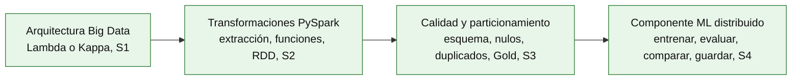

# Big Data - Producto de Unidad 1

**Esta es la plantilla-ejemplo del producto de Unidad 1 de Big Data.** La estructura (arquitectura seleccionada, transformaciones distribuidas, calidad y particionamiento, componente ML) es exigible a todos. El contenido usa los datasets reales que el docente trabajó en clase (H&M para calidad y particionamiento; campo eléctrico/magnético para el componente ML) como ejemplo — cada equipo lo reemplaza por el de su propio instrumento, declarado en su [Brief técnico-analítico](brief.md) de S2.

Tu [Brief técnico-analítico](brief.md) (hito de S2) define el contenido real: cada equipo declara una **pregunta central de negocio**, y **cada integrante** aporta su propia **dimensión U1** de esa pregunta — descriptiva/diagnóstica y predictiva, sin inferencia en tiempo real (la dimensión U2, con inferencia en vivo sobre streaming, es contenido de Unidad II, evaluado en S12). Los integrantes de un mismo equipo suelen compartir el instrumento o fuente física (el mismo sensor, el mismo dataset base), pero cada uno construye y sustenta **su propio notebook y su propio modelo**, sobre su propia variable objetivo — no un pipeline único repartido entre el equipo.

El modelo predictivo de tu dimensión U1 puede ser de **regresión o de clasificación**, según lo que pida tu propia pregunta (el brief lo deja explícito) — S4 enseñó la técnica concreta con `LinearRegression`/`RandomForestRegressor`, pero la misma disciplina (entrenar, evaluar con varias métricas, comparar más de una configuración, guardar el ganador) aplica igual si tu dimensión necesita `LogisticRegression`/`RandomForestClassifier` en su lugar.

## Producto

**Pipeline batch de ETL distribuido con salidas analíticas en Parquet listas para BI/ML.**

## 1. Arquitectura Big Data seleccionada

**Producto del paso:** el diagrama de arquitectura (Lambda o Kappa) de tu Proyecto Sello, con sus decisiones técnicas justificadas (S1).

Cada equipo decidió entre arquitectura Lambda (capas batch y velocidad separadas, unificadas en una capa de servicio) y Kappa (un único pipeline de streaming, el batch se trata como un caso particular de reprocesamiento) — la decisión depende de si el caso de negocio del equipo necesita resultados batch, en tiempo real, o ambos. Esta Unidad I construyó exclusivamente la ruta batch de esa arquitectura; la ruta de streaming es contenido de la Unidad II (S6-S9).

## 2. Transformaciones distribuidas con PySpark (ejemplo H&M)

**Producto del paso:** un notebook con extracción, transformaciones, funciones, agrupaciones/agregaciones y procesamiento RDD, con evidencia de que entiendes cuándo Spark ejecuta realmente el cálculo (S2).

```python
df = spark.read.csv(f"{ORIGEN_DATOS}/customers.csv", header=True, schema=schema)

df_transformado = (
    df
    .withColumn("es_activo", when(col("club_member_status") == "ACTIVE", lit(True)).otherwise(lit(False)))
    .filter(col("age").isNotNull())
)

df_transformado.explain(True)
```

Sobre tu propio dataset, esto significa: al menos una extracción con esquema explícito, una transformación con `withColumn()`/`filter()`, una agrupación con `groupBy().agg()`, y una verificación explícita del plan de ejecución que muestre en qué momento Spark deja de ser perezoso y ejecuta de verdad (2.6 de S2).

## 3. Calidad de datos y particionamiento analítico (ejemplo H&M)

**Producto del paso:** una salida particionada en Parquet, con calidad de datos aplicada (esquema, nulos, duplicados) y verificada de vuelta (S3).

**Tabla 1. Controles de calidad mínimos exigibles**

| Control | Qué verifica | Técnica de referencia (S3) |
|---|---|---|
| Esquema explícito | Tipos de datos correctos desde la lectura, sin dejar que Spark adivine. | `StructType` |
| Duplicados | Filas repetidas identificadas antes de eliminarlas, con criterio documentado. | `dropDuplicates()`, `Window`+`row_number()` |
| Nulos | Nulos (incluidas cadenas vacías) detectados y tratados con una decisión explícita. | `.na.fill()`/`.na.drop()` |
| Particionamiento | Salida escrita en Parquet, particionada por una columna de bajo cardinalidad usada en filtros. | `partitionBy()` |
| Verificación de ida y vuelta | Conteo de filas reconciliado tras leer de vuelta, `PartitionFilters` confirmado en el plan de ejecución. | `explain(True)` |

Sobre tu propia dimensión, esto significa una salida Gold real, particionada, con al menos un control de duplicados y uno de nulos aplicados y documentados — no solo mencionados.

## 4. Componente ML distribuido (ejemplo campo eléctrico)

**Producto del paso:** un modelo de regresión distribuida entrenado sobre tu propia salida Gold, evaluado con al menos tres métricas, comparado contra al menos una configuración alternativa, y guardado (S4).

**Tabla 2. Componentes mínimos exigibles del modelo**

| Componente | Qué verifica | Técnica de referencia (S4, caso regresión) |
|---|---|---|
| Vector de predictores | Los predictores están combinados en una sola columna vectorial, como exige Spark MLlib. | `VectorAssembler` |
| Modelo base entrenado y evaluado | El modelo aprende de `df_train` y se mide sobre `df_test`, nunca al revés. | `LinearRegression`, `RegressionEvaluator` (RMSE, R², MAE) |
| Comparación de configuraciones | Al menos una configuración alternativa (regularización, otro algoritmo) comparada con las mismas métricas. | `regParam`/`elasticNetParam`, o un segundo algoritmo |
| Modelo guardado | El modelo persistido es el que realmente ganó la comparación, no el primero que se entrenó. | `model.write().overwrite().save(...)` |

Sobre tu propia dimensión U1 (brief, sección 3), esto significa el indicador que tú declaraste — no necesariamente `CE`, y no necesariamente una regresión: si tu pregunta predictiva es de clasificación (por ejemplo, "¿qué tan probable es una tormenta?", como el ejemplo de sensores atmosféricos del brief), la Tabla 2 aplica igual cambiando `LinearRegression`/`RandomForestRegressor` por `LogisticRegression`/`RandomForestClassifier`, y RMSE/R²/MAE por las métricas de clasificación correspondientes (`areaUnderROC`, `f1`, etc.) — la disciplina es la misma: comparar antes de confiar en un único modelo (1.6 de S4).

**Figura 1. Pipeline batch completo, Unidad I (estructura general)**



A diferencia del roadmap de S4 (donde el componente ML era lo único nuevo del día), aquí los cuatro bloques están en verde: la Unidad I completa un pipeline donde los datos del Proyecto Sello entran crudos por un extremo y salen, del otro, como un Data Lake particionado con un primer modelo entrenado y comparado sobre él.

## 5. Rúbrica de Evaluación

**Tabla 3. Rúbrica de evaluación de la Unidad 1**

| Criterio | Peso | CE / Nivel | A (20 pts) | B (15 pts) | C (10 pts) | D (5 pts) | Calificación obtenida |
|---|---:|---|---|---|---|---|---:|
| 1. Arquitectura Big Data seleccionada y justificada | 12% | CE042-N3 | Arquitectura (Lambda o Kappa) elegida con justificación clara frente al caso de negocio del Proyecto Sello. | Arquitectura elegida, con justificación parcial. | Arquitectura mencionada, sin justificación clara. | No presenta una arquitectura elegida. | |
| 2. Uso correcto de Spark/PySpark para extracción, transformación, agregación y procesamiento distribuido | 16% | CE042-N3 | Extracción, transformaciones, agregaciones y RDD aplicados correctamente, con evidencia del plan de ejecución. | La mayoría de estos elementos funciona, con detalles menores. | Uso parcial o con errores de PySpark. | No evidencia procesamiento distribuido funcional. | |
| 3. Datos cargados y particionados en formatos analíticos | 16% | CE042-N3 | Salida Parquet particionada, verificada con lectura de vuelta y `PartitionFilters` confirmado. | Salida particionada y verificada, con algún detalle menor. | Escritura particionada incompleta o sin verificación. | No escribe salida particionada. | |
| 4. Pipeline batch reproducible | 12% | CE042-N3 | El notebook corre de punta a punta sin intervención manual, sobre el instrumento real o representativo de tu propia dimensión. | El notebook corre con ajustes menores necesarios. | El notebook corre solo parcialmente. | El notebook no es reproducible. | |
| 5. Primer componente ML distribuido con métricas básicas | 16% | CE043-N3 (parcial) | Modelo entrenado, evaluado con al menos tres métricas, comparado contra una configuración alternativa, y el ganador guardado. | Modelo entrenado y evaluado, con comparación o guardado incompletos. | Modelo entrenado, sin comparación clara. | No presenta un modelo entrenado. | |
| 6. Evidencias técnicas y documentación de ejecución | 8% | CE042-N3 (apoyo) | Evidencias completas, reproducibles por otra persona, con documentación clara y reloj/usuario visibles. | Evidencias suficientes, con vacíos menores de documentación. | Evidencias parciales o poco reproducibles. | No presenta evidencias ni documentación. | |
| 7. Sustentación | 20% | CG | Sustenta con claridad y profesionalismo su aporte individual, respondiendo con precisión las preguntas del jurado. | Sustenta con solvencia, con detalles menores en claridad, orden o precisión. | Sustenta con dificultad; claridad, orden o precisión insuficientes. | No sustenta adecuadamente ni demuestra su aporte individual. | |

Nota final = suma de (`Peso` × `Puntos de la calificación obtenida`) / 100 × 20.

`CE042-N3` = Nivel 3 de CE042 (Construye Dataset). `CE043-N3 (parcial)` = primera mitad del Nivel 3 de CE043 (Genera Modelos) — la segunda mitad se completa en Unidad 2. `CG` = Competencia General "Investigación e Innovación" del sílabo — no es una de las tres competencias CD/IA: los criterios 1-6 ya son la evidencia técnica, incluida su verificación en vivo; el criterio 7 verifica aporte individual y comunicación.

**Tabla 4. Subaspectos de la sustentación (Unidad 1)**

El criterio 7 se evalúa con los mismos 6 subaspectos de la sustentación integral del Proyecto Sello ([`u3-producto.md`](u3-producto.md#2-rubrica-de-evaluacion), Tabla 2) — exigibles desde esta primera sustentación de unidad, no solo en la sustentación final del curso.

| Subaspecto | Qué observa en Unidad 1 |
|---|---|
| 1. Aporte individual | Cada integrante demuestra su propia dimensión U1 (brief, sección 3) — no el trabajo del resto del equipo. |
| 2. Comunicación y orden | Claridad, estructura, tiempo y lenguaje técnico durante la presentación. |
| 3. Presentación personal y actitud | Puntualidad, vestimenta limpia y adecuada, higiene, cabello ordenado, actitud profesional, respeto, honestidad y coherencia con los valores y principios cristianos de la institución. |
| 4. Repositorio y estándares | Topics académicos configurados desde S2, organización, commits y reproducibilidad del notebook. |
| 5. MkDocs o equivalente | Documentación de tu dimensión U1 publicada, navegable y alineada con `u1-producto.md`. |
| 6. Pitch/demo ejecutiva | Introducción breve de tu dimensión U1 y su avance, con apoyo visual (.pptx, Canva o equivalente) — no reemplaza la demo técnica de la Tabla 3 de S5, la precede. |

Para usar la rúbrica con IA, solicita:

```text
Evalúa la sustentación y el producto (u1-producto.md, adaptada a la dimensión U1 propia del estudiante) usando la rúbrica de esta sección.
Para cada criterio selecciona la calificación obtenida: A=20, B=15, C=10, D=5.
Justifica brevemente cada nivel con evidencia concreta (código, capturas, métricas reales).
Para el criterio 7, verifica explícitamente los 6 subaspectos de la Tabla 4 antes de asignar el nivel.
Verifica que cada captura muestre reloj del sistema y usuario/perfil visible, y que las fechas sean coherentes con el historial de commits de GitHub. Si falta esta evidencia o hay inconsistencias, indícalo explícitamente antes de calificar.
Calcula la nota final con la fórmula: suma de (Peso × Puntos de la calificación obtenida) / 100 × 20.
Indica 2 fortalezas y 2 recomendaciones para lo que sigue en Unidad II.
```

## 6. Trazabilidad y procedencia de la rúbrica

Los primeros seis criterios son cita literal de los criterios de evaluación del producto de la Unidad I en el sílabo de Big Data; el séptimo (Sustentación) corresponde a la sustentación exigida por el mismo sílabo (sesión 5, actividad 2).

**Con la malla curricular:** los criterios 1-4 (arquitectura, PySpark, particionamiento, pipeline reproducible) son la evidencia completa del **Nivel 3 de CE042** ("Construye Dataset") — "Diseña e implementa un pipeline batch de extracción, limpieza y transformación con Spark/PySpark hacia un repositorio Parquet". El criterio 5 (primer componente ML) es la **primera mitad** del **Nivel 3 de CE043** ("Genera Modelos") — la segunda mitad ("entrena y visualiza un modelo de predicción de series de tiempo") se completa en Unidad 2 (S10). El **Nivel 3 de CE044** ("Analiza y Define Estrategias") todavía no se evidencia aquí: requiere visualizar la predicción junto a KPIs de negocio, contenido de S11 (Unidad 2). El criterio 7 (Sustentación) es transversal y no forma parte de la definición de ninguna competencia.
