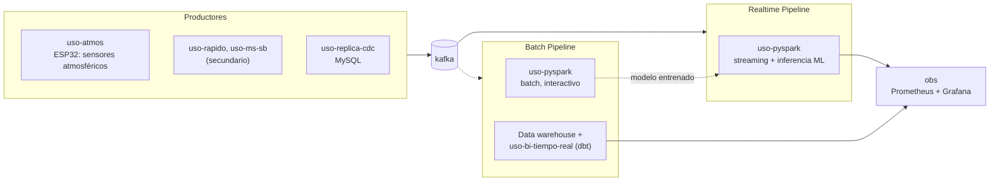
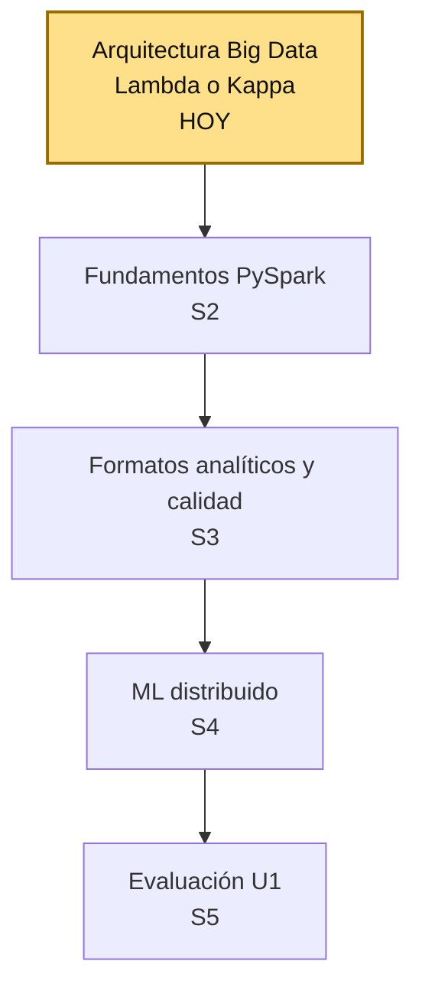
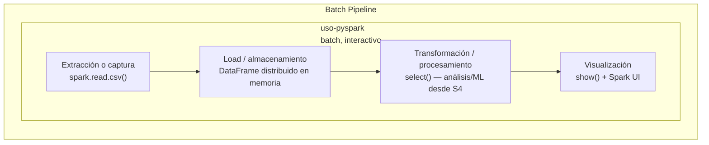
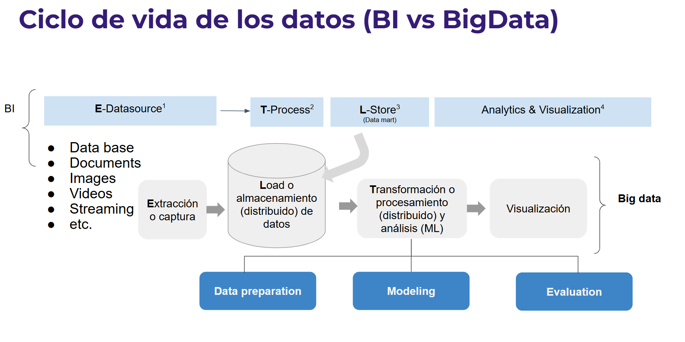
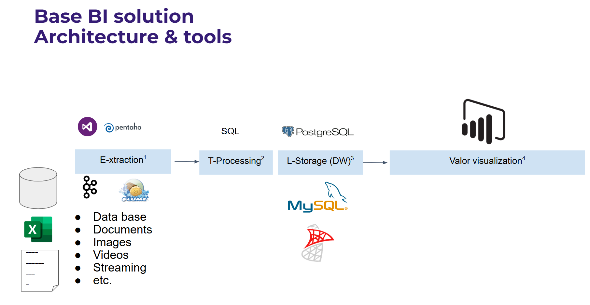
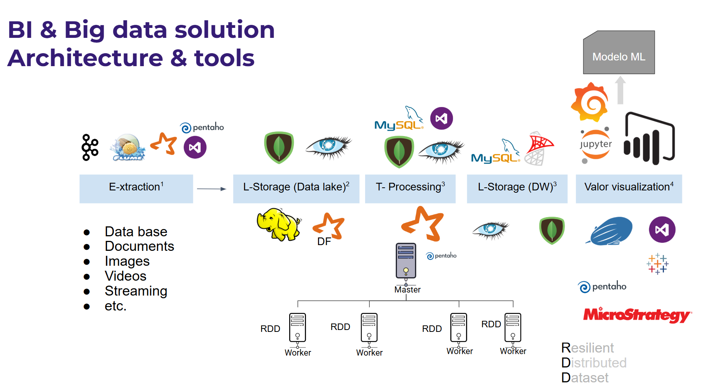
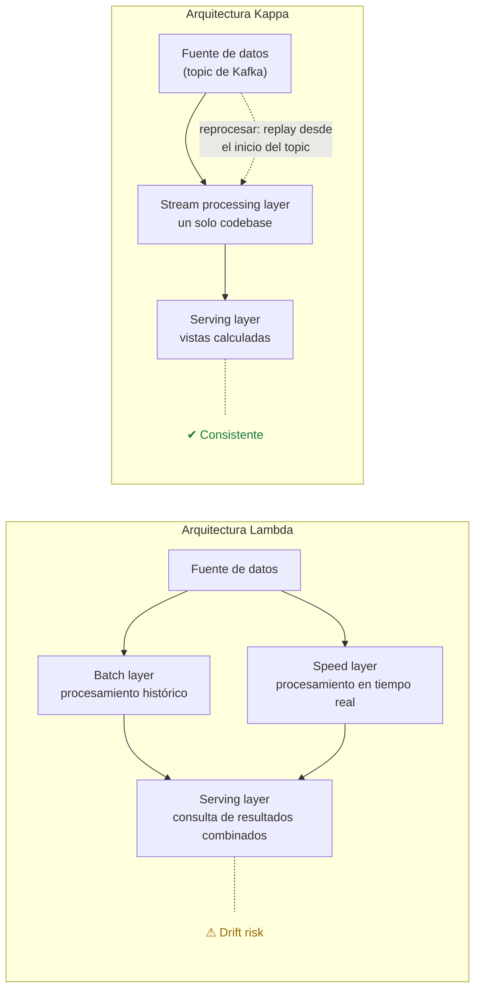
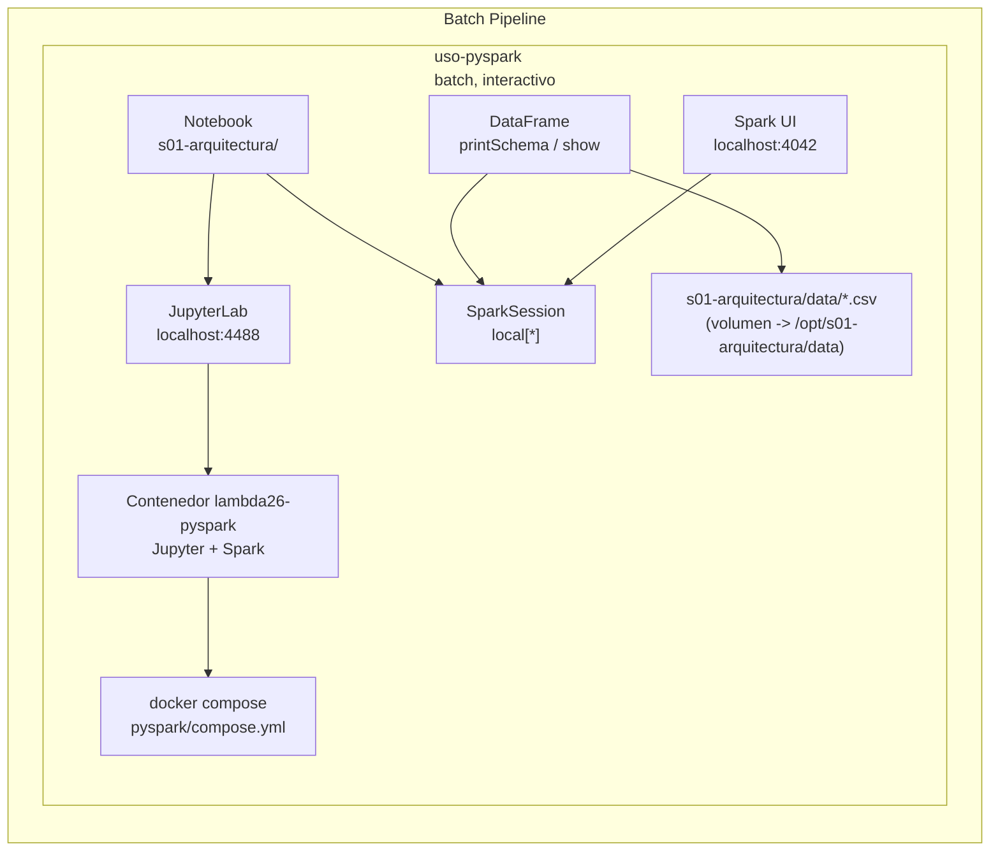

# S1 - Arquitectura Big Data: Lambda y Kappa, batch vs. streaming

*Por: Angel Sullon Macalupu @asullom - 2026*

## 1. Introducción

Tiempo: 20 min.

### 1.1 Presentación de la sesión

Esta sesión abre la Unidad 1 del proyecto del curso: se decide la primera arquitectura Big Data (Lambda o Kappa). Con esa decisión queda establecida la regla batch/streaming que ordena el pipeline construido en las sesiones siguientes de la unidad. El porqué de decidir la arquitectura antes de elegir herramientas se desarrolla en 1.6, a partir del caso de Uber — esta sesión resuelve solo esa primera decisión, no el pipeline completo.

### 1.2 Índice

1. Ecosistema y arquitectura Big Data.
2. Batch vs. Streaming.
3. Arquitectura Lambda.
4. Arquitectura Kappa.

### 1.3 Propósito de aprendizaje

Al concluir la clase, estarás en condiciones de:

- **Identificar** los componentes del ecosistema Big Data y **decidir** qué arquitectura (Lambda o Kappa) conviene aplicar a un problema real de negocio, justificando la elección entre procesamiento batch y streaming.

### 1.4 Producto de sesión

Diagrama de arquitectura Big Data (Lambda o Kappa) para el Proyecto Sello del equipo, con decisiones técnicas, tecnologías propuestas, supuestos y riesgos.

### 1.5 Metodología

**Tabla 1. Metodología de la sesión**

| Actividades a Realizar en el Periodo | Orientaciones generales (Orientaciones Metodológicas) | Material de estudio recomendado |
|---|---|---|
| Revisión previa individual | Leer el sílabo de la Unidad 1 y el caso de Uber (ver 1.6). Trabajo individual, antes de clase; sin instalación previa requerida para esta sesión. | Sílabo Big Data U1. |
| Clase presencial | Construcción guiada de la decisión arquitectónica: entorno `lambda26`, verificación con Spark, ecosistema, batch vs. streaming, regla de decisión, tecnologías y diagrama de flujo. Trabajo individual, siguiendo al docente paso a paso; consulta inmediata ante dudas sobre Lambda, Kappa o el ecosistema. | Pasos 3.1 a 3.7 de esta guía. |
| Evaluación formativa | Revisión en clase de la arquitectura seleccionada y su justificación. La evidencia se completa y sustenta de forma individual, fuera del aula, según los criterios mínimos de la sección 4.4. | Indicaciones de entrega (4.3), rúbrica de evaluación (4.6). |

### 1.6 Motivación de la sesión

#### 1.6.1 Caso: Uber y el almacenamiento por niveles con Kafka

Uber usa Apache Kafka como columna vertebral tanto de sus sistemas batch como de sus sistemas en tiempo real: la misma plataforma alimenta el procesamiento histórico y el procesamiento de eventos en vivo, como dos sistemas separados. Para sostener esa escala sin encarecer el clúster, aplica almacenamiento por niveles (*tiered storage*): los eventos recientes quedan en el disco local de los brokers (horas), mientras el histórico se mueve a almacenamiento remoto más barato (S3/GCS/HDFS) por días o meses, sin perder la capacidad de leerlo directamente desde Kafka. La idea de `lambda26` es construir un pipeline con ese mismo espíritu: batch y tiempo real como sistemas separados, ambos alimentados por Kafka.

**Figura 1. Arquitectura de Kafka en Uber: productores, pipeline batch y pipeline en tiempo real**


**Productores** (generan los eventos hacia Kafka): Rider App, Driver App, API/Servicios, Dispatch, Mapping & Logistics, y las bases de datos operacionales (Schemaless MySQL, Cassandra).

**Consumidores** (leen desde Kafka, ya separados en dos pipelines): el pipeline en tiempo real (Pub/Sub, Flink, ELK) alimenta la app móvil, alertas/dashboards, analítica en tiempo real y debugging; el pipeline batch (Hadoop) alimenta aplicaciones de ciencia de datos, exploración ad-hoc y reportes analíticos. Ambos pipelines leen del mismo Kafka, pero son sistemas separados — por eso es Lambda.

Fuente: [Kafka tiered storage at Uber](https://www.uber.com/us/en/blog/kafka-tiered-storage/).

`lambda26` sigue el mismo patrón, con sus propios componentes en vez de los de Uber:

**Figura 2. `lambda26` con el mismo patrón de Uber: productores, pipeline en tiempo real y pipeline batch**



`uso-pyspark` aparece dos veces en la Figura 2: son dos **contenedores separados de la misma imagen**, no dos tecnologías distintas. El de Batch Pipeline corre Jupyter (notebooks, exploración/entrenamiento), y el de Realtime Pipeline ejecuta `spark-submit` sobre un script `.py` como proceso persistente (streaming + inferencia). Se separan porque un notebook no es apto para un job que debe correr sin parar, y un job de producción no debería competir por recursos con el contenedor de exploración — por eso, aunque comparten la misma base tecnológica, Lambda los trata como dos sistemas independientes.

Es el mismo patrón que usa **Databricks** (la plataforma que suelen usar las certificaciones de ingeniería de datos): **All-Purpose Clusters** para notebooks/exploración (equivalente al contenedor batch/interactivo de la Figura 2) y **Job Clusters** — efímeros, creados solo para correr un Job y destruidos al terminar — para todo proceso productivo, incluido streaming. Databricks incluso recomienda explícitamente correr Structured Streaming como Job sobre Job Compute y no en un cluster interactivo, por las mismas dos razones: no competir por recursos con la exploración, y que un Job reintenta/reinicia automáticamente si el proceso se cae, algo que un notebook "dejado corriendo" no garantiza. `lambda26` reproduce esa misma separación con Docker, a escala de laboratorio. En la industria, Databricks corre sobre AWS, Azure o GCP (no es una nube en sí misma); su principal competidor, **Snowflake**, no usa Spark — es un data warehouse SQL-first. Muchas empresas usan ambos: Snowflake para BI/reportes, Databricks para ML e ingeniería de datos pesada.

**Preguntas de análisis**

**Activación de conocimientos previos**

1. ¿Qué problema resuelve separar el almacenamiento reciente (rápido, en el broker) del histórico (barato, remoto) dentro de la misma plataforma Kafka?
2. ¿Qué pasaría si Uber tuviera que guardar todo el histórico en el disco local de los brokers, sin niveles de almacenamiento?

**Comprensión de arquitecturas Big Data**

1. ¿Por qué el diseño de Uber (sistemas batch y en tiempo real separados, ambos sobre Kafka) corresponde a Lambda y no a Kappa? Justifica con la regla de decisión que se explica en 2.5.1.
2. ¿En qué escenario convendría eliminar la capa batch separada y reprocesar todo desde Kafka (Kappa) en vez de mantener ambos sistemas?

### 1.7 Ubicación en el curso

- Unidad: U1 - Arquitecturas Big Data y ETL batch distribuido.
- Producto del curso: Proyecto Sello: sistema Big Data distribuido end-to-end para procesamiento batch y streaming, analítica/ML, observabilidad y visualización BI para la toma de decisiones.
- Producto de unidad: pipeline batch de ETL distribuido con salidas analíticas en Parquet listas para BI/ML.
- Avance del producto en esta sesión: arquitectura Big Data seleccionada y justificada (Lambda o Kappa) para el Proyecto Sello del equipo.

Roadmap del producto de unidad:

**Figura 3. Roadmap del producto de la unidad U1**



Hoy se decide el primer componente real de la U1: la arquitectura Big Data. En las siguientes sesiones se construye el pipeline batch con PySpark, se cargan formatos analíticos en HDFS y se entrena un primer modelo distribuido. La evaluación U1 valida el pipeline batch completo construido sobre esa arquitectura.

## 2. Explica

Tiempo: 25 min.

### 2.1 Arquitectura de la sesión

**Figura 4. Arquitectura de la sesión: entorno `lambda26` (`uso-pyspark`)**



A diferencia de una solución BI o Big Data típica (Figuras 6 y 7), donde cada etapa del ciclo de vida del dato suele ser una herramienta distinta, en `lambda26` el módulo `uso-pyspark` cubre las 4 etapas dentro de un solo componente, sobre una `SparkSession` común (`local[*]`) corriendo en el contenedor `lambda26-pyspark`. Hoy (S1) solo verificas que ese ciclo completo funciona de punta a punta con un caso mínimo — leer un CSV y mostrarlo, con el job visible en Spark UI (localhost:4042); la transformación real y el análisis ML se profundizan desde S2 y S4.

Estos son los componentes que instalas y verificas en 3.1-3.2, antes de pasar al análisis conceptual (ecosistema, batch/streaming, Lambda o Kappa) que desarrolla el resto de esta sección.

### 2.2 Ecosistema y arquitectura Big Data

Big Data se refiere al procesamiento de grandes volúmenes de datos que no pueden manejarse eficientemente con herramientas tradicionales. Se resume con las **5V**:

**Tabla 2. Las 5V del Big Data**

| V | Significa |
|---|---|
| Volumen | Cantidad de datos generados. |
| Variedad | Diversidad de formatos y fuentes. |
| Velocidad | Rapidez con la que se generan y deben procesarse. |
| Veracidad | Confiabilidad y calidad del dato. |
| Valor | Utilidad real que aporta a una decisión. |

Una solución Big Data es un flujo de trabajo con 5 etapas:

```text
Fuente de datos -> Ingesta / extracción -> Almacenamiento -> Procesamiento -> Visualización / consumo
```

BI y Big Data comparten ese mismo flujo ETL de base (extracción, transformación/procesamiento, carga/almacenamiento, visualización); lo que cambia es la escala y las herramientas:

**Figura 5. Ciclo de vida de los datos: BI vs. Big Data**



En BI, el almacenamiento y el procesamiento no son distribuidos; en Big Data sí — con etapas explícitas de preparación de datos, modelado y evaluación (típicas de un flujo de Machine Learning) sobre almacenamiento y procesamiento distribuidos.

**Figura 6. Arquitectura base de una solución BI**



Una solución BI típica resuelve esas 4 etapas con herramientas de un solo nodo: extracción con ETL como Pentaho, procesamiento con SQL, almacenamiento en PostgreSQL/MySQL y visualización en Power BI.

**Figura 7. Arquitectura de una solución BI & Big Data**



Al escalar a Big Data, el almacenamiento pasa por un Data Lake antes del Data Warehouse, y el procesamiento se distribuye entre un nodo master y varios workers, cada uno con su RDD (*Resilient Distributed Dataset*) — así es como Spark paraleliza el trabajo. `lambda26` implementa ese mismo patrón con sus propios componentes: PySpark en el procesamiento distribuido, casos de uso que publican y consumen eventos, Kafka como columna vertebral de ingesta y observabilidad con Prometheus/Grafana — el mismo patrón productores / pipeline en tiempo real / pipeline batch ya presentado en la **Figura 2** (ver 1.6), aplicado al laboratorio del curso.

Hoy usamos solo el módulo `uso-pyspark` para reconocer el ecosistema; `uso-atmos`, `uso-replica-cdc`, `uso-bi-tiempo-real` y los casos secundarios `uso-rapido`/`uso-ms-sb` quedan pendientes como extensión progresiva del laboratorio a partir de S6. El detalle de contenedores, puertos y volúmenes de cada módulo está en el índice del curso.

### 2.3 Batch vs. Streaming

**Tabla 3. Batch vs. streaming**

| Enfoque | Cómo trabaja | Ejemplos |
|---|---|---|
| Batch | Trabaja con datos acumulados y se procesa periódicamente. | Reportes diarios, logs históricos, entrenamiento de modelos. |
| Streaming | Procesa los datos conforme llegan al sistema. | Detección de fraude, recomendaciones en tiempo real, monitoreo. |

Esta distinción es la base de la decisión arquitectónica de la sesión: no se elige Lambda o Kappa por preferencia técnica, sino según si el problema necesita batch, streaming o ambos.

### 2.4 Arquitectura Lambda

Lambda combina tres capas:

- **Batch layer**: procesamiento histórico.
- **Speed layer**: procesamiento en tiempo real.
- **Serving layer**: consulta de resultados combinados.

**Figura 8. Arquitectura Lambda - Spark & Hadoop**


El nombre "Lambda" viene de la letra griega λ: la fuente de datos se bifurca hacia la batch layer (histórico, Hadoop/MapReduce) y la speed layer (tiempo real, Spark) en paralelo, y ambos resultados convergen en la serving layer, que es lo que consultan las aplicaciones — esa bifurcación y reconvergencia es la que dibuja la forma de la lambda.

Fuente: [Lambda Architecture - Cazton](https://cazton.com/consulting/enterprise/lambda-architecture).

**Ventaja:** alta precisión al combinar histórico y tiempo real.

**Desventaja:** mayor complejidad (tres capas que mantener).

### 2.5 Arquitectura Kappa

Kappa procesa todo como streaming, incluido el reprocesamiento histórico (reproduciendo el stream desde el origen).

**Ventaja:** arquitectura más simple, una sola capa.

**Desventaja:** menos optimizada para consultas puramente históricas.

#### 2.5.1 Regla de decisión y comparación

Regla de decisión:

- Si el caso necesita histórico + tiempo real -> **Lambda**.
- Si todo el caso son eventos en tiempo real -> **Kappa**.

**Tabla 4. Comparación entre arquitectura Lambda y Kappa**

| Aspecto | Lambda | Kappa |
|---|---|---|
| Histórico | Sí (batch layer) | No como capa separada |
| Tiempo real | Sí (speed layer) | Sí |
| Complejidad | Alta | Menor |
| Capas | Batch + Speed + Serving | Solo streaming |
| Reprocesamiento | Desde la capa batch | Reproduciendo el stream |

**Figura 9. Comparación de pipelines: Lambda (capas en paralelo) vs. Kappa (una sola capa de streaming)**



En Lambda, la fuente alimenta dos capas en paralelo (batch y speed) que convergen en la serving layer; al ser dos codebases separados que se combinan, existe **riesgo de deriva** (*drift risk*) entre lo que calcula cada capa. En Kappa, todo pasa por una sola capa de streaming (un solo codebase, una sola fuente de verdad: **consistente**); para recalcular resultados no hay una capa batch aparte, se reproduce (*replay*) el topic de Kafka desde el origen sobre un nuevo procesador. El trade-off no es gratis: Lambda ofrece capas flexibles (se puede optimizar cada una por separado), pero Kappa exige mayor expertise en streaming — todo el equipo, incluido el reprocesamiento histórico, corre sobre la misma tecnología de streaming. Diagrama propio, basado en la comparación conceptual de [System Design Roadmap: Kappa vs Lambda Architecture Evolution](https://systemdr.systemdrd.com/p/kappa-vs-lambda-architecture-evolution).

## 3. Aplica: actividad práctica guiada

Tiempo: 2h.

**Actividad:** instalar y verificar `uso-pyspark`, y con el entorno funcionando, analizar `lambda26` y decidir entre arquitectura Lambda o Kappa, justificando batch vs. streaming para un caso de negocio (sílabo).

**Propósito de la actividad:** confirmar que el entorno del laboratorio funciona de punta a punta (Docker, Jupyter, Spark), y aplicar la regla de decisión batch/streaming a los casos de uso reales de `lambda26` (`orden-eventos`, `pago-eventos`) para seleccionar y justificar una arquitectura Big Data, proponiendo las tecnologías coherentes con esa elección.

**Orientaciones metodológicas:** en clase, el docente guía primero la instalación y verificación de `uso-pyspark`, y luego el análisis de los casos de uso propios de `lambda26` y la aplicación de la regla de decisión, paso a paso frente a la clase; los estudiantes replican cada paso en su propio equipo, verificando el entorno, su clasificación batch/streaming y su elección de arquitectura antes de proponer tecnologías y el diagrama de flujo.

**Actividades para realizar:**

- **3.1** Configurar y verificar el entorno `lambda26` (`uso-pyspark`).
- **3.2** Verificar Spark con un notebook mínimo.
- **3.3** Reconocer el ecosistema de `lambda26`.
- **3.4** Analizar el caso guiado y clasificar batch/streaming.
- **3.5** Aplicar la regla de decisión.
- **3.6** Proponer tecnologías y diagrama de flujo.
- **3.7** Completar la plantilla de propuesta.

### 3.1 Configurar y verificar el entorno `lambda26` (`uso-pyspark`)

**Producto del paso:** entorno `lambda26` funcionando y verificado (Jupyter + Spark).

Requisito previo: Docker Desktop instalado y corriendo. Clona el repositorio `lambda26` en tu equipo:

```bash
git clone https://github.com/262bigdata/lambda26.git
cd lambda26/pyspark
```

Esto es lo que vas a levantar y verificar en este paso:

**Figura 10. Componentes del entorno `lambda26` (`uso-pyspark`) y sus dependencias**



Lectura del diagrama (las flechas indican dependencia: A → B significa "A depende de B", igual que en LP2/DIST):

- El notebook depende de JupyterLab para ejecutarse, y JupyterLab depende del contenedor `lambda26-pyspark` (levantado por el `docker compose` de `pyspark/compose.yml`) — no son piezas sueltas que haya que conectar.
- El notebook depende de una `SparkSession` activa para poder procesar datos: sin ella, el código Spark no tiene motor sobre el cual correr.
- El DataFrame depende de dos cosas a la vez: la `SparkSession` (el motor que lo construye) y el archivo `s01-arquitectura/data/*.csv` (montado como volumen en `/opt/s01-arquitectura/data`, no copiado dentro de la imagen — cambiarlo no exige reconstruir el contenedor).
- Spark UI depende de que exista una `SparkSession` activa: no es un servicio aparte, se levanta junto con la sesión en el puerto 4040 dentro del contenedor (expuesto en tu máquina como `localhost:4042`) — por eso sirve para verificar que el motor realmente corrió, no solo que Jupyter respondió.

Este paso (3.1) levanta el contenedor y JupyterLab; el paso 3.2 crea el notebook, la `SparkSession`, el `DataFrame` y verifica Spark UI — completando así todas las dependencias de este diagrama.

A partir de aquí trabajamos con el contenedor `lambda26-pyspark` (la imagen personalizada de este repositorio) durante todo el curso — es el entorno de referencia que usa el resto de esta guía. La alternativa con la imagen oficial (al final de este paso) solo es necesaria si tu equipo no puede correr `lambda26-pyspark`.

Desde `lambda26/pyspark`, copia las variables de entorno (una sola vez) y levanta el laboratorio:

```powershell
cp .env.example .env
docker compose up -d
```

Verifica que responde:

```text
JupyterLab -> http://localhost:4488/lab?token=sintoken
```

**Nota:** el contenedor arranca con `jupyter notebook`, no `jupyter lab` — igual puedes entrar a `/lab` porque `notebook` 7.x viene construido sobre el mismo servidor de JupyterLab y sirve ambas interfaces (`/lab` y `/tree`) desde el mismo proceso. No hace falta cambiar ningún comando para usar `/lab`.

Spark UI (`http://localhost:4042`) todavía no responde en este punto: solo se levanta cuando creas una `SparkSession` activa, en 3.2 — no al levantar el contenedor. Spark usa el puerto 4040 por defecto dentro del contenedor; `compose.yml` lo expone en tu máquina como `4042` (`"4042:4040"`) para evitar choques con otros servicios que puedan estar usando el 4040 en tu equipo.

**Alternativa con imagen oficial de PySpark + Jupyter:** si tu equipo tiene buenos recursos de cómputo, puedes usar directamente la imagen oficial [`jupyter/pyspark-notebook`](https://hub.docker.com/r/jupyter/pyspark-notebook), que trae Spark completo sin depender de la imagen personalizada de `lambda26`. Diferencia de peso a tener en cuenta: la imagen personalizada de `lambda26` pesa **~1.9 GB**, mientras que `jupyter/pyspark-notebook` pesa **~6.9 GB** — considera tu espacio en disco y velocidad de conexión antes de elegir esta alternativa:

```yaml
# compose.yml
services:
    pyspark:
        image: jupyter/pyspark-notebook
        ports:
            - 4489:8888
            - 4041:4040
        environment:
            - JUPYTER_TOKEN=sintoken
        volumes:
            - ./:/home/jovyan
```

Puertos distintos a los de `pyspark/compose.yml` (4488/4042) para no chocar si ambos entornos quedan levantados a la vez.

```powershell
docker compose up -d
```

Accede igual por `http://localhost:4489/lab?token=sintoken` (JupyterLab) o `http://localhost:4489/?token=sintoken` (Jupyter Notebook).

Este es el único entorno que se instala en la Unidad 1: `pyspark/compose.yml` corre PySpark y Jupyter solos, sin Kafka. El módulo `kafka` y el override `pyspark/compose.kafka.yml` (que conecta PySpark a la red de Kafka) se instalan recién en la Unidad 2 (S6), cuando el curso pasa de batch a streaming — no hace falta levantarlos ahora. Este entorno queda corriendo durante toda la unidad: hoy solo lo verificas con un notebook mínimo (3.2), en S2 lo usas a fondo, sin perder tiempo de clase configurando nada.

### 3.2 Verificar Spark con un notebook mínimo

**Producto del paso:** notebook con una SparkSession activa, un dataset cargado y visible en Spark UI.

Desde JupyterLab (3.1), crea el notebook `01_arquitectura_practica.ipynb` dentro de la carpeta `s01-arquitectura/` y ejecuta estos pasos mínimos — el detalle completo (DataFrames, lazy evaluation, RDD) se retoma en S2, hoy solo confirmas que el entorno funciona de punta a punta:

1. Crear la SparkSession:

```python
from pyspark.sql import SparkSession

spark = (
    SparkSession.builder
    .appName("s1-verificacion")
    .master("local[*]")
    .config("spark.ui.port", "4040")
    .getOrCreate()
)

spark
```

2. Cargar un dataset como DataFrame. Descargar `biblia_ntv_.csv` desde [Kaggle: Biblia NTV (Spanish Bible NTV)](https://www.kaggle.com/datasets/camesruiz/biblia-ntv-spanish-bible-ntv?resource=download) y copiarlo a `lambda26/pyspark/sesiones/s01-arquitectura/data/` (montado como `/opt/s01-arquitectura/data/` en el contenedor):

```python
df = spark.read.csv("/opt/s01-arquitectura/data/biblia_ntv_.csv", header=True, inferSchema=True)
df
```

3. Ver la estructura y las primeras filas:

```python
df.printSchema()
df.show(5, truncate=False)
```

4. (Hasta aquí, opcional) una transformación simple:

```python
df.select("libro", "capitulo", "verso").show(5)
```

Verifica que:

```text
Spark UI -> http://localhost:4042
```

muestra el job que se acaba de ejecutar (la lectura del CSV y el `show()`).

### 3.3 Reconocer el ecosistema de `lambda26`

**Producto del paso:** mapa del flujo tecnológico del laboratorio.

Registra el flujo base del ecosistema:

```text
Usuarios -> Kafka -> Spark Processing -> Data Lake / Base de datos -> Dashboard / Aplicaciones
```

Responde:

1. ¿Dónde nacen los eventos?
2. ¿Qué componente ingesta los eventos?
3. ¿Qué componente procesa los datos a escala?
4. ¿Dónde se consumen los resultados?

### 3.4 Analizar el caso guiado y clasificar batch/streaming

**Producto del paso:** clasificación justificada del caso.

Retoma los casos de uso propios de `lambda26` (los analizas por su documentación, no los ejecutas hoy — `uso-rapido` y `uso-ms-sb` necesitan Kafka, que recién se instala en la Unidad 2):

- `uso-rapido`: `ec-orden-py` publica y consume `orden-eventos` por Kafka.
- `uso-ms-sb`: `ec-orden-ms` publica `orden-eventos`; `ec-pago-ms` consume `orden-eventos` y publica `pago-eventos`; cada microservicio guarda su propio histórico en su base Postgres.

El laboratorio necesita decidir cómo construir su capa analítica sobre esos eventos: ¿guarda el histórico en un almacenamiento separado (batch), reprocesa todo directamente desde Kafka (streaming), o necesita ambos?

Responde: ¿el caso requiere batch, streaming o ambos? Justifica con al menos dos razones tomadas del caso.

### 3.5 Aplicar la regla de decisión

**Producto del paso:** arquitectura seleccionada y justificada.

Aplicando la regla de decisión de 2.5.1 al caso de 3.4, selecciona Lambda o Kappa y justifica tu elección en 2-3 líneas.

### 3.6 Proponer tecnologías y diagrama de flujo

**Producto del paso:** lista de tecnologías y diagrama de flujo simple.

Propón tecnologías del ecosistema (Kafka, Spark Streaming, Spark Batch, Data Lake, Grafana para BI en tiempo real, etc.) y construye el diagrama:

```text
Usuarios -> Kafka -> Spark Streaming + Batch -> Data Lake / DW -> Grafana
```

### 3.7 Completar la plantilla de propuesta

**Producto del paso:** ficha de propuesta arquitectónica completa.

Completa la ficha de arquitectura Big Data:

**Tabla 5. Ficha de propuesta arquitectónica**

| Campo | Completa | Ejemplo de referencia |
|---|---|---|
| **Caso analizado** | Breve descripción del sistema: qué genera los datos y con qué frecuencia. | Plataforma de streaming: cada segundo llegan eventos de reproducciones, búsquedas y recomendaciones de los usuarios. |
| **Tipo de procesamiento** | Marca uno — Batch / Streaming / Ambos — y justifica. | — |
| **Arquitectura seleccionada** | Marca una — Lambda / Kappa — y justifica. | — |
| **Diagrama de arquitectura** | `Fuente de datos -> Ingesta / extracción -> Almacenamiento -> Procesamiento -> Visualización / consumo` | `Usuarios -> Kafka -> Spark Processing -> Data Lake / BD -> Dashboard / Aplicaciones` |
| **Tecnologías propuestas** | Ingesta / Procesamiento / Almacenamiento / Visualización. | Kafka (ingesta) → Data Lake / RAW (almacenamiento) → Spark (procesamiento) → Grafana (visualización). |
| **Supuestos y riesgos** | Supuestos / Riesgos o limitaciones. | Supuestos: gran volumen de datos, eventos generados continuamente, necesidad de análisis en tiempo real. Riesgos: alta complejidad de la arquitectura, costo de infraestructura, latencia en el procesamiento. |

**Evidencia de aprendizaje:**

- Entorno `lambda26` (`uso-pyspark`) funcionando y verificado, con un notebook que muestra Spark UI activo.
- Clasificación batch/streaming y arquitectura (Lambda o Kappa) seleccionada, con justificación.
- Ficha de propuesta arquitectónica completa (tecnologías, diagrama de flujo, supuestos y riesgos).

## 4. Crea: actividad autónoma

Tiempo: 2h fuera del aula.

### 4.1 Actividad

Replicación autónoma de la decisión arquitectónica Big Data (clasificación batch/streaming, regla de decisión, arquitectura Lambda o Kappa) sobre el caso de negocio real del Proyecto Sello del equipo, documentada en evidencia individual. El diagrama resultante no es un ejercicio desechable: es el entorno de desarrollo que el equipo va a configurar y usar durante el resto del curso.

Completa y evidencia estas tareas:

1. Definir el caso de negocio del Proyecto Sello de tu equipo: el problema real que el sistema Big Data del semestre va a resolver.
2. Describir qué datos genera ese caso y clasificarlo como batch, streaming o ambos, con justificación (equivalente a 3.4).
3. Aplicar la regla de decisión y seleccionar la arquitectura (Lambda o Kappa) para el proyecto del equipo, justificando la elección (equivalente a 3.5).
4. Proponer las tecnologías que el equipo va a configurar (Kafka, Spark y, si aplica, otras herramientas adicionales al ecosistema de `lambda26`) y construir el diagrama de flujo — este diagrama es el que el equipo configurará en las siguientes sesiones (equivalente a 3.6).
5. Completar la plantilla de propuesta arquitectónica, incluyendo riesgos y supuestos observados (equivalente a 3.7).

### 4.2 Propósito

Que cada estudiante demuestre, de forma individual y fuera del aula, que puede reproducir el patrón de decisión arquitectónica construido en clase sin el acompañamiento del docente — aplicándolo directamente al Proyecto Sello real de su equipo, no a un caso desconectado.

Cada estudiante aplica la clasificación batch/streaming y la regla de decisión Lambda/Kappa al caso de negocio del Proyecto Sello de su equipo — la arquitectura y las tecnologías que resulten de este análisis son las que el equipo configurará realmente, no una elección hipotética.

### 4.3 Indicaciones

Entrega un PDF con el siguiente nombre:

```text
S01_Equipo##_ApellidoNombre.pdf
```

Cada captura de pantalla del informe debe mostrar, sin recortar, el reloj del sistema (fecha y hora) y tu usuario o foto de perfil (Windows, VS Code o navegador) visibles en pantalla — es lo que permite verificar que la evidencia es tuya y que corresponde al momento real de tu trabajo.

#### 4.3.1 Estructura del informe

**Datos del estudiante**

- Nombre:
- Equipo:
- Sesión: S01 - Arquitectura Big Data: Lambda y Kappa, batch vs. streaming
- Rol o aporte realizado:
- Link de GitHub:

**Evidencia técnica**

Incluye capturas o extractos con una breve explicación debajo de cada uno, organizados en los mismos 4 bloques de la rúbrica (4.6) — así queda claro qué evidencia corresponde a cada criterio evaluado:

1. *Clasificación batch/streaming*
    - Clasificación batch/streaming del caso del Proyecto Sello, con justificación (equivalente a 3.4).
2. *Arquitectura seleccionada y regla de decisión aplicada*
    - Arquitectura seleccionada (Lambda o Kappa) y regla de decisión aplicada, con justificación (equivalente a 3.5).
3. *Tecnologías propuestas y diagrama de flujo*
    - Tecnologías propuestas y diagrama de flujo simple (equivalente a 3.6).
4. *Plantilla de propuesta completa*
    - Plantilla de propuesta arquitectónica completa, incluyendo riesgos y supuestos (equivalente a 3.7).

**Error o hallazgo**

Describe al menos un riesgo o supuesto que identificaste al analizar tu caso:

- Qué ocurrió o qué limitación encontraste.
- Cómo lo identificaste.
- Cómo lo documentaste o qué supuesto tomaste.

**Reflexión técnica breve**

Responde en 5 a 8 líneas:

```text
¿Qué arquitectura usarías para un sistema de sensores IoT y por qué?
```

### 4.4 Criterios mínimos de aceptación

La evidencia individual se considera completa si:

- El caso de negocio del Proyecto Sello está delimitado y descrito con claridad.
- La clasificación batch/streaming está justificada con datos del caso.
- La arquitectura seleccionada aplica correctamente la regla de decisión.
- Las tecnologías propuestas son coherentes con la arquitectura elegida.
- Cada captura de la evidencia técnica muestra el reloj del sistema y el usuario/perfil visible, sin recortar.
- Las fechas y horas de las capturas son coherentes con el historial de commits de su repositorio en GitHub.
- Incluye un error o hallazgo técnico diagnosticado.
- Incluye la reflexión técnica breve solicitada.

### 4.5 Preguntas de defensa

1. ¿En qué casos una empresa necesitaría procesamiento en tiempo real?
2. ¿Qué ventajas tiene combinar batch y streaming?
3. ¿Qué arquitectura usarías para un sistema de sensores IoT y por qué?
4. ¿Qué desventaja tiene Lambda frente a Kappa?
5. ¿Qué tecnología usarías para la ingesta de eventos y por qué?

### 4.6 Rúbrica de evaluación

**Tabla 6. Rúbrica de evaluación**

| Criterio | Peso (%) | A (20 pts) | B (15 pts) | C (10 pts) | D (5 pts) | Nivel obtenido |
|---|---:|---|---|---|---|---:|
| 1. Clasificación batch/streaming* | 25 | Clasifica el caso del Proyecto Sello (batch, streaming o ambos) con justificación clara y basada en los datos reales que genera. | Clasifica correctamente el caso del Proyecto Sello, con justificación breve. | Clasificación imprecisa o sin justificar. | No clasifica el caso del Proyecto Sello. | |
| 2. Arquitectura seleccionada y regla de decisión aplicada* | 25 | Aplica la regla de decisión con solidez técnica y selecciona y justifica Lambda o Kappa para el Proyecto Sello. | Aplica la regla de decisión correctamente y selecciona una arquitectura para el Proyecto Sello. | Aplica la regla de decisión con justificación débil. | No aplica la regla de decisión ni selecciona arquitectura. | |
| 3. Tecnologías propuestas y diagrama de flujo* | 25 | Propone tecnologías coherentes con la arquitectura elegida y un diagrama de flujo claro y completo del Proyecto Sello. | Propone tecnologías coherentes y un diagrama de flujo comprensible. | Tecnologías o diagrama incompletos o poco coherentes. | No propone tecnologías ni diagrama. | |
| 4. Plantilla de propuesta completa* | 25 | Completa todos los campos de la plantilla (caso, tipo de procesamiento, arquitectura, justificación, tecnologías, diagrama, riesgos y supuestos), coherentes entre sí. | Completa la plantilla con campos suficientes, con detalles menores pendientes. | Plantilla incompleta o con campos relevantes vacíos. | No presenta la plantilla. | |

\* Agregado manual.

Nota final = suma de (`Peso` / 100 × `Puntos del nivel obtenido`) = ____ / 20.

Para usar la rúbrica con IA, solicita:

```text
Evalúa el PDF usando la rúbrica de la sesión.
Para cada criterio selecciona el nivel obtenido usando la escala A=20, B=15, C=10, D=5 puntos.
Justifica brevemente cada nivel asignado.
Verifica que cada captura muestre reloj del sistema y usuario/perfil visible, y que las fechas sean coherentes con el historial de commits de GitHub. Si falta esta evidencia o hay inconsistencias, indícalo explícitamente antes de calificar.
Calcula la nota final con la fórmula: suma de (Peso/100 × Puntos del nivel obtenido), directamente sobre 20.
Indica 2 fortalezas y 2 recomendaciones.
```

## 5. Cierre

Tiempo: 5 min.

**Resumen breve:** hoy se construyó la primera decisión arquitectónica real del laboratorio `lambda26`: clasificación batch/streaming de los casos de uso propios (`uso-rapido`, `uso-ms-sb`), aplicación de la regla de decisión, selección justificada de Lambda o Kappa, tecnologías propuestas y diagrama de flujo — cada equipo aplicó el mismo análisis a su propio Proyecto Sello.

**Dinámica participativa:** en una ronda rápida (o con una herramienta digital tipo formulario o encuesta en vivo), cada estudiante comparte en una frase qué arquitectura (Lambda o Kappa) eligió para el caso guiado y por qué.

**Metacognición:** cada estudiante responde en voz alta o por escrito: ¿qué parte de la sesión te costó más entender, y cómo la resolviste?

**Proyección:** la arquitectura seleccionada hoy se retoma en S2, cuando se construye el pipeline batch con PySpark sobre esa decisión, y aplica en cualquier proyecto profesional donde primero hay que decidir qué arquitectura resuelve el problema real antes de elegir herramientas.

## Bibliografía

1. Marz, N., & Warren, J. (2015). *Big Data: Principles and best practices of scalable real-time data systems*. Manning Publications.
2. Kreps, J. (2014, July 2). *Questioning the Lambda architecture*. O'Reilly Radar. https://www.oreilly.com/radar/questioning-the-lambda-architecture/
3. Apache Software Foundation. (2024). *Apache Kafka documentation*. https://kafka.apache.org/documentation/
4. Apache Software Foundation. (2024). *Apache Spark documentation*. https://spark.apache.org/docs/latest/
