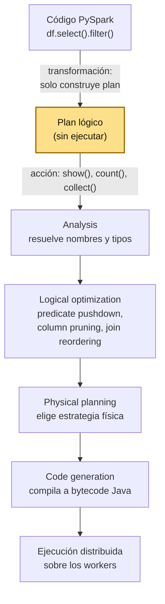
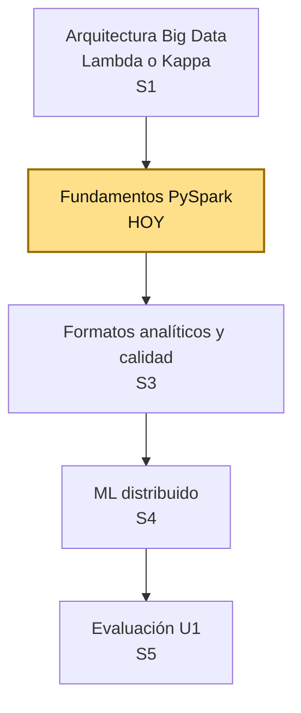
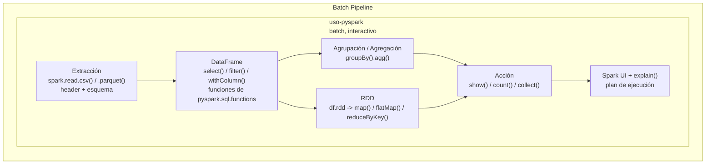
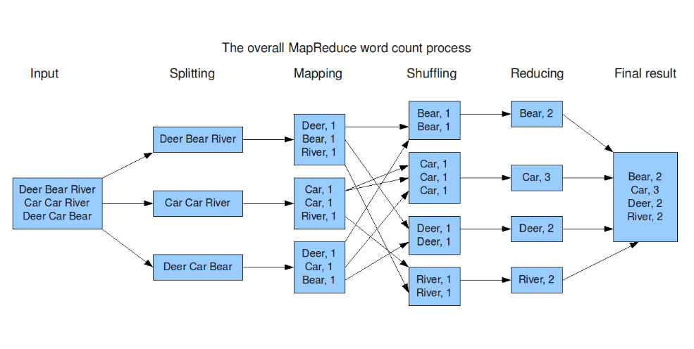

# S2 - Fundamentos PySpark: transformaciones, funciones, agrupaciones y evaluación perezosa

*Por: Angel Sullon Macalupu @asullom - 2026*

## 1. Introducción

Tiempo: 20 min.

### 1.1 Presentación de la sesión

En S1 se decidió la arquitectura Big Data (Lambda o Kappa) del Proyecto Sello y se verificó que el entorno `lambda26` (`uso-pyspark`) funciona de punta a punta. Esta sesión entra a fondo en la primera etapa real del pipeline batch: extracción, transformaciones, funciones, agrupaciones/agregaciones y el modelo RDD, todo bajo el concepto que explica por qué Spark procesa datos a esa escala sin colapsar — la evaluación perezosa (*lazy evaluation*). El porqué se desarrolla en 1.6, a partir de cómo Spark SQL optimiza tu código antes de ejecutarlo; esta sesión no llega todavía a particionar ni guardar en formatos analíticos (eso es S3).

### 1.2 Índice

1. Introducción a PySpark: qué es, objetos fundamentales y `SparkSession`.
2. DataFrames: extracción, estructura y escritura de resultados (CSV/Parquet, particiones).
3. Transformaciones, acciones, evaluación perezosa y análisis del plan de ejecución (`explain()`).
4. Funciones de `pyspark.sql.functions`.
5. Agrupaciones, agregaciones y funciones ventana.
6. RDD: el modelo debajo de los DataFrames.

### 1.3 Propósito de aprendizaje

Al concluir la clase, estarás en condiciones de:

- **Ejecutar** transformaciones distribuidas con PySpark sobre DataFrames y RDD, **identificar** el momento exacto en que Spark ejecuta realmente el cálculo, y **aplicar** funciones, agrupaciones y agregaciones para resumir datos a escala.

### 1.4 Producto de sesión

Notebook `02_fundamentos_practica.ipynb` con transformaciones y funciones documentadas, agrupaciones/agregaciones aplicadas, procesamiento RDD y evidencia del plan de ejecución (`explain()`).

### 1.5 Metodología

**Tabla 1. Metodología de la sesión**

| Actividades a Realizar en el Periodo | Orientaciones generales (Orientaciones Metodológicas) | Material de estudio recomendado |
|---|---|---|
| Revisión previa individual | Repasar el notebook de verificación de S1 (entorno `lambda26` ya debe estar funcionando, no la imagen oficial `jupyter/pyspark-notebook`), leer el caso de Catalyst Optimizer (ver 1.6) y **descargar el dataset H&M de Kaggle antes de clase** (ver 3.1) — pesa 625 MB, más de 1.3 millones de registros, no conviene descargarlo durante la sesión presencial. | Guía S1 (notebook de verificación), guía S2 — secciones 1.6 y 3.1. |
| Clase presencial | Construcción guiada del notebook `02_fundamentos_practica.ipynb`: extracción, transformaciones, evaluación perezosa, funciones, agrupaciones/agregaciones y RDD, sobre el dataset real H&M. Trabajo individual, siguiendo al docente paso a paso; consulta inmediata ante dudas. | Pasos 3.1 a 3.11 de esta guía. |
| Evaluación formativa | Revisión en clase de las transformaciones documentadas y la evidencia del plan de ejecución. La evidencia se completa y sustenta de forma individual, fuera del aula, según los criterios mínimos de la sección 4.4. | Indicaciones de entrega (4.3), rúbrica de evaluación (4.6). |

### 1.6 Motivación de la sesión

#### 1.6.1 Caso: los 23.5 TB que Expedia no necesitaba leer

Expedia Group —una de las plataformas de reservas de viaje más grandes del mundo— empezó a notar un patrón preocupante en sus pipelines de datos con Spark: consultas que funcionaban bien al principio se volvían dramáticamente más lentas a medida que crecía el volumen de datos, y trabajos que debían terminar en minutos terminaban corriendo por horas, inflando también el costo de infraestructura. Analizando los planes de ejecución con una herramienta propia (que expone la misma metadata que tú vas a ver con `explain()` en esta sesión: planes físicos, filtros aplicados, métricas de shuffle), encontraron un caso concreto: un job que escaneaba la tabla `lodging_content_vrbo_room_type_profile_history` completa —**23.5 TB**— con los arreglos `partition_filters` y `pushed_filters` del plan físico **vacíos**. La consulta no le dio a Catalyst ningún filtro que empujar hacia la lectura, así que Spark leyó la tabla entera antes de filtrar nada.

La causa no era un bug de Spark — era cómo estaba escrita la consulta: sin un predicado de partición explícito, no hay nada que Catalyst pueda empujar. El equipo agregó los predicados correctos, y el mismo job pasó de **~20 minutos a 1 minuto** (95% más rápido); aplicando el mismo diagnóstico a otros workloads, reportaron reducciones de 40-95% en tiempo de ejecución y 50-90% en costo de cómputo.

Fuente: [Expedia: LLM-Powered Spark SQL Plan Analysis for Performance Optimization](https://www.zenml.io/llmops-database/llm-powered-spark-sql-plan-analysis-for-performance-optimization).

Un `PushedFilters` vacío en tu propio `explain()` (Tabla 5) es la misma señal de alerta que Expedia encontró en una tabla de 23.5 TB — por eso esta sesión no se queda en aprender la sintaxis de `select()`/`filter()`/`groupBy()`, sino en entender qué hace Spark con esas transformaciones antes de ejecutarlas. Recién cuando llamas a una acción (`show()`, `count()`, `collect()`), el motor **Catalyst** de Spark SQL toma tu plan y lo optimiza en cuatro fases: *Analysis* (resuelve nombres y tipos), *Logical optimization* (aplica reglas como *predicate pushdown*, *column pruning* y reordenamiento de joins — el paso que le faltó a la consulta de Expedia), *Physical planning* (elige la estrategia física) y *Code generation* (compila a bytecode). Catalyst se diseñó explícitamente para que el equipo de Spark pudiera agregar nuevas reglas de optimización con facilidad, y para que desarrolladores externos lo extendieran — pero esas reglas solo actúan sobre lo que tu código les da la oportunidad de optimizar.

**Figura 1. De la transformación a la ejecución: las 4 fases de Catalyst**



*Nota.* Adaptado de *What is a Catalyst Optimizer?*, por Databricks, 2024, Databricks Blog (<https://www.databricks.com/blog/what-is-catalyst-optimizer>).

**Preguntas de análisis**

**Activación de conocimientos previos**

1. Antes de leer la causa, ¿qué esperarías que pasara si una consulta sobre una tabla de 23.5 TB no tiene ningún filtro? ¿Por qué Spark no "sabe" evitarlo por sí solo?
2. ¿Qué diferencia hay entre que Spark filtre **después** de leer toda la tabla, y que filtre **antes** (durante la lectura, empujando el filtro al propio lector)?

**Comprensión de evaluación perezosa**

1. Según el caso, ¿qué le faltó exactamente a la consulta de Expedia para que Catalyst pudiera aplicar *predicate pushdown*? Relaciónalo con las 4 fases del plan.
2. ¿Por qué revisar `explain()` — y no solo confiar en que "Spark es rápido" — es una práctica que un equipo de datos real necesita, según lo que le pasó a Expedia?

### 1.7 Ubicación en el curso

- Unidad: U1 - Arquitecturas Big Data y ETL batch distribuido.
- Producto del curso: Proyecto Sello: sistema Big Data distribuido end-to-end para procesamiento batch y streaming, analítica/ML, observabilidad y visualización BI para la toma de decisiones.
- Producto de unidad: pipeline batch de ETL distribuido con salidas analíticas en Parquet listas para BI/ML.
- Avance del producto en esta sesión: transformaciones distribuidas documentadas sobre datos del Proyecto Sello, con evidencia del plan de ejecución.

Roadmap del producto de unidad:

**Figura 2. Roadmap del producto de la unidad U1**



Hoy se construye la base técnica que usa el resto de la unidad: sin dominar transformaciones, funciones, agrupaciones y evaluación perezosa, S3 (carga particionada y calidad de datos) y S4 (ML distribuido) no tienen sobre qué apoyarse. La evaluación U1 valida el pipeline batch completo construido sobre esta base.

## 2. Explica

Tiempo: 25 min.

### 2.1 Arquitectura de la sesión

**Figura 3. Arquitectura de la sesión: extracción, DataFrame, RDD y evaluación perezosa sobre `uso-pyspark`**



A diferencia de S1, donde solo verificabas que el ciclo completo funcionara de punta a punta con un caso mínimo, hoy trabajas a fondo dentro de la etapa de transformación: extracción con control de esquema, transformaciones y funciones sobre DataFrame, agrupaciones/agregaciones, y el modelo RDD que corre por debajo. La visualización sigue siendo `show()` + Spark UI; la persistencia en formatos analíticos particionados (Parquet) recién se construye en S3 — hoy el resultado vive solo en memoria distribuida, dentro de la sesión de Spark.

### 2.2 Introducción a PySpark

Apache Spark es un *framework* de procesamiento de datos distribuido, de código abierto, diseñado para procesar grandes volúmenes de datos (Big Data) de forma rápida, en clústeres (Hadoop, Kubernetes, etc.), con soporte para varios lenguajes (Python, Scala, Java, R) y capacidad de mantener datos en memoria — hasta 100 veces más rápido que Hadoop MapReduce en cargas de trabajo iterativas (ver 2.8, sobre por qué). Tres características lo definen:

- **Motor unificado**: un mismo motor soporta SQL, streaming, machine learning (MLlib, retomado en S4) y grafos (GraphX).
- **Tolerancia a fallos**: recuperación automática ante errores de nodos, heredada del propio RDD (ver 2.8).
- **Evaluación perezosa** (*lazy evaluation*): optimiza el plan completo antes de ejecutarlo — el concepto central de esta sesión, desarrollado a fondo en 2.5.

**PySpark** es la API de Python para Apache Spark: permite escribir Spark con sintaxis de Python, combinando la facilidad de Python con el procesamiento distribuido de Spark, e integrarte con librerías del ecosistema Python (NumPy, Pandas, scikit-learn) — la razón por la que este curso usa PySpark y no Scala directamente.

**Objetos fundamentales de PySpark**

Si vienes de Pandas, hay una diferencia estructural desde el principio. En Pandas, las Series y los DataFrames tienen índices (implícitos o explícitos) que permiten acceso rápido a filas y alineación automática de datos entre operaciones. En PySpark, un DataFrame no tiene ese concepto:

**Tabla 2. Pandas vs. PySpark: índices**

| Pandas | PySpark |
|---|---|
| Cada fila tiene un índice (implícito o explícito); acceso directo con `loc`/`iloc`. | No hay índice automático: un DataFrame es una colección distribuida de filas sin "etiqueta de fila". |
| Operaciones entre Series se alinean automáticamente por índice (`s1 + s2`). | Las filas se particionan entre nodos del clúster — mantener un índice secuencial (como en Pandas) de forma distribuida no sería eficiente. |

Dos objetos sostienen esa diferencia:

- **Columna** (`pyspark.sql.Column`): una estructura distribuida que representa un campo del DataFrame — es lo que manipulas con `col()`, `when()`, `.cast()` (ver 2.6).
- **DataFrame**: una colección distribuida de datos organizados en filas y columnas (similar a una tabla SQL), optimizada para procesamiento paralelo en un clúster. Tres características lo definen: es **distribuido** (los datos se particionan en múltiples nodos), tiene **esquema definido** (cada columna tiene nombre y tipo — ver 2.4 sobre `StructType`) y sus operaciones son **lazy** (las transformaciones como `filter()`/`groupBy()` no se ejecutan hasta que llamas a una acción — el tema central de 2.5).

### 2.3 Configuración de la `SparkSession`

Toda esta sesión trabaja sobre una única `SparkSession` — el punto de entrada a Spark desde PySpark:

```python
from pyspark.sql import SparkSession

spark = (
    SparkSession.builder
    .appName("sesion2-fundamentos-spark")
    .master("local[*]")
    .config("spark.ui.port", "4040")
    .getOrCreate()
)
```

- `.master("...")`: define dónde se ejecuta Spark. `"local[*]"` corre en modo local usando todos los núcleos disponibles en tu máquina; `"local[2]"` limitaría el trabajo a solo 2 núcleos. En un clúster real, `.master()` apuntaría a un *cluster manager* (YARN, Kubernetes, el propio Spark standalone) en vez de `"local[...]"` — ese cambio no toca ni una línea del resto del código, solo esta configuración.
- `.appName("...")`: el nombre que identifica tu aplicación en Spark UI (`localhost:4042` en este entorno — ver nota abajo) — útil para distinguir sesiones cuando hay varias corriendo a la vez.
- `.config("spark.ui.port", "4040")`: fija el puerto de Spark UI *dentro del contenedor*. Por defecto Spark usa el 4040, pero si ese puerto ya está ocupado (por ejemplo, por otro notebook con una `SparkSession` activa), hay que cambiarlo aquí. En `lambda26`, `compose.yml` expone ese 4040 interno en tu máquina como `4042` (`"4042:4040"`), para evitar choques con otros servicios locales — por eso accedes por `localhost:4042`, no `:4040`.
- `.getOrCreate()`: crea la `SparkSession` si no existe una, o **reutiliza** la que ya está activa en el proceso — evita el error (y el desperdicio de recursos) de crear varias sesiones de Spark dentro del mismo entorno.

### 2.4 Extracción y estructura de un DataFrame

`spark.read.csv()` acepta parámetros que cambian cómo Spark interpreta el archivo:

**Tabla 3. Parámetros usados en esta sesión para `spark.read.csv()`**

| Parámetro | Qué hace | Costo/riesgo |
|---|---|---|
| `header=True` | Usa la primera fila del archivo como nombres de columna. | Si el header real no calza con el orden de columnas del schema inferido, Spark emite una advertencia en vez de fallar — hay que revisarla, no ignorarla. |
| `inferSchema=True` | Spark lee el archivo una vez completa para deducir el tipo de cada columna (`int`, `string`, `date`, etc.). Por defecto es `False`: sin declararlo, todas las columnas llegan como `string`. | Cuesta una pasada extra sobre los datos antes de la real; en un archivo de producción grande, se reemplaza por un `StructType` explícito para evitar ese costo y cualquier ambigüedad de tipos. |

**Error frecuente:** un caso muy común en datos reales — una columna de códigos (por ejemplo, un código postal `"05001"` o un código de producto `"00234"`) tiene solo dígitos. Si la lees con `inferSchema=True`, Spark ve solo números y **la infiere como un tipo numérico**, descartando el cero inicial sin avisar: `"05001"` se convierte silenciosamente en `5001`. Es exactamente el tipo de inconsistencia de esquema (uno de los tres criterios de calidad de datos que formaliza S3: esquema, nulos, duplicados) que un `StructType` explícito evita — porque el tipo lo decides tú, no Spark.

Un `StructType` explícito resuelve exactamente ese problema: declaras el tipo de cada columna tú mismo, sin que Spark tenga que adivinar nada — no hace falta describir todas las columnas de un archivo ancho, basta con las que te importan:

```python
from pyspark.sql.types import StructType, StructField, StringType

schema = StructType([
    StructField("codigo", StringType(), nullable=True),
    # ... el resto de columnas que necesites
])

df = spark.read.csv("ruta/al/archivo.csv", header=True, schema=schema)
```

Con `schema=schema` explícito, Spark ya no necesita `inferSchema=True` (se ahorra la pasada extra de lectura) y `codigo` conserva el cero inicial porque tú declaraste `StringType()`, no porque Spark lo haya adivinado bien.

**Nota:** `StructType` resuelve dos problemas a la vez, desde la lectura — sin él, todas las columnas llegan como `string` (el valor por defecto de `inferSchema`, ver Tabla 3); con `inferSchema=True`, una columna como `codigo` puede perder su cero inicial. `StructType` evita ambos: declaras el tipo correcto de cada columna, sin dejar que Spark adivine nada. No es la única forma de resolverlo — en 2.6 lo arreglamos de otra manera, con `.cast("string")` después de leer con `inferSchema=True`. `StructType` conviene cuando ya conoces el esquema de antemano; `.cast()` después es más rápido de escribir cuando estás explorando un archivo nuevo y todavía no sabes bien qué tipos necesitas. En 3.7 vas a encontrar este mismo problema con datos reales del dataset H&M.

Antes de transformar nada, conviene explorar lo que acabas de cargar. Ya usaste `.printSchema()` (esquema: nombres, tipos, nulabilidad) y `.show()` (muestra filas en formato tabla); sus parámetros más útiles son `n` (cuántas filas mostrar — 20 por defecto), `truncate` (si es `True`, recorta textos largos — conviene `truncate=False` cuando una columna de texto largo te importa completa) y `vertical` (si es `True`, muestra cada fila como una lista de campos en vez de una tabla ancha — útil cuando hay muchas columnas). Un tercer método, `.describe()`, genera un resumen estadístico (`count`, `mean`, `stddev`, `min`, `max`) de las columnas numéricas — por ejemplo, `df.describe("una_columna_numerica").show()` te da de inmediato su rango, sin escribir ninguna agregación manual. Sobre una tabla con muchas columnas, `.describe()` sin argumentos produce una tabla ancha genuinamente ilegible (cada valor se corta entre líneas); con decenas de columnas, ni siquiera `vertical=True` lo deja cómodo — la solución real es `.select()` primero un puñado de columnas representativas y recién ahí `.describe()`, en vez de resumir todo el ancho del DataFrame de una vez.

### 2.5 Transformaciones, acciones y evaluación perezosa

Toda operación sobre un DataFrame es una **transformación** o una **acción**:

**Tabla 4. Transformaciones comunes vs. acciones comunes**

| Tipo | Qué hace | Ejemplos |
|---|---|---|
| Transformación | Construye un nuevo plan lógico; no ejecuta nada todavía. | `select()`, `filter()`, `withColumn()`, `groupBy()`, `join()` |
| Acción | Dispara la ejecución real (las 4 fases de Catalyst, ver 1.6) y devuelve un resultado. | `show()`, `count()`, `collect()`, `take()`, `write()` |

`explain(True)` expone las 4 fases de Catalyst como planes concretos:

**Tabla 5. Fases del plan de ejecución mostradas por `explain(True)`**

| Fase (Catalyst) | Nombre en `explain(True)` | Qué muestra |
|---|---|---|
| Analysis | *Analyzed Logical Plan* | Nombres y tipos ya resueltos. |
| Logical optimization | *Optimized Logical Plan* | El plan después de aplicar reglas como *predicate pushdown* (el `filter()` bajó antes que el `select()`, aunque en el código estuviera después). |
| Physical planning | *Physical Plan* | La estrategia física real: qué archivo lee (`FileScan csv`), qué filtros empuja al propio lector (`PushedFilters`). |
| Code generation | (no se imprime como texto; ya es bytecode) | No aparece en `explain()`, pero es el paso final antes de ejecutar en los workers. |

Ejecuta tú mismo `explain(True)` sobre un `filter()` seguido de un `select()` (lo harás en 3.5, sobre datos reales) y compara el *Parsed Logical Plan* contra el *Optimized Logical Plan*: vas a encontrar el `Filter` movido **antes** del `Project` en el plan optimizado, aunque en tu código el `select()` estuviera escrito primero — eso es *predicate pushdown* en acción, no una casualidad del optimizador.

Esa misma evaluación perezosa tiene un costo oculto: si llamas a dos acciones distintas (`show()` y después `count()`) sobre el mismo DataFrame transformado, Spark **recalcula todo el plan dos veces** — la evaluación perezosa no guarda el resultado, solo el plan. `cache()` rompe ese recálculo, guardando el resultado en memoria la primera vez que una acción lo dispara:

```python
df_transformado = df_transformado.cache()

df_transformado.count()  # primera acción: ejecuta el plan completo y lo guarda en memoria
df_transformado.show(5)  # segunda acción: reutiliza el resultado cacheado, no vuelve a leer el archivo
```

Úsalo solo si vas a reutilizar el mismo DataFrame en más de una acción — cachear algo que se usa una sola vez solo gasta memoria sin ahorrar nada. Libera la memoria con `df_transformado.unpersist()` cuando ya no lo necesites.

### 2.6 Funciones de `pyspark.sql.functions`

Las transformaciones simples (`select()`, `filter()`) alcanzan para casos básicos, pero la mayoría de transformaciones reales necesitan funciones de columna explícitas, importadas de `pyspark.sql.functions`. `withColumn()` es la forma de crear o reemplazar una columna aplicando una de esas funciones:

```python
from pyspark.sql.functions import col, when, lit, current_date

df = df.withColumn("codigo", col("codigo").cast("string"))  # corrige el tipo de una columna existente, sin releer el archivo (ver 2.4)

df = df.withColumn(
    "categoria",
    when(col("valor") < 10, "bajo")
    .when(col("valor") <= 50, "medio")
    .otherwise("alto")
)

df = df.withColumn("origen", lit("catálogo interno"))     # columna constante
df = df.withColumn("fecha_procesado", current_date())     # columna calculada por Spark, no por ti
```

`col("valor")` referencia la columna de forma explícita (necesario para comparaciones y expresiones compuestas); `when()/otherwise()` es el equivalente de un `if/elif/else` a nivel de columna, evaluado en cada fila de forma distribuida; `lit()` inyecta un valor literal como columna (útil para banderas o constantes); `.cast()` cambia el tipo de una columna sin releer el archivo; `current_date()` es una función de Spark, no de Python — se evalúa en cada worker al momento de la acción, no una sola vez al escribir el código. Como `withColumn()` es una transformación, ninguna de estas líneas ejecuta nada todavía — el plan solo se dispara con la acción que sigue. En 3.7 vas a aplicar exactamente este patrón sobre datos reales del dataset H&M.

Estas mismas funciones se vuelven más útiles encadenadas, corrigiendo varias columnas a la vez después de leer un archivo cuyos tipos no confías al 100% — por ejemplo, una fecha guardada como texto y un identificador que debería ser texto y no número:

```python
from pyspark.sql.functions import to_date

df = (
    df
    .withColumn("fecha", to_date(col("fecha"), "yyyy-MM-dd"))
    .withColumn("id_relacionado", col("id_relacionado").cast("string"))
    .withColumn("monto", col("monto").cast("double"))
)
```

`to_date(col("fecha"), "yyyy-MM-dd")` es una función nueva aquí: convierte una columna de texto (`"2020-01-15"`) en un tipo `date` real, según el patrón de formato que le indiques — sin esto, la columna queda como `string` y no puedes hacer comparaciones ni operaciones de fecha sobre ella. Antes de agregar una columna calculada a partir de otra (como `monto`), confirma qué representa realmente esa columna — no asumas unidades (moneda, escala) solo porque el nombre te lo sugiere; en 3.9 vas a encontrar un caso real del dataset H&M donde esa suposición sería incorrecta.

### 2.7 Agrupaciones y agregaciones

`groupBy()` agrupa filas por una o más columnas; solo tiene sentido combinado con una función de agregación en `.agg()` — sin eso, el grupo no produce ningún resumen.

**Tabla 6. Funciones de agregación comunes**

| Función | Qué calcula |
|---|---|
| `count()` | Cantidad de filas por grupo. |
| `sum()` | Suma de una columna por grupo. |
| `avg()` | Promedio de una columna por grupo. |
| `min()` / `max()` | Valor mínimo/máximo por grupo. |
| `countDistinct()` | Cantidad de valores distintos por grupo. |

```python
from pyspark.sql.functions import sum, count, avg

resumen = df.groupBy("cliente_id").agg(
    sum("monto").alias("total"),
    count("*").alias("num_registros"),
    avg("monto").alias("promedio")
)

resumen.show()
```

`countDistinct()` responde una pregunta distinta a `count()`: no cuántas filas hay, sino cuántos valores *distintos* aparecen:

```python
from pyspark.sql.functions import countDistinct

df.groupBy("fecha").agg(
    countDistinct("cliente_id").alias("clientes_unicos")
).show()
```

`groupBy()` también acepta más de una columna a la vez — por ejemplo, `df.groupBy("cliente_id", "canal").agg(...)` agrupa por la combinación de ambas, no por cada una por separado. En 3.9 vas a aplicar exactamente este patrón sobre transacciones reales del dataset H&M — con una advertencia importante sobre qué significa realmente la columna que vas a sumar.

`groupBy().agg()` tiene una limitación: **colapsa** las filas de cada grupo en una sola fila de resumen — no es que algo falle, es que varias filas se reducen a una sola, perdiendo el detalle original. Compara el mismo cliente (`cliente_id = "101"`, 3 compras) con ambas técnicas:

**Tabla 7. Entrada: transacciones de un cliente, antes de agregar**

| cliente_id | monto |
|---|---:|
| 101 | 20 |
| 101 | 30 |
| 101 | 50 |

**Tabla 8. Resultado con `groupBy().agg()`** — de 3 filas de entrada, queda **1 sola fila**:

| cliente_id | total |
|---|---:|
| 101 | 100 |

**Tabla 9. Resultado con `Window`/`.over()`** — siguen siendo **3 filas**, cada una con el total de su cliente repetido:

| cliente_id | monto | total_cliente |
|---|---:|---:|
| 101 | 20 | 100 |
| 101 | 30 | 100 |
| 101 | 50 | 100 |

Una **función ventana** (`Window`) resuelve esa pérdida de detalle: agrega un valor calculado por grupo **sin perder ninguna fila**, cada fila conserva su identidad y además trae el resumen de su grupo en una columna nueva:

```python
from pyspark.sql.window import Window
from pyspark.sql.functions import sum

ventana = Window.partitionBy("cliente_id")

df_con_total = df.withColumn("total_cliente", sum("monto").over(ventana))
```

`Window.partitionBy("cliente_id")` agrupa los datos por esa columna para el cálculo que sigue — como `groupBy()`, pero sin colapsar filas; `.over(ventana)` aplica la agregación dentro de cada grupo, fila por fila. Útil cuando necesitas el detalle y el resumen a la vez, algo que `groupBy().agg()` no te da. En 3.9 vas a aplicar exactamente esto sobre transacciones reales del dataset H&M.

### 2.8 RDD: el modelo debajo de los DataFrames

Un DataFrame se apoya, por debajo, en un RDD (*Resilient Distributed Dataset*) — la abstracción original de Spark: una colección distribuida e inmutable, tolerante a fallos, sobre la que se aplican operaciones funcionales (`map`, `filter`, `flatMap`, `reduceByKey`) en vez de operaciones relacionales (`select`, `groupBy`). Se accede al RDD subyacente con `df.rdd`.

**Tabla 10. DataFrame vs. RDD**

| Aspecto | DataFrame | RDD |
|---|---|---|
| Optimización | Pasa por Catalyst (predicate pushdown, column pruning, etc.). | Sin optimización automática: Spark ejecuta las operaciones tal como se escriben. |
| Tipado | Esquema con nombres y tipos de columna. | Colección de objetos Python sin esquema explícito. |
| Caso de uso típico | Datos estructurados/semi-estructurados (CSV, JSON, Parquet, SQL). | Procesamiento de texto libre, lógica funcional personalizada que no encaja en operaciones relacionales. |
| Ejemplo en esta sesión | `groupBy().agg()` sobre datos tabulares (aplicado en 3.9 sobre transacciones reales de H&M). | Conteo de palabras sobre texto libre (aplicado en 3.10 sobre descripciones reales de producto). |

Por eso, cuando el dato ya es estructurado, conviene quedarse en DataFrame y dejar que Catalyst optimice; RDD se reserva para el caso en que la transformación no encaja en operaciones relacionales — como el conteo de palabras de texto libre.

```python
import re
from operator import add

rdd = df.select("texto").rdd.map(lambda x: x.texto)
rdd = rdd.filter(lambda t: t is not None)  # descarta valores nulos antes de procesar el texto

palabras = rdd.flatMap(
    lambda linea: re.sub(r"[^\wáéíóúñüÁÉÍÓÚÑÜ]", " ", linea.lower()).split()
)

pares = palabras.filter(lambda p: p != "").map(lambda palabra: (palabra, 1))
conteo = pares.reduceByKey(add)

conteo.takeOrdered(10, key=lambda x: -x[1])
```

El `filter(lambda t: t is not None)` no es opcional cuando trabajas con texto real: es común que algunas filas no tengan valor en una columna de texto libre — sin ese filtro, `re.sub()` fallaría con un error de tipo apenas encontrara el primer valor nulo. Es un adelanto de lo que S3 formaliza como control de calidad de datos (nulos). En 3.10 vas a aplicar este mismo patrón sobre texto real del dataset H&M.

`flatMap` aplana el resultado (una línea produce varias palabras, no una lista de listas); `map` construye pares `(palabra, 1)`; `reduceByKey` suma los `1` de cada palabra repetida — el mismo patrón MapReduce que dio origen a Spark:

**Figura 4. El proceso MapReduce de conteo de palabras: Input, Splitting, Mapping, Shuffling, Reducing, Final result**



Mapea el diagrama contra el código: *Splitting* es el `flatMap` (cada línea de texto se separa en palabras sueltas); *Mapping* es el `.map(lambda palabra: (palabra, 1))` (cada palabra se convierte en un par `(palabra, 1)`); *Shuffling* es el paso interno de Spark que agrupa todos los pares con la misma clave en el mismo nodo antes de reducir (no hay una línea de código explícita para esto — Spark lo hace por debajo, es la razón por la que `reduceByKey` es una operación costosa: mueve datos entre particiones); *Reducing* es el propio `reduceByKey(add)`, que suma los `1` de cada palabra repetida. Hadoop MapReduce (el origen de este patrón) implementa exactamente estos mismos pasos sobre disco; Spark los implementa en memoria, lo que evita escribir a disco entre cada etapa — esa es la razón técnica de fondo de por qué Spark es más rápido que Hadoop MapReduce para este tipo de carga de trabajo iterativa.

*Nota.* Adaptado de *¿Qué es MapReduce en Hadoop?*, por KeepCoding, 2022, KeepCoding Blog (<https://keepcoding.io/blog/mapreduce-hadoop/>).

## 3. Aplica: actividad práctica guiada

Tiempo: 2h.

**Actividad:** construir el notebook `02_fundamentos_practica.ipynb` sobre el entorno `lambda26` (`uso-pyspark`), aplicando extracción, transformaciones, funciones, agrupaciones/agregaciones, RDD y verificando en cada paso el efecto de la evaluación perezosa — sobre el dataset real H&M (Kaggle).

**Propósito de la actividad:** dejar evidencia ejecutable de que dominas el ciclo completo de transformación distribuida en PySpark — DataFrame y RDD sobre la misma `SparkSession` — antes de avanzar a formatos analíticos particionados (S3) y ML distribuido (S4).

**Orientaciones metodológicas:** en clase, el docente guía la construcción del notebook paso a paso, alternando explicación breve y ejecución; los estudiantes replican cada celda en su propio entorno, verificando el resultado (incluido el plan de `explain()`) antes de avanzar al siguiente paso.

**Actividades para realizar:**

- **3.1** Descargar el dataset H&M y reanudar el entorno `lambda26` (`uso-pyspark`).
- **3.2** Crear el notebook y la `SparkSession`.
- **3.3** Cargar y explorar `articles.csv`.
- **3.4** Cargar `customers.csv` con esquema explícito y explorar columnas.
- **3.5** Aplicar transformaciones y verificar la evaluación perezosa.
- **3.6** Analizar el plan de ejecución con `explain()`.
- **3.7** Aplicar funciones y crear columnas con `withColumn()`.
- **3.8** Cargar `transactions.parquet` y aplicar funciones.
- **3.9** Aplicar agrupaciones y agregaciones (`transactions.parquet`).
- **3.10** Convertir a RDD y procesar texto (`detail_desc` de `articles.csv`).
- **3.11** Documentar hallazgos y responder preguntas de reflexión.

### 3.1 Descargar el dataset H&M y reanudar el entorno `lambda26`

**Producto del paso:** dataset H&M disponible en `pyspark/sesiones/s02-fundamentos/data/`, entorno `lambda26` funcionando.

Este dataset (*H&M Personalized Fashion Recommendations* — fuente original: Kaggle, <https://www.kaggle.com/competitions/h-and-m-personalized-fashion-recommendations/data>) pesa 625 MB comprimido, con más de 1.3 millones de registros solo en `customers.csv` — no se sube al repositorio (`pyspark/.gitignore` ya excluye `s02-fundamentos/data/`). El docente ya lo empaquetó y lo comparte por Drive, así que no hace falta crear cuenta en Kaggle ni aceptar las reglas de la competencia. Descárgalo una sola vez, antes de clase:

1. Descarga `Datos HM.zip` desde: <https://drive.google.com/drive/folders/1EhNp6jRzSvT9bFWX_w5fHaSy4fG535aA?usp=sharing>
2. Extráelo dentro de `lambda26/pyspark/sesiones/s02-fundamentos/data/`, de modo que quede `s02-fundamentos/data/articles.csv`, `s02-fundamentos/data/customers.csv` y `s02-fundamentos/data/transactions.parquet`.

`transactions.parquet` ya viene convertido a formato columnar; el archivo original de Kaggle es un CSV de varios GB sin comprimir (`transactions_train.csv`) — la conversión CSV → Parquet es justamente el tipo de tarea que formalizas en S3.

Estructura esperada:

```text
lambda26/pyspark/sesiones/s02-fundamentos/data/
├── articles.csv
├── customers.csv
└── transactions.parquet
```

Si el contenedor `lambda26` sigue corriendo desde S1, continúa directo en 3.2. Si lo detuviste:

```powershell
cd lambda26/pyspark
docker compose up -d
```

Verifica que responde:

```text
JupyterLab -> http://localhost:4488/lab?token=sintoken
```

### 3.2 Crear el notebook y la `SparkSession`

**Producto del paso:** notebook `02_fundamentos_practica.ipynb` con una `SparkSession` activa.

Desde JupyterLab, crea el notebook dentro de la carpeta `s02-fundamentos/`:

```python
from pyspark.sql import SparkSession

spark = (
    SparkSession.builder
    .appName("sesion2-fundamentos-spark")
    .master("local[*]")
    .config("spark.ui.port", "4040")
    .config("spark.sql.shuffle.partitions", "8")
    .config("spark.driver.memory", "4g")
    .getOrCreate()
)

spark
```

`spark.sql.shuffle.partitions` se fija en 8 (en vez del valor por defecto, 200 — pensado para clústeres con muchos nodos) porque seguimos en un único contenedor local: con 200 particiones, el overhead de coordinar cientos de particiones pequeñas sería mayor que el propio cómputo en tu máquina.

`spark.driver.memory` se fija en `"4g"` porque en modo `local[*]` el driver y el executor comparten un mismo proceso JVM, y sin esta configuración Spark usa el default de **1g** — sin importar cuánta RAM tenga tu servidor. Con varias lecturas/escrituras y agrupaciones encadenadas en el mismo notebook (como en 3.9), 1g se queda corto y la JVM puede terminar cayéndose con `ConnectionRefusedError` del lado de Python (el símbolo de que la JVM detrás de Py4J ya no está viva) — el heap se agota aunque el servidor tenga memoria de sobra sin usar. Si tu servidor tiene bastante RAM disponible, puedes subir este valor más (`"8g"`, `"16g"`); si el notebook sigue cayéndose con `4g`, reinicia el kernel y sube el valor antes de reintentar.

Declara también la ruta del dataset como variable global, una sola vez:

```python
ORIGEN_DATOS = "/opt/s02-fundamentos/data"
ARTIFACTS = "/opt/s02-fundamentos/artifacts"
```

Úsalas en cada lectura/escritura del resto de la guía (`f"{ORIGEN_DATOS}/articles.csv"`, `f"{ARTIFACTS}/..."`, etc.) en vez de repetir la ruta completa — si algún día cambia dónde vive el dataset o las salidas, solo corriges esta línea, no cada celda.

### 3.3 Cargar y explorar `articles.csv`

**Producto del paso:** DataFrame `df_articles` cargado (primera forma de lectura), con estructura, filas y estadísticas verificadas paso a paso — no en un solo bloque.

Primero, la lectura:

```python
df_articles = spark.read.csv(
    f"{ORIGEN_DATOS}/articles.csv",
    header=True,
    inferSchema=True,
)
```

`inferSchema=True` deja que Spark decida el tipo de cada columna (ver Tabla 3, 2.4) — incluida `article_id`, que son solo dígitos y por eso corre el riesgo del cero inicial descrito en el "Error frecuente" de 2.4. Lo confirmas y lo corriges en 3.7.

Ahora explora lo que acabas de cargar, en celdas separadas — cada método responde una pregunta distinta:

`.show()` — visualiza filas en formato tabla:

```python
df_articles.show(5, truncate=False)
```

`.printSchema()` — muestra el esquema (nombres, tipos, nulabilidad):

```python
df_articles.printSchema()
```

`.describe()` — genera un resumen estadístico (`count`, `mean`, `stddev`, `min`, `max`). Con las 25 columnas de `articles.csv`, ni siquiera `vertical=True` lo deja cómodo de leer (125 líneas de resumen) — mejor selecciona antes un puñado de columnas representativas, mezclando nominales (texto) y numéricas (códigos):

```python
df_articles.select(
    "prod_name", "product_group_name", "colour_group_name", "department_no", "section_no"
).describe().show()
```

Prueba también los parámetros de `.show()` que viste en 2.4:

```python
df_articles.show(3, vertical=True)
```

### 3.4 Cargar `customers.csv` con esquema explícito y explorar columnas

**Producto del paso:** DataFrame `df_customers` cargado con `StructType` (segunda forma de lectura), con sus columnas y su tamaño verificados.

Define el esquema, columna por columna — el mismo patrón de 2.4, ahora completo:

```python
from pyspark.sql.types import StructType, StructField, StringType, DoubleType, IntegerType

schema_customers = StructType([
    StructField("customer_id", StringType(), nullable=True),
    StructField("FN", DoubleType(), nullable=True),
    StructField("Active", DoubleType(), nullable=True),
    StructField("club_member_status", StringType(), nullable=True),
    StructField("fashion_news_frequency", StringType(), nullable=True),
    StructField("age", IntegerType(), nullable=True),
    StructField("postal_code", StringType(), nullable=True),
])
```

Lee el CSV con ese esquema:

```python
df_customers = spark.read.csv(
    f"{ORIGEN_DATOS}/customers.csv",
    header=True,
    schema=schema_customers,
)
```

Genera el resumen estadístico:

```python
df_customers.describe().show()
```

Fíjate en la fila `count` de cada columna: en una corrida real, `customer_id` da 1 371 980 (todas las filas), pero `FN` y `Active` dan bastante menos — cerca de dos tercios de los valores son nulos en esas dos columnas. No es un error de lectura: así llega el dato real de Kaggle. Profundizar en por qué y qué hacer con esos nulos es justamente lo que S3 formaliza como control de calidad de datos — acá basta con que lo notes.

Consulta los nombres de columna:

```python
print(df_customers.columns)
```

Consulta la cantidad de filas y de columnas:

```python
num_rows, num_cols = df_customers.count(), len(df_customers.columns)
print(f"Filas: {num_rows}, Columnas: {num_cols}")
```

**Muestra aleatoria** (`.sample()`): con un dataset real de este tamaño (1 371 980 filas — confírmalo tú mismo con `.count()` arriba), trabajar con todo el dataset en una laptop se vuelve pesado — para explorar y validar tu lógica alcanza con una muestra aleatoria. La carga del dataset completo queda para cuando el procesamiento corra en un servidor con más recursos, no en tu equipo local.

```python
df_customers_muestra = df_customers.sample(
    withReplacement=False,  # sin reemplazo: cada fila se elige como máximo una vez
    fraction=0.01,          # ~1% del dataset
    seed=None,              # sin semilla fija: cada corrida da una muestra distinta
)
```

**Registros iniciales** (`.head()`) — trae las primeras filas como lista de objetos `Row`:

```python
df_customers_muestra.head(3)
```

**Registros finales** (`.tail()`) — trae las últimas filas. A diferencia de `.head()`, es más costoso en un DataFrame distribuido: "las últimas filas" no es barato de determinar cuando los datos están repartidos en particiones sin orden garantizado.

```python
df_customers_muestra.tail(3)
```

**Guardar la muestra en CSV y Parquet:** un adelanto de lo que S3 formaliza a fondo (particionamiento, calidad de datos antes de guardar) — por ahora, solo la mecánica básica de escribir un resultado a disco:

```python
df_customers_muestra.write.mode("overwrite").csv(f"{ARTIFACTS}/customers_muestra_csv", header=True)
df_customers_muestra.write.mode("overwrite").parquet(f"{ARTIFACTS}/customers_muestra_parquet")
```

Spark no escribe un solo archivo — escribe una **carpeta**, con un archivo por partición adentro (por eso los nombres `customers_muestra_csv`/`customers_muestra_parquet` son carpetas, no archivos). `mode("overwrite")` reemplaza la carpeta si ya existe, en vez de fallar por que ya está ahí — útil mientras estás probando y corres la celda varias veces.

**¿Cuántos archivos quedaron?** `.rdd.getNumPartitions()` te dice cuántas particiones tiene el DataFrame — y por lo tanto, cuántos `part-0000X-...` va a escribir:

```python
df_customers_muestra.rdd.getNumPartitions()
```

**¿Por qué salen tantos archivos `part-0000X-...` si la muestra es pequeña?** `df_customers_muestra` hereda el número de particiones de la lectura original de `customers.csv` (no se reduce solo porque `.sample()` deje menos filas), y cada partición se escribe en paralelo como su propio archivo — así es como Spark escala a datasets reales, sin depender de un solo nodo para juntar todo antes de guardar. En una corrida real sobre este dataset, `.rdd.getNumPartitions()` dio **50** — confirma el número exacto en tu propia corrida, puede variar según la configuración del clúster.

**Para compartir un solo archivo** (por ejemplo con estudiantes cuya laptop tiene pocos recursos, en vez de una carpeta con ~20 partes): junta las particiones en una sola antes de escribir con `.coalesce(1)`:

```python
df_customers_muestra.coalesce(1).write.mode("overwrite").csv(f"{ARTIFACTS}/customers_muestra_csv_unico", header=True)
df_customers_muestra.coalesce(1).write.mode("overwrite").parquet(f"{ARTIFACTS}/customers_muestra_parquet_unico")
```

Esto sigue creando una carpeta (con un único `part-00000-...` adentro, más `_SUCCESS`) — el archivo real a compartir es ese `part-00000-...` de dentro; puedes renombrarlo o descargarlo directo desde el explorador de archivos de Jupyter.

**¿Y si quiero un `.csv` de verdad, con nombre exacto, sin carpeta?** Spark no lo hace — su API de escritura está pensada para carpetas, ni siquiera `.coalesce(1)` cambia eso (sigue generando `part-00000-...` dentro de una carpeta, no un archivo suelto con el nombre que tú elijas). Para eso hay que salir de Spark: como la muestra ya es chica (~1%, cabe cómoda en memoria), conviértela a pandas y usa su `.to_csv()`, que sí escribe un único archivo con el nombre exacto:

```python
df_customers_muestra.toPandas().to_csv(f"{ARTIFACTS}/customers_muestra.csv", index=False)
```

`index=False` evita que pandas agregue una columna extra con el número de fila. Esta ruta solo es segura para datos que caben en la memoria del driver — para el dataset completo (millones de filas) seguiría siendo `.coalesce(1)` + `.write.csv()` de Spark, no `.toPandas()`.

**Leer de vuelta, tenga uno o varios archivos:** Spark lee la carpeta completa como un solo DataFrame — no importa si adentro hay un `part-00000` o veinte, la lectura es igual de simple:

```python
df_leido_csv = spark.read.csv(f"{ARTIFACTS}/customers_muestra_csv", header=True, inferSchema=True)
df_leido_parquet = spark.read.parquet(f"{ARTIFACTS}/customers_muestra_parquet")

df_leido_csv.count(), df_leido_parquet.count()
```

### 3.5 Aplicar transformaciones y verificar la evaluación perezosa

**Producto del paso:** evidencia de que el plan se construye antes de ejecutarse.

Primero, `.select()` — elige columnas específicas del DataFrame:

```python
df_seleccionado = df_customers.select("customer_id", "age", "club_member_status", "fashion_news_frequency")
```

Ahora, `.filter()` — conserva solo las filas que cumplen una condición (aquí, `col("club_member_status") == "ACTIVE"` compara el valor real de esa columna):

```python
from pyspark.sql.functions import col

df_activos = df_seleccionado.filter(col("club_member_status") == "ACTIVE")
```

Como práctica: una vez que entiendes cada función por separado, puedes combinarlas en una sola expresión encadenada — así es como normalmente se escribe en código real:

```python
df_activos = (
    df_customers
    .select("customer_id", "age", "club_member_status", "fashion_news_frequency")
    .filter(col("club_member_status") == "ACTIVE")
)

# Hasta aquí Spark solo construyó el plan: no hay salida, no hubo ejecución
df_activos
```

Encadenar `.select()` y `.filter()` sigue sin ejecutar nada — ambas son transformaciones, y el plan recién se dispara con una acción:

```python
# Acción: aquí recién Spark ejecuta
df_activos.show(10, truncate=False)
df_activos.count()
```

Confirma que la celda anterior (transformación) no mostró ningún dato, y que esta celda (acción) sí — esa diferencia es la evaluación perezosa en la práctica, no solo en la teoría de 1.6.

Los resultados de `.show()`/`.count()` (y, en 3.6, el texto de `explain()`) aparecen directamente debajo de la celda que los ejecuta, dentro del propio notebook — no en Spark UI. `localhost:4042` es una pestaña aparte del navegador que muestra los **jobs** que Spark ejecutó (uno por cada acción), con sus etapas y tareas: sirve para confirmar que la acción realmente disparó trabajo distribuido y para inspeccionar el rendimiento (shuffles, tiempo por etapa), pero no muestra tus datos ni el texto del plan — eso solo aparece en la celda del notebook.

### 3.6 Analizar el plan de ejecución con `explain()`

**Producto del paso:** plan de ejecución interpretado con al menos una optimización identificada.

Usamos `explain()` para observar cómo Spark organiza el procesamiento antes de ejecutarlo — es la base para entender rendimiento y optimización, no solo curiosidad interna: el mismo comando te sirve más adelante para diagnosticar por qué una consulta es lenta o si Catalyst está aplicando las optimizaciones que esperás (predicate pushdown, column pruning).

```python
df_activos.explain(True)
```

**Cómo leer esto, plan por plan.** Cada plan se lee de **abajo hacia arriba** (lo de más abajo es lo primero que pasa):

- **`Parsed Logical Plan`:** tu código tal cual lo escribiste, sin revisar nada todavía. De abajo hacia arriba: `Relation ... csv` (lee el archivo) → `Project [...]` (tu `select()`) → `Filter ...` (tu `filter()`) — el mismo orden en que escribiste `.select().filter()`. Las comillas simples (`'Filter`, `` `club_member_status` ``) significan "todavía no verificado": Spark ni confirmó que esas columnas existan.
- **`Analyzed Logical Plan`:** misma estructura, ninguna línea cambia de lugar. Spark solo confirmó que las columnas existen y les asignó tipo (`age: int`, `club_member_status: string`) — es un chequeo, no una optimización.
- **`Optimized Logical Plan`:** acá sí cambia algo — compáralo contra el *Parsed*. `Filter` y `Project` **se intercambian de posición**: ahora el filtro va justo después de leer el archivo, y el `select()` al final. Tu código dice "selecciona, después filtra"; Catalyst ejecuta "filtra primero, selecciona después", porque descartar filas cuanto antes reduce lo que el resto del plan tiene que procesar — es *predicate pushdown*. Además aparece `isnotnull(club_member_status)`, que tú nunca escribiste: Catalyst lo agrega solo, porque una igualdad (`= ACTIVE`) nunca es cierta para un valor nulo, así que de paso descarta los nulos.
- **`Physical Plan`:** la receta final de ejecución. `PushedFilters` confirma que el filtro se empujó hasta el propio lector del CSV; `ReadSchema` muestra que solo se leen las columnas que realmente usaste (4 de las 7 de `customers.csv`) — las demás ni se tocan.

**La idea en una frase:** tu código pide "trae estas columnas, después filtra"; Spark ejecuta "filtra (leyendo solo esas columnas) primero, presenta después" — mismo resultado, procesando muchísimo menos dato en el camino.

Identifica en tu propio resultado: ¿el `Filter` quedó antes o después del `Project` en el *Optimized Logical Plan*? Relaciónalo con la Tabla 5 y el ejemplo de 2.5.

### 3.7 Aplicar funciones y crear columnas con `withColumn()`

**Producto del paso:** `df_articles` (cargado en 3.3) con al menos tres columnas nuevas o corregidas mediante `withColumn()`.

Reutiliza `df_articles` — aplica el mismo patrón de 2.6, ahora sobre datos reales, en celdas separadas — cada bloque corrige o crea una columna con una función distinta:

```python
from pyspark.sql.functions import col, when, lit, current_date
```

**Corregir el tipo de una columna** (`.cast()`, de 2.6): en 3.3 leíste `article_id` con `inferSchema=True` — como son solo dígitos, Spark corre el riesgo de quitarle el cero inicial sin avisar (2.4). Verifica y corrige:

```python
df_articles = df_articles.withColumn("article_id", col("article_id").cast("string"))
```

**Clasificar con `when()`/`otherwise()`** (de 2.6, aplicado a la columna real `perceived_colour_value_name` — valores reales: `"Dark"`, `"Light"`, u otros):

```python
df_articles = df_articles.withColumn(
    "rango_percibido",
    when(col("perceived_colour_value_name") == "Dark", "oscuro")
    .when(col("perceived_colour_value_name") == "Light", "claro")
    .otherwise("medio")
)
```

**Agregar una columna constante** (`lit()`, de 2.6):

```python
df_articles = df_articles.withColumn("fuente", lit("H&M Kaggle"))
```

**Agregar una columna con fecha actual** (`current_date()`, de 2.6 — la calcula Spark, no tú):

```python
df_articles = df_articles.withColumn("fecha_procesado", current_date())
```

Verifica el resultado:

```python
df_articles.select(
    "article_id", "prod_name", "perceived_colour_value_name", "rango_percibido", "fuente", "fecha_procesado"
).show(5, truncate=False)
```

Verifica que `article_id` se muestre con el cero inicial (por ejemplo, `0108775015`, no `108775015`) — es la comprobación directa del error frecuente descrito en 2.4.

### 3.8 Cargar `transactions.parquet` y aplicar funciones

**Producto del paso:** DataFrame `df_transactions` cargado (tercera forma de lectura: Parquet), con tipos corregidos y columnas clasificadas con `when()` para poder agrupar en 3.9.

Primero, la lectura:

```python
df_transactions = spark.read.parquet(f"{ORIGEN_DATOS}/transactions.parquet").limit(100000)
```

Trabajamos solo con un subconjunto (`.limit(100000)`) del archivo completo (varios millones de filas): incluso con datos reales de Big Data, explorar de forma interactiva casi nunca procesa todo el volumen disponible — se corta un segmento suficiente para validar la lógica de tus transformaciones antes de correrlas sobre el dataset completo. Como `.limit()` se aplica sin `orderBy()`, las filas exactas que te tocan pueden variar entre ejecuciones — no busques un resultado numérico único y "correcto", verifica que la lógica de tu código sea correcta.

Confirma tú mismo las columnas — no asumas el esquema (ver 2.4):

```python
df_transactions.printSchema()
```

Corrige los tipos con `withColumn()` — el mismo patrón encadenado de 2.6, aplicado ahora a las 5 columnas reales de `transactions.parquet`:

```python
from pyspark.sql.functions import col, to_date

df_transactions = (
    df_transactions
    .withColumn("t_dat", to_date(col("t_dat"), "yyyy-MM-dd"))
    .withColumn("customer_id", col("customer_id").cast("string"))
    .withColumn("article_id", col("article_id").cast("string"))
    .withColumn("price", col("price").cast("double"))
    .withColumn("sales_channel_id", col("sales_channel_id").cast("int"))
)
```

- `t_dat`: `to_date()` de 2.6 — llega como texto (`"2020-01-15"`), no como fecha.
- `customer_id`: en este dataset ya suele llegar como texto (es un identificador tipo hash, no dígitos puros) — castearlo de todos modos deja explícito el tipo esperado, sin depender de que la inferencia haya acertado.
- `article_id`: mismo riesgo de cero inicial que en 2.4/3.7 — `article_id` se repite en esta tabla, porque `transactions.parquet` referencia el mismo `article_id` de `articles.csv`.
- `price`: fuerza `double`, por si Parquet lo trajo con otro tipo numérico.
- `sales_channel_id`: fuerza `int`, por la misma razón.

Ahora aplica expresiones condicionales con `when()` — el mismo patrón de 2.6/3.7, con varios ejemplos sobre las columnas reales de `transactions.parquet`:

**Clasificar por canal de venta:**

```python
from pyspark.sql.functions import when

df_transactions = df_transactions.withColumn(
    "canal",
    when(col("sales_channel_id") == 1, "Online")
    .when(col("sales_channel_id") == 2, "Tienda")
    .otherwise("Desconocido")
)
```

**Etiquetar transacciones baratas o caras:** recuerda que `price` está normalizado a [0, 1] (2.7) — los umbrales van en esa escala, no en soles/dólares:

```python
df_transactions = df_transactions.withColumn(
    "categoria_precio",
    when(col("price") < 0.1, "Barato")
    .when(col("price") < 0.3, "Medio")
    .otherwise("Caro")
)
```

**Aplicar múltiples condiciones** (con `&`, combinando dos columnas):

```python
df_transactions = df_transactions.withColumn(
    "tipo_transaccion",
    when((col("sales_channel_id") == 1) & (col("price") > 0.3), "Online Premium")
    .when((col("sales_channel_id") == 2) & (col("price") > 0.3), "Tienda Premium")
    .otherwise("Regular")
)
```

**Fin de semana vs. laborable** (`dayofweek()` + `.isin()`):

```python
from pyspark.sql.functions import dayofweek

df_transactions = df_transactions.withColumn("dia_semana", dayofweek(col("t_dat")))
# dayofweek(): 1=domingo ... 7=sábado (convención propia de Spark, no ISO).

df_transactions = df_transactions.withColumn(
    "tipo_dia",
    when(col("dia_semana").isin(1, 7), "Fin de semana").otherwise("Laborable")
)
```

`dayofweek()` necesita una columna de tipo fecha real, no texto — por eso este bloque va después de haber corregido `t_dat` con `to_date()` más arriba, no antes. `.isin(1, 7)` verifica si el valor numérico de la columna está dentro de esa lista — aquí, si el día corresponde a domingo (1) o sábado (7).

**Por qué no `date_format(col, "u")`:** una versión anterior de esta guía usaba `date_format(col("t_dat"), "u")` para obtener el día ISO de la semana. Es un patrón de texto, y desde Spark 3.0 el parser de fechas cambió de `java.text.SimpleDateFormat` a `java.time.format.DateTimeFormatter` — en el parser nuevo, la letra `"u"` significa **año** (numeración astronómica), no día de la semana; en el viejo significaba día de la semana. Como el significado cambió entre versiones, Spark no ejecuta el patrón en silencio: lanza `SparkUpgradeException` (`INCONSISTENT_BEHAVIOR_CROSS_VERSION.DATETIME_PATTERN_RECOGNITION`) para forzar una decisión explícita, en vez de arriesgarse a un resultado distinto al esperado. `dayofweek()` evita el problema de raíz porque no depende de un patrón de texto ambiguo.

**Por qué el error aparece recién en 3.9 y no en esta celda:** por evaluación perezosa. `date_format()`/`dayofweek()` son transformaciones — Spark solo arma el plan, no lo ejecuta. El error se dispara recién en la primera acción (`.show()`, `.count()`, etc.) que fuerza a evaluar toda la cadena de transformaciones sobre `df_transactions`, sin importar en qué celda esa acción esté escrita.

### 3.9 Aplicar agrupaciones y agregaciones (`transactions.parquet`)

**Producto del paso:** resumen agregado por cliente, con la advertencia de dominio sobre `price` aplicada.

Reutiliza `df_transactions` (preparado en 3.8) para las siguientes agregaciones, cada una en su propia celda. Antes, la distinción entre las dos funciones que se combinan en cada bloque:

- **Agrupación** — `groupBy("customer_id")`: junta las filas que comparten el mismo valor en esa columna (todas las transacciones de un mismo cliente quedan en un solo grupo). Por sí sola, no calcula nada — solo define los grupos.
- **Agregación** — `sum()`, `avg()`, `count()`, `min()`, `max()`, `countDistinct()` (Tabla 6, dentro de `.agg()`): calculan un valor resumen *por cada grupo* ya formado por `groupBy()`. Sin un `groupBy()` antes, no hay "por cada grupo" — `.agg()` sin `groupBy()` resumiría todo el DataFrame en una sola fila.

En cada bloque de abajo, `groupBy("customer_id")` es la agrupación (siempre la misma); lo que cambia es qué función de agregación va dentro de `.agg()`. Todos estos `.show()` usan `truncate=False`: `customer_id` es un hash largo, y con el truncado por defecto (20 caracteres) dos clientes distintos pueden lucir idénticos en pantalla — sin `truncate=False` no podrías confirmar si dos filas son del mismo cliente o de dos distintos.

**Total gastado por cliente** (`sum`):

```python
from pyspark.sql.functions import sum

df_total_por_cliente = df_transactions.groupBy("customer_id").agg(
    sum("price").alias("total_normalizado")
)
df_total_por_cliente.show(5, truncate=False)
```

**Promedio de gasto por cliente** (`avg`):

```python
from pyspark.sql.functions import avg

df_avg_por_cliente = df_transactions.groupBy("customer_id").agg(
    avg("price").alias("promedio_normalizado")
)
df_avg_por_cliente.show(5, truncate=False)
```

**Número de transacciones por cliente** (`count`):

```python
from pyspark.sql.functions import count

df_count_por_cliente = df_transactions.groupBy("customer_id").agg(
    count("*").alias("num_transacciones")
)
df_count_por_cliente.show(5, truncate=False)
```

`count("*")` cuenta todas las filas del grupo (incluye valores nulos en otras columnas); `count("una_columna")` cuenta solo las filas donde esa columna específica no es nula — la diferencia importa cuando una columna tiene datos faltantes.

**Clientes únicos por día** (`countDistinct`):

```python
from pyspark.sql.functions import countDistinct

df_clientes_unicos_por_dia = df_transactions.groupBy("t_dat").agg(
    countDistinct("customer_id").alias("clientes_unicos")
)
df_clientes_unicos_por_dia.show(5)
```

**Varias agregaciones a la vez** — combina las tres primeras en un solo `.agg()`, más eficiente que calcularlas por separado (Spark hace un solo pase sobre los datos en vez de tres):

```python
from pyspark.sql.functions import sum, count, avg

df_agg_multi = df_transactions.groupBy("customer_id").agg(
    count("*").alias("num_transacciones"),
    sum("price").alias("total_normalizado"),
    avg("price").alias("promedio_normalizado")
)
df_agg_multi.show(5, truncate=False)
```

**Agrupar por múltiples columnas** — agrupa por la combinación de ambas, no por cada una por separado:

```python
df_ventas_por_dia_y_canal = df_transactions.groupBy("t_dat", "sales_channel_id").agg(
    sum("price").alias("total_normalizado")
)
df_ventas_por_dia_y_canal.show(5)
```

**Usar `agg()` con un diccionario** — forma alternativa, sin `alias()`:

```python
df_agg_dict = (
    df_transactions.groupBy("customer_id")
    .agg({"price": "sum", "article_id": "count"})
    .withColumnRenamed("sum(price)", "total_normalizado")
    .withColumnRenamed("count(article_id)", "num_articulos")
)
df_agg_dict.show(5, truncate=False)
```

Con un diccionario, Spark nombra las columnas resultantes automáticamente (`sum(price)`, `count(article_id)`) — por eso hace falta `withColumnRenamed()` después si quieres nombres más claros. Es una sintaxis más compacta, pero menos explícita que encadenar `.alias()`.

**Total gastado por cliente, sin agrupar** (función ventana — `Window`, `.over()`, de 2.7): a diferencia de `groupBy().agg()`, que colapsa todas las filas de un cliente en una sola fila de resumen, una función ventana agrega el total **sin perder ninguna fila original** — cada transacción conserva su propia fila, con el total de su cliente repetido en una columna nueva.

Define la ventana:

```python
from pyspark.sql.window import Window

window_cliente = Window.partitionBy("customer_id")
```

`Window.partitionBy("customer_id")` agrupa los datos por esa columna para el cálculo que sigue — como `groupBy()`, pero sin colapsar filas.

Aplica la agregación sobre la ventana:

```python
from pyspark.sql.functions import sum

df_con_total_cliente = df_transactions.withColumn(
    "total_gastado_cliente",
    sum("price").over(window_cliente)
)
df_con_total_cliente.show(5, truncate=False)
```

Cada fila de `df_con_total_cliente` sigue siendo una transacción individual, pero ahora trae una columna extra (`total_gastado_cliente`) con el total del cliente al que pertenece esa fila — útil cuando necesitas el detalle y el resumen a la vez, algo que `groupBy().agg()` no te da. `truncate=False` es clave acá: `customer_id` es un hash largo, y con el truncado por defecto de `.show()` (20 caracteres) dos IDs distintos pueden lucir idénticos en pantalla — sin `truncate=False` no podrías confirmar si dos filas realmente pertenecen al mismo cliente o no, que es justo lo que esta función ventana busca mostrar.

**No es la misma forma de llegar al mismo resultado — el resultado tiene otra forma.** Compara tu propio `df_agg_dict` (3.9, `groupBy().agg()`) contra `df_con_total_cliente`: para un cliente cualquiera, `df_agg_dict` lo muestra **una sola vez**, con el total ya sumado; `df_con_total_cliente` muestra a ese mismo cliente **una vez por cada transacción suya**, todas con el mismo `total_gastado_cliente` repetido — la ventana no colapsó nada, solo le pegó el agregado de su grupo a cada fila individual. Eso habilita cálculos que `groupBy().agg()` no puede hacer, porque ya perdió el detalle: por ejemplo, `price / total_gastado_cliente` te diría qué porcentaje del gasto total de ese cliente representó cada compra puntual — necesitás el valor individual y el agregado en la misma fila a la vez.

**Advertencia de dominio:** la columna `price` de este dataset está **normalizada por Kaggle a un rango [0, 1]** — no representa el precio real en ninguna moneda (H&M anonimizó los montos antes de publicar el dataset). `sum("price")`/`avg("price")` son agregaciones técnicamente correctas, pero leerlas como "gasto en soles/dólares/coronas" sería un error de dominio — exactamente el chequeo de **veracidad** (una de las 5V de Big Data, S1) que 2.6 te advirtió que hicieras antes de calcular con una columna cuyo significado no confirmaste.

### 3.10 Convertir a RDD y procesar texto (`detail_desc` de `articles.csv`)

**Producto del paso:** conteo de palabras distribuido sobre descripciones de producto, con las 10 más frecuentes, más una exploración con `filter()` y un reto de práctica.

Reutiliza `df_articles` (cargado en 3.3) — aplica el patrón RDD de 2.8 sobre `detail_desc`, las ~105 000 descripciones de producto reales. Se hace por partes, para ver el resultado intermedio de cada operación antes de llegar al conteo completo.

**Paso 1: pasar de DataFrame a RDD.** Toma solo la columna de texto y descarta los valores nulos (no todos los artículos tienen descripción):

```python
rdd = df_articles.select("detail_desc").rdd.map(lambda x: x.detail_desc)
rdd = rdd.filter(lambda texto: texto is not None)  # algunos artículos no tienen descripción — el mismo filtro de nulos que 2.8 advirtió

rdd.take(5)
```

No te sorprendas si varias de las 5 descripciones salen **idénticas** (en una corrida real, las primeras 3 fueron la misma línea repetida) — H&M cataloga cada combinación de color/talla como un artículo distinto, pero muchos comparten la misma descripción de producto. No es un bug del filtro ni de `.take()`, es así el dato real.

**Paso 2: filtrar descripciones por palabra clave.** Antes de ir al conteo completo, una operación más simple sobre el mismo RDD — quedarte solo con las descripciones que mencionan un material real y frecuente en el catálogo, `"cotton"`:

```python
textos_algodon = rdd.filter(lambda texto: "cotton" in texto.lower())
textos_algodon.take(5)
```

**Paso 3: `flatMap` + `map` + `reduceByKey` — conteo distribuido completo:**

```python
import re
from operator import add

palabras = rdd.flatMap(
    lambda linea: re.sub(r"[^\wáéíóúñüÁÉÍÓÚÑÜ]", " ", linea.lower()).split()
)

pares = palabras.filter(lambda p: p != "").map(lambda palabra: (palabra, 1))
conteo = pares.reduceByKey(add)

conteo.takeOrdered(10, key=lambda x: -x[1])
```

**Lee tu propio resultado, no solo el número:** vas a ver algo como `('and', 163384), ('a', 152403), ('with', 150704), ('the', 136096), ('in', 109801), ('at', 80690)` dominando el top, y recién a partir de ahí (`back`, `front`, `soft`, `waist`) aparece vocabulario real del catálogo. Es esperado, no un error: un conteo de palabras sin quitar *stopwords* (artículos, preposiciones, conjunciones) siempre lo van a dominar palabras funcionales del idioma, sin importar el dominio del texto — recién después aparece el vocabulario que sí describe el negocio (en moda: `back`/`front`/`waist` son partes de la prenda, no personajes ni lugares). Compara esto contra 2.8: en un texto narrativo (la Biblia usada en S1), después de las mismas stopwords aparecerían nombres propios o palabras temáticas distintas — el contraste depende del dominio del texto, no del algoritmo.

**Reto de práctica** (documenta tus respuestas en 3.11, con evidencia real de tu propia corrida):

```python
# 1. ¿Cuántas veces aparece "cotton" en el conteo distribuido?
conteo.filter(lambda x: x[0] == "cotton").collect()

# 2. Extrae 5 descripciones que mencionen "sustainable" (moda sostenible)
rdd.filter(lambda texto: "sustainable" in texto.lower()).take(5)

# 3. De las 10 palabras más frecuentes de tu propia corrida, ¿cuántas son stopwords
#    (sin significado de dominio) y en qué posición empieza el vocabulario real del catálogo?
```

### 3.11 Documentar hallazgos y responder preguntas de reflexión

**Producto del paso:** notebook documentado con celdas markdown explicando cada resultado.

Agrega celdas markdown breves debajo de cada bloque de código (3.3-3.10) explicando qué hiciste y qué observaste — es la base directa de la evidencia técnica que armarás en 4.3.1.

**Evidencia de aprendizaje:**

- Notebook `02_fundamentos_practica.ipynb` con extracción, transformaciones, funciones, agrupaciones/agregaciones y RDD ejecutados sobre el dataset H&M.
- Plan de ejecución (`explain()`) interpretado, con al menos una optimización de Catalyst identificada.
- Resultado de agrupación/agregación documentado, con la advertencia de dominio sobre `price` aplicada.
- Conteo de palabras (RDD) sobre `detail_desc`, con las 10 más frecuentes documentado.

## 4. Crea: actividad autónoma

Tiempo: 2h fuera del aula.

### 4.1 Actividad

Replicación autónoma del flujo de transformación construido en clase (extracción, transformaciones, funciones, agrupaciones/agregaciones, RDD y evaluación perezosa) sobre datos del Proyecto Sello del equipo — reales si el equipo ya los tiene, o una muestra representativa del caso de negocio definido en S1 si todavía no hay datos reales disponibles.

Completa y evidencia estas tareas:

1. Cargar un dataset del Proyecto Sello como DataFrame, verificar esquema y primeras filas (equivalente a 3.3-3.4).
2. Aplicar al menos tres transformaciones y una acción, evidenciando que la transformación no ejecuta nada hasta que llega la acción (equivalente a 3.5).
3. Analizar el plan de ejecución con `explain()` e identificar al menos una optimización aplicada por Catalyst (equivalente a 3.6).
4. Aplicar al menos una función (`withColumn`, `when`, `lit` o `.cast()`) sobre una columna del caso del equipo (equivalente a 3.7).
5. Aplicar una agrupación con al menos una función de agregación relevante al caso del equipo (equivalente a 3.9).
6. Convertir a RDD y aplicar al menos dos operaciones tipo `map`/`flatMap`/`filter`/`reduceByKey` (equivalente a 3.10).

### 4.2 Propósito

Que cada estudiante demuestre, de forma individual y fuera del aula, que puede reproducir el flujo de transformación PySpark construido en clase sin el acompañamiento del docente — aplicándolo al caso real del Proyecto Sello de su equipo, no a un dataset desconectado.

### 4.3 Indicaciones

Entrega un PDF con el siguiente nombre:

```text
S02_Equipo##_ApellidoNombre.pdf
```

Cada captura de pantalla del informe debe mostrar, sin recortar, el reloj del sistema (fecha y hora) y tu usuario o foto de perfil (Windows, VS Code o navegador) visibles en pantalla — es lo que permite verificar que la evidencia es tuya y que corresponde al momento real de tu trabajo.

#### 4.3.1 Estructura del informe

**Datos del estudiante**

- Nombre:
- Equipo:
- Sesión: S02 - Fundamentos PySpark: transformaciones, funciones, agrupaciones y evaluación perezosa
- Rol o aporte realizado:
- Link de GitHub:

**Evidencia técnica**

Incluye capturas o extractos con una breve explicación debajo de cada uno, organizados en los mismos 4 bloques de la rúbrica (4.6):

1. *Extracción y exploración del DataFrame*
    - Dataset del Proyecto Sello cargado, esquema y primeras filas (equivalente a 3.3-3.4).
2. *Transformaciones, funciones y evaluación perezosa*
    - Transformaciones y funciones aplicadas, con evidencia de que la ejecución ocurre recién con la acción (equivalente a 3.5 y 3.7).
3. *Agrupaciones y agregaciones*
    - Resumen agregado relevante al caso del equipo (equivalente a 3.9).
4. *RDD y plan de ejecución*
    - Procesamiento RDD y plan de `explain()` interpretado (equivalente a 3.6 y 3.10).

**Error o hallazgo**

Describe al menos un error o comportamiento inesperado que encontraste al procesar tus propios datos:

- Qué ocurrió o qué limitación encontraste.
- Cómo lo identificaste.
- Cómo lo resolviste o qué decisión tomaste.

**Reflexión técnica breve**

Responde en 5 a 8 líneas:

```text
¿Por qué la evaluación perezosa es útil para procesar datos a escala, y qué
riesgo tendría si Spark ejecutara cada transformación de inmediato, apenas
se escribe?
```

### 4.4 Criterios mínimos de aceptación

La evidencia individual se considera completa si:

- El DataFrame del Proyecto Sello se carga y explora correctamente (esquema, primeras filas).
- Aplica al menos tres transformaciones (incluida al menos una función de columna) y una acción, documentando el efecto de la evaluación perezosa.
- Aplica una agrupación con al menos una función de agregación relevante al caso.
- Convierte a RDD y aplica al menos dos operaciones tipo `map`/`flatMap`/`filter`/`reduceByKey`.
- Analiza el plan de ejecución con `explain()` y explica al menos una fase o una optimización.
- Cada captura de la evidencia técnica muestra el reloj del sistema y el usuario/perfil visible, sin recortar.
- Las fechas y horas de las capturas son coherentes con el historial de commits de su repositorio en GitHub.
- Incluye un error o hallazgo técnico diagnosticado.
- Incluye la reflexión técnica breve solicitada.

### 4.5 Preguntas de defensa

1. ¿Cuál es la diferencia entre una transformación y una acción en Spark? Da un ejemplo de cada una.
2. ¿Por qué Spark no ejecuta las transformaciones de inmediato? ¿Qué ventaja de rendimiento aporta eso?
3. ¿Qué información te da `explain()` sobre cómo Spark va a ejecutar tu código?
4. ¿Cuándo usarías RDD en vez de DataFrame, y por qué en la mayoría de los casos conviene usar DataFrame?
5. ¿Qué diferencia hay entre `groupBy().count()` y `groupBy().agg(...)`?

### 4.6 Rúbrica de evaluación

**Tabla 11. Rúbrica de evaluación**

| Criterio | Peso (%) | A (20 pts) | B (15 pts) | C (10 pts) | D (5 pts) | Nivel obtenido |
|---|---:|---|---|---|---|---:|
| 1. Extracción y exploración del DataFrame* | 25 | Carga el dataset del Proyecto Sello, verifica esquema y datos, e identifica cualquier inconsistencia de forma explícita. | Carga el dataset y verifica esquema y datos correctamente. | Carga el dataset con verificación incompleta o imprecisa. | No carga o no explora el dataset. | |
| 2. Transformaciones, funciones y evaluación perezosa* | 25 | Aplica transformaciones y funciones (`withColumn`, `when`, `lit`, `.cast()`) con evidencia clara de la evaluación perezosa, relacionándola con Catalyst. | Aplica transformaciones, funciones y acciones correctamente, con evidencia de la evaluación perezosa. | Aplica transformaciones/funciones con evidencia débil o sin distinguir transformación de acción. | No aplica transformaciones ni funciones. | |
| 3. Agrupaciones y agregaciones* | 25 | Aplica agrupaciones/agregaciones relevantes al caso, con resultado interpretado correctamente. | Aplica agrupaciones/agregaciones correctamente. | Agrupaciones/agregaciones incompletas o poco relevantes al caso. | No aplica agrupaciones ni agregaciones. | |
| 4. RDD y plan de ejecución* | 25 | Aplica operaciones RDD relevantes e interpreta `explain()` identificando al menos una optimización real. | Aplica operaciones RDD y analiza `explain()` correctamente. | RDD o `explain()` aplicado de forma superficial. | No aplica RDD ni analiza el plan de ejecución. | |

\* Agregado manual.

Nota final = suma de (`Peso` / 100 × `Puntos del nivel obtenido`) = ____ / 20.

Para usar la rúbrica con IA, solicita:

```text
Evalúa el PDF usando la rúbrica de la sesión.
Para cada criterio selecciona el nivel obtenido usando la escala A=20, B=15, C=10, D=5 puntos.
Justifica brevemente cada nivel asignado.
Verifica que cada captura muestre reloj del sistema y usuario/perfil visible, y que las fechas sean coherentes con el historial de commits de GitHub. Si falta esta evidencia o hay inconsistencias, indícalo explícitamente antes de calificar.
Calcula la nota final con la fórmula: suma de (Peso/100 × Puntos del nivel obtenido), directamente sobre 20.
Indica 2 fortalezas y 2 recomendaciones.
```

## 5. Cierre

Tiempo: 5 min.

**Resumen breve:** hoy se construyó el flujo de transformación distribuida en PySpark sobre datos reales de Big Data (H&M, Kaggle): extracción con control de esquema, transformaciones y funciones sobre DataFrame, evaluación perezosa verificada con `explain()`, agrupaciones/agregaciones y el modelo RDD por debajo — cada estudiante aplicó el mismo flujo a los datos del Proyecto Sello de su equipo.

**Dinámica participativa:** en una ronda rápida, cada estudiante comparte una optimización concreta que observó en su propio `explain()` (por ejemplo, un `Filter` que Catalyst movió antes que un `Project`).

**Metacognición:** cada estudiante responde en voz alta o por escrito: ¿qué parte de la sesión te costó más entender, y cómo la resolviste?

**Proyección:** las transformaciones construidas hoy son la entrada directa de S3, donde el resultado se carga particionado en formatos analíticos con validación de calidad de datos — y aplica en cualquier trabajo profesional con Spark, donde entender qué es transformación y qué es acción es la base para no ejecutar cálculos costosos antes de tiempo.

## Bibliografía

1. Databricks. (2024). *What is a Catalyst Optimizer?* Databricks Blog. https://www.databricks.com/blog/what-is-catalyst-optimizer
2. KeepCoding. (2022). *¿Qué es MapReduce en Hadoop?* KeepCoding Blog. https://keepcoding.io/blog/mapreduce-hadoop/
3. Zaharia, M., Chowdhury, M., Das, T., Dave, A., Ma, J., McCauly, M., Franklin, M. J., Shenker, S., & Stoica, I. (2012). *Resilient Distributed Datasets: A Fault-Tolerant Abstraction for In-Memory Cluster Computing*. 9th USENIX Symposium on Networked Systems Design and Implementation (NSDI 12).
4. Apache Software Foundation. (2024). *Apache Spark documentation*. https://spark.apache.org/docs/latest/
5. Apache Software Foundation. (2024). *PySpark API reference: pyspark.sql.functions*. https://spark.apache.org/docs/latest/api/python/reference/pyspark.sql/functions.html
6. H&M Group. (2022). *H&M Personalized Fashion Recommendations* [Data set]. Kaggle. https://www.kaggle.com/competitions/h-and-m-personalized-fashion-recommendations/data
