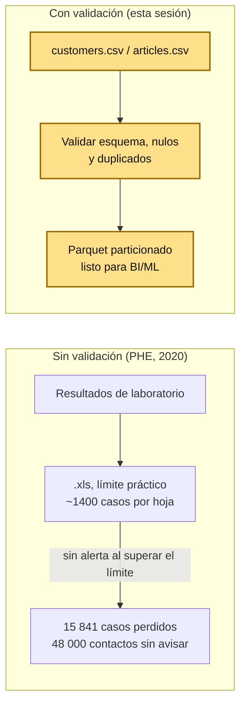
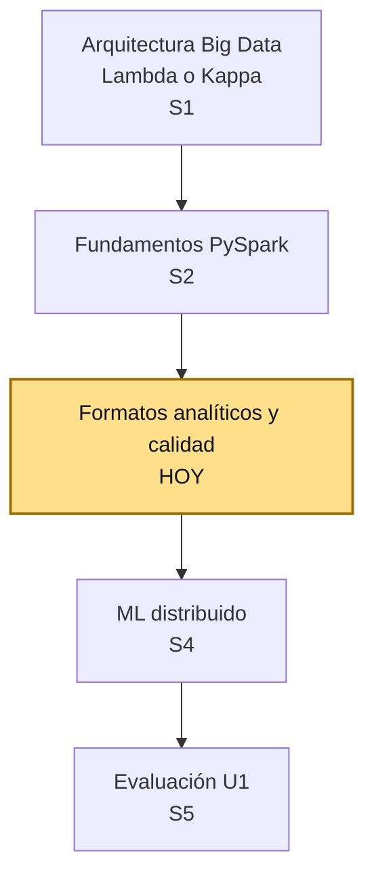
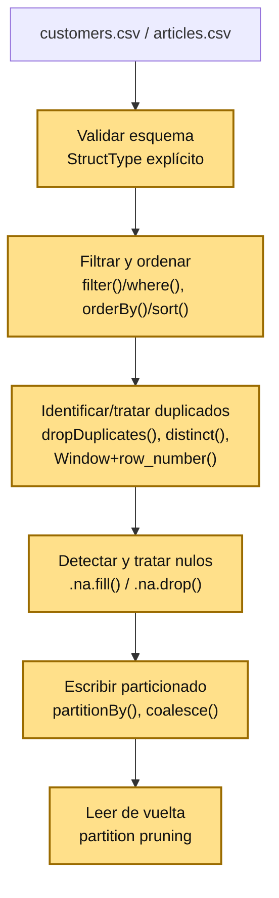
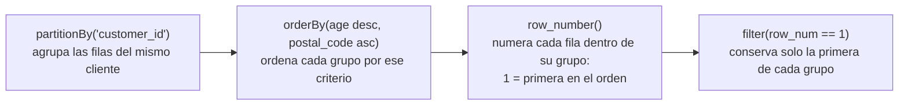
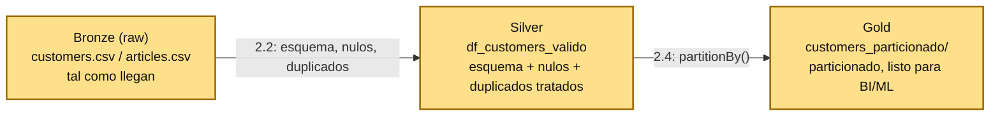

# S3 - Procesamiento y Calidad de Datos: filtrado, duplicados, nulos y particionamiento analítico

## 1. Introducción

### 1.1 Presentación de la sesión

S1 decidió la arquitectura del pipeline batch; S2 construyó las transformaciones distribuidas sobre esa arquitectura. Esta sesión cierra esa cadena: formaliza el procesamiento de datos (filtrar, ordenar) y la calidad de datos (esquema, nulos, duplicados) como un paso explícito y repetible antes de escribir cualquier salida analítica — el mismo control que se aplica de aquí en adelante a cualquier dataset nuevo que entre al pipeline, no solo al de hoy. Y cierra con el formato y la estructura de particionamiento que esa salida necesita para ser realmente utilizable a escala, no solo "que cargue sin error".

El porqué de formalizar esto — qué pasa cuando nadie lo hace — se desarrolla en 1.6, a partir de un caso real. Esta sesión no levanta un clúster HDFS real (queda fuera del alcance de un laboratorio en una sola máquina), pero reproduce la misma estructura de carpetas particionadas y el mismo razonamiento que un almacenamiento distribuido real exige.

### 1.2 Índice

1. Validación de calidad de datos (esquema, nulos, duplicados).
2. Procesamiento distribuido de datos: filtrado y orden.
3. Carga particionada en formatos analíticos.
4. Verificación de la carga particionada.
5. Arquitectura por capas de un Data Lake: Bronze (raw), Silver y Gold.

### 1.3 Propósito de aprendizaje

Al concluir la clase, estarás en condiciones de:

- **Validar** el esquema y la calidad (nulos, duplicados) de un dataset real antes de cargarlo a un pipeline, **aplicar** el tratamiento adecuado según el problema encontrado, **escribir/leer** una salida analítica particionada en un formato columnar (Parquet), y **ubicar** cada paso dentro de las capas de un Data Lake analítico (Bronze/raw, Silver, Gold).

### 1.4 Producto de sesión

Notebook de Jupyter con: validación de esquema explícito (`StructType`, verificación de columnas obligatorias); filtrado (`filter()`/`where()`, `.between()`, `eqNullSafe()`) y orden (`orderBy()`/`sort()`) de resultados; duplicados identificados y tratados (`dropDuplicates()`, `distinct()`, deduplicación determinista con `Window` + `row_number()`); nulos detectados —incluidas cadenas vacías— y tratados (`.na.fill()`/`.na.drop()`); salida escrita en múltiples formatos y particionada en Parquet (`partitionBy()`, `coalesce()`/`repartition()`, `cache()`/`persist()` con `StorageLevel`); lectura particionada verificada (conteo de ida y vuelta, `PartitionFilters` confirmado en `explain(True)`).

### 1.5 Metodología

**Tabla 1. Metodología de la sesión**

| Actividades a Realizar en el Periodo | Orientaciones generales (Orientaciones Metodológicas) | Material de estudio recomendado |
|---|---|---|
| Revisión previa individual | Repasar el notebook de S2 (entorno `lambda26` ya debe estar funcionando) y **copiar `customers.csv`/`articles.csv` a `s03-procesamiento-calidad-datos/data/`** (ver 3.1) — no hace falta descargar nada nuevo, ya los tienes de S2. | Guía S2, guía S3 — sección 3.1. |
| Clase presencial | Construcción guiada del notebook `03_procesamiento_calidad_datos_practica.ipynb`: validación de esquema, nulos, duplicados y escritura particionada, sobre datos reales H&M. Trabajo individual, siguiendo al docente paso a paso; consulta inmediata ante dudas. | Pasos 3.1 a 3.12 de esta guía. |
| Evaluación formativa | Revisión en clase de los controles de calidad aplicados y la salida particionada. La evidencia se completa y sustenta de forma individual, fuera del aula, según los criterios mínimos de la sección 4.4. | Indicaciones de entrega (4.3), rúbrica de evaluación (4.6). |

### 1.6 Motivación de la sesión

#### 1.6.1 Caso: las 15 841 pruebas de COVID-19 que Excel perdió sin avisar

En octubre de 2020, Public Health England (PHE) —la agencia de salud pública de Inglaterra— descubrió que **15 841 resultados positivos** de pruebas de COVID-19, registrados entre el 25 de septiembre y el 2 de octubre, habían desaparecido de sus reportes diarios sin que nadie lo notara durante días. La causa no fue un virus más agresivo de lo esperado: fue un archivo Excel. El sistema automatizado que centralizaba los resultados de laboratorios privados los guardaba en plantillas con el formato antiguo `.xls`, con un límite duro de 65 536 filas por hoja — pero como cada resultado ocupaba varias filas, la capacidad práctica real era de apenas ~1400 casos por plantilla. Cuando ese límite se superaba, los resultados adicionales simplemente **no se importaban** — sin error, sin advertencia, sin que el proceso se detuviera.

Los pacientes sí recibieron su resultado individual. Lo que se perdió fue la conexión de esos casos con el sistema de rastreo de contactos: unas **48 000 personas** que habían estado en contacto cercano con alguien contagiado nunca fueron notificadas ni se les pidió aislarse, durante una semana crítica de la pandemia. El gobierno calificó el problema como un tema de "tamaño de archivo" y lo resolvió dividiendo los datos en múltiples hojas más pequeñas.

Fuente: Karabus, J. (2020, 5 de octubre). [*What a Hancock-up: Excel spreadsheet blunder blamed after England under-reports 16,000 COVID-19 cases*](https://www.theregister.com/2020/10/05/excel_england_coronavirus_contact_error/). The Register.

No fue una falla de Excel ni de Spark: fue que nadie validó, antes de que los datos entraran al pipeline de reporte, si el volumen esperado cabía en el formato elegido, ni si el proceso podía fallar en silencio sin dejar rastro. Esta sesión formaliza justamente ese control: antes de que un dataset llegue a una salida analítica lista para BI/ML, se valida su esquema, se cuentan y tratan sus nulos de forma explícita, y se confirma si tiene duplicados — sin dar por sentado que "si cargó sin error, está bien". Y se escribe en un formato pensado para el volumen real de los datos, no en uno con un límite artificial de filas.

**Figura 1. Cargar datos sin validar vs. con validación explícita**



*Nota.* Adaptado de *What a Hancock-up: Excel spreadsheet blunder blamed after England under-reports 16,000 COVID-19 cases*, por J. Karabus, 2020, The Register (<https://www.theregister.com/2020/10/05/excel_england_coronavirus_contact_error/>).

**Preguntas de análisis**

**Activación de conocimientos previos**

1. Antes de leer la causa, ¿qué esperarías que pasara si un sistema deja de agregar filas nuevas a un archivo sin lanzar ningún error? ¿Cómo lo notarías, si nadie te avisa?
2. ¿Qué diferencia hay entre que un dato "no exista" (un nulo, que sí se ve en el dataset) y que un dato "exista pero nunca haya llegado a cargarse" (como los 15 841 casos de PHE, invisibles hasta que alguien los buscó)?

**Comprensión de validación de datos**

1. Según el caso, ¿qué control simple —aplicado *antes* de cargar los datos al pipeline de reporte— habría evitado que el límite de `.xls` causara una pérdida silenciosa? Relaciónalo con lo que vas a aplicar en 3.3-3.9.
2. ¿Por qué confirmar el conteo de filas antes y después de cada paso de limpieza (como harás en 3.5 y 3.8) es una práctica que un equipo de datos real necesita, según lo que le pasó a PHE?

### 1.7 Ubicación en el curso

- Unidad: U1 - Arquitecturas Big Data y ETL batch distribuido.
- Producto del curso: Proyecto Sello: sistema Big Data distribuido end-to-end para procesamiento batch y streaming, analítica/ML, observabilidad y visualización BI para la toma de decisiones.
- Producto de unidad: pipeline batch de ETL distribuido con salidas analíticas en Parquet listas para BI/ML.
- Avance del producto en esta sesión: salida analítica particionada en Parquet, con controles de calidad (esquema, nulos, duplicados) aplicados sobre datos del Proyecto Sello.

**Figura 2. Roadmap del producto de la unidad U1**



Hoy se cierra la base técnica que el resto de la unidad necesita: sin un dataset con esquema validado, nulos tratados y duplicados resueltos, S4 (ML distribuido) entrenaría un modelo sobre datos sin confiabilidad garantizada. La evaluación U1 (S5) valida el pipeline batch completo, desde la arquitectura hasta esta salida particionada.

## 2. Explica

Tiempo: 25 min.

### 2.1 Arquitectura de la sesión

**Figura 3. Arquitectura de la sesión: validación de calidad y escritura particionada sobre `uso-pyspark`**



Cada bloque de esta cadena es un control de calidad, no un paso decorativo: si uno se salta, el problema no desaparece — solo se descubre más tarde, más caro de corregir (como en el caso de 1.6).

### 2.2 Validación de calidad de datos: esquema, nulos y duplicados

El sílabo agrupa estos tres controles bajo un mismo concepto — calidad de datos — porque comparten el mismo propósito, aunque cada uno mire un problema distinto: confirmar que el dataset es confiable *antes* de construir nada sobre él, no descubrirlo después de que el problema ya causó daño (como en el caso de 1.6).

#### 2.2.1 Validación de esquema

En S2 (2.4) ya viste que `inferSchema=True` puede adivinar mal un tipo (un código postal con ceros iniciales convertido silenciosamente a número) y que un `StructType` explícito evita esa ambigüedad. En S3, esa misma técnica se usa con una intención distinta: no es solo "leer correcto", es la primera verificación formal de calidad — confirmar que el dato que llegó es el que esperabas, antes de construir nada sobre él.

**Tabla 2. Señales de un esquema roto, y qué revisar**

| Señal | Qué puede significar | Qué revisar |
|---|---|---|
| Una columna numérica llega como `string` (o viceversa) | El archivo real no calza con el esquema que esperabas, o tiene valores mezclados (texto en una columna numérica). | Compara `printSchema()` contra el esquema documentado; identifica la fila que rompe el tipo esperado. |
| `df.columns` trae menos o más columnas de las esperadas | El archivo cambió de estructura (una fuente externa actualizó su formato) o el separador/header se leyó mal. | Revisa `header=True` y el separador (`sep=","` por defecto); compara contra una versión anterior del archivo si existe. |
| Un valor "normal" a simple vista rompe un tipo (`"05001"` → `5001`) | `inferSchema=True` adivinó mal — el mismo caso del cero inicial de S2. | Usa `StructType` explícito con `StringType()` para esa columna. |

`printSchema()` y `df.columns` (ya vistos en S2) son las dos herramientas mínimas para esta verificación — la diferencia en S3 es que se hace *siempre*, como primer paso, antes de cualquier transformación, no como una curiosidad ocasional.

Un esquema explícito confirma el *tipo* de cada columna, pero no confirma que la columna exista de verdad: un CSV con una columna renombrada o eliminada igual carga sin error, con esa columna entera en `null`. La verificación completa compara el conjunto de columnas leídas contra el conjunto esperado, y detiene el pipeline si falta alguna — no como advertencia, como una condición que impide seguir:

```python
columnas_requeridas = {"customer_id", "FN", "Active", "club_member_status", "fashion_news_frequency", "age", "postal_code"}
faltantes = columnas_requeridas - set(df.columns)
if faltantes:
    raise ValueError(f"Faltan columnas obligatorias: {sorted(faltantes)}")
```

`raise ValueError(...)` detiene la ejecución ahí mismo, con un mensaje que dice exactamente qué falta — la diferencia frente a dejar que el pipeline siga y falle más adelante, en un paso que ya no tiene relación obvia con la causa real.

#### 2.2.2 Duplicados

"Duplicado" no tiene una única definición — depende de qué columnas comparas, y de si necesitas *elegir* cuál fila conservar o simplemente confirmar que no hay copias:

**Tabla 3. Formas de tratar duplicados**

| Técnica | Qué compara | Qué hace con las filas repetidas | Cuándo usarla |
|---|---|---|---|
| `df.dropDuplicates()` | **Todas** las columnas de la fila. | Colapsa filas idénticas en todas sus columnas a una sola. | Confirmar que no hay filas exactamente repetidas de punta a punta. |
| `df.dropDuplicates(["col1", "col2"])` | Solo la(s) columna(s) indicada(s). | Se queda con **una** fila por cada combinación única de esas columnas — cuál exactamente no lo controlás. | Confirmar unicidad de una clave, simple o compuesta. |
| `df.distinct()` | **Todas** las columnas de la fila. | Igual que `dropDuplicates()` sin argumentos — es su forma corta. | Lo mismo que la primera fila de esta tabla; ambas son intercambiables. |
| `groupBy("col").count().filter("count > 1")` | La(s) columna(s) agrupadas. | No elimina nada — **lista** los valores que aparecen más de una vez, sin decidir qué hacer con ellos todavía. | Diagnosticar *cuántos* y *cuáles* duplicados hay, antes de decidir cómo tratarlos. |
| `Window.partitionBy("col").orderBy(...)` + `row_number()` | Solo la(s) columna(s) de partición. | Igual que `dropDuplicates()`, pero **tú eliges** cuál fila del grupo conservar (la de mayor/menor valor de otra columna). | Cuando una fila cualquiera del grupo no sirve — necesitas la correcta (la más reciente, la de mayor edad, etc.). |

`dropDuplicates()`/`distinct()` deciden solas cuál copia conservar (una cualquiera); `Window`+`row_number()` te da control real sobre el criterio de selección — por ejemplo, quedarte con el registro de mayor `age` por `customer_id`. Pero un solo criterio de orden no alcanza para que el resultado sea *determinista*: si dos filas del mismo `customer_id` empatan en `age`, cuál de las dos gana el `row_number() == 1` queda librado al orden interno con el que Spark procesó esos datos — puede cambiar entre corridas del mismo dataset. Se agrega una segunda columna como desempate, para que el ganador sea siempre el mismo:

```python
from pyspark.sql.window import Window
from pyspark.sql.functions import row_number

window_spec = Window.partitionBy("customer_id").orderBy(
    col("age").desc_nulls_last(),
    col("postal_code").asc_nulls_last(),
)

df_ranked = df_customers.withColumn("row_num", row_number().over(window_spec))
df_clean = df_ranked.filter(col("row_num") == 1).drop("row_num")
```

`Window` no hace nada raro — solo automatiza algo que harías a mano si tuvieras pocas filas: agrupar, ordenar cada grupo por tu criterio, y numerar. La diferencia con `dropDuplicates()` es que ahí **tú** decides el orden; en `dropDuplicates()`, decide Spark, sin que puedas influir.

**Figura 4. Qué hace cada pieza de `Window`+`row_number()`**



**Tabla 4. El mismo ejemplo, fila por fila**

| `customer_id` | `age` | `postal_code` | → `row_num` | ¿Sobrevive `filter(row_num == 1)`? |
|---|---|---|---|---|
| C001 | 34 | 08001 | 1 | Sí — dentro del grupo C001, gana por `postal_code` (desempate, `asc`) |
| C001 | 34 | 08002 | 2 | No — mismo `age`, pero pierde el desempate |
| C002 | 51 | 28010 | 1 | Sí — único de su grupo, ni siquiera necesitó desempate |

`partitionBy` decide **los grupos** (uno por `customer_id`); `orderBy` decide **el orden dentro de cada grupo**, no entre grupos — por eso C001 y C002 tienen cada uno su propio `row_num` empezando en 1. `dropDuplicates(["customer_id"])` llega al mismo número de filas finales, pero sin la columna `age`/`postal_code` como criterio: conservaría una fila cualquiera de C001, no necesariamente la de `postal_code` más bajo.

Si la columna de desempate en sí puede repetirse entre dos filas candidatas (como acá, donde dos clientes de la misma edad también podrían compartir `postal_code`), el resultado sigue sin ser 100% determinista — la garantía real solo la da una columna con valores únicos por fila dentro de cada partición (un identificador propio de la fila, o una marca temporal con precisión suficiente). En producción, el criterio más común es una columna de actualización (`updated_at DESC`) más una columna estable como desempate final.

El caso real de S2 ilustra por qué esta distinción importa más allá de la sintaxis: en `articles.csv`, muchos `article_id` distintos comparten la misma `detail_desc` (mismo producto, distinta variante de color/talla). Eso **no** es un duplicado de fila — `dropDuplicates()`/`distinct()` no deberían eliminar ninguna de esas filas, porque cada `article_id` es legítimamente distinto. Si en cambio quisieras un solo representante por `product_code` (el producto base, sin variantes), ahí sí corresponde `Window`+`row_number()` — porque necesitas elegir cuál variante conservar, no simplemente confirmar unicidad.

#### 2.2.3 Nulos: detección y tratamiento

Un nulo no es automáticamente un error — puede ser un dato legítimamente ausente (una bandera que nunca se activó) o una falla real de captura. Antes de decidir qué hacer, hay que **contarlos**, columna por columna:

```python
from pyspark.sql.functions import col, count, when

df.select([
    count(when(col(c).isNull(), c)).alias(c) for c in df.columns
]).show(vertical=True, truncate=False)
```

`when(col(c).isNull(), c)` devuelve el nombre de la columna cuando el valor es nulo, y `None` cuando no lo es; `count()` sobre eso cuenta solo los casos nulos, columna por columna, en una sola pasada.

Ese conteo se le puede escapar a un problema real: en columnas de texto, una cadena vacía (`""`) o solo espacios no cuenta como `NULL` para Spark, aunque en la práctica signifique exactamente lo mismo — un dato ausente. Antes de dar por buena una columna de texto porque `isNull()` dio 0, confirma también esto:

```python
from pyspark.sql.functions import trim

df.filter(col("customer_id").isNull() | (trim(col("customer_id")) == "")).count()
```

Con el conteo en mano, hay dos operaciones para tratar los nulos, y no son intercambiables:

**Tabla 5. `.na.fill()` vs. `.na.drop()`**

| Operación | Qué hace | Cuándo usarla |
|---|---|---|
| `.na.fill({...})` (alias: `.fillna({...})`) | Reemplaza los nulos por un valor por defecto, columna por columna — de cualquier tipo, incluidas columnas numéricas. | Cuando el nulo tiene un significado razonable (una bandera no activada, una categoría "sin dato") y la fila completa sigue siendo útil. |
| `.na.drop()` (sin argumentos) | Elimina **toda fila que tenga al menos un nulo, en cualquier columna**. | Rara vez es la decisión correcta sin más — es la versión más agresiva posible. |
| `.na.drop(subset=[...])` | Elimina las filas donde **solo** la(s) columna(s) indicada(s) son nulas. | Cuando el nulo hace que la fila sea inutilizable — por ejemplo, sin un identificador (`customer_id`), la fila no se puede vincular a nada. |

`.na.fill({...})` puede rellenar cualquier columna, con el tipo de valor que corresponda — pero que la sintaxis lo permita no significa que cualquier valor sea una buena decisión. Rellenar una columna de bandera (`FN`, `Active`) con `0` es razonable: el nulo ya significaba "no activado". Rellenar `age` con `0` es distinto — un cliente de "0 años" no es un dato faltante marcado como tal, es un dato **falso** que se ve como válido; peor que dejarlo nulo, porque un nulo al menos se puede detectar y un `0` se puede confundir con un valor real. Por eso el notebook de esta sesión no rellena `age`, aunque la sintaxis lo permitiría.

`.na.drop()` sin argumentos es la versión más agresiva: elimina una fila si **cualquier** columna tiene un nulo. En una corrida real sobre `customers.csv`, esto dejó **462 911** de 1 371 980 filas — un 66.3% del dataset descartado, solo por tener al menos un nulo en alguna de las 7 columnas. Casi siempre conviene `subset=[...]`, apuntando solo a la columna que de verdad invalida la fila.

### 2.3 Procesamiento distribuido: filtrado y orden de resultados

Con el dataset ya validado, estas dos operaciones cubren cómo seleccionar y ordenar resultados sobre datos en los que ya se puede confiar.

#### 2.3.1 Filtrado de datos: `filter()` y `where()`

`filter()` acepta dos formas equivalentes de escribir la misma condición — una expresión SQL como texto, o una expresión booleana con `col()`. En una expresión booleana, las condiciones se combinan con `&` (y), `|` (o) y `~` (no), cada comparación entre paréntesis — **no** con los operadores `and`/`or`/`not` de Python, que no operan sobre columnas de Spark y fallan con un error, no con un resultado silenciosamente incorrecto.

**Tabla 6. Dos formas de escribir el mismo filtro**

| Expresión SQL (texto) | Expresión booleana (`col()`) |
|---|---|
| `df.filter("age > 30")` | `df.filter(col("age") > 30)` |
| `df.filter("age BETWEEN 25 AND 35")` | `df.filter(col("age").between(25, 35))` |
| `df.filter("fashion_news_frequency IN ('Regularly', 'Monthly')")` | `df.filter(col("fashion_news_frequency").isin("Regularly", "Monthly"))` |

La versión SQL es más compacta para condiciones simples; la versión con `col()` es la única forma de combinar condiciones con operadores de columna (`&`, `|`, `~`) o de encadenar métodos como `.isin()`, `.isNull()`, `.startswith()` — no hay un equivalente en texto para esos últimos. `where()` es un **alias exacto** de `filter()` (mismo método, otro nombre) — usa el que le resulte más natural a tu equipo; Spark no distingue entre ambos.

**Cuidado con la trampa entre `BETWEEN`/`.between()` y una comparación estricta escrita a mano.** `.between(25, 35)` es el equivalente exacto de `BETWEEN 25 AND 35` — **incluye ambos extremos**. Pero `(col("age") > 25) & (col("age") < 35)` no es lo mismo: excluye 25 y 35. Parecen la misma idea, no lo son — en una corrida real sobre `customers.csv`, `.between(25, 35)` devolvió **413 179** filas y la versión estricta **338 303** — una diferencia real de **74 876 filas**, exactamente las que tienen edad 25 o 35.

`eqNullSafe()` es otra comparación con semántica distinta a la obvia: `col("x") == None` nunca es verdadero, ni siquiera para las filas donde `x` es nulo — comparar con `null` usando `==` siempre da `null`, no `True`. `col("x").eqNullSafe(None)` sí encuentra esas filas, porque trata `null` como un valor comparable en vez de "desconocido". Sobre `club_member_status` (6 062 nulos), `col("club_member_status").eqNullSafe(None)` devuelve exactamente esos **6 062** — el mismo resultado que `isNull()`, pero con la semántica de igualdad, útil cuando estás comparando contra una variable que podría o no ser `None` sin saberlo de antemano.

Dos casos adicionales de `filter()` con `col()`, útiles para calidad de datos:

```python
# Filtrar nulos
df_customers.filter(col("club_member_status").isNotNull()).show()
df_customers.filter(col("fashion_news_frequency").isNull()).show()

# Filtrar por contenido de texto
df_customers.filter(col("postal_code").startswith("28")).show()
df_customers.filter(col("postal_code").contains("56")).show()
df_customers.filter(col("postal_code").endswith("00")).show()
```

`.isNotNull()`/`.isNull()` filtran filas según si una columna específica es nula — a diferencia del conteo de 2.2.3 (que cuenta nulos en todas las columnas a la vez), esto te deja *ver* las filas nulas de una columna, no solo contarlas. `.startswith()`/`.contains()`/`.endswith()` filtran por texto dentro del valor de una columna — útiles para validar formato (por ejemplo, que todos los `postal_code` empiecen con un prefijo de región esperado).

#### 2.3.2 Orden de resultados: `orderBy()` y `sort()`

`orderBy()` reorganiza **todo** el DataFrame en un orden global — a diferencia de un filtro, que cada partición resuelve por su cuenta sin coordinarse con las demás, ordenar de punta a punta obliga a Spark a barajar (*shuffle*) los datos entre particiones para compararlos entre sí. Es una operación cara: se aplica sobre el resultado final que vas a mostrar o guardar, no como paso intermedio de un pipeline si el orden no se necesita justo ahí.

```python
df_customers.orderBy("age").show(3)                      # ascendente por defecto
df_customers.orderBy(col("age").desc()).show(3)           # descendente
df_customers.orderBy("age", ascending=False).show(3)      # descendente, otra sintaxis
```

Por defecto, los nulos van al final en orden ascendente y al principio en descendente. `asc_nulls_last()`/`desc_nulls_last()` (o sus pares `_nulls_first()`) lo dejan explícito, en vez de depender de un comportamiento implícito:

```python
df_customers.orderBy(col("age").desc_nulls_last()).show(3)
df_customers.orderBy(col("postal_code").asc_nulls_last()).show(3)
```

Con varias columnas, cada una puede tener su propio sentido de orden:

```python
df_customers.orderBy(col("club_member_status").asc(), col("age").desc()).show(3)
df_customers.orderBy(["club_member_status", "age"], ascending=[True, False]).show(3)
```

También puedes ordenar por el resultado de una expresión, no solo por una columna tal cual — por ejemplo, por la longitud de un texto:

```python
from pyspark.sql.functions import length

df_customers.orderBy(length(col("postal_code")).desc()).show()
```

`sort()` es un **alias exacto** de `orderBy()`, igual que `where()` lo es de `filter()` — mismo resultado, dos nombres.

### 2.4 Carga particionada en formatos analíticos

La carga particionada no es solo "elegir un formato" — cómo se escribe (2.4.1) y qué tan bien se aprovecha la memoria antes de escribir (2.4.2) determinan si esa carga es realmente utilizable a escala.

#### 2.4.1 Escritura en múltiples formatos y particionada

`.write.format("formato").option(...).save("ruta")` es la forma genérica de guardar un DataFrame — el mismo método sirve para `"csv"`, `"json"`, `"parquet"`, `"orc"`, cambiando solo el string:

```python
df.write.format("csv").option("header", True).save("ruta/salida_csv")
df.write.format("json").save("ruta/salida_json")
df.write.format("parquet").save("ruta/salida_parquet")
```

`.csv()`/`.json()`/`.parquet()` (los que ya usaste en S2 y en esta guía) son atajos de esa misma forma genérica, para el caso común de un solo formato sin opciones adicionales — `.write.format("parquet").save(...)` y `.write.parquet(...)` hacen exactamente lo mismo.

`partitionBy()` no agrega una columna al archivo — crea una **subcarpeta por cada valor distinto** de la columna indicada:

```python
df.write.format("parquet").partitionBy("columna").save("ruta/salida")
```

```text
ruta/salida/
├── columna=valor_a/
│   └── part-00000-....parquet
├── columna=valor_b/
│   └── part-00000-....parquet
└── columna=valor_c/
    └── part-00000-....parquet
```

Esta es la estructura que hace que un formato particionado sea distinto de "guardar un CSV grande": una consulta que filtra por `columna = "valor_a"` puede ignorar por completo las carpetas `valor_b`/`valor_c`, sin siquiera abrirlas — el mismo principio que organiza datos en HDFS o en un data lake real, aunque acá corra sobre disco local. Esto es *particionamiento físico* — existe en disco, en la estructura de carpetas.

No cualquier columna sirve para esto. Una buena columna de partición tiene cardinalidad baja o moderada (pocos valores distintos) y aparece seguido en filtros — `club_member_status`, con un puñado de valores posibles, cumple ambas condiciones. Un identificador único como `customer_id` no serviría: crearía una carpeta distinta por cada uno de los 1 371 980 clientes, la mayoría con un solo archivo diminuto adentro — el particionamiento deja de ayudar (no hay ninguna carpeta grande que evitar abrir) y solo agrega miles de carpetas que gestionar.

Existe también el *particionamiento lógico*: cómo Spark organiza los datos **en memoria**, mientras los procesa, sin que eso se refleje todavía en ningún archivo:

```python
df = df.repartition("customer_id")  # reorganiza los datos en memoria por esa columna
```

`repartition("columna")` agrupa en memoria las filas que comparten valor de esa columna en la misma partición interna — útil antes de un `groupBy()`/`join()` costoso sobre esa columna, para que Spark no tenga que barajar los datos de nuevo en ese paso. No crea ninguna carpeta — es un paso previo, no de escritura.

`coalesce(N)`/`repartition(N)` (S2 ya usó `coalesce(1)` para forzar un solo archivo de salida) influyen en cuántos archivos `part-0000X` caen **dentro de cada** carpeta de partición física — sin fijarlos, se hereda el número de particiones del DataFrame en memoria (la misma sorpresa de las ~50 particiones que viste en S2 al guardar una muestra pequeña). No es una garantía exacta de "N archivos por carpeta": el resultado final depende también de cómo queden distribuidos los datos entre esas N particiones antes de escribir, no solo del número que pediste.

**Tabla 7. `coalesce(N)` vs. `repartition(N)`**

| | `coalesce(N)` | `repartition(N)` |
|---|---|---|
| Puede... | Solo **reducir** el número de particiones. | Aumentar o reducir el número de particiones. |
| Cómo lo hace | Combina particiones existentes, sin barajar todos los datos. | Baraja (*shuffle*) todos los datos entre las N particiones nuevas. |
| Costo | Más barato — evita el *shuffle* completo. | Más caro, pero necesario si necesitas *más* particiones que las actuales. |

#### 2.4.2 Cache y persistencia

Spark puede guardar un DataFrame ya calculado en memoria (o disco) para no recalcularlo cada vez que lo usas — la misma idea de `cache()` que S2 introdujo (2.5), acá con más control:

```python
df_filtrado = df.filter(col("age") > 30).cache()

df_filtrado.count()  # se calcula y se guarda
df_filtrado.show()   # se reutiliza desde memoria, no vuelve a filtrar
```

`persist()` es la versión con más control de `cache()` — `cache()` es en realidad `persist()` con un nivel de almacenamiento por defecto (memoria). `StorageLevel` deja elegir explícitamente dónde guardar:

```python
from pyspark.storagelevel import StorageLevel

df.persist(StorageLevel.MEMORY_AND_DISK)  # usa memoria; si no alcanza, cae a disco
```

**Tabla 8. Cuándo usar cada técnica**

| Técnica | Qué hace | Cuándo usarla |
|---|---|---|
| Evaluación perezosa (S2) | Difiere la ejecución hasta una acción. | Siempre — Spark lo hace automáticamente, no se activa a mano. |
| `partitionBy()` / `repartition()` | Organiza los datos (en disco o en memoria) para paralelismo. | Antes de escrituras, `join()`s o `groupBy()`s costosos sobre esa columna. |
| `cache()` / `persist()` | Evita recalcular un resultado ya obtenido. | Si vas a reutilizar el mismo DataFrame varias veces — no antes de un uso único. |

`df.unpersist()` libera esa memoria cuando ya no la necesitas — cacheado indefinidamente, un DataFrame grande puede desplazar a otros del clúster.

### 2.5 Verificación de la carga particionada

Al leer una salida particionada, Spark reconstruye la columna de partición a partir del **nombre de la carpeta**, no del contenido del archivo — `spark.read.parquet("ruta/salida")` te devuelve `columna` como si fuera una columna normal, aunque no esté guardada dentro de ningún `part-0000X.parquet`.

Antes de confiar en esa lectura, confirma que el viaje de ida y vuelta (escribir, después leer) no perdió ni duplicó ninguna fila — no lo asumas, compáralo contra el conteo del DataFrame que escribiste:

```python
assert df_leido.count() == df_original.count()
```

Si el `assert` falla en silencio (sin lanzar excepción) es que los conteos coinciden — la ausencia de error es la confirmación misma, no hace falta un `print` adicional.

Si filtras por esa columna, `explain(True)` muestra una optimización que no viste en S2: **`PartitionFilters`**, junto al ya conocido `PushedFilters`. La diferencia es real, no solo de nombre:

**Tabla 9. `PushedFilters` (S2) vs. `PartitionFilters` (S3)**

| | `PushedFilters` | `PartitionFilters` |
|---|---|---|
| Qué filtra | Filas, dentro de los archivos que igual se abren. | **Carpetas enteras**, antes de abrir ningún archivo. |
| Sobre qué actúa | El contenido de las columnas dentro del archivo. | El nombre de la carpeta de partición. |
| Costo evitado | Procesar filas que no cumplen el filtro. | Abrir y leer archivos que ni siquiera contienen el valor buscado. |

*Partition pruning* es más barato que *predicate pushdown*: uno evita procesar filas, el otro evita abrir archivos enteros.

**Cuidado: `PartitionFilters` solo aparece si el filtro compara la columna de partición directamente.** En cuanto envuelves esa columna en una función —`upper()`, `trim()`, un `cast()`— antes de compararla, Spark ya no puede resolver de antemano qué carpetas saltarse: `PartitionFilters` queda vacía y el filtro se aplica *después* de abrir todos los archivos, como `PushedFilters` normal. El resultado final es idéntico; el costo, no. Se verifica en 3.11.

### 2.6 Arquitectura por capas de un Data Lake: Bronze (raw), Silver y Gold

Un Data Warehouse se grafica como estrella o constelación porque tiene tablas fijas (hecho + dimensiones) con relaciones declaradas. Un Data Lake no tiene eso — guarda archivos, no tablas relacionadas — así que no se grafica con un diagrama de esquema (ER): se organiza en **capas de refinamiento creciente**. El patrón más usado para eso es la arquitectura *medallion*: **Bronze** (*raw*), **Silver**, **Gold**.

**Tabla 10. Las tres capas, con lo que ya construiste en esta sesión**

| Capa | Qué contiene | Dónde queda en esta sesión |
|---|---|---|
| **Bronze** (*raw*) | El dato tal como llega, sin tocar — ni siquiera se valida todavía. | `customers.csv`/`articles.csv` originales (3.1). |
| **Silver** | Esquema validado, nulos y duplicados tratados — confiable, pero todavía no organizado para consulta rápida. | `df_customers_valido` (3.3-3.8): esquema, nulos y duplicados de la sección 2.2. |
| **Gold** | Particionado y listo para consumo directo por BI/ML, sin más limpieza pendiente. | `customers_particionado/` (3.10): la salida particionada de la sección 2.4. |

**Figura 5. De Bronze a Gold, sobre los datos de esta sesión**



Cada control de calidad de esta sesión (2.2) es, en el fondo, el paso que mueve el dato de Bronze a Silver — validar esquema, tratar nulos y resolver duplicados no son pasos sueltos, son la definición operativa de "Silver". El particionado (2.4) es el paso que mueve el dato de Silver a Gold: ya confiable, pero todavía sin organizar para que una consulta futura no tenga que leer más de lo necesario. `customers_particionado/` —la salida que S4 consume— es Gold: es la capa que existe específicamente para ser consumida por otro sistema (BI o ML), no para seguir transformándose.

**¿Y dónde quedan las dimensiones y la tabla de hechos?** No aparecen en esta sesión, por dos motivos, no uno solo. Primero, falta la mitad de la ecuación: una tabla de hechos existe para medir un **evento** (una venta, un pedido), y las dimensiones son las entidades que describen ese evento (quién, qué, cuándo) — acá `customers.csv` es una sola tabla descriptiva, sin ningún evento medible en juego. `transactions.parquet` sí sería el candidato natural a "hecho" (con `customers`/`articles` como dimensiones), pero esta sesión lo deja fuera a propósito (3.1: "esta sesión no necesita `transactions.parquet`") — sin un hecho, no hay nada alrededor de qué organizar dimensiones. Segundo, y más de fondo: aunque hubiera un hecho, modelarlo en estrella todavía no sería trabajo de esta capa. Un Data Lake prepara el dato para que **cualquier consumidor futuro** lo modele como necesite — un Data Warehouse con estrella, un modelo de ML (S4), un reporte ad hoc — esa decisión es de quien consume Gold, río abajo, no de quien lo construye.

**Tabla 11. Data Warehouse frente a Data Lake**

| | Data Warehouse | Data Lake (esta sesión) |
|---|---|---|
| Pregunta que resuelve | ¿Cómo se relacionan mis eventos con las entidades que los describen? | ¿Cómo garantizo que el dato esté limpio y sea consultable sin leer de más? |
| Qué es | Una base de datos: el resultado ya modelado (hecho + dimensiones) | Un repositorio de archivos organizado en capas de refinamiento |
| Paradigma de carga | **ETL**: transformar (modelar en estrella) antes de cargar a la base | **ELT**: cargar tal como llega (Bronze/raw), transformar después, dentro del propio repositorio |
| Se grafica con | Diagrama ER: estrella o constelación | Diagrama de flujo por capas + árbol de carpetas particionadas |
| Cuándo se decide la forma final | Antes de cargar — el modelo dimensional se diseña primero | Después de Gold — cada consumidor decide su propia forma |
| Consumidor típico | Un dashboard ejecutivo con KPIs fijos | Cualquier proceso posterior: un DW, un modelo ML (S4), un reporte distinto cada vez |

**Figura 6. De este Data Lake (ELT) a un futuro Data Warehouse (ETL)**

```mermaid
flowchart LR
    subgraph DLPROC["ELT (Data Lake), esta sesión"]
        direction LR
        E2["Extract<br/>fuente(s) real(es)"]
        subgraph LAGO["esto es el Data Lake"]
            direction LR
            L2["Load<br/>Bronze (raw), tal como llega"] --> T2["Transform<br/>esquema, nulos, duplicados<br/>(construye Silver)"]
            T2 --> L3["Load<br/>Gold, particionado<br/>(customers_particionado/)"]
        end
        E2 --> L2
    end
    subgraph DWPROC["ETL (Data Warehouse) — hipotético"]
        direction LR
        T1["Transform<br/>modelar en estrella:<br/>hecho + dimensiones"]
        subgraph ALMACEN["esto es el Data Warehouse"]
            L1["Load<br/>Data Warehouse<br/>(la base de datos)"]
        end
        T1 --> L1
    end

    L3 -.->|"si algún día se construye un DW,<br/>parte de acá — no de un nuevo Extract"| T1

    classDef raw fill:#e8dcc8,stroke:#8a7455,color:#111;
    classDef gold fill:#ffe08a,stroke:#9a6b00,stroke-width:2px,color:#111;
    classDef hipotetico fill:#f5f5f5,stroke:#999,stroke-dasharray: 4 3,color:#555;
    class L2 raw;
    class L3 gold;
    class DWPROC hipotetico;
```



El Data Lake es el recuadro "esto es el Data Lake" completo (Bronze + Transform + Gold), no solo la última caja dorada — al revés que el DW, donde el Data Warehouse real es únicamente ese último `Load`. `customers_particionado/` (Gold) es donde termina S03; el bloque "ETL (Data Warehouse)" es hipotético, no parte de esta sesión — y si algún día se construyera, partiría de Gold, no de un `Extract` nuevo, porque el Data Lake ya hizo el trabajo de calidad que un DW necesitaría de todas formas.

## 3. Aplica: actividad práctica guiada

Tiempo: 2h.

**Actividad:** construir el notebook `03_procesamiento_calidad_datos_practica.ipynb` sobre el entorno `lambda26` (`uso-pyspark`), validando esquema, tratando nulos y duplicados, y escribiendo una salida analítica particionada en Parquet — sobre el mismo dataset real H&M usado en S2 (`customers.csv`, `articles.csv`).

**Propósito de la actividad:** dejar evidencia ejecutable de que dominas los controles de calidad de datos (esquema, nulos, duplicados) y el particionamiento de salidas analíticas, antes de avanzar a ML distribuido (S4).

**Orientaciones metodológicas:** en clase, el docente guía la construcción del notebook paso a paso, alternando explicación breve y ejecución; los estudiantes replican cada celda en su propio entorno, verificando el resultado (incluida la estructura de carpetas particionada) antes de avanzar al siguiente paso.

**Actividades para realizar:**

- **3.1** Preparar los datos de S2 y reanudar el entorno `lambda26`. `[Bronze]`
- **3.2** Crear el notebook y la `SparkSession`.
- **3.3** Cargar `customers.csv` y validar el esquema.
- **3.4** Explorar nulos por columna.
- **3.5** Filtrado de datos (`filter()`/`where()`).
- **3.6** Ordenar resultados (`orderBy()`/`sort()`).
- **3.7** Tratamiento de duplicados.
- **3.8** Tratar nulos con `.na.fill()` y `.na.drop()`. `[3.3-3.8: construyendo Silver]`
- **3.9** Escritura en múltiples formatos.
- **3.10** Escritura particionada en Parquet. `[Silver → Gold]`
- **3.11** Leer de vuelta y verificar el particionamiento. `[Gold]`
- **3.12** Documentar hallazgos y responder preguntas de reflexión.

### 3.1 Preparar los datos de S2 y reanudar el entorno `lambda26` `[Bronze]`

**Producto del paso:** `customers.csv` y `articles.csv` disponibles en `pyspark/sesiones/s03-procesamiento-calidad-datos/data/`, entorno `lambda26` funcionando.

Ya descargaste estos dos archivos en S2 — no hace falta descargarlos de nuevo, solo cópialos a la carpeta de esta sesión (desde tu máquina, no dentro del notebook):

```bash
cp lambda26/pyspark/sesiones/s02-fundamentos/data/customers.csv lambda26/pyspark/sesiones/s03-procesamiento-calidad-datos/data/
cp lambda26/pyspark/sesiones/s02-fundamentos/data/articles.csv lambda26/pyspark/sesiones/s03-procesamiento-calidad-datos/data/
```

`customers.csv` pesa ~207 MB — la copia tarda unos segundos, no es instantánea. **Espera a que termine antes de abrir Jupyter y correr el notebook**: si lees el archivo mientras todavía se está copiando, Spark lee la foto parcial que existe en ese instante, sin ningún error — solo un conteo de filas mucho menor al real, silencioso. Confirma que la copia terminó comparando el número de líneas contra el original:

```bash
wc -l lambda26/pyspark/sesiones/s02-fundamentos/data/customers.csv
wc -l lambda26/pyspark/sesiones/s03-procesamiento-calidad-datos/data/customers.csv
```

Ambos deben coincidir exactamente antes de seguir a 3.2.

Esta sesión no necesita `transactions.parquet` — el foco es esquema, nulos y duplicados sobre datos tabulares, no sobre transacciones. Si el contenedor `lambda26` sigue corriendo desde S2, continúa directo en 3.2.

### 3.2 Crear el notebook y la `SparkSession`

**Producto del paso:** notebook `03_procesamiento_calidad_datos_practica.ipynb` con una `SparkSession` activa.

```python
from pyspark.sql import SparkSession

spark = (
    SparkSession.builder
    .appName("sesion3-calidad-datos")
    .master("local[*]")
    .config("spark.ui.port", "4040")
    .config("spark.sql.shuffle.partitions", "8")
    .config("spark.driver.memory", "4g")
    .getOrCreate()
)

spark
```

`spark.driver.memory` en `"4g"` desde el arranque — en S2 la JVM se cayó por quedarse en el default de 1g; acá se fija de una vez, no se espera al primer *crash*.

Declara las rutas del dataset y las salidas, una sola vez:

```python
ORIGEN_DATOS = "/opt/s03-procesamiento-calidad-datos/data"
ARTIFACTS = "/opt/s03-procesamiento-calidad-datos/artifacts"
```

### 3.3 Cargar `customers.csv` y validar el esquema

`[3.3-3.8: construyendo Silver]` — ninguno de estos seis pasos por sí solo convierte `df_customers` en Silver (2.6); son el mismo dato, cada vez con un control de calidad más aplicado, hasta que 3.8 lo cierra en `df_customers_valido`.

**Producto del paso:** `df_customers` cargado con esquema explícito, verificado contra lo esperado — control de calidad #1: esquema.

Mismo esquema explícito de S2 (2.2, 2.4):

```python
from pyspark.sql.types import StructType, StructField, StringType, DoubleType, IntegerType

schema_customers = StructType([
    StructField("customer_id", StringType(), nullable=True),
    StructField("FN", DoubleType(), nullable=True),
    StructField("Active", DoubleType(), nullable=True),
    StructField("club_member_status", StringType(), nullable=True),
    StructField("fashion_news_frequency", StringType(), nullable=True),
    StructField("age", IntegerType(), nullable=True),
    StructField("postal_code", StringType(), nullable=True),
])

df_customers = spark.read.csv(
    f"{ORIGEN_DATOS}/customers.csv",
    header=True,
    schema=schema_customers,
)

df_customers.printSchema()
```

Un esquema explícito confirma el tipo, no la presencia — valida las 7 columnas requeridas de forma explícita, deteniendo el pipeline si falta alguna (2.2.1):

```python
columnas_requeridas = {
    "customer_id",
    "FN",
    "Active",
    "club_member_status",
    "fashion_news_frequency",
    "age",
    "postal_code",
}

faltantes = columnas_requeridas - set(df_customers.columns)
if faltantes:
    raise ValueError(f"Faltan columnas obligatorias: {sorted(faltantes)}")

print("Esquema validado: las 7 columnas requeridas estan presentes.")
```

Confirma también el conteo de filas — 7 columnas, en el mismo orden y tipo (Tabla 2):

```python
print(df_customers.columns)
df_customers.count()
```

### 3.4 Explorar nulos por columna

**Producto del paso:** conteo exacto de nulos por columna, con porcentaje sobre el total — control de calidad #2: nulos.

En S2, `.describe()` ya insinuó el problema (la fila `count` daba menos que el total en `FN`/`Active`). Acá lo cuantificas exacto, con la técnica de 2.2.3:

```python
from pyspark.sql.functions import col, count, when

total_filas = df_customers.count()

df_customers.select([
    count(when(col(c).isNull(), c)).alias(c) for c in df_customers.columns
]).show(vertical=True, truncate=False)
```

El mismo resultado, con porcentaje (más fácil de interpretar que el conteo crudo):

```python
nulos = df_customers.select([
    count(when(col(c).isNull(), c)).alias(c) for c in df_customers.columns
]).collect()[0].asDict()

for columna, cantidad in nulos.items():
    porcentaje = cantidad / total_filas * 100
    print(f"{columna}: {cantidad} nulos ({porcentaje:.1f}%)")
```

`isNull()` no detecta cadenas vacías ni espacios — confírmalo sobre `customer_id`, la columna crítica del dataset (2.2.3):

```python
from pyspark.sql.functions import trim

df_customers.filter(
    col("customer_id").isNull() | (trim(col("customer_id")) == "")
).count()
```

En una corrida real, dio **0** — `customer_id` no solo no tiene nulos, tampoco tiene cadenas vacías disfrazadas de dato.

### 3.5 Filtrado de datos (`filter()`/`where()`)

**Producto del paso:** las dos sintaxis de `filter()` (SQL y booleana) aplicadas sobre datos reales, más filtrado de nulos y de contenido de texto (2.3.1). Recuerda: `&`/`|`/`~` para combinar condiciones de columna, nunca `and`/`or`/`not` de Python.

Expresión SQL como texto:

```python
df_customers.filter("age > 30").show(3)
df_customers.filter("club_member_status = 'ACTIVE'").show()
df_customers.filter("age BETWEEN 25 AND 35").show()
df_customers.filter("fashion_news_frequency IN ('Regularly', 'Monthly')").show()
```

La misma lógica, con `col()` (Tabla 3) — `.between(25, 35)` es el equivalente exacto de `BETWEEN 25 AND 35`:

```python
from pyspark.sql.functions import col

df_customers.filter(col("age") > 30).show()
df_customers.filter(col("club_member_status") == "ACTIVE").show()
df_customers.filter(col("age").between(25, 35)).show()
df_customers.filter(col("fashion_news_frequency").isin("Regularly", "Monthly")).show()
```

Confirma la trampa entre `.between()` (inclusivo) y una comparación estricta escrita a mano (Tabla 3):

```python
print("between (incluye 25 y 35):", df_customers.filter(col("age").between(25, 35)).count())
print("estricto (excluye 25 y 35):   ", df_customers.filter((col("age") > 25) & (col("age") < 35)).count())
```

En una corrida real, `.between(25, 35)` dio **413 179** y la versión estricta **338 303** — una diferencia real de **74 876 filas**, las que tienen edad exactamente 25 o 35. No son la misma consulta, aunque se parezcan.

`eqNullSafe()` trata `null` como un valor comparable en vez de "desconocido" — útil cuando comparás contra algo que podría ser `None`:

```python
df_customers.filter(col("club_member_status").eqNullSafe("ACTIVE")).show(3)
df_customers.filter(col("club_member_status").eqNullSafe(None)).count()
```

En una corrida real, `eqNullSafe(None)` encontró **6 062** filas — exactamente los nulos de `club_member_status` (3.4) — algo que `col("club_member_status") == None` nunca habría encontrado, porque comparar con `null` usando `==` siempre da `null`, nunca `True`.

`where()` es el mismo método que `filter()`, con otro nombre:

```python
df_customers.where(col("Active") == 1).show()
df_customers.where("FN = 1").show()
```

Filtrar nulos de una columna específica (a diferencia del conteo de 3.4, esto te deja *ver* las filas, no solo contarlas):

```python
df_customers.filter(col("club_member_status").isNotNull()).show()
df_customers.filter(col("fashion_news_frequency").isNull()).show()
```

Filtrar por contenido de texto — útil para validar formato, por ejemplo que `postal_code` tenga el prefijo de región esperado:

```python
df_customers.filter(col("postal_code").startswith("28")).show()
df_customers.filter(col("postal_code").contains("56")).show()
df_customers.filter(col("postal_code").endswith("00")).show()
```

Filtrar también sirve para validar rangos — confirma si hay edades fuera de lo razonable:

```python
df_edad_invalida = df_customers.filter((col("age") < 0) | (col("age") > 100))
df_edad_invalida.count()
```

Si el conteo da 0, también es un control de calidad exitoso — no un resultado "vacío" sin valor.

### 3.6 Ordenar resultados (`orderBy()`/`sort()`)

**Producto del paso:** resultados ordenados por una, varias y por una expresión sobre una columna (2.3.2).

Por una sola columna, en las formas equivalentes:

```python
df_customers.orderBy("age").show(3)
df_customers.orderBy(col("age")).show(3)
df_customers.orderBy(col("age").desc()).show(3)
df_customers.orderBy("age", ascending=False).show(3)
```

Por defecto, los nulos van al final en ascendente y al principio en descendente — `desc_nulls_last()`/`asc_nulls_last()` (2.3.2) lo dejan explícito:

```python
df_customers.orderBy(col("age").desc_nulls_last()).show(3)
df_customers.orderBy(col("postal_code").asc_nulls_last()).show(3)
```

Por varias columnas, cada una con su propio sentido:

```python
df_customers.orderBy(col("club_member_status").asc(), col("age").desc()).show(3)
df_customers.orderBy(["club_member_status", "age"], ascending=[True, False]).show(3)
```

Por una expresión, no solo por el valor de la columna — acá, por la longitud del código postal:

```python
from pyspark.sql.functions import length

df_customers.orderBy(length(col("postal_code")).desc()).show()
```

`sort()` es el mismo método que `orderBy()`, con otro nombre:

```python
df_customers.sort("age").show(3)
df_customers.sort(col("age").desc()).show(3)
```

### 3.7 Tratamiento de duplicados

**Producto del paso:** duplicados identificados y/o tratados con las técnicas de la Tabla 5 — control de calidad #2.

Antes de eliminar nada, identifica **sin eliminar todavía** — lista qué valores de `customer_id` aparecen más de una vez, para saber si hay algo que tratar antes de decidir cómo tratarlo:

```python
from pyspark.sql.functions import count

df_customers.groupBy("customer_id").count().filter("count > 1").show()
```

Recién ahora, con el diagnóstico en mano, elimina duplicados completos (todas las columnas) o por columnas específicas:

```python
df_clean = df_customers.dropDuplicates()
df_clean = df_customers.dropDuplicates(["customer_id"])
df_clean = df_customers.dropDuplicates(["customer_id", "postal_code"])
```

`distinct()` es la forma corta de `dropDuplicates()` sin argumentos:

```python
df_clean = df_customers.distinct()
```

Confirma las cifras sobre el dataset completo — si coinciden con el total, no hay duplicados reales en ninguna definición:

```python
total = df_customers.count()
sin_duplicados_fila_completa = df_customers.distinct().count()
sin_duplicados_por_id = df_customers.dropDuplicates(["customer_id"]).count()

print(f"Total: {total}, sin duplicar (fila completa): {sin_duplicados_fila_completa}, sin duplicar (por customer_id): {sin_duplicados_por_id}")
```

En una corrida real, las tres cifras dieron **1 371 980** — cero duplicados, en ninguna de las dos definiciones. No es un resultado "vacío": es la confirmación real de que `customer_id` es una clave limpia en este dataset.

Marcar duplicados eligiendo cuál fila conservar (acá, la de mayor `age` por `customer_id`) — a diferencia de `dropDuplicates()`, que elige una fila cualquiera. Un solo criterio de orden no es determinista si hay empates (2.2.2) — se agrega `postal_code` como desempate:

```python
from pyspark.sql.window import Window
from pyspark.sql.functions import row_number

window_spec = Window.partitionBy("customer_id").orderBy(
    col("age").desc_nulls_last(),
    col("postal_code").asc_nulls_last(),
)

df_ranked = df_customers.withColumn("row_num", row_number().over(window_spec))
df_clean = df_ranked.filter(col("row_num") == 1).drop("row_num")
```

**Contraste real con `articles.csv`** (S2, 3.10): `rdd.take(5)` sobre `detail_desc` trajo descripciones idénticas repetidas. Eso **no** son duplicados de fila — cada `article_id` es distinto (variante de color/talla), así que `dropDuplicates()`/`distinct()` no deberían tocar ninguna de esas filas. Confirma cuántos `article_id` comparten la misma descripción, sin tratarlos como error:

```python
df_articles = spark.read.csv(f"{ORIGEN_DATOS}/articles.csv", header=True, inferSchema=True)

duplicados_por_descripcion = (
    df_articles.filter(col("detail_desc").isNotNull())
    .groupBy("detail_desc")
    .count()
    .filter(col("count") > 1)
    .orderBy(col("count").desc())
)
duplicados_por_descripcion.show(5, truncate=False)
```

`filter(col("detail_desc").isNotNull())` va **antes** del `groupBy()`: sin él, `groupBy()` agrupa todos los artículos sin descripción bajo un mismo grupo `NULL` — que en una corrida real salió como el "valor más repetido" (416 artículos), tapando los duplicados de contenido real que sí importan. Un `NULL` que se repite no es un duplicado de descripción, es simplemente la ausencia del dato.

Acá sí corresponde `Window`+`row_number()` para elegir un representante por `product_code` (el producto base, sin variantes de color/talla) — `article_id` identifica cada variante, `product_code` el producto. A diferencia del dedup de `customer_id`, acá no hace falta una columna de desempate adicional: `article_id` ya es único por fila, así que ordenar solo por él ya es determinista:

```python
window_producto = Window.partitionBy("product_code").orderBy("article_id")

df_articles_un_por_producto = (
    df_articles
    .withColumn("fila", row_number().over(window_producto))
    .filter(col("fila") == 1)
    .drop("fila")
)

print(f"Filas originales: {df_articles.count()}, un representante por product_code: {df_articles_un_por_producto.count()}")
```

En una corrida real, la reducción fue de **105 542 filas a 47 224 representantes** — más de la mitad de `articles.csv` son variantes de un producto ya representado por otra fila. Es la diferencia real entre `dropDuplicates()` (no puede hacer esta reducción, porque cada `article_id` es único) y `Window`+`row_number()` (sí, porque agrupa por `product_code`).

### 3.8 Tratar nulos con `.na.fill()` y `.na.drop()` `[Silver, completa]`

**Producto del paso:** `df_customers_valido`, el dataset final — filtrado/ordenado/deduplicado (3.5-3.7) y ahora con nulos tratados columna por columna, cada decisión con un criterio documentado (Tabla 6) — control de calidad #3.

`FN`/`Active` son columnas de tipo "bandera" (presente/ausente); un nulo ahí significa "la bandera no se activó" — se rellenan con `0`, no con un promedio. `fashion_news_frequency` nulo se rellena con `"NONE"`, la misma categoría que el propio dataset ya usa explícitamente para ese caso. `fillna()` es un alias exacto de `.na.fill()`:

```python
df_fill2 = df_customers.fillna({"FN": 0, "Active": 0})
```

`.na.fill()` puede rellenar cualquier columna, con cualquier tipo de valor — incluida `age`, con `0`. Pero que la sintaxis lo permita no lo hace buena idea: un cliente de "0 años" no es un dato faltante marcado como tal, es un dato **falso** que se ve como válido — peor que dejarlo nulo. Por eso, la versión que este notebook aplica de verdad **no** rellena `age`:

```python
df_customers_limpio = df_customers.na.fill({
    "FN": 0,
    "Active": 0,
    "fashion_news_frequency": "NONE",
    "club_member_status": "UNKNOWN",
})
```

`.na.drop()` sin argumentos elimina toda fila con **cualquier** nulo, en cualquier columna — sobre este dataset (FN/Active ~65% nulos), eso descarta la enorme mayoría de las filas. Pruébalo para ver la magnitud, pero no lo uses como versión final:

```python
df_customers.na.drop().count()
```

En una corrida real, dio **462 911** — de 1 371 980 filas, sobreviven menos de un tercio (33.7%). Compará esto contra el resultado de `na.drop(subset=["customer_id"])` de abajo, que no elimina ninguna: la diferencia entre "cualquier columna" y "solo la columna crítica" no es un matiz, es la diferencia entre destruir dos tercios del dataset o no perder nada.

`customer_id` es la columna crítica de este dataset — sin identificador, la fila no sirve para nada, así que corresponde `.na.drop(subset=[...])`, apuntando solo a esa columna:

```python
df_customers_valido = df_customers_limpio.na.drop(subset=["customer_id"])

print(f"Filas antes: {df_customers.count()}, después de na.drop(subset=['customer_id']): {df_customers_valido.count()}")
```

En una corrida real, ambos números dieron **1 371 980** — `customer_id` nunca llega nulo en este dataset, así que `na.drop(subset=[...])` no elimina ninguna fila (muy distinto del `.na.drop()` sin argumentos de arriba). Es el resultado esperado: confirma que la columna clave está completa. Confírmalo también con un chequeo explícito, no solo comparando conteos a simple vista:

```python
assert df_customers_valido.filter(col("customer_id").isNull()).count() == 0
```

`df_customers_valido` se reutiliza en los pasos que siguen (3.9-3.11), varios con su propio `.count()` — sin cachearlo, cada uno recalcularía la lectura completa más la limpieza desde cero. `cache()` (2.4.2, ya usado en S2) guarda el resultado la primera vez que una acción lo dispara:

```python
df_customers_valido = df_customers_valido.cache()
```

Si el DataFrame fuera más grande de lo que la memoria disponible aguanta, `persist(StorageLevel.MEMORY_AND_DISK)` (2.4.2) es la versión con más control — cae a disco en vez de fallar:

```python
from pyspark.storagelevel import StorageLevel

df_customers_valido.persist(StorageLevel.MEMORY_AND_DISK)
```

### 3.9 Escritura en múltiples formatos

**Producto del paso:** el mismo resultado guardado en tres formatos distintos, con `.write.format()` (2.4.1) — sobre una muestra chica, no el dataset completo, solo para ver la sintaxis:

```python
muestra = df_edad_invalida.limit(100)  # el resultado (vacío o no) de la validación de 3.5

muestra.write.format("csv").option("header", True).mode("overwrite").save(f"{ARTIFACTS}/muestra_csv")
muestra.write.format("json").mode("overwrite").save(f"{ARTIFACTS}/muestra_json")
muestra.write.format("parquet").mode("overwrite").save(f"{ARTIFACTS}/muestra_parquet")
```

### 3.10 Escritura particionada en Parquet `[Silver → Gold]`

**Producto del paso:** salida analítica particionada por `club_member_status`, lista para BI/ML — el producto que pide el sílabo de esta sesión. `club_member_status` tiene pocos valores distintos y aparece seguido en filtros — la columna de partición correcta (2.4.1); un identificador único como `customer_id` habría creado más de un millón de carpetas diminutas.

`repartition(4)` antes de escribir influye en cuántos archivos caen dentro de **cada** carpeta de partición (2.4.1) — sin esto, se hereda el número de particiones de la lectura original, la misma sorpresa de las ~50 particiones que viste en S2 al guardar la muestra de `customers.csv`. No es una garantía exacta de "4 archivos por carpeta" — depende de cómo queden distribuidos los datos entre esas 4 particiones:

```python
(
    df_customers_valido
    .repartition(4)
    .write.format("parquet")
    .mode("overwrite")
    .partitionBy("club_member_status")
    .save(f"{ARTIFACTS}/customers_particionado")
)
```

`partitionBy("club_member_status")` crea una subcarpeta por cada valor distinto de esa columna (`club_member_status=ACTIVE/`, `club_member_status=LEFT CLUB/`, ...), como en 2.4.1. Verifica la estructura real:

```python
import os

for carpeta in sorted(os.listdir(f"{ARTIFACTS}/customers_particionado")):
    print(carpeta)
```

Contraste directo: si en vez de `repartition(4)` usas `coalesce(1)` (Tabla 7), obtienes **un solo** archivo por carpeta de partición en vez de cuatro — más lento de escribir en paralelo, pero más simple de compartir:

```python
(
    df_customers_valido
    .coalesce(1)
    .write.format("parquet")
    .mode("overwrite")
    .partitionBy("club_member_status")
    .save(f"{ARTIFACTS}/customers_particionado_un_archivo")
)
```

### 3.11 Leer de vuelta y verificar el particionamiento `[Gold]`

**Producto del paso:** confirmación de que la salida particionada se lee correctamente y que el particionamiento sí se aprovecha en consultas.

```python
df_verificacion = spark.read.parquet(f"{ARTIFACTS}/customers_particionado")
df_verificacion.printSchema()
df_verificacion.count()
```

Confirma que el viaje de ida y vuelta no perdió ni duplicó filas — no lo asumas por los dos conteos ya impresos, verifícalo con un chequeo explícito (2.5):

```python
assert df_verificacion.count() == df_customers_valido.count()
```

`club_member_status` reaparece en el esquema aunque no está dentro de los archivos Parquet físicos — Spark lo reconstruye a partir del nombre de la carpeta (2.5, *partition discovery*).

Filtra por la columna particionada y revisa el plan — deberías ver `PartitionFilters` (Tabla 7), no solo `PushedFilters` (el que ya viste en S2, 3.6):

```python
df_verificacion.filter(col("club_member_status") == "ACTIVE").explain(True)
```

Repite el mismo filtro, pero envolviendo la columna con `upper()` (convierte el texto a mayúsculas, para no depender de cómo vino escrito el valor) — mismo resultado final, plan de ejecución distinto:

```python
from pyspark.sql.functions import upper

df_verificacion.filter(upper(col("club_member_status")) == "ACTIVE").explain(True)
```

En el primer `explain(True)`, el nodo `FileScan parquet` trae `PartitionFilters: [isnotnull(club_member_status#...), (club_member_status#... = ACTIVE)]` — la lista tiene contenido: Spark sabe, antes de leer nada, que solo debe abrir la carpeta `club_member_status=ACTIVE`. En el segundo, `PartitionFilters: []` — vacía: el `upper()` rompe la poda, y Spark abre las cuatro carpetas de la Tabla 12 completas, filtrando recién después de leerlas. Con 1.37 millones de filas la diferencia ya es real; a escala de producción, es la diferencia entre leer un archivo o leer todos.

Para ver cuántas filas quedaron guardadas en cada partición (cada carpeta `club_member_status=...`), sin salir de Spark ni contar archivos a mano:

```python
df_verificacion.groupBy("club_member_status").count().orderBy("club_member_status").show(truncate=False)
```

**Tabla 12. Filas por partición, sobre la salida real de esta sesión**

| `club_member_status` | Filas |
|---|---|
| ACTIVE | 1 272 491 |
| LEFT CLUB | 467 |
| PRE-CREATE | 92 960 |
| UNKNOWN | 6 062 |

Las cuatro particiones suman `1 371 980` — el mismo total de siempre, solo repartido entre carpetas. Pero el reparto está lejos de ser parejo: `ACTIVE` concentra el 92.7 % de las filas, mientras `LEFT CLUB` apenas tiene 467. `PartitionFilters` (Tabla 9) ayuda mucho al filtrar por `LEFT CLUB` (descarta casi todo el dataset sin abrirlo) — pero ayuda poco al filtrar por `ACTIVE`, porque esa "carpeta a evitar" ya es casi todo el dataset. Particionar por una columna así de desbalanceada sigue siendo válido, pero el beneficio real de *partition pruning* depende de qué tan pareja sea la columna elegida, no solo de que tenga pocos valores distintos.

Ya terminaste de reutilizar `df_customers_valido` — libera la memoria que ocupaba cacheado:

```python
df_customers_valido.unpersist()
```

### 3.12 Documentar hallazgos y responder preguntas de reflexión

**Producto del paso:** notebook documentado con celdas markdown explicando cada resultado.

Agrega celdas markdown breves debajo de cada bloque de código (3.3-3.11) explicando qué hiciste y qué observaste — es la base directa de la evidencia técnica que armarás en 4.3.1.

**Reflexión técnica breve** (5 a 8 líneas): ¿qué diferencia encontraste entre `dropDuplicates()` y `Window`+`row_number()` al aplicarlos sobre `articles.csv`? ¿Qué columnas rellenaste con `.na.fill()` y cuáles no, y por qué? ¿Por qué `.between(25, 35)` y `(col("age") > 25) & (col("age") < 35)` no dan el mismo resultado? ¿Qué diferencia notaste entre `PushedFilters` (S2) y `PartitionFilters` (S3) en el plan de ejecución?

**Evidencia de aprendizaje:**

- Notebook `03_procesamiento_calidad_datos_practica.ipynb` con filtrado, orden, duplicados y nulos tratados, documentado.
- Duplicados identificados y tratados con al menos tres técnicas (`dropDuplicates()`/`distinct()`, `groupBy()+count()`, `Window`+`row_number()`).
- Salida particionada en Parquet (`partitionBy()`) verificada por lectura, con plan de ejecución mostrando `PartitionFilters`.
- Reflexión técnica documentada.

## 4. Crea: actividad autónoma

Tiempo: 2h fuera del aula.

### 4.1 Actividad

Replicación autónoma de los controles de calidad de datos construidos en clase (esquema, nulos, duplicados) y de la escritura particionada, sobre datos del Proyecto Sello del equipo — reales si el equipo ya los tiene, o una muestra representativa del caso de negocio definido en S1 si todavía no hay datos reales disponibles.

Completa y evidencia estas tareas:

1. Cargar un dataset del Proyecto Sello con esquema explícito y verificarlo contra lo esperado (equivalente a 3.3).
2. Filtrar y ordenar resultados con al menos dos técnicas distintas de cada una (equivalente a 3.5-3.6).
3. Confirmar o tratar duplicados con al menos dos técnicas distintas (`distinct()`/`dropDuplicates()` y `Window`+`row_number()`), aplicando la definición de duplicado correcta al caso (equivalente a 3.7).
4. Detectar y tratar nulos con `.na.fill()`/`.na.drop()`, documentando el criterio de cada decisión (equivalente a 3.8).
5. Escribir una salida particionada en Parquet por una columna categórica relevante al caso del equipo, controlando el número de archivos por partición (equivalente a 3.10).
6. Leer de vuelta la salida particionada, analizar el plan de ejecución identificando `PartitionFilters`, y revisar si la columna de partición elegida queda balanceada o concentrada en pocos valores (equivalente a 3.11).
7. Identificar las tres capas (Bronze, Silver, Gold) en tu propio pipeline, señalando qué artefacto real de tu proyecto corresponde a cada una (equivalente a 2.6).

### 4.2 Propósito

Que cada estudiante demuestre, de forma individual y fuera del aula, que puede reproducir los controles de calidad de datos y el particionamiento construidos en clase sin el acompañamiento del docente — aplicándolos al caso real del Proyecto Sello de su equipo, no a un dataset desconectado.

### 4.3 Indicaciones

Entrega un PDF con el siguiente nombre:

```text
S03_Equipo##_ApellidoNombre.pdf
```

Cada captura de pantalla del informe debe mostrar, sin recortar, el reloj del sistema (fecha y hora) y tu usuario o foto de perfil (Windows, VS Code o navegador) visibles en pantalla — es lo que permite verificar que la evidencia es tuya y que corresponde al momento real de tu trabajo.

#### 4.3.1 Estructura del informe

**Datos del estudiante**

- Nombre:
- Equipo:
- Sesión: S03 - Procesamiento y Calidad de Datos: filtrado, duplicados, nulos y particionamiento analítico
- Rol o aporte realizado:
- Link de GitHub:

**Evidencia técnica**

Incluye capturas o extractos con una breve explicación debajo de cada uno, organizados en los mismos 4 bloques de la rúbrica (4.6):

1. *Esquema, filtrado y orden*
    - Dataset del Proyecto Sello cargado con esquema explícito; filtrado y orden aplicados con al menos dos técnicas cada uno (equivalente a 3.3, 3.5-3.6).
2. *Duplicados y nulos*
    - Duplicados confirmados/tratados con al menos dos técnicas, y nulos detectados y tratados con criterio documentado (equivalente a 3.7-3.8).
3. *Escritura y lectura particionada*
    - Salida en Parquet particionada por una columna relevante, leída de vuelta y verificada, con el balance de filas por partición revisado (equivalente a 3.10-3.11).
4. *Plan de ejecución, capas y reflexión*
    - `explain()` con `PartitionFilters` identificado, las tres capas (Bronze, Silver, Gold) señaladas sobre el propio pipeline, más la reflexión técnica (equivalente a 2.6, 3.11-3.12).

**Error o hallazgo**

Describe al menos un error o comportamiento inesperado que encontraste al procesar tus propios datos:

- Qué ocurrió o qué limitación encontraste.
- Cómo lo identificaste.
- Cómo lo resolviste o qué decisión tomaste.

**Reflexión técnica breve**

Responde en 5 a 8 líneas:

```text
¿Por qué validar esquema, nulos y duplicados antes de escribir una salida
analítica es más barato que corregirlos después de que otro equipo (BI/ML)
ya empezó a consumirla?
```

### 4.4 Criterios mínimos de aceptación

La evidencia individual se considera completa si:

- El dataset del Proyecto Sello se carga con esquema explícito, verificado contra lo esperado.
- Aplica filtrado (`filter()`/`where()`) y orden (`orderBy()`/`sort()`) con al menos dos técnicas cada uno.
- Confirma o trata duplicados con al menos dos técnicas distintas, aplicando una definición de duplicado coherente con el caso.
- Detecta y trata los nulos con `.na.fill()`/`.na.drop()`, documentando el criterio de cada columna.
- Escribe una salida particionada en Parquet, controlando el número de archivos por partición.
- Lee de vuelta la salida particionada, analiza el plan de ejecución identificando `PartitionFilters`, y revisa si la columna de partición queda balanceada.
- Identifica las tres capas (Bronze, Silver, Gold) sobre su propio pipeline, con el artefacto real de cada una.
- Cada captura de la evidencia técnica muestra el reloj del sistema y el usuario/perfil visible, sin recortar.
- Las fechas y horas de las capturas son coherentes con el historial de commits de su repositorio en GitHub.
- Incluye un error o hallazgo técnico diagnosticado.
- Incluye la reflexión técnica breve solicitada.

### 4.5 Preguntas de defensa

1. ¿Cuándo escribirías un filtro como expresión SQL de texto, y cuándo necesitas la versión con `col()`?
2. ¿Qué diferencia hay entre `.na.fill()` y `.na.drop()`, y cómo decidiste cuál aplicar en cada columna de tu caso?
3. ¿Por qué `distinct()`/`dropDuplicates()` y `groupBy()+count()` responden preguntas distintas sobre los mismos duplicados?
4. ¿Cuándo usarías `Window`+`row_number()` en vez de `dropDuplicates()` para tratar duplicados?
5. ¿Qué es *partition pruning*, y en qué se diferencia de *predicate pushdown* (visto en S2)?
6. ¿Por qué `partitionBy()` crea carpetas en vez de agregar una columna al archivo Parquet?
7. En tu propio pipeline, ¿qué artefacto real corresponde a Bronze, cuál a Silver y cuál a Gold? ¿Por qué esa salida final es Gold y no, por ejemplo, la fuente sin tocar?
8. Si tu columna de partición quedó muy desbalanceada (una carpeta con casi todo el dataset), ¿qué tanto te sigue ayudando `PartitionFilters` en ese caso?

### 4.6 Rúbrica de evaluación

**Tabla 13. Rúbrica de evaluación**

| Criterio | Peso (%) | A (20 pts) | B (15 pts) | C (10 pts) | D (5 pts) | Nivel obtenido |
|---|---:|---|---|---|---|---:|
| 1. Esquema, filtrado y orden* | 25 | Valida el esquema explícitamente, aplica filtrado y orden con al menos dos técnicas cada uno, con propósito claro. | Valida esquema y aplica filtrado/orden correctamente. | Validación de esquema o filtrado/orden incompleto, o con una sola técnica. | No valida esquema ni aplica filtrado/orden. | |
| 2. Duplicados y nulos* | 25 | Trata duplicados con al menos dos técnicas (incluida `Window`+`row_number()`) y nulos con criterio documentado y coherente por columna. | Trata duplicados y nulos correctamente. | Tratamiento de duplicados o nulos incompleto o sin criterio claro. | No trata duplicados ni nulos. | |
| 3. Escritura y lectura particionada* | 25 | Escribe una salida particionada relevante al caso, controla el número de archivos por partición, verifica la lectura y revisa si el balance entre particiones es razonable. | Escribe y lee la salida particionada correctamente, sin revisar el balance entre particiones. | Escritura particionada incompleta o sin verificación de lectura. | No escribe salida particionada. | |
| 4. Plan de ejecución, capas y reflexión* | 25 | Identifica `PartitionFilters` en `explain()` y lo relaciona correctamente con *partition pruning*; identifica Bronze, Silver y Gold sobre su propio pipeline; reflexión técnica completa. | Identifica `PartitionFilters` y las tres capas; reflexión técnica presente. | Análisis del plan o de las capas superficial, o reflexión incompleta. | No analiza el plan de ejecución, no identifica las capas ni entrega reflexión. | |

\* Agregado manual.

Nota final = suma de (`Peso` / 100 × `Puntos del nivel obtenido`) = ____ / 20.

Para usar la rúbrica con IA, solicita:

```text
Evalúa el PDF usando la rúbrica de la sesión.
Para cada criterio selecciona el nivel obtenido usando la escala A=20, B=15, C=10, D=5 puntos.
Justifica brevemente cada nivel asignado.
Verifica que cada captura muestre reloj del sistema y usuario/perfil visible, y que las fechas sean coherentes con el historial de commits de GitHub. Si falta esta evidencia o hay inconsistencias, indícalo explícitamente antes de calificar.
Calcula la nota final con la fórmula: suma de (Peso/100 × Puntos del nivel obtenido), directamente sobre 20.
Indica 2 fortalezas y 2 recomendaciones.
```

## 5. Cierre

Tiempo: 5 min.

**Resumen breve:** hoy se formalizaron los controles de calidad de datos sobre el dataset real H&M — esquema (validado explícitamente), filtrado y orden (`filter()`/`where()`, `orderBy()`/`sort()`), duplicados (identificados y tratados con varias técnicas, incluida deduplicación selectiva con `Window`+`row_number()`) y nulos (detectados y tratados con criterio, cerrando el hallazgo real de S2) — y se escribió una salida analítica particionada en Parquet, verificada por lectura y por *partition pruning* en el plan de ejecución.

**Dinámica participativa:** en una ronda rápida, cada estudiante comparte qué columna decidió tratar con `.na.fill()` y cuál con `.na.drop()`, y por qué.

**Metacognición:** cada estudiante responde en voz alta o por escrito: ¿qué parte de la sesión te costó más entender, y cómo la resolviste?

**Proyección:** la salida particionada de hoy es la entrada directa de S4 (ML distribuido), donde un modelo se entrena sobre datos cuya calidad ya está garantizada — y aplica en cualquier trabajo profesional con datos, donde cargar sin validar es la forma más común de que un problema pequeño se vuelva un incidente real, como el caso de PHE en 1.6.

## Bibliografía

1. Karabus, J. (2020, 5 de octubre). *What a Hancock-up: Excel spreadsheet blunder blamed after England under-reports 16,000 COVID-19 cases*. The Register. https://www.theregister.com/2020/10/05/excel_england_coronavirus_contact_error/
2. Apache Software Foundation. (2024). *Apache Spark documentation*. https://spark.apache.org/docs/latest/
3. Apache Software Foundation. (2024). *PySpark API reference: pyspark.sql.functions*. https://spark.apache.org/docs/latest/api/python/reference/pyspark.sql/functions.html
4. Apache Software Foundation. (2024). *Parquet files*. Spark SQL Guide. https://spark.apache.org/docs/latest/sql-data-sources-parquet.html
5. H&M Group. (2022). *H&M Personalized Fashion Recommendations* [Data set]. Kaggle. https://www.kaggle.com/competitions/h-and-m-personalized-fashion-recommendations/data
