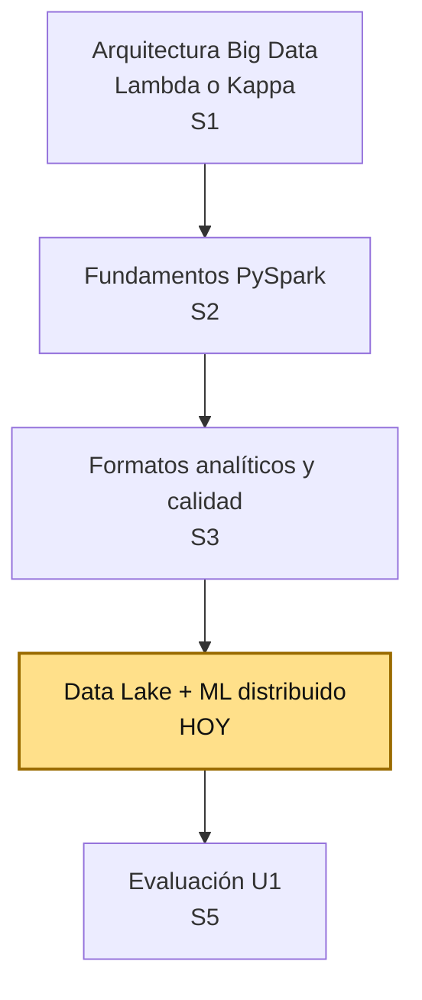
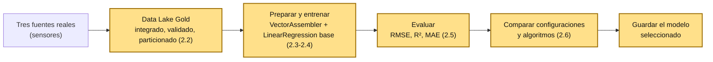
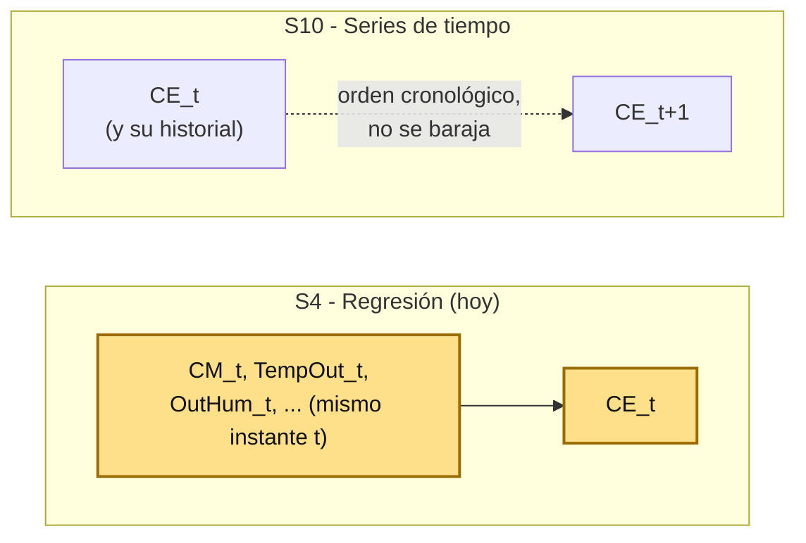

# S4 - ML Distribuido con Spark MLlib (Regresión)

## 1. Introducción

### 1.1 Presentación de la sesión

S3 cerró la base técnica del pipeline batch: una salida analítica particionada, con esquema validado, nulos tratados y duplicados resueltos. Hasta ahí, todo el trabajo transformaba y verificaba datos — ninguna sesión generaba todavía una predicción a partir de ellos. Esta sesión construye ese Data Lake sobre un segundo caso real (tres fuentes de sensores que hay que integrar antes de tratarlas) y entrena el primer modelo de regresión distribuida con Spark sobre esa salida, comparando configuraciones básicas antes de reportar métricas.

El porqué de comparar configuraciones en vez de conformarse con entrenar un único modelo se desarrolla en 1.6, a partir de un caso real. Esta sesión no busca el mejor modelo posible — ajustar hiperparámetros a fondo excede el alcance de un primer contacto — ni construye pronósticos con historial temporal: eso es contenido de S10.

### 1.2 Índice

1. Preparación de datos: integración y calidad (Bronze, Silver, Gold).
2. Preparación de datos para modelado distribuido.
3. Entrenamiento de un modelo de regresión distribuida.
4. Evaluación con métricas de regresión.
5. Comparación de configuraciones y algoritmos.

### 1.3 Propósito de aprendizaje

Al concluir la clase, estarás en condiciones de:

- **Integrar, validar y particionar** datos provenientes de múltiples fuentes en un Data Lake analítico, y **entrenar y comparar** modelos de regresión distribuida sobre esa salida, reportando métricas iniciales que permitan decidir si un modelo mejora sobre otro, sin necesidad de ajustar hiperparámetros de forma exhaustiva.

### 1.4 Producto de sesión

Notebook de Jupyter con: tres fuentes reales integradas por una clave común, con esquema explícito, duplicados resueltos (`Window`+`row_number()`), un código de error distinguido de un nulo, y una salida particionada en Parquet (Bronze → Silver → Gold); vector de predictores ensamblado (`VectorAssembler`) sobre esa salida; modelo base de regresión lineal entrenado (`LinearRegression`) y evaluado (`RegressionEvaluator`: RMSE, R², MAE); comparación de al menos tres configuraciones de regularización (`regParam`, `elasticNetParam`); comparación con un segundo algoritmo (`RandomForestRegressor`), incluida la importancia de cada variable; modelo seleccionado guardado (`model.write().overwrite().save(...)`).

### 1.5 Metodología

**Tabla 1. Metodología de la sesión**

| Actividades a Realizar en el Periodo | Orientaciones generales (Orientaciones Metodológicas) | Material de estudio recomendado |
|---|---|---|
| Revisión previa individual | Repasar las técnicas de calidad de datos de S3 (esquema, nulos, duplicados, particionado) — confirmar que el entorno `lambda26` sigue funcionando. | Guía S3. |
| Clase presencial | Construcción guiada del notebook `04_ml_distribuido_regresion_practica.ipynb`: integración de tres fuentes en un Data Lake analítico, entrenamiento de un modelo base, evaluación con métricas de regresión, comparación de configuraciones y de un segundo algoritmo. Trabajo individual, siguiendo al docente paso a paso; consulta inmediata ante dudas. | Fases 3.1 a 3.7 de esta guía (24 actividades en total). |
| Evaluación formativa | Revisión en clase de la salida particionada, del modelo entrenado y de la tabla comparativa de configuraciones. La evidencia se completa y sustenta de forma individual, fuera del aula, según los criterios mínimos de la sección 4.4. | Indicaciones de entrega (4.3), rúbrica de evaluación (4.6). |

### 1.6 Motivación de la sesión

#### 1.6.1 Caso: el algoritmo que le costó a Zillow 2000 empleos

El 2 de noviembre de 2021, Zillow —la plataforma inmobiliaria más grande de Estados Unidos— anunció el cierre total de Zillow Offers, su negocio de compra automatizada de casas (*iBuying*). El modelo de negocio dependía de una sola variable crítica: la capacidad de su algoritmo de precios (basado en el *Zestimate*) para predecir, con precisión de pocos puntos porcentuales, el valor de una casa entre 3 y 6 meses hacia adelante — el tiempo que Zillow tardaba en comprar, remodelar y revender cada propiedad.

El algoritmo sobreestimó sistemáticamente el valor de miles de casas. Zillow pagó por ellas más de lo que el mercado, ya desacelerándose, estaba dispuesto a pagar de vuelta. El resultado: un castigo contable de **304 millones de dólares** en inventario ese mismo trimestre, y el despido de aproximadamente el **25% de la plantilla de la empresa** (más de 2000 personas). Un modelo de regresión entrenado y desplegado a escala, sin margen para volatilidad de mercado ni un proceso que comparara su desempeño contra alternativas antes de comprometer capital real.

Fuente: incidentdatabase.ai. (2021). *Incident 149: Zillow Shut Down Zillow Offers Division Allegedly Due to Predictive Pricing Tool's Insufficient Accuracy*. https://incidentdatabase.ai/cite/149/

No fue que Zillow usara un modelo "malo" en un sentido técnico simple — fue que confió en un único modelo, entrenado sobre condiciones de mercado que ya habían cambiado, sin un proceso que lo comparara sistemáticamente contra configuraciones alternativas ni midiera qué tan lejos podía estar su error antes de arriesgar dinero real en cada predicción. Esta sesión formaliza justamente ese hábito: ningún modelo se reporta ni se guarda sin antes compararlo, con métricas explícitas, contra al menos otra configuración y otro algoritmo.

**Preguntas de análisis**

**Activación de conocimientos previos**

1. Antes de leer la causa, ¿qué riesgo ves en construir un negocio completo sobre una única predicción numérica, sin ningún mecanismo de comparación o corrección?

**Comprensión de la comparación de modelos**

1. Según el caso, ¿qué hubiera cambiado si Zillow hubiera comparado su modelo de precios contra configuraciones alternativas, y hubiera medido explícitamente su margen de error antes de comprar cada casa?
2. ¿Por qué reportar una sola métrica (por ejemplo, solo R²) puede ocultar un problema que sí aparece en otra métrica (por ejemplo, RMSE)? Relaciónalo con lo que vas a comparar en 3.4.4-3.4.5.

### 1.7 Ubicación en el curso

- Unidad: U1 - Arquitecturas Big Data y ETL batch distribuido.
- Producto del curso: Proyecto Sello: sistema Big Data distribuido end-to-end para procesamiento batch y streaming, analítica/ML, observabilidad y visualización BI para la toma de decisiones.
- Producto de unidad: pipeline batch de ETL distribuido con salidas analíticas en Parquet listas para BI/ML.
- Avance del producto en esta sesión: Data Lake analítico construido desde tres fuentes reales, con un modelo de regresión distribuida entrenado y comparado sobre esa salida, con métricas iniciales reportadas.

**Figura 1. Roadmap del producto de la unidad U1**



Hoy se cierra el último eslabón que la evaluación de unidad (S5) necesita: sin un Data Lake propio, construido y validado, y sin un modelo entrenado y comparado sobre él, S5 no tendría nada de "ML distribuido" que sustentar como parte del pipeline batch completo.

## 2. Explica

Tiempo: 35 min.

### 2.1 Arquitectura de la sesión

**Figura 2. De tres fuentes crudas al modelo comparado**



Cada bloque de esta cadena es un paso necesario, no opcional: sin datos íntegros y de calidad no hay Data Lake confiable; sin `VectorAssembler` no hay entrada válida para MLlib; sin evaluación explícita no hay forma de saber si el modelo sirve; sin comparación no hay manera de distinguir un modelo confiable de uno que solo parece funcionar (el caso de 1.6).

**CRISP-DM** (*Cross-Industry Standard Process for Data Mining*) es el proceso estándar, independiente de cualquier proyecto o herramienta, para organizar un trabajo de minería de datos o aprendizaje automático en seis fases: Business Understanding, Data Understanding, Data Preparation, Modeling, Evaluation y Deployment. No es exclusivo de Spark ni de esta sesión — es el mismo marco que ordenaría un proyecto de ML hecho enteramente en pandas y scikit-learn.

Esta sesión sigue ese mismo orden, con las seis fases marcadas de forma explícita en la sección 3, sobre las fases 3.1 a 3.7 (24 actividades en total): Business Understanding se documenta directamente en el propio notebook (3.1.2-3.1.3), retomando el objetivo y alcance ya presentados en 1.1 y 1.7. Modeling y Evaluation quedan separadas: Fase 4 es técnica — entrenar y medir cada candidato por separado (3.4) —, Fase 5 es estratégica — comparar todos los candidatos entre sí y validar el resultado contra el objetivo de negocio de 3.1.3 (3.5).

El contenido concreto de cada fase cambia según el tipo de problema que se resuelve — la tabla siguiente compara los tres tipos más comunes de problema supervisado, no solo el que trabaja esta sesión.

**Tabla 2. Los mismos seis pasos, tres tipos de problema**

| Fase CRISP-DM | Clasificación | Regresión | Series de tiempo |
|---|---|---|---|
| 1. Business Understanding | Definir la clase a predecir y el costo de cada tipo de error (falso positivo vs. falso negativo) | Definir la variable numérica a predecir y qué decisión de negocio depende de ella | Definir qué se pronostica, con qué horizonte (cuántos pasos adelante) y con qué frecuencia se necesita el pronóstico |
| 2. Data Understanding | Cargar datos, describir clases, revisar **balance de clases** | Cargar datos, describir variables, correlación con el objetivo | Cargar la serie, **graficarla**, revisar frecuencia/huecos temporales, estacionalidad visible |
| 3. Data Preparation | Limpieza, codificar categóricas, **balanceo** (SMOTE/undersampling) si aplica, **split aleatorio** train/test | Limpieza, ensamblar vector de predictores, escalado si aplica, **split aleatorio** train/test | Limpieza, crear **features de rezago (lag)** y ventana móvil, verificar estacionariedad (ADF), **split cronológico** — nunca aleatorio |
| 4. Modeling (técnica) | Candidatos: logística, árboles, SVM…; entrenar y medir cada uno (accuracy, F1, AUC); ajustar hiperparámetros básicos; importancia de variables | Candidatos: lineal, con regularización, basado en árboles…; entrenar y medir cada uno (RMSE, R², MAE); ajustar hiperparámetros básicos; importancia de variables | Candidatos: **baseline de persistencia/naive estacional** + modelo con features de rezago (o clásico tipo ARIMA); entrenar y medir con **validación temporal** (`TimeSeriesSplit`, nunca k-fold aleatorio) |
| 5. Evaluation (estratégica) | Comparar candidatos, elegir el más adecuado según el costo de error definido en Fase 1; validar contra el objetivo de negocio | Comparar candidatos, elegir el más adecuado; validar si el error es aceptable para la decisión de negocio de Fase 1 | Comparar candidatos **contra el baseline de persistencia** (si no le gana, el modelo no se justifica); validar si el error es aceptable para el horizonte de negocio de Fase 1 |
| 6. Deployment | Guardar el modelo seleccionado | Guardar el modelo seleccionado | Guardar el modelo + definir la **cadencia de reentrenamiento** (una serie temporal cambia de régimen con el tiempo, un modelo de clasificación/regresión estático no) |

Clasificación y regresión comparten casi toda la estructura (split aleatorio, comparar candidatos por métrica). Series de tiempo rompe dos supuestos, en Fase 3 y Fase 4: el split no puede ser aleatorio (fuga de futuro hacia el pasado, 2.3) y el modelo tiene que vencer a un baseline ingenuo para justificar su complejidad — no es solo "agregar variables de rezago", es una validación distinta de principio a fin.

En este curso: la columna Regresión es esta sesión (S4); Series de tiempo es S10; Clasificación se trabaja con la plantilla de referencia del curso.

### 2.2 Preparación de datos: integración y calidad (Bronze, Silver, Gold)

La **integración de datos** es el proceso de combinar información proveniente de distintos sistemas de origen —cada uno con su propia estructura, calidad y ritmo de actualización— en una sola fuente confiable para análisis. Es distinta de simplemente "cargar un dataset": antes de combinar dos o más fuentes hay que resolver los problemas de cada una por separado (esquema, duplicados, valores fuera de dominio), porque un problema sin resolver en una fuente no desaparece al integrarla — se propaga, y a veces se multiplica, al resto del resultado. Un caso típico, fuera de este curso: un sistema que junta ventas de un CRM y pedidos de un ERP, cada uno con su propio formato de fecha y sus propios duplicados — si el duplicado del CRM no se resuelve antes de unirlo con el ERP, el resultado final duplica pedidos que nunca estuvieron duplicados en ninguna de las dos fuentes por separado.

S3 (H&M) parte de una sola fuente ya lista, así que ese problema no aparecía todavía. El dataset de hoy sí lo tiene, desde el principio: varias fuentes reales que hay que integrar antes de aplicar esquema, nulos y duplicados — la mecánica de cada control de calidad ya la viste en S3 (esquema explícito, `Window`+`row_number()`, particionado, 2.2-2.4 de esa sesión); lo nuevo hoy es aplicarla sobre más de una fuente a la vez, y distinguir un nulo de un código de error de sensor, que no es lo mismo (3.3.1).

Esta sesión organiza su salida en las mismas capas que ya viste en S3 (2.6): Bronze (crudo), Silver (integrado y validado), Gold (particionado, listo para consumo) — con una diferencia real frente a H&M: hoy no hay una columna categórica ya presente en los datos para particionar, así que se **deriva** una a partir de una fecha (3.3.4) — patrón igual de común en almacenamiento analítico real, basado en el mismo criterio de siempre (pocos valores distintos, usados seguido en filtros).

### 2.3 Preparación de datos para modelado distribuido

A diferencia de librerías como scikit-learn, donde un modelo acepta directamente una matriz de columnas (`X`), Spark MLlib exige que todos los predictores estén combinados en una **sola columna vectorial**. `VectorAssembler` hace esa combinación:

```python
from pyspark.ml.feature import VectorAssembler

ensamblador = VectorAssembler(inputCols=PREDICTORES, outputCol="features")
df_ml = ensamblador.transform(df).select("features", "Valor_Objetivo")
```

Esta diferencia no es una peculiaridad arbitraria de Spark: en un motor distribuido, cada fila se procesa de forma independiente en un nodo distinto — tener un único objeto `Vector` por fila simplifica cómo Spark distribuye y serializa esa fila entre nodos, en vez de coordinar N columnas sueltas por separado.

La columna objetivo (`label`, la variable que el modelo debe predecir) **no** entra al ensamblador — es un dato de salida, no de entrada. Hoy esa columna es `CE` (3.3.7).

**Tabla 3. Misma tabla, dos preguntas distintas: regresión (hoy) y series de tiempo (S10)**

| | Esta sesión (S4) — Regresión | S10 — Series de tiempo |
|---|---|---|
| Pregunta de fondo | ¿Qué otras variables explican `Valor_Objetivo`? | ¿El pasado de `Valor_Objetivo` predice su futuro? |
| Predictores | Las otras variables, en el mismo instante `t` | `Valor_Objetivo` en instantes anteriores (`t`, `t-1`, ...) |
| Objetivo | `Valor_Objetivo` en ese mismo instante `t` | `Valor_Objetivo` en un instante futuro (`t+1`) |
| Orden de las filas | Irrelevante — cada fila es independiente | Crítico — el orden cronológico es el dato |
| División entrenamiento/prueba | Aleatoria (`randomSplit`) | Cronológica (equivalente a `TimeSeriesSplit`) |
| Riesgo si se usa la división del otro caso | Ninguno | Fuga de información: el modelo "vería" el futuro al entrenar |

```python
df_train, df_test = df_ml.randomSplit([0.8, 0.2], seed=42)
```

`seed=42` fija la aleatoriedad — sin ella, cada corrida dividiría los datos distinto, y los resultados no serían comparables entre configuraciones (2.6). Ninguna de las dos preguntas de la Tabla 3 es más difícil de construir en Spark que la otra — la diferencia está en qué significa una fila y qué se le puede hacer a su orden, no en la complejidad del código.

### 2.4 Entrenamiento de un modelo de regresión distribuida

Todo estimador de Spark MLlib sigue el mismo patrón de dos pasos: `fit()` entrena sobre los datos de entrenamiento y devuelve un **modelo** (un `Transformer`); `transform()` aplica ese modelo entrenado sobre datos nuevos para producir predicciones. Es el mismo patrón que reaparecerá en cualquier otro algoritmo de MLlib, no solo en regresión.

Estimar una variable numérica continua a partir de otras variables medidas en el mismo instante es uno de los tipos de problema más comunes en aprendizaje automático, con o sin Spark de por medio. El ejemplo más conocido, fuera de este curso, es la competencia *House Prices* de Kaggle: predecir el precio de venta de una casa a partir de sus características (área, año de construcción, barrio, calidad de materiales, entre otras). La estructura es idéntica a la de hoy — varios predictores numéricos y categóricos, un objetivo numérico continuo, sin ningún componente temporal — solo que ahí la variable a explicar es el precio de una casa, y aquí es `CE`.

```python
from pyspark.ml.regression import LinearRegression

lr_base = LinearRegression(featuresCol="features", labelCol="Valor_Objetivo")
modelo_base = lr_base.fit(df_train)

predicciones_base = modelo_base.transform(df_test)
```

`modelo_base.coefficients` y `modelo_base.intercept` exponen la ecuación aprendida — útil para verificar rápido si el signo de cada coeficiente coincide con lo que ya sabes del dominio (por ejemplo, si una variable debería aumentar o disminuir el objetivo, según el conocimiento previo del problema).

### 2.5 Evaluación con métricas de regresión

Ninguna métrica sola cuenta toda la historia — el caso de 1.6 es, en el fondo, un caso de confiar en una sola señal de desempeño:

**Tabla 4. RMSE, R² y MAE**

| Métrica | Qué mide | Sensible a errores grandes | Unidad |
|---|---|---|---|
| RMSE (raíz del error cuadrático medio) | Qué tan lejos, en promedio, cae la predicción del valor real, penalizando fuerte los errores grandes. | Sí — un solo error enorme infla el RMSE mucho más que varios errores moderados. | La misma que la variable objetivo (`Valor_Objetivo`). |
| MAE (error absoluto medio) | Qué tan lejos, en promedio, cae la predicción, sin penalizar extra los errores grandes. | No — cada error pesa lo mismo, grande o chico. | La misma que la variable objetivo. |
| R² (coeficiente de determinación) | Qué proporción de la variabilidad de `Valor_Objetivo` explica el modelo, entre 0 y 1 (puede ser negativo si el modelo es peor que predecir siempre el promedio). | No aplica — es una proporción, no un error. | Sin unidad (proporción). |

```python
from pyspark.ml.evaluation import RegressionEvaluator

evaluador_rmse = RegressionEvaluator(labelCol="Valor_Objetivo", predictionCol="prediction", metricName="rmse")
evaluador_r2 = RegressionEvaluator(labelCol="Valor_Objetivo", predictionCol="prediction", metricName="r2")
evaluador_mae = RegressionEvaluator(labelCol="Valor_Objetivo", predictionCol="prediction", metricName="mae")

print(f"RMSE={evaluador_rmse.evaluate(predicciones_base):.4f}")
print(f"R2={evaluador_r2.evaluate(predicciones_base):.4f}")
print(f"MAE={evaluador_mae.evaluate(predicciones_base):.4f}")
```

Que RMSE y MAE difieran bastante entre sí es, por sí solo, una señal: significa que hay al menos algunos errores grandes que MAE está "escondiendo" en el promedio.

### 2.6 Comparación de configuraciones y algoritmos

`regParam` controla cuánto se penaliza la magnitud de los coeficientes — un valor alto reduce el riesgo de que el modelo memorice ruido específico del conjunto de entrenamiento (*overfitting*), a costa de un ajuste menos preciso. `elasticNetParam` mezcla dos formas de esa penalización: `0.0` es Ridge (penalización L2, reduce coeficientes sin llevarlos nunca a cero), `1.0` es Lasso (penalización L1, puede llevar coeficientes irrelevantes exactamente a cero), y cualquier valor entre ambos es una mezcla (*Elastic Net*).

**Tabla 5. Tres configuraciones básicas, sin búsqueda exhaustiva**

| Configuración | `regParam` | `elasticNetParam` | Qué prueba |
|---|---:|---:|---|
| Sin regularización | 0.0 | 0.0 | La línea base, sin ningún ajuste. |
| Ridge (L2) | 0.1 | 0.0 | Si penalizar coeficientes grandes mejora la generalización. |
| Elastic Net (L1+L2) | 0.1 | 0.5 | Una mezcla de ambas penalizaciones. |

`regParam` penaliza la **magnitud** de cada coeficiente, no su importancia real — así que si los predictores están en escalas muy distintas entre sí, la penalización podría terminar siendo desigual sin ninguna razón estadística. En muchas implementaciones de regresión regularizada esto obliga a escalar los predictores a mano antes de entrenar. `LinearRegression` de Spark MLlib no lo necesita: el parámetro `standardization` (`True` por defecto) ya estandariza las features internamente antes de ajustar el modelo, precisamente para que `regParam` penalice de forma justa entre variables de escalas distintas — y devuelve los coeficientes en la escala original de lo que se le pasó como `features`, no en unidades estandarizadas (documentación oficial de Spark). Escalar a mano (3.3.6) sería redundante. Tampoco aplica a modelos basados en árboles como `RandomForestRegressor`: dividen por umbrales, no por magnitud de coeficientes.

`LinearRegression` asume que la relación entre predictores y objetivo es, de fondo, lineal. `RandomForestRegressor` no necesita ese supuesto — construye muchos árboles de decisión sobre subconjuntos aleatorios de datos y variables, y promedia sus predicciones, capturando relaciones no lineales e interacciones que una ecuación lineal no puede representar:

```python
from pyspark.ml.regression import RandomForestRegressor

rf = RandomForestRegressor(featuresCol="features", labelCol="Valor_Objetivo", numTrees=50, maxDepth=8, seed=42)
modelo_rf = rf.fit(df_train)
```

Comparar ambas familias (lineal vs. árboles) es la forma más básica de saber si, de entrada, la relación real es aproximadamente lineal — si `RandomForestRegressor` mejora mucho a `LinearRegression`, es una señal de que la relación no lo es.

## 3. Aplica: actividad práctica guiada

Tiempo: 2h.

**Actividad:** construir el notebook `04_ml_distribuido_regresion_practica.ipynb` sobre el entorno `lambda26` (`uso-pyspark`), integrando tres fuentes reales de sensores en un Data Lake analítico particionado, y entrenando y comparando modelos de regresión distribuida con Spark MLlib sobre esa salida, reportando métricas iniciales (RMSE, R², MAE).

**Propósito de la actividad:** dejar evidencia ejecutable de que dominas la integración y calidad de datos multi-fuente, la preparación de datos para MLlib, el entrenamiento y evaluación de un modelo de regresión, y la comparación sistemática de configuraciones — antes de confiar en un único modelo, como en el caso de 1.6.

**Orientaciones metodológicas:** en clase, el docente guía la construcción del notebook paso a paso, alternando explicación breve y ejecución; los estudiantes replican cada celda en su propio entorno, verificando cada resultado antes de avanzar al siguiente paso.

**Actividades para realizar** (estructura genérica CRISP-DM: cada fase es un paso `3.N`, sus actividades son `3.N.M` — reutilizable como plantilla para cualquier sesión de este tipo):

**3.1 Fase 1 — Business Understanding**

- **3.1.1** Crear el notebook y la `SparkSession`.
- **3.1.2** Definir la variable numérica a predecir.
- **3.1.3** Definir la decisión de negocio asociada.

**3.2 Fase 2 — Data Understanding**

- **3.2.1** Cargar los datos.
- **3.2.2** Describir las variables.
- **3.2.3** Analizar estadísticas descriptivas.
- **3.2.4** Analizar correlación con el objetivo.

**3.3 Fase 3 — Data Preparation**

- **3.3.1** Limpiar los datos.
- **3.3.2** Tratar nulos, errores y duplicados.
- **3.3.3** Seleccionar predictores.
- **3.3.4** Ensamblar el vector de predictores (`VectorAssembler`).
- **3.3.5** Dividir aleatoriamente en entrenamiento y prueba.
- **3.3.6** Escalar si aplica.

**3.4 Fase 4 — Modeling**

- **3.4.1** Entrenar regresión lineal.
- **3.4.2** Evaluar con RMSE, R² y MAE.
- **3.4.3** Probar regularización e hiperparámetros básicos.
- **3.4.4** Entrenar un modelo basado en árboles.
- **3.4.5** Evaluar con RMSE, R² y MAE.
- **3.4.6** Analizar importancia de variables.

**3.5 Fase 5 — Evaluation**

- **3.5.1** Comparar los modelos candidatos.
- **3.5.2** Seleccionar el mejor modelo.
- **3.5.3** Validar si el error es aceptable para el negocio.

**3.6 Fase 6 — Deployment**

- **3.6.1** Guardar el modelo seleccionado.

**3.7 Cierre**

- **3.7.1** Documentar hallazgos y responder preguntas de reflexión.

### 3.1 Fase 1 — Business Understanding

#### 3.1.1 Crear el notebook y la `SparkSession`

**Producto del paso:** notebook `04_ml_distribuido_regresion_practica.ipynb` con una `SparkSession` activa.

```python
from pyspark.sql import SparkSession

spark = (
    SparkSession.builder
    .appName("sesion4-ml-distribuido-regresion")
    .master("local[*]")
    .config("spark.ui.port", "4040")
    .config("spark.sql.shuffle.partitions", "8")
    .config("spark.driver.memory", "4g")
    .getOrCreate()
)

spark
```

```python
ORIGEN_DATOS = "/opt/s04-ml-distribuido-regresion/data"
```

Nota metodológica: `ARTIFACTS` (la ruta de salida) todavía no se declara acá — recién hace falta cuando empieza a escribirse la primera salida (3.3.2). Cada configuración se declara en el paso donde se usa por primera vez, no de forma anticipada en un bloque global (más sobre esto en 2.1).

#### 3.1.2 Definir la variable numérica a predecir

**Producto del paso:** una celda markdown que documenta, dentro del propio notebook, qué variable se predice y bajo qué condición — sin depender de esta guía para explicarlo.

```markdown
## Fase 1 — Business Understanding

**Objetivo:** estimar `Valor_Objetivo` (hoy, `CE`) a partir de otras variables medidas
en el mismo instante — no un pronóstico con historial temporal (eso es contenido de S10, 2.3).
```

#### 3.1.3 Definir la decisión de negocio asociada

**Producto del paso:** el alcance de la comparación documentado — qué se va a entrenar y comparar antes de confiar en un único modelo, como en el caso de 1.6.

```markdown
**Alcance:** comparar un modelo base de regresión lineal, tres configuraciones de
regularización y un segundo algoritmo (Random Forest), reportando RMSE, R² y MAE — sin
búsqueda exhaustiva de hiperparámetros. El modelo ganador es el que decide si vale la pena
sostener un pipeline de regresión distribuida sobre esta fuente, en vez de no predecir nada.
```

### 3.2 Fase 2 — Data Understanding

Cargar cada fuente con su esquema, resolver el problema técnico que bloquearía la integración, integrar, y explorar la tabla resultante para conocerla — todavía sin decidir ninguna regla de limpieza.

#### 3.2.1 Cargar los datos

**Producto del paso:** `df_integrado`, las tres fuentes cargadas con esquema explícito, deduplicadas donde hacía falta, e integradas por `DateTime`.

```python
from pyspark.sql.types import StructType, StructField, TimestampType, DoubleType

schema_ce = StructType([
    StructField("DateTime", TimestampType(), nullable=False),
    StructField("CE", DoubleType(), nullable=True),
])
df_ce = spark.read.csv(f"{ORIGEN_DATOS}/campo_electrico.csv", header=True, schema=schema_ce)

schema_cm = StructType([
    StructField("DateTime", TimestampType(), nullable=False),
    StructField("CM", DoubleType(), nullable=True),
])
df_cm = spark.read.csv(f"{ORIGEN_DATOS}/campo_magnetico.csv", header=True, schema=schema_cm)

schema_va = StructType([
    StructField("TempOut", DoubleType(), nullable=True),
    StructField("OutHum", DoubleType(), nullable=True),
    StructField("WindSpeed", DoubleType(), nullable=True),
    StructField("Bar", DoubleType(), nullable=True),
    StructField("SolarRad", DoubleType(), nullable=True),
    StructField("UVIndex", DoubleType(), nullable=True),
    StructField("DateTime", TimestampType(), nullable=False),
])
df_va = spark.read.csv(f"{ORIGEN_DATOS}/variables_ambientales.csv", header=True, schema=schema_va)
```

En una corrida real: `campo_electrico.csv` trajo `93 027` filas, `campo_magnetico.csv` `355 021`, y `variables_ambientales.csv` `359 573` — esta última con `DateTime` duplicada en varias filas, la única de las tres con ese problema. Un `join` contra una clave duplicada multiplica filas del lado que no lo está, sin ningún error visible, así que hay que resolverlo **antes** de integrar:

```python
from pyspark.sql.functions import col, count as spark_count, when, lit
from pyspark.sql.window import Window
from pyspark.sql.functions import row_number

columnas_conteo_nulos = [c for c in df_va.columns if c != "DateTime"]

df_va_con_conteo = df_va.withColumn(
    "CantidadNulos",
    sum(when(col(c).isNull(), 1).otherwise(0) for c in columnas_conteo_nulos),
)

ventana_va = Window.partitionBy("DateTime").orderBy(col("CantidadNulos").asc())

df_va_unico = (
    df_va_con_conteo
    .withColumn("row_num", row_number().over(ventana_va))
    .filter(col("row_num") == 1)
    .drop("row_num", "CantidadNulos")
)
```

Mismo patrón de deduplicación determinista de S3 (`Window`+`row_number()`), con un criterio de orden distinto: en vez de "la fila con mayor `age`", acá se conserva **la fila con menos nulos** — el mismo minuto medido dos veces, con la versión más completa ganando. Completa aquí cuántas filas quedaron después de esta deduplicación.

`DateTime` es la clave común para integrar; el campo eléctrico queda como tabla principal (`left join`), porque interesa el periodo que ese sensor cubre, no el de los otros dos:

```python
df_integrado = (
    df_ce
    .join(df_cm, on="DateTime", how="left")
    .join(df_va_unico, on="DateTime", how="left")
)

print(f"Integrado: {df_integrado.count():,} registros x {len(df_integrado.columns)} columnas")
```

En una corrida real, el resultado fue `93 027` filas × `9` columnas (`DateTime`, `CE`, `CM`, `TempOut`, `OutHum`, `WindSpeed`, `Bar`, `SolarRad`, `UVIndex`) — el mismo conteo que `campo_electrico.csv` por sí solo, sin duplicar ninguna fila: la deduplicación de arriba hizo su trabajo antes de llegar acá.

**Error frecuente**: la fuente original trae la columna de radiación solar como `SolarRad.` (con un punto al final, tal como la exporta el equipo de medición). Referenciarla luego con `col("SolarRad.")` falla con `AnalysisException` — Spark interpreta el punto como acceso a un campo anidado, no como parte literal del nombre. No hace falta escapar el nombre en cada uso: como `header=True` junto con un `schema` explícito hace que Spark ignore el texto del header para nombrar columnas, basta con declarar el nombre ya limpio (`SolarRad`, sin punto) en el `StructField` de arriba.

#### 3.2.2 Describir las variables

**Producto del paso:** el esquema de `df_integrado` y el conteo de nulos por columna — un `left join` puede introducir nulos nuevos si algún `DateTime` del campo eléctrico no tiene contraparte en las otras dos fuentes.

```python
df_integrado.printSchema()

df_integrado.select([
    spark_count(when(col(c).isNull(), c)).alias(c) for c in df_integrado.columns
]).show(vertical=True, truncate=False)
```

#### 3.2.3 Analizar estadísticas descriptivas

**Producto del paso:** media, desviación estándar, mínimo y máximo de cada variable numérica, todavía sobre datos sin limpiar — antes de decidir ninguna regla de calidad.

```python
df_integrado.describe(["CE", "CM", "TempOut", "OutHum", "WindSpeed", "Bar", "SolarRad", "UVIndex"]).show()
```

#### 3.2.4 Analizar correlación con el objetivo

**Producto del paso:** una primera lectura de qué variables podrían explicar `CE`.

```python
predictores_candidatos = [
    c for c in df_integrado.columns
    if c not in ("DateTime", "CE")
]

for columna in predictores_candidatos:
    correlacion = df_integrado.stat.corr(columna, "CE")
    print(f"{columna:12s} correlacion con CE: {correlacion:.4f}")
```

En una corrida real: `CM` `0.0115`, `TempOut` `0.1170`, `OutHum` `-0.0597`, `WindSpeed` `-0.1675`, `Bar` `0.0132`, `SolarRad` `-0.0244`, `UVIndex` `-0.0092`. Todas las correlaciones lineales simples son débiles (la más fuerte, `WindSpeed`, no llega a `-0.17`) — dos advertencias antes de sacar conclusiones: todavía no se filtró `CM = 99999` (3.3.1) — ese código de error puede distorsionar su correlación real con `CE` — y `df_integrado` todavía puede tener nulos sueltos (3.2.2) que Spark ignora en el cálculo, no reemplaza. Esta es una lectura preliminar; la relación real entre cada variable y `CE` se confirma recién con `df_valido` (3.3.2) y, sobre todo, con los coeficientes o la `featureImportances` del modelo entrenado (3.4) — que sí capturan relaciones no lineales, a diferencia de una correlación de Pearson simple.

### 3.3 Fase 3 — Data Preparation

Con los datos ya conocidos (Fase 2), acá se aplican las reglas de limpieza, se escribe la salida Gold y se deja lista la tabla para modelar: nada de esto se decide sin la exploración previa.

#### 3.3.1 Limpiar los datos

**Producto del paso:** `df_limpio`, sin el código de error de `CM` (2.2).

`CM = 99999` es un código de error de sensor, no un nulo: Spark lo ve como un `Double` válido, no como `NULL` — por eso `isNull()` no lo detecta, hace falta filtrarlo por el valor de dominio conocido.

```python
errores_cm = df_integrado.filter(col("CM") == 99999).count()
print(f"Filas con codigo de error CM=99999: {errores_cm:,}")

df_limpio = df_integrado.filter(col("CM") != 99999)
print(f"Filas despues de eliminar el codigo de error: {df_limpio.count():,}")
```

En una corrida real, `180` filas tenían ese código — se descartan, no se tratan como si `99999` microteslas fuera un dato real. `df_limpio` quedó con `92 847` filas (`93 027 - 180`).

#### 3.3.2 Tratar nulos, errores y duplicados

**Producto del paso:** `df_valido`, con las ocho variables físicas completas y sin `DateTime` repetida, persistido como capa Gold particionada y reutilizado para el modelado.

Primero, confirmar que ni la deduplicación (3.2.1) ni el `join` (3.2.1) dejaron `DateTime` repetida:

```python
total_final = df_limpio.count()
sin_duplicar = df_limpio.dropDuplicates(["DateTime"]).count()

print(f"Total: {total_final:,}, sin duplicar por DateTime: {sin_duplicar:,}")
assert total_final == sin_duplicar, "Hay DateTime duplicada en la tabla integrada final"
```

En una corrida real, `92 847` filas en ambos casos — sin duplicados en la tabla final, gracias a que `CE` (tabla principal del `join`) ya no los tiene desde el origen.

Con eso confirmado, quedan los nulos finales sobre las variables físicas:

```python
VARIABLES_MODELO = [
    "CE", "CM", "TempOut", "OutHum",
    "WindSpeed", "Bar", "SolarRad", "UVIndex",
]

antes = df_limpio.count()
df_valido = df_limpio.na.drop(subset=VARIABLES_MODELO)
despues = df_valido.count()

print(f"Filas antes: {antes:,}, despues de na.drop(subset=VARIABLES_MODELO): {despues:,}")
print(f"Filas eliminadas por nulos en variables criticas: {antes - despues:,}")

df_valido = df_valido.cache()
```

En una corrida real, `92 847` filas antes y después — `0` filas eliminadas por nulos: para este recorte de fechas (2026-03-01 a 2026-09-04), ninguna de las ocho variables físicas tenía nulos sueltos sobre el periodo que cubre `CE`.

Con la tabla ya limpia, se persiste como capa Gold particionada por mes (2.2), en vez de dejarla solo en memoria:

```python
from pyspark.sql.functions import date_format

ARTIFACTS = "/opt/s04-ml-distribuido-regresion/artifacts"

df_particionable = df_valido.withColumn("AnioMes", date_format(col("DateTime"), "yyyy-MM"))

(
    df_particionable
    .repartition(4)
    .write.format("parquet")
    .mode("overwrite")
    .partitionBy("AnioMes")
    .save(f"{ARTIFACTS}/campo_electrico_particionado")
)

import os
for carpeta in sorted(os.listdir(f"{ARTIFACTS}/campo_electrico_particionado")):
    print(carpeta)
```

**Tabla 6. Filas reales por `AnioMes`**

| AnioMes | Filas |
|---|---:|
| 2026-05 | 28 107 |
| 2026-06 | 41 502 |
| 2026-07 | 1 409 |
| 2026-08 | 20 582 |
| 2026-09 | 1 247 |

El rango real de `campo_electrico.csv` (mayo-septiembre 2026, con un hueco real de casi 7 días a inicios de septiembre) define cuántas particiones aparecen: solo 5, no 7 (marzo-abril de `variables_ambientales` se descartaron en el `join`, y septiembre queda muy chico porque `CE` se corta el 1 de septiembre a las 20:46, justo antes del hueco).

Se lee de vuelta para confirmar que no hubo pérdida de filas, y que Spark usa `PartitionFilters` en el plan de ejecución al filtrar por `AnioMes` (S3, 2.5):

```python
df_verificacion = spark.read.parquet(f"{ARTIFACTS}/campo_electrico_particionado")
df_verificacion.printSchema()

assert df_verificacion.count() == df_particionable.count()
print(f"Verificado: {df_verificacion.count():,} filas, ida y vuelta sin perdida.")

df_verificacion.filter(col("AnioMes") == "2026-09").explain(True)
```

Para ver cuántas filas quedaron guardadas en cada partición, sin salir de Spark ni contar archivos a mano:

```python
df_verificacion.groupBy("AnioMes").count().orderBy("AnioMes").show(truncate=False)
```

En una corrida real, coincide exactamente con la Tabla 6.

```python
df_valido.unpersist()
```

`df_verificacion` ya es la salida Gold, leída y verificada — no hace falta volver a leer el Parquet desde disco para empezar la parte de modelado:

```python
df = df_verificacion

df.printSchema()
print(f"Filas: {df.count():,}")
df.describe(VARIABLES_MODELO).show()
```

En una corrida real, este conteo dio **92 847** filas.

`campo_electrico_particionado/` no tiene un solo destino. La misma tabla —8 variables, sin nulos, particionada por mes— alimenta dos sesiones que le hacen a los datos preguntas de naturaleza distinta, no solo un modelo "más simple" y otro "más avanzado" (2.3).

**S4 (hoy) pregunta:** dado un instante, ¿qué otras variables explican `CE` en ese mismo instante? Cada fila es una foto independiente — el orden en que aparecen no importa, se podrían barajar sin cambiar nada del resultado.

**S10 pregunta:** dado el historial de `CE`, ¿su propio pasado predice su futuro? Ahí el orden de las filas *es* el dato — no se pueden barajar, porque "usar el futuro para predecir el pasado" no es un error de estilo, es una fuga de información que invalida el resultado.

**Figura 3. La misma salida Gold, dos preguntas distintas**



**Tabla 7. Misma salida Gold, dos preguntas**

| | S4 — Regresión (hoy) | S10 — Series de tiempo |
|---|---|---|
| Pregunta de fondo | ¿Qué otras variables explican `CE`? | ¿El pasado de `CE` predice su futuro? |
| Predictores | Las otras 7 variables, en el mismo instante `t` | `CE` en instantes anteriores (`t`, `t-1`, ...) |
| Objetivo | `CE` en ese mismo instante `t` | `CE` en un instante futuro (`t+1`) |
| Orden de las filas | Irrelevante — cada fila es independiente | Crítico — el orden cronológico es el dato |
| División entrenamiento/prueba | Aleatoria (`randomSplit`, 2.3, Tabla 3) | Cronológica (equivalente a `TimeSeriesSplit`) |
| Riesgo si se usa la división del otro caso | Ninguno | Fuga de información: el modelo "vería" el futuro al entrenar |

Ninguna de las dos preguntas es más difícil de construir en Spark que la otra — la diferencia está en qué significa una fila y qué se le puede hacer a su orden, no en la complejidad del código.

#### 3.3.3 Seleccionar predictores

**Producto del paso:** `PREDICTORES`, las 7 variables físicas que entran al modelo — todo `VARIABLES_MODELO` menos la columna objetivo.

```python
PREDICTORES = [v for v in VARIABLES_MODELO if v != "CE"]
print(f"Predictores ({len(PREDICTORES)}): {PREDICTORES}")
```

#### 3.3.4 Ensamblar el vector de predictores (`VectorAssembler`)

**Producto del paso:** `df_ml`, con una sola columna `features` (vector de 7 predictores) y la columna objetivo `CE` (2.3).

```python
from pyspark.ml.feature import VectorAssembler

ensamblador = VectorAssembler(inputCols=PREDICTORES, outputCol="features")
df_ml = ensamblador.transform(df).select("features", "CE")

df_ml.show(5, truncate=False)
```

#### 3.3.5 Dividir aleatoriamente en entrenamiento y prueba

**Producto del paso:** `df_train`/`df_test`, división aleatoria 80/20 (2.3, Tabla 3).

```python
df_train, df_test = df_ml.randomSplit([0.8, 0.2], seed=42)

print(f"Entrenamiento: {df_train.count():,} filas")
print(f"Prueba: {df_test.count():,} filas")
```

En una corrida real, sobre las 92 847 filas: **74 434** para entrenamiento y **18 413** para prueba — el 80/20 esperado, con `seed=42` garantizando que sea la misma división en cada nueva corrida (necesario para que las comparaciones de 3.4 sean justas entre sí).

#### 3.3.6 Escalar si aplica

**Producto del paso:** ninguno — este paso no aplica en esta sesión, y vale la pena documentar por qué en vez de saltarlo en silencio.

"Si aplica" es literal acá, y en Spark MLlib no aplica: `LinearRegression` tiene el parámetro `standardization`, activado (`True`) por defecto — ya estandariza los predictores internamente antes de ajustar el modelo, precisamente para que `regParam` (3.4.3) penalice de forma justa entre variables de escalas muy distintas (`CM` en miles, `TempOut`/`OutHum` en decenas), y devuelve los coeficientes en la escala original de `features`, no en unidades estandarizadas (2.6). Escalar a mano con `StandardScaler` antes de entrenar sería trabajo redundante — Spark ya lo hace, y sin ese paso extra los coeficientes quedan además más interpretables (en unidades reales, no en desviaciones estándar). `RandomForestRegressor` (3.4.4) tampoco lo necesita — sus árboles dividen por umbrales, no por magnitud de coeficientes.

Este paso no siempre "no aplica": en librerías que no estandarizan internamente (por ejemplo, una implementación propia de regresión regularizada, o algunos modelos de otras librerías), escalar a mano sigue siendo necesario. Vale la pena confirmarlo revisando la documentación del modelo concreto, no asumirlo por costumbre.

### 3.4 Fase 4 — Modeling

Fase técnica: entrenar cada candidato, medir su desempeño individual sobre `df_test`, ajustar configuraciones básicas y analizar la relevancia de sus variables — todavía sin comparar entre sí ni decidir un ganador.

#### 3.4.1 Entrenar regresión lineal

**Producto del paso:** `modelo_base` entrenado, con coeficientes e intercepto visibles (2.4).

```python
from pyspark.ml.regression import LinearRegression

lr_base = LinearRegression(featuresCol="features", labelCol="CE")
modelo_base = lr_base.fit(df_train)

print("Coeficientes:", modelo_base.coefficients)
print("Intercepto:", modelo_base.intercept)
```

**Advertencias esperadas, no errores**: al correr esta celda pueden aparecer dos líneas en la consola —

- `regParam is zero, which might cause numerical instability and overfitting`: Spark avisa que este modelo base no tiene regularización (2.6) — es exactamente lo que se está probando a propósito como línea base en 3.4.3, no un problema a corregir.
- `netlib-blas: JNI_OnLoad: dlopen(libblas.so.3) failed...`: el contenedor no tiene una librería de álgebra lineal nativa instalada, así que Spark cae a una implementación en JVM pura — más lenta, pero igual de correcta. No afecta ningún resultado de esta sesión.

En una corrida real, `modelo_base.coefficients` dio `[-0.0027, 0.1241, 0.0104, -0.0740, -0.0104, 0.0000, 0.0194]` (en el orden de `PREDICTORES`: `CM`, `TempOut`, `OutHum`, `WindSpeed`, `Bar`, `SolarRad`, `UVIndex`) y el intercepto `71.5001`. `TempOut` (`0.1241`) es el coeficiente más grande en magnitud, seguido de `WindSpeed` (`-0.0740`) — vale la pena que confirmes si ese signo y esa magnitud tienen sentido físico con lo que ya sabes del dominio, antes de asumir que el modelo "aprendió algo real".

#### 3.4.2 Evaluar con RMSE, R² y MAE

**Producto del paso:** las tres métricas del modelo base, sobre el conjunto de prueba — nunca sobre el de entrenamiento (2.5).

```python
from pyspark.ml.evaluation import RegressionEvaluator

predicciones_base = modelo_base.transform(df_test)
predicciones_base.select("CE", "prediction").show(5)

def evaluar(predicciones, nombre):
    resultados = {}
    for metrica in ["rmse", "r2", "mae"]:
        evaluador = RegressionEvaluator(labelCol="CE", predictionCol="prediction", metricName=metrica)
        resultados[metrica.upper()] = evaluador.evaluate(predicciones)
    print(f"{nombre}: RMSE={resultados['RMSE']:.4f}  R2={resultados['R2']:.4f}  MAE={resultados['MAE']:.4f}")
    return resultados

resultados_base = evaluar(predicciones_base, "LinearRegression base")
```

**Tabla 8. Resultado real del modelo base**

| Métrica | Valor |
|---|---|
| RMSE | 0.9153 |
| R² | 0.1119 |
| MAE | 0.7365 |

Un R² de `0.11` significa que el modelo lineal explica poco más de una décima parte de la variabilidad real de `CE` — bastante menos que el resultado con las 8 variables originales (`Rain`/`WindDir` incluidos), y una señal de que estas 7 variables por sí solas no capturan gran parte de lo que mueve a `CE`. Guarda esa cifra — 3.4.5 compara este mismo resultado contra un algoritmo sin el supuesto de linealidad.

#### 3.4.3 Probar regularización e hiperparámetros básicos

**Producto del paso:** tabla comparativa de las tres configuraciones de la Tabla 5 (2.6).

```python
configuraciones = [
    {"nombre": "Sin regularizacion", "regParam": 0.0, "elasticNetParam": 0.0},
    {"nombre": "Ridge (L2)", "regParam": 0.1, "elasticNetParam": 0.0},
    {"nombre": "Elastic Net (L1+L2)", "regParam": 0.1, "elasticNetParam": 0.5},
]

comparacion_configs = []
for config in configuraciones:
    lr = LinearRegression(
        featuresCol="features", labelCol="CE",
        regParam=config["regParam"], elasticNetParam=config["elasticNetParam"],
    )
    modelo = lr.fit(df_train)
    predicciones = modelo.transform(df_test)
    resultado = evaluar(predicciones, config["nombre"])
    resultado["Configuracion"] = config["nombre"]
    comparacion_configs.append(resultado)

import pandas as pd
pd.DataFrame(comparacion_configs)[["Configuracion", "RMSE", "R2", "MAE"]]
```

La fila "Sin regularización" es una verificación útil: con `regParam=0.0` no hay penalización, así que su RMSE/R²/MAE debería salir igual al modelo base de 3.4.2 — si no coincide, algo cambió entre celdas (por ejemplo, `df_train`/`df_test` fueron reasignados). En una corrida real, coincidió exactamente: `Sin regularización` RMSE=`0.9153`, `Ridge (L2)` RMSE=`0.9175`, `Elastic Net (L1+L2)` RMSE=`0.9260` — agregar regularización empeoró el resultado en las tres configuraciones, no lo mejoró.

#### 3.4.4 Entrenar un modelo basado en árboles

**Producto del paso:** `modelo_rf` entrenado — todavía sin evaluar ni comparar contra los modelos lineales de 3.4.1-3.4.3. Entrena sobre `features` (sin escalar, 3.3.6): los árboles no lo necesitan.

```python
from pyspark.ml.regression import RandomForestRegressor

rf = RandomForestRegressor(featuresCol="features", labelCol="CE", numTrees=50, maxDepth=8, seed=42)
modelo_rf = rf.fit(df_train)
```

#### 3.4.5 Evaluar con RMSE, R² y MAE

**Producto del paso:** métricas de `RandomForestRegressor` sobre `df_test`, con la misma función `evaluar()` de 3.4.2 — comparables directamente con la Tabla 8 y la Tabla 5, porque miden sobre el mismo `df_test`.

```python
predicciones_rf = modelo_rf.transform(df_test)

resultados_rf = evaluar(predicciones_rf, "Random Forest")
```

#### 3.4.6 Analizar importancia de variables

**Producto del paso:** la importancia de cada variable según `modelo_rf`, la primera medida directamente comparable entre las 7 variables sobre un modelo no lineal.

**¿Las 7 variables aportan por igual?** `RandomForestRegressor` calcula, sin costo adicional, `featureImportances`: una proporción de cuánto reduce cada variable el error del modelo en promedio, a lo largo de todos sus árboles — las proporciones de las 7 variables suman `1.0`.

```python
importancias = list(zip(PREDICTORES, modelo_rf.featureImportances.toArray()))
importancias.sort(key=lambda x: x[1], reverse=True)

for variable, importancia in importancias:
    print(f"{variable:12s} {importancia:.4f}")
```

**Tabla 9. Importancia de cada variable**

| Variable | Importancia |
|---|---|
| WindSpeed | 0.2549 |
| TempOut | 0.2426 |
| OutHum | 0.1550 |
| CM | 0.1523 |
| Bar | 0.0998 |
| SolarRad | 0.0528 |
| UVIndex | 0.0426 |

En una corrida real, `WindSpeed` y `TempOut` concentran juntas casi la mitad de la importancia total (`0.2549 + 0.2426 = 0.4975`), seguidas de cerca por `OutHum` y `CM`. Vale la pena notar que `CM` (correlación lineal de apenas `0.0115` en 3.2.4, la más débil de las 7) termina con la cuarta importancia más alta en Random Forest — una discrepancia real entre una medida lineal simple y una medida que sí captura relaciones no lineales e interacciones entre variables. Es el tipo de discrepancia que justifica comparar más de un algoritmo (1.6) en vez de confiar en un único modelo.

Si una o dos variables concentran la mayor parte de la importancia y el resto aporta casi nada, es una señal real para decidir con datos —no por intuición— si conviene simplificar el modelo a menos predictores en una futura iteración (fuera del alcance evaluado de esta sesión).

### 3.5 Fase 5 — Evaluation

Fase estratégica: ya no se entrena nada nuevo — se comparan los candidatos de la Fase 4 entre sí y se valida el resultado contra el objetivo de negocio definido en 3.1.3, antes de seleccionar un ganador.

#### 3.5.1 Comparar los modelos candidatos

**Producto del paso:** tabla comparativa de las cuatro configuraciones entrenadas en 3.4, sobre el mismo `df_test`.

**Tabla 10. Comparación final**

| Configuración | RMSE | R² | MAE |
|---|---|---|---|
| Sin regularización | 0.9153 | 0.1119 | 0.7365 |
| Ridge (L2) | 0.9175 | 0.1075 | 0.7417 |
| Elastic Net (L1+L2) | 0.9260 | 0.0909 | 0.7563 |
| **Random Forest** | **0.7464** | **0.4094** | **0.5747** |

En una corrida real, **Random Forest ganó en las tres métricas a la vez** — RMSE, R² (casi cuatro veces mayor que el mejor modelo lineal: `0.41` contra `0.11`) y MAE. Entre las tres configuraciones lineales, agregar regularización **empeoró** el resultado en vez de mejorarlo — el modelo base no estaba sobreajustando, así que no había ningún problema de *overfitting* que la regularización tuviera que corregir. La ganancia real de Random Forest vino de otro lado: no asume una relación lineal entre las 7 variables y `CE`, y esa relación, en los datos reales, claramente no lo es — un R² de apenas `0.11` en el mejor modelo lineal ya lo anticipaba.

#### 3.5.2 Seleccionar el mejor modelo

**Producto del paso:** el modelo ganador, señalado explícitamente con base en la Tabla 10 — no en cuál se entrenó primero o más rápido.

Con los resultados de la Tabla 10, **Random Forest queda seleccionado** como modelo ganador de esta sesión — 3.6.1 lo persiste.

#### 3.5.3 Validar si el error es aceptable para el negocio

**Producto del paso:** una lectura explícita de si el resultado cumple lo que 3.1.3 se propuso medir — no solo qué modelo ganó, sino si ese resultado sirve para algo.

El alcance declarado en 3.1.3 era comparar cuatro configuraciones y reportar RMSE, R² y MAE — eso ya se cumplió: las cuatro quedaron entrenadas, medidas sobre el mismo `df_test`, y reunidas en la Tabla 10. Sobre el desempeño en sí: un R² de `0.41` es un avance real frente al `0.11` del mejor modelo lineal, pero sigue dejando **casi el 60 % de la variabilidad de `CE` sin explicar** — no alcanzaría el umbral que exigiría un sistema en producción real (donde normalmente se fija un mínimo de negocio *antes* de empezar a modelar). La conclusión honesta: estas 7 variables meteorológicas, sin `Rain` ni `WindDir`, capturan una relación real pero parcial con `CE` — suficiente para decidir con evidencia, no por intuición, cuál modelo se guarda, pero no suficiente para un despliegue real sin seguir iterando (más variables, más historia, u otro enfoque).

### 3.6 Fase 6 — Deployment

Aquí "Deployment" significa exactamente lo que hace este paso — persistir el artefacto ya seleccionado en 3.5.2 para poder reutilizarlo sin reentrenar — y no más que eso: no hay empaquetado productivo, servicio de inferencia ni monitoreo; ese alcance queda fuera de esta sesión.

#### 3.6.1 Guardar el modelo seleccionado

**Producto del paso:** el modelo ganador de la Tabla 10 (3.5.2), guardado como artefacto reutilizable.

```python
modelo_ganador = modelo_rf  # ajusta esta linea segun el ganador real de tu Tabla 10 (3.5.2)

modelo_ganador.write().overwrite().save(f"{ARTIFACTS}/modelo_ce_regresion")
print(f"Modelo guardado en {ARTIFACTS}/modelo_ce_regresion")
```

**Error frecuente**: guardar el primer modelo entrenado (3.4.1) en vez del que realmente ganó la comparación de 3.5.2. La sección 4.6 evalúa explícitamente que el modelo guardado coincida con el mejor resultado reportado — no con el más rápido de entrenar. No des por sentado cuál algoritmo va a ganar solo porque ganó en una corrida anterior con otros datos — vuelve a comparar cada vez que cambien los datos.

### 3.7 Cierre

#### 3.7.1 Documentar hallazgos y responder preguntas de reflexión

**Producto del paso:** notebook documentado con celdas markdown explicando cada resultado.

Agrega celdas markdown breves debajo de cada bloque de código relevante, desde la integración de fuentes (3.2) hasta la comparación de modelos (3.4), explicando qué hiciste y qué observaste — es la base directa de la evidencia técnica que armarás en 4.3.1.

**Reflexión técnica breve** (5 a 8 líneas): ¿por qué resolver los duplicados de variables ambientales antes del `join` evita un problema que, si se dejara para después, sería más difícil de rastrear? ¿qué configuración de la Tabla 10 tuvo el mejor RMSE, y por cuánto margen superó a la línea base sin regularización? ¿cuál fue la variable con mayor `featureImportances` en tu Tabla 9, y tiene sentido físico que sea la más relevante para explicar `CE`? ¿por qué `VectorAssembler` es un paso obligatorio en Spark MLlib y no en scikit-learn?

**Evidencia de aprendizaje:**

- Notebook `04_ml_distribuido_regresion_practica.ipynb` con las tres fuentes integradas, calidad de datos aplicada, y salida particionada (Gold) verificada.
- Vector de predictores, modelo base, evaluación y comparación de configuraciones documentados.
- Comparación con un segundo algoritmo (`RandomForestRegressor`), incluida la importancia de cada variable (`featureImportances`).
- Modelo seleccionado guardado, coincidente con el mejor resultado de la comparación.
- Reflexión técnica documentada.

## 4. Crea: actividad autónoma

Tiempo: 3h fuera del aula.

### 4.1 Actividad

Replicación autónoma de la integración de datos y del entrenamiento/comparación de modelos de regresión construidos en clase, sobre datos del Proyecto Sello del equipo — reales si el equipo ya los tiene, o una muestra representativa si todavía no hay datos reales disponibles.

Completa y evidencia estas tareas:

1. Integrar al menos dos fuentes de datos del Proyecto Sello (o preparar una sola fuente ya integrada, si el caso del equipo no tiene múltiples orígenes), con esquema explícito y calidad de datos aplicada, incluida su escritura particionada en Parquet (Gold) con sus capas Bronze/Silver/Gold identificadas (equivalente a 3.2.1, 3.3.1-3.3.2, 2.2).
2. Seleccionar predictores y ensamblar el vector sobre esa salida, con una variable objetivo numérica relevante al caso del equipo (equivalente a 3.3.3-3.3.4).
3. Dividir en entrenamiento y prueba, y escalar los predictores si aplica (equivalente a 3.3.5-3.3.6).
4. Entrenar un modelo base de regresión y evaluarlo con las tres métricas (RMSE, R², MAE) (equivalente a 3.4.1-3.4.2).
5. Comparar al menos tres configuraciones básicas de regularización, documentando el resultado de cada una (equivalente a 3.4.3).
6. Entrenar un segundo algoritmo de MLlib, distinto de `LinearRegression`, evaluarlo e incluir la importancia de variables (equivalente a 3.4.4-3.4.6).
7. Comparar todos los candidatos en una sola tabla, seleccionar el mejor y validar si el resultado cumple el objetivo de negocio definido para el caso de tu equipo (equivalente a 3.5.1-3.5.3).
8. Guardar el modelo con mejor desempeño, coincidente con la comparación (equivalente a 3.6.1).
9. Explicar, con tus propias palabras, por qué ninguna métrica sola basta para decidir cuál modelo es mejor.

### 4.2 Propósito

Que cada estudiante demuestre, de forma individual y fuera del aula, que puede integrar datos con calidad, y entrenar, evaluar y comparar modelos de regresión distribuida sin el acompañamiento del docente — aplicándolo al caso real del Proyecto Sello de su equipo, no a un dataset desconectado.

### 4.3 Indicaciones

Entrega un PDF con el siguiente nombre:

```text
S04_Equipo##_ApellidoNombre.pdf
```

Cada captura de pantalla del informe debe mostrar, sin recortar, el reloj del sistema (fecha y hora) y tu usuario o foto de perfil (Windows, VS Code o navegador) visibles en pantalla — es lo que permite verificar que la evidencia es tuya y que corresponde al momento real de tu trabajo.

#### 4.3.1 Estructura del informe

**Datos del estudiante**

- Nombre:
- Equipo:
- Sesión: S04 - ML Distribuido con Spark MLlib (Regresión)
- Rol o aporte realizado:
- Link de GitHub:

**Evidencia técnica**

Incluye capturas o extractos con una breve explicación debajo de cada uno, organizados en los mismos 5 bloques de la rúbrica (4.6):

1. *Integración y calidad de datos*
    - Fuentes integradas con esquema explícito, calidad de datos aplicada, con sus capas Bronze/Silver/Gold identificadas (equivalente a 3.2.1, 3.3.1-3.3.2).
2. *Preparación y modelo base*
    - Predictores seleccionados, vector ensamblado, división train/test y escalado si aplica; modelo base entrenado y evaluado con las tres métricas (equivalente a 3.3.3-3.3.6, 3.4.1-3.4.2).
3. *Comparación de configuraciones y algoritmos*
    - Tabla comparativa de al menos tres configuraciones de regularización y un segundo algoritmo, con importancia de variables (equivalente a 3.4.3-3.4.6).
4. *Comparación final y validación de negocio*
    - Tabla comparativa de todos los candidatos, modelo seleccionado y validación explícita contra el objetivo de negocio (equivalente a 3.5.1-3.5.3).
5. *Modelo guardado y reflexión*
    - Modelo guardado, coincidente con la mejor comparación, más la reflexión técnica (equivalente a 3.6-3.7, Deployment y cierre).

**Error o hallazgo**

Describe al menos un error o comportamiento inesperado que encontraste al integrar tus datos o al entrenar/comparar tus propios modelos:

- Qué ocurrió o qué limitación encontraste.
- Cómo lo identificaste.
- Cómo lo resolviste o qué decisión tomaste.

**Reflexión técnica breve**

Responde en 5 a 8 líneas:

```text
¿Por qué confiar en un único modelo, sin comparar configuraciones ni
algoritmos alternativos, es una decisión de riesgo cuando ese modelo
va a usarse para tomar decisiones reales?
```

**Anexo: Feedback de la sesión**

Pega esta página como la última hoja del PDF, con tus respuestas.

1. ¿Cuál es el aprendizaje más importante que te llevas de la clase de hoy?
2. ¿Qué punto de la clase te resultó más confuso o te dejó con dudas?
3. ¿Tienes alguna pregunta que te gustaría que sea respondida la siguiente clase?
4. Sobre tu nivel de comprensión de la clase de hoy, marca una opción:
    - ¡Entendido! - Lo domino y podría explicarlo.
    - Más o menos. - Entendí la idea general, pero tengo dudas.
    - Necesito ayuda. - Me siento perdido/a con este tema.
5. ¿Cómo puedo ayudarte a comprender mejor el tema?
6. Pensando en tu participación y esfuerzo en la clase de hoy, ¿cómo te autoevaluarías? Marca una opción:
    - Muy Comprometido/a: Me esforcé al máximo.
    - Comprometido/a: Sé que podría haberme esforzado un poco más.
    - Poco Comprometido/a: Hoy no di mi mejor esfuerzo.
7. Mi satisfacción con la clase fue... (califica del 1 al 10, donde 1 es insatisfecho y 10 es muy satisfecho).

### 4.4 Criterios mínimos de aceptación

La evidencia individual se considera completa si:

- El archivo respeta el nombre solicitado.
- Al menos una fuente de datos del Proyecto Sello fue cargada con esquema explícito y calidad de datos aplicada.
- Una salida particionada (Gold) fue escrita y verificada.
- Un vector de predictores fue ensamblado sobre esa salida.
- El modelo base fue entrenado y evaluado con RMSE, R² y MAE.
- Al menos tres configuraciones de regularización fueron comparadas con las mismas métricas.
- Un segundo algoritmo de MLlib fue comparado contra el modelo lineal, con importancia de variables.
- El modelo guardado coincide con el de mejor desempeño en la comparación.
- Cada captura de la evidencia técnica muestra el reloj del sistema y el usuario/perfil visible, sin recortar.
- Las fechas y horas de las capturas son coherentes con el historial de commits de su repositorio en GitHub.
- Incluye un error o hallazgo técnico diagnosticado.
- Incluye la reflexión técnica breve solicitada.
- Incluye el Anexo de feedback de la sesión respondido, como última página del PDF.

### 4.5 Preguntas de defensa

1. ¿Por qué resolver los duplicados de una fuente antes de integrarla evita un problema más difícil de rastrear después?
2. ¿Cuál es la diferencia entre un nulo y un código de error de sensor, y por qué `isNull()` no detecta el segundo?
3. En tu propio pipeline, ¿qué artefacto real corresponde a Bronze, cuál a Silver y cuál a Gold?
4. ¿Por qué `VectorAssembler` es un paso obligatorio en Spark MLlib, y qué pasaría si intentaras entrenar un modelo sin ese paso?
5. ¿Qué diferencia hay entre `regParam=0.0` y `regParam` con un valor alto, y qué riesgo controla cada extremo?
6. ¿Por qué RMSE penaliza más los errores grandes que MAE, y cuándo esa diferencia importa más para una decisión real?
7. ¿Por qué esta sesión usa una división aleatoria (`randomSplit`) en vez de una división cronológica?
8. Si `RandomForestRegressor` hubiera dado un RMSE mucho peor que `LinearRegression`, ¿qué te diría eso sobre la relación entre tus variables?

### 4.6 Rúbrica de evaluación

**Tabla 11. Rúbrica de evaluación**

| Criterio | Peso (%) | A (20 pts) | B (15 pts) | C (10 pts) | D (5 pts) | Nivel obtenido |
|---|---:|---|---|---|---|---:|
| 1. Integración y calidad de datos* | 20 | Fuentes integradas con esquema explícito y calidad de datos aplicada (nulos, duplicados, casos especiales), con salida particionada y las tres capas (Bronze/Silver/Gold) identificadas sobre el propio pipeline. | Integración, calidad y particionado correctos, con algún criterio menos justificado o las capas sin identificar con claridad. | Integración, calidad o particionado incompletos. | No integra fuentes ni aplica calidad de datos. | |
| 2. Preparación y modelo base* | 20 | Vector de predictores correcto, división y escalado (si aplica) documentados, modelo base entrenado y evaluado con las tres métricas. | Preparación y modelo base correctos, con alguna métrica incompleta. | Preparación o modelo base incompletos. | No presenta un modelo entrenado ni evaluado. | |
| 3. Comparación de configuraciones y algoritmos* | 20 | Al menos tres configuraciones y un segundo algoritmo comparados con las mismas métricas, con importancia de variables. | Comparación completa, con análisis superficial. | Comparación incompleta. | No compara configuraciones ni algoritmos. | |
| 4. Comparación final y validación de negocio* | 20 | Todos los candidatos comparados en una sola tabla, modelo seleccionado explícitamente, y validación clara contra el objetivo de negocio de la Fase 1. | Comparación y selección correctas, validación de negocio superficial. | Comparación incompleta o sin validar contra el objetivo de negocio. | No compara los candidatos entre sí ni selecciona un ganador. | |
| 5. Modelo guardado y comprensión* | 20 | Modelo guardado coincide con la mejor comparación; explicación clara de por qué ninguna métrica sola basta. | Modelo guardado correcto, explicación con detalles menores. | Modelo guardado no coincide con la mejor comparación, o explicación superficial. | No guarda modelo ni explica el criterio de selección. | |

\* Agregado manual.

Nota final = suma de (`Peso` / 100 × `Puntos del nivel obtenido`) = ____ / 20.

Para usar la rúbrica con IA, solicita:

```text
Evalúa el PDF usando la rúbrica de la sesión.
Para cada criterio selecciona el nivel obtenido usando la escala A=20, B=15, C=10, D=5 puntos.
Justifica brevemente cada nivel asignado.
Verifica que cada captura muestre reloj del sistema y usuario/perfil visible, y que las fechas sean coherentes con el historial de commits de GitHub. Si falta esta evidencia o hay inconsistencias, indícalo explícitamente antes de calificar.
Calcula la nota final con la fórmula: suma de (Peso/100 × Puntos del nivel obtenido), directamente sobre 20.
Indica 2 fortalezas y 2 recomendaciones.
```

## 5. Cierre

Tiempo: 5 min.

**Resumen breve:** hoy el pipeline batch ganó un Data Lake propio y su primer modelo — tres fuentes reales integradas y validadas (esquema, duplicados, un código de error distinto de un nulo), escritas como una capa Gold particionada; sobre esa salida, un vector de predictores ensamblado con `VectorAssembler`, un modelo base de regresión lineal entrenado y evaluado con tres métricas distintas (RMSE, R², MAE), comparado sistemáticamente contra otras configuraciones de regularización y contra un segundo algoritmo (Random Forest), antes de guardar el que realmente tuvo mejor desempeño — no el primero que se entrenó.

**Dinámica participativa:** en una ronda rápida, cada estudiante comparte qué configuración de la Tabla 10 le dio el mejor RMSE, y si le sorprendió o no.

**Metacognición:** ¿qué parte de la sesión te costó más entender: integrar tres fuentes con calidad de datos, por qué Spark MLlib necesita `VectorAssembler`, la diferencia entre RMSE y MAE, o por qué comparar contra Random Forest importa aunque el modelo lineal ya "funcione"?

**Proyección:** S5 evalúa el pipeline batch completo de la Unidad I — arquitectura, PySpark, calidad de datos, particionamiento y el Data Lake con el modelo de regresión de hoy — como un sistema integrado. El componente de series de tiempo (con historial temporal e inferencia en streaming) queda para S10, sobre la misma familia de datos, una vez que exista la infraestructura de streaming (S6-S9).

## Bibliografía

1. incidentdatabase.ai. (2021). *Incident 149: Zillow Shut Down Zillow Offers Division Allegedly Due to Predictive Pricing Tool's Insufficient Accuracy*. https://incidentdatabase.ai/cite/149/
2. Apache Software Foundation. (2024). *Apache Spark documentation*. https://spark.apache.org/docs/latest/
3. Apache Software Foundation. (2024). *PySpark API reference: pyspark.ml*. https://spark.apache.org/docs/latest/api/python/reference/pyspark.ml.html
4. Apache Software Foundation. (2024). *PySpark API reference: pyspark.sql.functions*. https://spark.apache.org/docs/latest/api/python/reference/pyspark.sql/functions.html
5. Apache Software Foundation. (2024). *Parquet files*. Spark SQL Guide. https://spark.apache.org/docs/latest/sql-data-sources-parquet.html
6. Apache Software Foundation. (2024). *ML Tuning: model selection and hyperparameter tuning*. Spark MLlib Guide. https://spark.apache.org/docs/latest/ml-tuning.html
7. Apache Software Foundation. (2024). *LinearRegression (Scala API)* [parámetro `standardization`]. https://spark.apache.org/docs/latest/api/scala/org/apache/spark/ml/regression/LinearRegression.html
