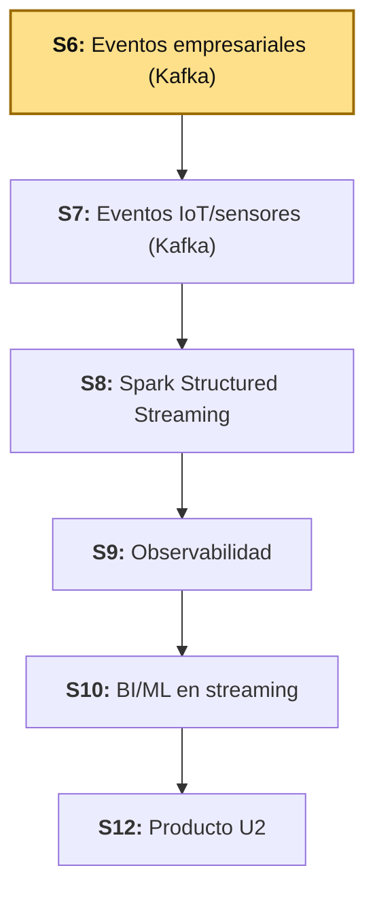
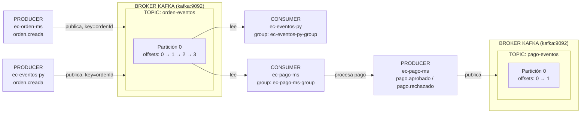

# S6 - Ingesta de Eventos Empresariales en Tiempo Real

## 1. Introducción

### 1.1 Presentación de la sesión

Hasta S5, todo el pipeline de `lambda26` fue **batch**: un archivo llega completo, Spark lo procesa de punta a punta, y termina. Esta sesión abre la Unidad II con un tipo de dato distinto — el **evento**: un mensaje pequeño, que llega uno a la vez, en cualquier momento, sin que nadie avise cuándo empieza ni cuándo termina el flujo. Antes de que Spark pueda procesar eventos en streaming (S8), tiene que existir algo que los reciba, los ordene y los entregue de forma confiable — ese componente es **Apache Kafka**, y esta sesión construye el primer flujo de eventos reales del proyecto: una orden de compra que se crea, y un pago que se procesa a partir de ella.

Esta sesión trabaja **eventos empresariales** (una orden, un pago) — un flujo de negocio normal, con volumen bajo y estructura conocida de antemano. **S7 aplica exactamente el mismo patrón de Kafka a un tipo de evento distinto: telemetría de sensores/IoT** — alta frecuencia, volumen mayor, esquema que puede variar. Ninguna herramienta cambia entre S6 y S7; lo que cambia es el productor y la naturaleza del evento — por eso esta sesión invierte el tiempo en dejar Kafka y el patrón productor-consumidor bien entendidos, no en el negocio de "órdenes" en sí.

### 1.2 Índice

1. Conceptos de Kafka: topic, producer, consumer, broker, partition, offset, consumer group, key.
2. Productor y consumidor manuales por consola.
3. Productor y consumidor en Python.
4. Microservicios Spring Boot como productor y consumidor reales.
5. Contrato de evento, documentado y versionable.

### 1.3 Propósito de aprendizaje

Al concluir la clase, estarás en condiciones de:

- **Publicar y consumir** eventos empresariales con Apache Kafka para un flujo de negocio real, documentando el contrato de cada evento, el tópico que lo transporta y su particionado, con evidencia verificable de publicación y consumo en al menos dos niveles: manual (consola/Python) y aplicado (microservicios).

### 1.4 Producto de sesión

Un flujo de eventos empresariales funcional: Kafka corriendo con Kafka UI, el tópico `orden-eventos` probado manualmente por consola y por un productor/consumidor en Python, y dos microservicios Spring Boot reales — `ec-orden-ms` (publica `orden.creada` al registrar una orden) y `ec-pago-ms` (consume `orden.creada`, procesa el pago y publica `pago.aprobado`/`pago.rechazado` en `pago-eventos`) — con el contrato de ambos eventos documentado.

### 1.5 Metodología

**Tabla 1. Metodología de la sesión**

| Actividades a Realizar en el Periodo | Orientaciones generales (Orientaciones Metodológicas) | Material de estudio recomendado |
|---|---|---|
| Revisión previa individual | Confirmar Docker Desktop funcionando; instalar y verificar Java 21 y VS Code si aún no están instalados (ver 3.5.0). Trabajo individual, antes de clase. | Silabo Unidad II, este mismo documento (1.1-1.7). |
| Clase presencial | Construcción guiada de `kafka/` (broker + UI), prueba manual por consola, prueba con Python, y construcción de `ec-orden-ms`/`ec-pago-ms` como productor y consumidor reales. Trabajo individual, siguiendo al docente paso a paso; consulta inmediata ante un topic que no aparece o un consumer que no recibe nada. | Pasos 3.1 a 3.9 de esta guía. |
| Evaluación formativa | Revisión en clase de Kafka UI mostrando `orden-eventos` y `pago-eventos` con mensajes reales, y de los logs de ambos microservicios publicando/consumiendo. La evidencia se completa y sustenta de forma individual, fuera del aula, según los criterios mínimos de la sección 4.4. | Indicaciones de entrega (4.3), rúbrica de evaluación (4.6). |

### 1.6 Motivación de la sesión

#### 1.6.1 Caso: el pedido que se perdió entre dos sistemas

Una plataforma de comercio electrónico separa "registrar el pedido" de "procesar el pago" en dos aplicaciones distintas, para que un problema en una no tumbe a la otra. La primera versión los conecta con una llamada HTTP directa: el servicio de órdenes, apenas guarda el pedido, llama por REST al servicio de pagos. Funciona en las pruebas. En producción, un día el servicio de pagos está reiniciándose (un despliegue nuevo) justo cuando entra una ráfaga de pedidos — la llamada HTTP falla, y esos pedidos, o se pierden, o el servicio de órdenes también empieza a fallar en cadena (el mismo problema de acoplamiento síncrono que Circuit Breaker mitiga, pero no elimina: la orden y el pago siguen dependiendo de que ambos servicios estén arriba *al mismo tiempo*).

La solución no es un mejor manejo de errores en esa llamada — es no depender de que los dos servicios coincidan en el tiempo. El servicio de órdenes publica un evento ("orden creada") y sigue con lo suyo, sin esperar respuesta de nadie. El servicio de pagos lee ese evento cuando puede — un minuto después, o una hora después si estuvo caído — y lo procesa. Ningún pedido se pierde: Kafka lo retiene hasta que alguien lo consuma. Esta sesión construye exactamente ese patrón, con datos reales.

**Preguntas de análisis**

**Activación de conocimientos previos**

1. ¿Qué problema tiene conectar dos servicios con una llamada HTTP directa, si uno de los dos puede estar caído en el momento exacto en que el otro lo necesita?
2. ¿Por qué "guardar el evento en una cola y seguir" es distinto de "esperar la respuesta antes de continuar"?

**Comprensión de mensajería con Kafka**

1. Si dos consumidores distintos (por ejemplo, `ec-pago-ms` y un futuro servicio de notificaciones) necesitan leer el mismo evento `orden.creada`, ¿alcanza con un solo consumer, o cada uno necesita su propio consumer group? Relaciónalo con 2.2.
2. ¿Qué garantiza Kafka si `ec-pago-ms` está caído cuando `ec-orden-ms` publica un evento, y `ec-pago-ms` vuelve a levantarse cinco minutos después?

### 1.7 Ubicación en el curso

- Unidad: U2 - Sistema Big Data en tiempo real: ingesta, streaming, observabilidad y BI/ML.
- Producto del curso: Proyecto Sello: sistema Big Data distribuido end-to-end para procesamiento batch y streaming, analítica/ML, observabilidad y visualización BI para la toma de decisiones.
- Producto de unidad: pipeline en tiempo real con ingesta de eventos empresariales e IoT/sensores, procesamiento streaming con Spark, observabilidad/costos y salidas BI/ML distribuidas.
- Avance del producto en esta sesión: ingesta de eventos empresariales con Kafka, primer tramo del pipeline en tiempo real.

**Figura 1. Roadmap del producto de la Unidad II**



## 2. Explica

### 2.1 Arquitectura de la sesión

Esta sesión trabaja únicamente con estos componentes, dentro de `lambda26`:

- `kafka/` — el broker y su interfaz web.
- `uso-rapido/ec-eventos-py` — productor/consumidor en Python, para verificar el flujo sin depender de Java.
- `uso-microserv/ec-orden-ms` — microservicio Spring Boot, productor real.
- `uso-microserv/ec-pago-ms` — microservicio Spring Boot, consumidor y productor real.

**Figura 2. Flujo completo: `ec-orden-ms` publica, `ec-pago-ms` consume y vuelve a publicar**



`ec-pago-ms` y `ec-eventos-py` leen del **mismo** topic (`orden-eventos`) sin competir entre sí porque cada uno tiene su propio *consumer group* (2.2, Tabla 2) — Kafka entrega una copia completa de los eventos a cada consumer group, no reparte los eventos como si fuera una sola cola compartida.

En la práctica manual (3.2) solo existe `orden-eventos`. El topic `pago-eventos` aparece recién cuando `ec-pago-ms` publica su primer resultado de pago (3.9).

### 2.2 Conceptos de Kafka

**Tabla 2. Conceptos clave de Kafka**

| Concepto | Qué es |
|---|---|
| `topic` | Canal lógico donde se publican mensajes de un mismo tipo (ej. `orden-eventos`). |
| `producer` | Aplicación que envía eventos a un topic. |
| `consumer` | Aplicación que lee eventos desde un topic. |
| `broker` | Servidor Kafka que almacena y distribuye los eventos. |
| `partition` | División interna de un topic — permite que varios consumidores lean en paralelo. |
| `offset` | Posición de un evento dentro de una partición — Kafka no borra el evento al leerlo, solo avanza el offset del consumer. |
| `consumer group` | Grupo que coordina consumidores y recuerda hasta qué offset ya leyó cada uno. |
| `key` | Valor que Kafka usa para decidir en qué partición cae el evento — mensajes con la misma `key` siempre van a la misma partición, y por lo tanto se leen en orden entre sí. |

La `key` no tiene que ser una clave primaria relacional: puede ser `ordenId`, un `deviceId` (S7), un `correlationId` o un UUID generado por la aplicación — lo único que importa es que agrupe correctamente los eventos que deben mantenerse en orden entre sí. Ver Figura 2 (2.1) para el flujo completo con particiones y offsets reales.

**Error frecuente**: pensar que leer un evento lo elimina del topic, igual que sacar un mensaje de una cola tradicional. Kafka retiene los eventos según su política de retención (por tiempo o tamaño, no cubierta en esta sesión) — leer solo avanza el offset del consumer group que lo leyó; otro consumer group puede leer el mismo evento desde el principio.

### 2.3 Observabilidad y diagnóstico

Revisar Kafka UI (topics, particiones, mensajes, consumer groups y su *lag*), logs de `ec-orden-ms` (líneas `component=producer`) y logs de `ec-pago-ms` (líneas `component=consumer`/`component=processor`/`component=producer`) — cada línea de log declara explícitamente `service`, `component`, `topic` y `status`, precisamente para que un evento se pueda rastrear de un extremo al otro sin adivinar.

## 3. Aplica: actividad práctica guiada

Tiempo: 3h.

**Actividad:** construcción guiada del flujo de eventos empresariales de `lambda26`: Kafka, prueba manual, prueba en Python, y los microservicios `ec-orden-ms`/`ec-pago-ms` como productor y consumidor reales (Producto de la sesión en 1.4).

**Propósito de la actividad:** dejar Kafka operativo y validado en tres niveles de práctica — consola, Python, microservicios — de forma que el patrón productor-consumidor quede claro antes de repetirlo en S7 con otro tipo de evento.

**Orientaciones metodológicas:** en el laboratorio, el docente guía la construcción paso a paso frente a la clase; los estudiantes replican cada paso en su propia laptop, verificando el resultado en Kafka UI antes de avanzar al siguiente.

**Actividades para realizar:**

- **3.1** Levantar Kafka.
- **3.2** Probar Kafka por consola (producer/consumer manuales).
- **3.3** Verificar con Kafka UI.
- **3.4** Probar con Python (productor y consumidor rápidos).
- **3.5** Crear `ec-orden-ms` como productor.
- **3.5.0** Instalar y verificar Java 21 y VS Code.
- **3.5.1** Crear la entidad, el evento y el repositorio.
- **3.5.2** Configurar Kafka en código, no solo por propiedades.
- **3.5.3** Crear el productor, el servicio y el controlador.
- **3.6** Levantar y probar `ec-orden-ms`.
- **3.7** Crear `ec-pago-ms` como consumidor y productor.
- **3.7.1** Crear la entidad, los dos eventos y el repositorio.
- **3.7.2** Configurar Kafka: productor, consumidor y manejo de errores.
- **3.7.3** Crear el productor, el consumidor y el controlador.
- **3.8** Levantar y probar `ec-pago-ms`.
- **3.9** Documentar el contrato de ambos eventos.

### 3.1 Levantar Kafka

**Producto del paso:** Kafka, Kafka UI y el exportador de métricas corriendo en DEV.

Crea:

```text
kafka/compose.yml
```

```yaml
name: lambda26-kafka

services:
  kafka:
    image: apache/kafka:4.3.1
    container_name: lambda26-kafka
    restart: unless-stopped
    ports:
      - "49092:9092"
    environment:
      KAFKA_NODE_ID: 1
      KAFKA_PROCESS_ROLES: broker,controller
      KAFKA_LISTENERS: PLAINTEXT://0.0.0.0:9092,CONTROLLER://0.0.0.0:9093
      KAFKA_ADVERTISED_LISTENERS: PLAINTEXT://kafka:9092
      KAFKA_CONTROLLER_LISTENER_NAMES: CONTROLLER
      KAFKA_LISTENER_SECURITY_PROTOCOL_MAP: CONTROLLER:PLAINTEXT,PLAINTEXT:PLAINTEXT
      KAFKA_CONTROLLER_QUORUM_VOTERS: 1@kafka:9093
      KAFKA_OFFSETS_TOPIC_REPLICATION_FACTOR: 1
      KAFKA_AUTO_CREATE_TOPICS_ENABLE: "false"

  kafka-ui:
    image: ghcr.io/kafbat/kafka-ui:v1.5.0
    container_name: lambda26-kafka-ui
    restart: unless-stopped
    ports:
      - "48085:8080"
    environment:
      KAFKA_CLUSTERS_0_NAME: lambda26
      KAFKA_CLUSTERS_0_BOOTSTRAPSERVERS: kafka:9092
    depends_on:
      - kafka

  kafka-exporter:
    image: danielqsj/kafka-exporter:v1.10.0
    container_name: lambda26-kafka-exporter
    restart: unless-stopped
    command: ["--kafka.server=kafka:9092"]
    ports:
      - "49308:9308"
    depends_on:
      - kafka
```

`KAFKA_AUTO_CREATE_TOPICS_ENABLE: "false"` es intencional: cada topic se crea de forma explícita (3.2), con las particiones que decides — no aparece solo la primera vez que alguien publica en un nombre nuevo, un error común que oculta un typo en el nombre del topic detrás de un topic "fantasma" con una sola partición por defecto.

Las tres imágenes van con versión fija, no `latest` — mismo criterio que ya aplican otros cursos del proyecto: una guía que muchos estudiantes siguen en momentos distintos no puede depender de un tag que cambia de contenido con el tiempo. `kafka-ui` es un caso particular: la imagen histórica, `provectuslabs/kafka-ui`, no saca una versión real desde hace más de dos años — el equipo original se movió a un fork activo, **Kafbat** (`ghcr.io/kafbat/kafka-ui`), que continúa el mismo proyecto con desarrollo real. Por eso esta guía usa `ghcr.io/kafbat/kafka-ui:v1.5.0` en vez de `provectuslabs/kafka-ui`, aunque el nombre del servicio (`kafka-ui`) y su función no cambian en nada.

Levanta:

```powershell
docker compose -f kafka/compose.yml up -d
docker compose -f kafka/compose.yml ps
```

Servicios esperados: `lambda26-kafka`, `lambda26-kafka-ui`, `lambda26-kafka-exporter`.

### 3.2 Probar Kafka por consola

**Producto del paso:** topic `orden-eventos` creado y probado con un producer y un consumer manuales.

Entra al contenedor:

```powershell
docker compose -f kafka/compose.yml exec kafka bash
```

Crea el topic:

```bash
/opt/kafka/bin/kafka-topics.sh --create \
  --topic orden-eventos \
  --bootstrap-server kafka:9092 \
  --partitions 1 \
  --replication-factor 1
```

Lista los topics:

```bash
/opt/kafka/bin/kafka-topics.sh --list --bootstrap-server kafka:9092
```

Resultado esperado:

```text
orden-eventos
```

**Terminal 1** (consumer):

```powershell
docker compose -f kafka/compose.yml exec kafka bash
```

```bash
/opt/kafka/bin/kafka-console-consumer.sh \
  --topic orden-eventos \
  --bootstrap-server kafka:9092 \
  --from-beginning
```

**Terminal 2** (producer):

```powershell
docker compose -f kafka/compose.yml exec kafka bash
```

```bash
/opt/kafka/bin/kafka-console-producer.sh \
  --topic orden-eventos \
  --bootstrap-server kafka:9092
```

Escribe:

```text
hola kafka
```

El consumer de la Terminal 1 debe mostrar ese mismo texto de inmediato.

### 3.3 Verificar con Kafka UI

**Producto del paso:** confirmación visual del topic, sus mensajes y sus offsets.

Abre `http://localhost:48085` y verifica:

- El clúster `lambda26` aparece conectado.
- El topic `orden-eventos` existe, con 1 partición.
- El mensaje manual de 3.2 aparece en la pestaña de mensajes, con columnas `partition` y `offset`.

### 3.4 Probar con Python

**Producto del paso:** confirmación de que el flujo funciona con un cliente distinto al de consola, incluida la estructura JSON del evento.

Crea `uso-rapido/ec-eventos-py/producer_ordenes.py` y `uso-rapido/ec-eventos-py/consumer_ordenes.py` (usa la librería `kafka-python` o `confluent-kafka`, según lo que el equipo docente tenga disponible en el ambiente). El evento publicado por el productor Python debe seguir exactamente este formato — es el mismo contrato que usará `ec-orden-ms` en Java (3.9):

```json
{
  "tipoEvento": "orden.creada",
  "ordenId": 321,
  "total": 180.0,
  "estado": "PENDIENTE",
  "origen": "python",
  "timestamp": 1713350000000
}
```

Levanta el contenedor de utilidades Python (o ejecuta los scripts directamente si el entorno ya tiene Python instalado con las librerías necesarias):

```powershell
docker compose -f uso-rapido/ec-eventos-py/compose.yml up -d --build
```

Ejecuta el consumer:

```powershell
docker compose -f uso-rapido/ec-eventos-py/compose.yml exec ec-eventos-py python /app/consumer_ordenes.py
```

En otra terminal:

```powershell
docker compose -f uso-rapido/ec-eventos-py/compose.yml exec ec-eventos-py python /app/producer_ordenes.py
```

El consumer debe imprimir `topic`, `partition`, `offset`, `origen`, `estado`, `total` y `payload` completo. Si llega el mensaje manual de texto plano de 3.2 (no es JSON), el consumer no debe caerse: debe marcarlo como `invalid` y mostrar `rawPayload` — un consumer real recibe de todo, no solo lo que él mismo publicó.

**Error frecuente**: un consumer que asume que todo mensaje en el topic es JSON válido con la forma esperada, y lanza una excepción no controlada apenas llega algo distinto — un solo mensaje malformado no debería tumbar un consumer que va a correr indefinidamente.

### 3.5 Crear `ec-orden-ms` como productor

**Producto del paso:** proyecto Spring Boot `ec-orden-ms` creado, con Kafka, JPA y PostgreSQL.

#### 3.5.0 Instalar y verificar Java 21 y VS Code

**Producto del paso:** entorno de desarrollo configurado con Java 21 y VS Code (mismo criterio que DIST/LP2, ver 3.1 de esas guías).

**Windows** — **PowerShell** como usuario normal:

```powershell
winget install --id EclipseAdoptium.Temurin.21.JDK --exact
```

**macOS** (Homebrew no viene preinstalado en ningún Mac; una vez instalado, el comando de Temurin es el mismo para Intel y para Apple Silicon M1/M2/M3/M4 — Homebrew detecta la arquitectura automáticamente):

```bash
# 1. Instalar Homebrew (si no lo tiene)
/bin/bash -c "$(curl -fsSL https://raw.githubusercontent.com/Homebrew/install/HEAD/install.sh)"

# 2. Solo en Apple Silicon (M1/M2/M3/M4): agregar Homebrew al PATH.
#    Se instala en /opt/homebrew (no en /usr/local como en Intel), y el
#    propio instalador lo pide como paso obligatorio, no opcional.
echo 'eval "$(/opt/homebrew/bin/brew shellenv)"' >> ~/.zprofile
eval "$(/opt/homebrew/bin/brew shellenv)"

# 3. Instalar Temurin 21
brew install --cask temurin@21
```

**Linux (Ubuntu/Debian)** — repositorio oficial de Adoptium vía `apt`:

```bash
sudo apt install -y wget apt-transport-https gpg
wget -qO - https://packages.adoptium.net/artifactory/api/gpg/key/public | gpg --dearmor | sudo tee /etc/apt/trusted.gpg.d/adoptium.gpg > /dev/null
echo "deb https://packages.adoptium.net/artifactory/deb $(awk -F= '/^VERSION_CODENAME/{print$2}' /etc/os-release) main" | sudo tee /etc/apt/sources.list.d/adoptium.list
sudo apt update
sudo apt install -y temurin-21-jdk
```

**Linux (Fedora/RHEL)** — repositorio oficial de Adoptium vía `dnf`:

```bash
sudo tee /etc/yum.repos.d/adoptium.repo > /dev/null <<'EOF'
[Adoptium]
name=Adoptium
baseurl=https://packages.adoptium.net/artifactory/rpm/$(. /etc/os-release; echo $ID)/$releasever/$basearch
enabled=1
gpgcheck=1
gpgkey=https://packages.adoptium.net/artifactory/api/gpg/key/public
EOF
sudo dnf install -y temurin-21-jdk
```

Al finalizar, cierra y vuelve a abrir la terminal. Verifica la instalación:

```powershell
java --version
javac --version
```

Ambas comprobaciones deben mostrar Java 21. Si conserva una versión anterior, configura `JAVA_HOME` con la ruta del JDK 21 desde las variables de entorno de Windows, actualiza `Path` para que `%JAVA_HOME%\bin` tenga prioridad y abre una terminal nueva.

**VS Code:**

```powershell
winget install -e --id Microsoft.VisualStudioCode
```

```bash
brew install --cask visual-studio-code
```

```bash
sudo snap install --classic code
```

Instala las extensiones desde la terminal:

```bash
code --install-extension vscjava.vscode-java-pack
code --install-extension vmware.vscode-boot-dev-pack
code --install-extension cweijan.vscode-database-client2
```

`vscjava.vscode-java-pack` trae soporte de Spring Initializr integrado a VS Code (lo usarás para generar `ec-orden-ms` y `ec-pago-ms` desde la Tabla 3), `vmware.vscode-boot-dev-pack` agrega el Spring Boot Dashboard para arrancar/detener ambos microservicios sin recordar el comando cada vez, y `cweijan.vscode-database-client2` es un cliente gráfico para revisar las tablas `ordenes`/`pagos` en PostgreSQL sin salir del editor.

No hace falta instalar Maven aparte: cada proyecto que genera Spring Initializr trae su propio **Maven Wrapper** (`mvnw`/`mvnw.cmd`), que descarga la versión correcta de Maven la primera vez que lo ejecutas. Por eso en 3.6 y 3.8 los comandos usan `.\mvnw.cmd`, no `mvn`.

**Tabla 3. Configuración de `ec-orden-ms` en Spring Initializr**

| Campo | Valor |
|---|---|
| Project | Maven Project |
| Spring Boot | **4.1.1** (mismo criterio que DIST — ya trae Swagger/springdoc probado) |
| Language | Java |
| Group Id | `pe.edu.upeu` |
| Artifact Id | `ec-orden-ms` |
| Package name | `pe.edu.upeu.ec.orden` |
| Java | **21** (mismo criterio que DIST/LP2) |
| Dependencias | Spring Web (**`spring-boot-starter-webmvc`** en Boot 4, ya no `-web`), Spring for Apache Kafka, Spring Data JPA, PostgreSQL Driver, Lombok, Spring Boot DevTools |
| Ubicación sugerida | `uso-microserv/ec-orden-ms` |

**Spring Boot 4 renombró varios starters** — no es solo un número de versión más alto. `spring-boot-starter-web` pasó a llamarse `spring-boot-starter-webmvc` (separa explícitamente WebMVC de WebFlux desde el nombre del starter), y el genérico `spring-boot-starter-test` desapareció: cada starter que uses trae su propio `-test` (`spring-boot-starter-data-jpa-test`, `spring-boot-starter-webmvc-test`) en vez de uno solo que los cubra todos. Si Spring Initializr no te deja elegir Boot 4 todavía, agrega estas dependencias a mano con los nombres de arriba después de generar el proyecto — no con los nombres de Boot 3.

**Spring Boot DevTools** reinicia la aplicación automáticamente cada vez que guardas un cambio en el código, sin que tengas que detener y volver a ejecutar `.\mvnw.cmd spring-boot:run` a mano — en `application-dev.yml` (más abajo) se activa con `spring.devtools.restart.enabled` y `spring.devtools.livereload.enabled`. En el `pom.xml` va con `<scope>runtime</scope>` y `<optional>true</optional>`, para que no viaje al artefacto final en `prod`.

**`uso-microserv/ec-orden-ms/compose-dev.yml`:**

```yaml
name: lambda26-ec-orden-dev

services:
  postgres-ec-orden-dev:
    image: postgres:16-alpine
    container_name: lambda26-postgres-ec-orden-dev
    restart: unless-stopped
    environment:
      POSTGRES_DB: db_ec_orden_ms
      POSTGRES_USER: ecom
      POSTGRES_PASSWORD: ecom
    ports:
      - "49020:5432"
    volumes:
      - lambda26_postgres_ec_orden_dev_data:/var/lib/postgresql/data

volumes:
  lambda26_postgres_ec_orden_dev_data:
```

`name`/`container_name` dejan `-ms` fuera (`lambda26-ec-orden-dev`, no `lambda26-ec-orden-ms-dev`) — mismo criterio que ya usa DIST (`pagatu-orden-dev`, no `pagatu-orden-ms-dev`): el sufijo `-ms` identifica el artefacto Maven (`ec-orden-ms`, Tabla 3), no hace falta repetirlo en cada nombre de contenedor o red.

**`uso-microserv/ec-orden-ms/src/main/resources/application.yml`** (agnóstico de ambiente, solo decide el perfil activo y las propiedades propias):

```yaml
spring:
  application:
    name: ec-orden-ms
  profiles:
    active: dev

app:
  kafka:
    topic:
      ordenes: orden-eventos
```

**`uso-microserv/ec-orden-ms/src/main/resources/application-dev.yml`:**

```yaml
server:
  port: 49021

spring:
  devtools:
    restart:
      enabled: true
    livereload:
      enabled: true
  kafka:
    bootstrap-servers: localhost:49092
  datasource:
    url: jdbc:postgresql://localhost:49020/db_ec_orden_ms
    username: ecom
    password: ecom
    driver-class-name: org.postgresql.Driver
  flyway:
    enabled: false
  jpa:
    hibernate:
      ddl-auto: update
    show-sql: true
    properties:
      hibernate:
        format_sql: true
```

`49020` (Postgres) y `49021` (la app) son puertos distintos, a propósito — usar el mismo número para los dos, un error fácil de cometer al copiar y pegar, haría que uno de los dos procesos no pudiera arrancar en DEV (ambos corren directo en el host, compitiendo por el mismo puerto).

`app.kafka.topic.ordenes` (en `application.yml`, no en `application-dev.yml`) es el nombre del topic — vive en el archivo agnóstico de ambiente porque el topic es el mismo en DEV y en producción local; lo que cambia entre ambientes es la dirección del broker (`spring.kafka.bootstrap-servers`), no el nombre del topic. `spring.kafka.producer.key-serializer`/`value-serializer` ya **no** se configuran por propiedades (a diferencia de una primera versión de este proyecto) — 3.5.2 (`KafkaConfiguracion`) los define directamente en código, con un tipo concreto (`EventoOrden`) en vez del genérico `Object`.

`ddl-auto: update` (no `validate`, a diferencia del criterio usado en los proyectos de LP2/DIST) es intencional aquí: este microservicio es una herramienta de laboratorio para generar eventos, no el producto evaluado de esta sesión — no justifica el peso de una migración Flyway completa solo para una tabla.

#### 3.5.1 Crear la entidad, el evento y el repositorio

Crea:

```text
uso-microserv/ec-orden-ms/src/main/java/pe/edu/upeu/ec/orden/entity/Orden.java
```

```java
package pe.edu.upeu.ec.orden.entity;

import jakarta.persistence.Entity;
import jakarta.persistence.GeneratedValue;
import jakarta.persistence.GenerationType;
import jakarta.persistence.Id;
import jakarta.persistence.Table;
import lombok.AllArgsConstructor;
import lombok.Builder;
import lombok.Data;
import lombok.NoArgsConstructor;

@Entity
@Table(name = "ordenes")
@Data
@Builder
@NoArgsConstructor
@AllArgsConstructor
public class Orden {

    @Id
    @GeneratedValue(strategy = GenerationType.IDENTITY)
    private Long id;

    private Long usuarioId;

    private Double total;

    private String estado;
}
```

`@Data` (Lombok) reemplaza aquí a `@Getter`/`@Setter` por separado — genera ambos de una vez, además de `equals()`/`hashCode()`/`toString()`; con una entidad tan simple como esta (cuatro campos, sin relaciones), no hay razón para escribirlos por separado.

Crea el evento — un DTO propio, no la entidad `Orden` reutilizada, porque lo que viaja por Kafka es un contrato con otros servicios (2.1), no el modelo interno de persistencia:

```text
uso-microserv/ec-orden-ms/src/main/java/pe/edu/upeu/ec/orden/event/EventoOrden.java
```

```java
package pe.edu.upeu.ec.orden.event;

import lombok.AllArgsConstructor;
import lombok.Builder;
import lombok.Data;
import lombok.NoArgsConstructor;

@Data
@Builder
@NoArgsConstructor
@AllArgsConstructor
public class EventoOrden {

    private String tipoEvento;
    private Long ordenId;
    private Double total;
    private String estado;
    private String origen;
    private Long timestamp;
}
```

Crea el repositorio:

```text
uso-microserv/ec-orden-ms/src/main/java/pe/edu/upeu/ec/orden/repository/OrdenRepositorio.java
```

```java
package pe.edu.upeu.ec.orden.repository;

import pe.edu.upeu.ec.orden.entity.Orden;
import org.springframework.data.jpa.repository.JpaRepository;

public interface OrdenRepositorio extends JpaRepository<Orden, Long> {
}
```

#### 3.5.2 Configurar Kafka en código, no solo por propiedades

**Producto del paso:** un `KafkaTemplate` tipado (`EventoOrden`, no `Object`), definido explícitamente en una clase `@Configuration`.

Crea:

```text
uso-microserv/ec-orden-ms/src/main/java/pe/edu/upeu/ec/orden/configuration/KafkaConfiguracion.java
```

```java
package pe.edu.upeu.ec.orden.configuration;

import pe.edu.upeu.ec.orden.event.EventoOrden;
import java.util.HashMap;
import java.util.Map;
import org.apache.kafka.clients.producer.ProducerConfig;
import org.apache.kafka.common.serialization.StringSerializer;
import org.springframework.beans.factory.annotation.Value;
import org.springframework.context.annotation.Bean;
import org.springframework.context.annotation.Configuration;
import org.springframework.kafka.core.DefaultKafkaProducerFactory;
import org.springframework.kafka.core.KafkaTemplate;
import org.springframework.kafka.core.ProducerFactory;
import org.springframework.kafka.support.serializer.JsonSerializer;

@Configuration
public class KafkaConfiguracion {

    @Value("${spring.kafka.bootstrap-servers}")
    private String bootstrapServers;

    @Bean
    public ProducerFactory<String, EventoOrden> producerFactory() {
        Map<String, Object> propiedades = new HashMap<>();
        propiedades.put(ProducerConfig.BOOTSTRAP_SERVERS_CONFIG, bootstrapServers);
        propiedades.put(ProducerConfig.KEY_SERIALIZER_CLASS_CONFIG, StringSerializer.class);
        propiedades.put(ProducerConfig.VALUE_SERIALIZER_CLASS_CONFIG, JsonSerializer.class);

        return new DefaultKafkaProducerFactory<>(propiedades);
    }

    @Bean
    public KafkaTemplate<String, EventoOrden> kafkaTemplate() {
        return new KafkaTemplate<>(producerFactory());
    }
}
```

`KafkaTemplate<String, EventoOrden>` (tipado) en vez de `KafkaTemplate<String, Object>` (genérico, S3.5 de una versión anterior de esta guía) hace que el compilador rechace enviar cualquier cosa que no sea un `EventoOrden` por este template — un error de tipo se detecta al compilar, no en producción cuando alguien intente deserializar un evento con la forma equivocada.

#### 3.5.3 Crear el productor, el servicio y el controlador

Crea el productor:

```text
uso-microserv/ec-orden-ms/src/main/java/pe/edu/upeu/ec/orden/service/ProductorOrden.java
```

```java
package pe.edu.upeu.ec.orden.service;

import pe.edu.upeu.ec.orden.event.EventoOrden;
import lombok.RequiredArgsConstructor;
import lombok.extern.slf4j.Slf4j;
import org.springframework.beans.factory.annotation.Value;
import org.springframework.kafka.core.KafkaTemplate;
import org.springframework.stereotype.Component;

@Slf4j
@Component
@RequiredArgsConstructor
public class ProductorOrden {

    private final KafkaTemplate<String, EventoOrden> kafkaTemplate;
    @Value("${app.kafka.topic.ordenes}")
    private String topicOrdenes;

    public void publicarOrdenCreada(EventoOrden eventoOrden) {
        kafkaTemplate.send(topicOrdenes, String.valueOf(eventoOrden.getOrdenId()), eventoOrden)
                .whenComplete((resultado, ex) -> {
                    if (ex != null) {
                        log.error(
                                "service=ec-orden-ms component=producer topic={} eventType={} ordenId={} timestamp={} status=error error=\"{}\"",
                                topicOrdenes,
                                eventoOrden.getTipoEvento(),
                                eventoOrden.getOrdenId(),
                                eventoOrden.getTimestamp(),
                                ex.getMessage()
                        );
                        return;
                    }

                    log.info(
                            "service=ec-orden-ms component=producer topic={} partition={} offset={} eventType={} ordenId={} timestamp={} status=published",
                            resultado.getRecordMetadata().topic(),
                            resultado.getRecordMetadata().partition(),
                            resultado.getRecordMetadata().offset(),
                            eventoOrden.getTipoEvento(),
                            eventoOrden.getOrdenId(),
                            eventoOrden.getTimestamp()
                    );
                });
    }
}
```

`kafkaTemplate.send(...)` devuelve un `CompletableFuture` — `.whenComplete(...)` reacciona cuando Kafka confirma el envío (o falla), sin bloquear el hilo que llamó a `publicarOrdenCreada` esperando la respuesta. El log de éxito recién imprime `partition`/`offset` reales (los que asignó el broker) porque solo se conocen después de que el envío se confirma — antes de eso, no existen todavía. `ordenId` como `key` (2.2) sigue el mismo motivo de antes: si algún día un mismo pedido genera más de un evento (por ejemplo, `orden.creada` y una futura `orden.cancelada`), Kafka los mantiene en la misma partición y en orden entre sí.

Crea el servicio:

```text
uso-microserv/ec-orden-ms/src/main/java/pe/edu/upeu/ec/orden/service/OrdenServicio.java
```

```java
package pe.edu.upeu.ec.orden.service;

import pe.edu.upeu.ec.orden.entity.Orden;
import pe.edu.upeu.ec.orden.event.EventoOrden;
import pe.edu.upeu.ec.orden.repository.OrdenRepositorio;
import java.time.Instant;
import java.util.List;
import lombok.RequiredArgsConstructor;
import org.springframework.beans.factory.annotation.Value;
import org.springframework.stereotype.Service;

@Service
@RequiredArgsConstructor
public class OrdenServicio {

    private static final String ESTADO_PENDIENTE = "PENDIENTE";
    private static final String TIPO_EVENTO_ORDEN_CREADA = "orden.creada";

    private final OrdenRepositorio ordenRepositorio;
    private final ProductorOrden productorOrden;
    @Value("${spring.application.name}")
    private String applicationName;

    public List<Orden> listarOrdenes() {
        return ordenRepositorio.findAll();
    }

    public Orden crearOrden(Orden orden) {
        orden.setId(null);
        orden.setEstado(ESTADO_PENDIENTE);

        Orden ordenGuardada = ordenRepositorio.save(orden);

        EventoOrden eventoOrden = EventoOrden.builder()
                .tipoEvento(TIPO_EVENTO_ORDEN_CREADA)
                .ordenId(ordenGuardada.getId())
                .total(ordenGuardada.getTotal())
                .estado(ordenGuardada.getEstado())
                .origen(applicationName)
                .timestamp(Instant.now().toEpochMilli())
                .build();

        productorOrden.publicarOrdenCreada(eventoOrden);

        return ordenGuardada;
    }
}
```

`orden.setId(null)` antes de guardar evita que alguien fuerce un `id` propio en el `POST` (un cliente podría mandar `{"id": 999, ...}` intentando sobrescribir una orden existente) — `crearOrden` siempre crea una fila nueva, nunca actualiza una vieja. `@Value("${spring.application.name}")` para `origen` evita hardcodear el literal `"ec-orden-ms"` (S3.5 de una versión anterior de esta guía) — si el nombre del microservicio cambia algún día, este valor lo sigue automáticamente.

Crea el controlador:

```text
uso-microserv/ec-orden-ms/src/main/java/pe/edu/upeu/ec/orden/controller/OrdenControlador.java
```

```java
package pe.edu.upeu.ec.orden.controller;

import pe.edu.upeu.ec.orden.entity.Orden;
import pe.edu.upeu.ec.orden.service.OrdenServicio;
import java.util.List;
import lombok.RequiredArgsConstructor;
import org.springframework.http.HttpStatus;
import org.springframework.web.bind.annotation.GetMapping;
import org.springframework.web.bind.annotation.PostMapping;
import org.springframework.web.bind.annotation.RequestBody;
import org.springframework.web.bind.annotation.RequestMapping;
import org.springframework.web.bind.annotation.ResponseStatus;
import org.springframework.web.bind.annotation.RestController;

@RestController
@RequestMapping("/ordenes")
@RequiredArgsConstructor
public class OrdenControlador {

    private final OrdenServicio ordenServicio;

    @GetMapping
    public List<Orden> listarOrdenes() {
        return ordenServicio.listarOrdenes();
    }

    @PostMapping
    @ResponseStatus(HttpStatus.CREATED)
    public Orden crearOrden(@RequestBody Orden orden) {
        return ordenServicio.crearOrden(orden);
    }
}
```

La orden se guarda en PostgreSQL y se publica en Kafka **sin una transacción real que las una** — son dos sistemas distintos (base de datos relacional y broker de mensajería) que no comparten una transacción entre sí; si el envío a Kafka fallara después de guardar en PostgreSQL, la orden quedaría guardada sin evento publicado. Resolver esa inconsistencia (patrón *Outbox*) queda fuera del alcance de esta sesión — aquí el objetivo es dejar el flujo feliz funcionando y visible.

### 3.6 Levantar y probar `ec-orden-ms`

**Producto del paso:** primera orden real publicando un evento verificable en Kafka UI.

```powershell
docker compose -f uso-microserv/ec-orden-ms/compose-dev.yml up -d
docker compose -f uso-microserv/ec-orden-ms/compose-dev.yml ps
```

```powershell
docker exec -it lambda26-postgres-ec-orden-dev psql -U ecom -d db_ec_orden_ms -c "\dt"
```

```powershell
cd uso-microserv/ec-orden-ms
.\mvnw.cmd spring-boot:run
```

Crea una orden:

```powershell
Invoke-RestMethod -Method Post -Uri "http://localhost:49021/ordenes" `
  -ContentType "application/json" `
  -Body '{"usuarioId":1,"total":100}'
```

Verifica en consola (`Ctrl+C` no es necesario, revisa el log de la terminal donde corre `.\mvnw.cmd spring-boot:run`):

```text
service=ec-orden-ms component=producer topic=orden-eventos partition=0 offset=0 eventType=orden.creada ordenId=1 timestamp=1713350000000 status=published
```

Verifica en Kafka UI (3.3) que `orden-eventos` ahora tiene un mensaje con `tipoEvento: orden.creada` y `origen: ec-orden-ms`.

Confirma que la orden también quedó guardada en PostgreSQL (recuerda que es un sistema aparte de Kafka, sin transacción que los una):

```powershell
docker exec -it lambda26-postgres-ec-orden-dev psql -U ecom -d db_ec_orden_ms -c "SELECT * FROM ordenes;"
```

También puedes crear y listar órdenes desde Swagger, sin usar `Invoke-RestMethod`:

```text
http://localhost:49021/swagger-ui/index.html
```

### 3.7 Crear `ec-pago-ms` como consumidor y productor

**Producto del paso:** proyecto Spring Boot `ec-pago-ms` que consume `orden-eventos` y publica el resultado del pago en `pago-eventos`.

Repite 3.5 con `Artifact Id: ec-pago-ms`, `Package name: pe.edu.upeu.ec.pago`, Java 21, en `uso-microserv/ec-pago-ms`, con su propia base de datos `db_ec_pago_ms` en el puerto `49030` y la app en el puerto `49031` — mismo criterio de `ec-orden-ms` (3.5): puertos distintos entre sí, para no repetir el error de usar el mismo número en Postgres y en la app.

**`uso-microserv/ec-pago-ms/src/main/resources/application.yml`:**

```yaml
spring:
  application:
    name: ec-pago-ms
  profiles:
    active: dev

app:
  kafka:
    topic:
      ordenes: orden-eventos
      pagos: pago-eventos
    group-id:
      pagos: ec-pago-ms-group
```

**`uso-microserv/ec-pago-ms/src/main/resources/application-dev.yml`** (mismo patrón de `ec-orden-ms`, 3.5, con su propio puerto y base de datos):

```yaml
server:
  port: 49031

spring:
  devtools:
    restart:
      enabled: true
    livereload:
      enabled: true
  kafka:
    bootstrap-servers: localhost:49092
  datasource:
    url: jdbc:postgresql://localhost:49030/db_ec_pago_ms
    username: ecom
    password: ecom
    driver-class-name: org.postgresql.Driver
  flyway:
    enabled: false
  jpa:
    hibernate:
      ddl-auto: update
    show-sql: true
    properties:
      hibernate:
        format_sql: true
```

`ec-pago-ms` necesita **dos** topics (`ordenes`, el que consume; `pagos`, el que publica) y su propio `group-id` — por eso `app.kafka` tiene más llaves aquí que en `ec-orden-ms` (solo `ordenes`, que publica). El `group-id` va en `app.kafka.group-id.pagos` (propiedad propia), no en `spring.kafka.consumer.group-id` — se referencia directo en la anotación `@KafkaListener` (3.7.2) con `${app.kafka.group-id.pagos}`, sin depender de la configuración automática de consumer de Spring Boot.

#### 3.7.1 Crear la entidad, los dos eventos y el repositorio

`ec-pago-ms` maneja tres tipos de dato distintos: su propia entidad (`Pago`, lo que persiste), el evento que **consume** (`EventoOrden` — mismo contrato que publica `ec-orden-ms`, pero declarado de nuevo aquí, porque cada microservicio es dueño de su propio modelo de datos, 2.1) y el evento que **produce** (`EventoPago`).

Crea:

```text
uso-microserv/ec-pago-ms/src/main/java/pe/edu/upeu/ec/pago/entity/Pago.java
```

```java
package pe.edu.upeu.ec.pago.entity;

import jakarta.persistence.Entity;
import jakarta.persistence.GeneratedValue;
import jakarta.persistence.GenerationType;
import jakarta.persistence.Id;
import jakarta.persistence.Table;
import lombok.AllArgsConstructor;
import lombok.Builder;
import lombok.Data;
import lombok.NoArgsConstructor;

@Entity
@Table(name = "pagos")
@Data
@Builder
@NoArgsConstructor
@AllArgsConstructor
public class Pago {

    @Id
    @GeneratedValue(strategy = GenerationType.IDENTITY)
    private Long id;

    private Long ordenId;

    private Double monto;

    private String estado;
}
```

Crea el evento que consume (idéntico en forma al `EventoOrden` de `ec-orden-ms`, 3.5.1 — mismo contrato, cada servicio con su propia copia de la clase):

```text
uso-microserv/ec-pago-ms/src/main/java/pe/edu/upeu/ec/pago/event/EventoOrden.java
```

```java
package pe.edu.upeu.ec.pago.event;

import lombok.AllArgsConstructor;
import lombok.Builder;
import lombok.Data;
import lombok.NoArgsConstructor;

@Data
@Builder
@NoArgsConstructor
@AllArgsConstructor
public class EventoOrden {

    private String tipoEvento;
    private Long ordenId;
    private Double total;
    private String estado;
    private String origen;
    private Long timestamp;
}
```

Crea el evento que produce:

```text
uso-microserv/ec-pago-ms/src/main/java/pe/edu/upeu/ec/pago/event/EventoPago.java
```

```java
package pe.edu.upeu.ec.pago.event;

import lombok.AllArgsConstructor;
import lombok.Builder;
import lombok.Data;
import lombok.NoArgsConstructor;

@Data
@Builder
@NoArgsConstructor
@AllArgsConstructor
public class EventoPago {

    private String tipoEvento;
    private Long ordenId;
    private Double monto;
    private String estado;
    private String origen;
    private Long timestamp;
}
```

Crea el repositorio:

```text
uso-microserv/ec-pago-ms/src/main/java/pe/edu/upeu/ec/pago/repository/PagoRepositorio.java
```

```java
package pe.edu.upeu.ec.pago.repository;

import pe.edu.upeu.ec.pago.entity.Pago;
import org.springframework.data.jpa.repository.JpaRepository;

public interface PagoRepositorio extends JpaRepository<Pago, Long> {
}
```

#### 3.7.2 Configurar Kafka: productor, consumidor y manejo de errores

**Producto del paso:** `ec-pago-ms` preparado para publicar (`EventoPago`) y para consumir (`EventoOrden`) — con un mensaje malformado manejado sin tumbar el consumer (2.2, "Error frecuente").

Crea:

```text
uso-microserv/ec-pago-ms/src/main/java/pe/edu/upeu/ec/pago/configuration/KafkaConfiguracion.java
```

```java
package pe.edu.upeu.ec.pago.configuration;

import pe.edu.upeu.ec.pago.event.EventoOrden;
import pe.edu.upeu.ec.pago.event.EventoPago;
import java.util.HashMap;
import java.util.Map;
import org.apache.kafka.clients.consumer.ConsumerConfig;
import org.apache.kafka.clients.producer.ProducerConfig;
import org.apache.kafka.common.serialization.StringDeserializer;
import org.apache.kafka.common.serialization.StringSerializer;
import org.slf4j.Logger;
import org.slf4j.LoggerFactory;
import org.springframework.beans.factory.annotation.Value;
import org.springframework.context.annotation.Bean;
import org.springframework.context.annotation.Configuration;
import org.springframework.kafka.annotation.EnableKafka;
import org.springframework.kafka.listener.CommonErrorHandler;
import org.springframework.kafka.config.ConcurrentKafkaListenerContainerFactory;
import org.springframework.kafka.core.ConsumerFactory;
import org.springframework.kafka.core.DefaultKafkaConsumerFactory;
import org.springframework.kafka.core.DefaultKafkaProducerFactory;
import org.springframework.kafka.core.KafkaTemplate;
import org.springframework.kafka.core.ProducerFactory;
import org.springframework.kafka.listener.DefaultErrorHandler;
import org.springframework.kafka.support.serializer.ErrorHandlingDeserializer;
import org.springframework.kafka.support.serializer.JsonDeserializer;
import org.springframework.kafka.support.serializer.JsonSerializer;
import org.springframework.util.backoff.FixedBackOff;

@EnableKafka
@Configuration
public class KafkaConfiguracion {

    private static final Logger log = LoggerFactory.getLogger(KafkaConfiguracion.class);

    @Value("${spring.kafka.bootstrap-servers}")
    private String bootstrapServers;

    @Bean
    public ProducerFactory<String, EventoPago> producerFactory() {
        Map<String, Object> propiedades = new HashMap<>();
        propiedades.put(ProducerConfig.BOOTSTRAP_SERVERS_CONFIG, bootstrapServers);
        propiedades.put(ProducerConfig.KEY_SERIALIZER_CLASS_CONFIG, StringSerializer.class);
        propiedades.put(ProducerConfig.VALUE_SERIALIZER_CLASS_CONFIG, JsonSerializer.class);

        return new DefaultKafkaProducerFactory<>(propiedades);
    }

    @Bean
    public KafkaTemplate<String, EventoPago> kafkaTemplate() {
        return new KafkaTemplate<>(producerFactory());
    }

    @Bean
    public ConsumerFactory<String, EventoOrden> consumerFactory() {
        Map<String, Object> propiedades = new HashMap<>();
        propiedades.put(ConsumerConfig.BOOTSTRAP_SERVERS_CONFIG, bootstrapServers);
        propiedades.put(ConsumerConfig.GROUP_ID_CONFIG, "ec-pago-ms-group");
        propiedades.put(ConsumerConfig.AUTO_OFFSET_RESET_CONFIG, "earliest");
        propiedades.put(ConsumerConfig.KEY_DESERIALIZER_CLASS_CONFIG, ErrorHandlingDeserializer.class);
        propiedades.put(ConsumerConfig.VALUE_DESERIALIZER_CLASS_CONFIG, ErrorHandlingDeserializer.class);
        propiedades.put(ErrorHandlingDeserializer.KEY_DESERIALIZER_CLASS, StringDeserializer.class);
        propiedades.put(ErrorHandlingDeserializer.VALUE_DESERIALIZER_CLASS, JsonDeserializer.class);
        propiedades.put(JsonDeserializer.TRUSTED_PACKAGES, "*");
        propiedades.put(JsonDeserializer.VALUE_DEFAULT_TYPE, EventoOrden.class.getName());
        propiedades.put(JsonDeserializer.USE_TYPE_INFO_HEADERS, false);

        return new DefaultKafkaConsumerFactory<>(
                propiedades,
                new ErrorHandlingDeserializer<>(new StringDeserializer()),
                new ErrorHandlingDeserializer<>(new JsonDeserializer<>())
        );
    }

    @Bean
    public CommonErrorHandler kafkaErrorHandler() {
        DefaultErrorHandler errorHandler = new DefaultErrorHandler((record, exception) ->
                log.error(
                        "Mensaje descartado de Kafka en topic={}, particion={}, offset={}: {}",
                        record.topic(),
                        record.partition(),
                        record.offset(),
                        exception.getMessage(),
                        exception
                ),
                new FixedBackOff(0L, 0L)
        );
        errorHandler.setCommitRecovered(true);
        return errorHandler;
    }

    @Bean
    public ConcurrentKafkaListenerContainerFactory<String, EventoOrden> kafkaListenerContainerFactory() {
        ConcurrentKafkaListenerContainerFactory<String, EventoOrden> factory =
                new ConcurrentKafkaListenerContainerFactory<>();
        factory.setConsumerFactory(consumerFactory());
        factory.setCommonErrorHandler(kafkaErrorHandler());
        return factory;
    }
}
```

`ErrorHandlingDeserializer` envuelve al deserializador real (`JsonDeserializer`) — si un mensaje no se puede convertir a `EventoOrden` (JSON malformado, o el texto plano de 3.2), no lanza la excepción directo al listener: la captura y se la entrega al `CommonErrorHandler`. `kafkaErrorHandler()` decide qué hacer con eso: `FixedBackOff(0L, 0L)` significa "no reintentes, falla una sola vez" (un mensaje malformado no se arregla solo reintentando), y `setCommitRecovered(true)` avanza el offset igual — sin esto, el consumer se quedaría reintentando el mismo mensaje malformado para siempre, sin poder avanzar a los siguientes. Esto es lo que responde al "Error frecuente" de 2.2: un mensaje que no cumple el contrato no tumba el consumer, queda registrado en el log y el consumer sigue.

#### 3.7.3 Crear el productor, el consumidor y el controlador

Crea el productor:

```text
uso-microserv/ec-pago-ms/src/main/java/pe/edu/upeu/ec/pago/service/ProductorPago.java
```

```java
package pe.edu.upeu.ec.pago.service;

import pe.edu.upeu.ec.pago.event.EventoPago;
import lombok.RequiredArgsConstructor;
import lombok.extern.slf4j.Slf4j;
import org.springframework.beans.factory.annotation.Value;
import org.springframework.kafka.core.KafkaTemplate;
import org.springframework.stereotype.Component;

@Slf4j
@Component
@RequiredArgsConstructor
public class ProductorPago {

    private final KafkaTemplate<String, EventoPago> kafkaTemplate;
    @Value("${app.kafka.topic.pagos}")
    private String topicPagos;

    public void enviarEventoPago(EventoPago eventoPago) {
        kafkaTemplate.send(topicPagos, String.valueOf(eventoPago.getOrdenId()), eventoPago)
                .whenComplete((resultado, ex) -> {
                    if (ex != null) {
                        log.error(
                                "service=ec-pago-ms component=producer topic={} eventType={} ordenId={} timestamp={} status=error error=\"{}\"",
                                topicPagos,
                                eventoPago.getTipoEvento(),
                                eventoPago.getOrdenId(),
                                eventoPago.getTimestamp(),
                                ex.getMessage()
                        );
                        return;
                    }

                    log.info(
                            "service=ec-pago-ms component=producer topic={} partition={} offset={} eventType={} ordenId={} timestamp={} status=published",
                            resultado.getRecordMetadata().topic(),
                            resultado.getRecordMetadata().partition(),
                            resultado.getRecordMetadata().offset(),
                            eventoPago.getTipoEvento(),
                            eventoPago.getOrdenId(),
                            eventoPago.getTimestamp()
                    );
                });
    }
}
```

Crea el consumidor — el "procesador" de pago, con una regla simple y **determinista**: montos menores a 1000 se aprueban, para poder forzar el caso `pago.rechazado` a voluntad (3.8), en vez de depender del azar:

```text
uso-microserv/ec-pago-ms/src/main/java/pe/edu/upeu/ec/pago/service/ConsumidorPago.java
```

```java
package pe.edu.upeu.ec.pago.service;

import pe.edu.upeu.ec.pago.entity.Pago;
import pe.edu.upeu.ec.pago.event.EventoOrden;
import pe.edu.upeu.ec.pago.event.EventoPago;
import pe.edu.upeu.ec.pago.repository.PagoRepositorio;
import java.time.Instant;
import lombok.RequiredArgsConstructor;
import lombok.extern.slf4j.Slf4j;
import org.springframework.beans.factory.annotation.Value;
import org.springframework.kafka.annotation.KafkaListener;
import org.springframework.stereotype.Component;

@Slf4j
@Component
@RequiredArgsConstructor
public class ConsumidorPago {

    private static final String TIPO_EVENTO_ORDEN_CREADA = "orden.creada";
    private static final String TIPO_EVENTO_PAGO_APROBADO = "pago.aprobado";
    private static final String TIPO_EVENTO_PAGO_RECHAZADO = "pago.rechazado";
    private static final String ESTADO_APROBADO = "APROBADO";
    private static final String ESTADO_RECHAZADO = "RECHAZADO";
    private static final double LIMITE_APROBACION = 1000;

    private final PagoRepositorio pagoRepositorio;
    private final ProductorPago productorPago;
    @Value("${spring.application.name}")
    private String applicationName;
    @Value("${app.kafka.topic.ordenes}")
    private String topicOrdenes;
    @Value("${app.kafka.group-id.pagos}")
    private String groupIdPagos;

    @KafkaListener(
            topics = "${app.kafka.topic.ordenes}",
            groupId = "${app.kafka.group-id.pagos}",
            containerFactory = "kafkaListenerContainerFactory"
    )
    public void consumirEventoOrden(EventoOrden eventoOrden) {
        if (eventoOrden == null || !TIPO_EVENTO_ORDEN_CREADA.equals(eventoOrden.getTipoEvento())) {
            log.warn("service=ec-pago-ms component=consumer eventType={} status=ignored", eventoOrden != null ? eventoOrden.getTipoEvento() : null);
            return;
        }

        long processedAt = Instant.now().toEpochMilli();
        Long latencyMs = eventoOrden.getTimestamp() != null ? processedAt - eventoOrden.getTimestamp() : null;

        log.info(
                "service=ec-pago-ms component=consumer topic={} groupId={} eventType={} ordenId={} timestamp={} processedAt={} latencyMs={} status=consumed",
                topicOrdenes,
                groupIdPagos,
                eventoOrden.getTipoEvento(),
                eventoOrden.getOrdenId(),
                eventoOrden.getTimestamp(),
                processedAt,
                latencyMs
        );

        boolean pagoAprobado = eventoOrden.getTotal() != null && eventoOrden.getTotal() < LIMITE_APROBACION;
        String estadoPago = pagoAprobado ? ESTADO_APROBADO : ESTADO_RECHAZADO;
        String tipoEventoPago = pagoAprobado ? TIPO_EVENTO_PAGO_APROBADO : TIPO_EVENTO_PAGO_RECHAZADO;

        Pago pago = Pago.builder()
                .ordenId(eventoOrden.getOrdenId())
                .monto(eventoOrden.getTotal())
                .estado(estadoPago)
                .build();

        pagoRepositorio.save(pago);

        EventoPago eventoPago = EventoPago.builder()
                .tipoEvento(tipoEventoPago)
                .ordenId(eventoOrden.getOrdenId())
                .monto(eventoOrden.getTotal())
                .estado(estadoPago)
                .origen(applicationName)
                .timestamp(Instant.now().toEpochMilli())
                .build();

        productorPago.enviarEventoPago(eventoPago);

        log.info(
                "service=ec-pago-ms component=processor ordenId={} estadoPago={} status=processed",
                eventoOrden.getOrdenId(),
                estadoPago
        );
    }
}
```

`latencyMs` (diferencia entre `processedAt`, el momento en que este consumer procesa el evento, y `timestamp`, el momento en que `ec-orden-ms` lo publicó) es una métrica real de cuánto tarda el flujo completo en moverse de un extremo a otro — algo que Kafka UI no muestra directamente, solo se ve calculándolo en el propio log. `@KafkaListener` referencia el topic y el `groupId` con `${...}` (propiedades, 3.7) en vez de escribirlos literal — el mismo criterio que ya evita hardcodear `"ec-orden-ms"` en 3.5.3, aplicado ahora al nombre del topic y del grupo.

Crea el servicio y el controlador (consulta simple sobre lo ya guardado, no participan del flujo de eventos):

```text
uso-microserv/ec-pago-ms/src/main/java/pe/edu/upeu/ec/pago/service/PagoServicio.java
```

```java
package pe.edu.upeu.ec.pago.service;

import pe.edu.upeu.ec.pago.entity.Pago;
import pe.edu.upeu.ec.pago.repository.PagoRepositorio;
import java.util.List;
import java.util.Optional;
import lombok.RequiredArgsConstructor;
import org.springframework.stereotype.Service;

@Service
@RequiredArgsConstructor
public class PagoServicio {

    private final PagoRepositorio pagoRepositorio;

    public List<Pago> listarPagos() {
        return pagoRepositorio.findAll();
    }

    public Optional<Pago> buscarPagoPorId(Long id) {
        return pagoRepositorio.findById(id);
    }
}
```

```text
uso-microserv/ec-pago-ms/src/main/java/pe/edu/upeu/ec/pago/controller/PagoControlador.java
```

```java
package pe.edu.upeu.ec.pago.controller;

import pe.edu.upeu.ec.pago.entity.Pago;
import pe.edu.upeu.ec.pago.service.PagoServicio;
import java.util.List;
import lombok.RequiredArgsConstructor;
import org.springframework.http.ResponseEntity;
import org.springframework.web.bind.annotation.GetMapping;
import org.springframework.web.bind.annotation.PathVariable;
import org.springframework.web.bind.annotation.RequestMapping;
import org.springframework.web.bind.annotation.RestController;

@RestController
@RequestMapping("/pagos")
@RequiredArgsConstructor
public class PagoControlador {

    private final PagoServicio pagoServicio;

    @GetMapping("/saludo")
    public String saludo() {
        return "ec-pago-ms activo";
    }

    @GetMapping
    public List<Pago> listarPagos() {
        return pagoServicio.listarPagos();
    }

    @GetMapping("/{id}")
    public ResponseEntity<Pago> buscarPagoPorId(@PathVariable Long id) {
        return pagoServicio.buscarPagoPorId(id)
                .map(ResponseEntity::ok)
                .orElseGet(() -> ResponseEntity.notFound().build());
    }
}
```

### 3.8 Levantar y probar `ec-pago-ms`

**Producto del paso:** flujo completo — una orden nueva termina en un pago procesado y publicado.

```powershell
docker compose -f uso-microserv/ec-pago-ms/compose-dev.yml up -d
cd uso-microserv/ec-pago-ms
.\mvnw.cmd spring-boot:run
```

Con `ec-orden-ms` (3.6) todavía corriendo, crea otra orden para disparar el flujo completo:

```powershell
Invoke-RestMethod -Method Post -Uri "http://localhost:49021/ordenes" `
  -ContentType "application/json" `
  -Body '{"usuarioId":2,"total":150}'
```

Verifica en el log de `ec-pago-ms`:

```text
service=ec-pago-ms component=consumer topic=orden-eventos groupId=ec-pago-ms-group eventType=orden.creada ordenId=2 timestamp=1713350000000 processedAt=1713350000120 latencyMs=120 status=consumed
service=ec-pago-ms component=processor ordenId=2 estadoPago=APROBADO status=processed
service=ec-pago-ms component=producer topic=pago-eventos partition=0 offset=0 eventType=pago.aprobado ordenId=2 timestamp=1713350000130 status=published
```

Verifica los datos:

```powershell
docker exec -it lambda26-postgres-ec-pago-dev psql -U ecom -d db_ec_pago_ms -c "SELECT * FROM pagos;"
```

También puedes consultar los pagos desde Swagger:

```text
http://localhost:49031/swagger-ui/index.html
```

Verifica en Kafka UI: el topic `pago-eventos` ahora existe, con el mensaje `pago.aprobado`, y el consumer group `ec-pago-ms-group` visible en la pestaña `Consumers`, con su *lag* en `orden-eventos` (idealmente en `0`, si ya consumió todo lo publicado).

Repite con un total mayor o igual a `1000` para forzar el caso `pago.rechazado` — el mismo código, la misma regla, un resultado distinto según el dato real.

### 3.9 Documentar el contrato de ambos eventos

**Producto del paso:** contrato de evento documentado — el criterio de aceptación que el propio sílabo exige para esta sesión.

**Tabla 4. Contrato del evento `orden.creada`**

| Campo | Valor |
|---|---|
| Topic | `orden-eventos` |
| Particiones | 1 |
| Key | `ordenId` (como texto) |
| Productores | `ec-orden-ms`, `ec-eventos-py` |
| Consumidores | `ec-pago-ms`, `ec-eventos-py` |

```json
{
  "tipoEvento": "orden.creada",
  "ordenId": 1,
  "total": 100.0,
  "estado": "PENDIENTE",
  "origen": "ec-orden-ms",
  "timestamp": 1713350000000
}
```

**Tabla 5. Contrato del evento de pago**

| Campo | Valor |
|---|---|
| Topic | `pago-eventos` |
| Particiones | 1 |
| Key | `ordenId` (como texto) |
| Productor | `ec-pago-ms` |

```json
{
  "tipoEvento": "pago.aprobado",
  "ordenId": 1,
  "monto": 100.0,
  "estado": "APROBADO",
  "origen": "ec-pago-ms",
  "timestamp": 1713350000000
}
```

`tipoEvento` es `pago.rechazado` cuando `estado` es `RECHAZADO` — mismo esquema, mismo topic, distinto valor.

**Por qué documentar el contrato, no solo construirlo:** quien construya un tercer consumidor de `orden-eventos` (por ejemplo, un servicio de notificaciones, más adelante) necesita saber exactamente qué campos esperar, sin tener que leer el código fuente de `ec-orden-ms` — el contrato es la interfaz real entre servicios que no comparten base de datos.

**Evidencia de aprendizaje:**

- Kafka, Kafka UI y el exportador de métricas corriendo.
- Topic `orden-eventos` probado por consola y por Python.
- `ec-orden-ms` publicando `orden.creada` con evidencia de log y de Kafka UI.
- `ec-pago-ms` consumiendo `orden-eventos` y publicando `pago.aprobado`/`pago.rechazado`, con evidencia de log, de Kafka UI y de la tabla `pagos`.
- Contrato de ambos eventos documentado (Tablas 4-5).

## 4. Crea: actividad autónoma

Tiempo: 3h fuera del aula.

### 4.1 Actividad

Extensión autónoma del flujo de eventos empresariales construido en clase, documentada en evidencia individual.

Completa y evidencia estas tareas:

1. Agregar un tercer evento de negocio propio (por ejemplo, `orden.cancelada`), publicado por `ec-orden-ms` o por un nuevo microservicio pequeño.
2. Documentar su contrato (mismo formato de las Tablas 4-5: topic, particiones, key, productores, consumidores, JSON de ejemplo).
3. Provocar y evidenciar un mensaje que no cumple el contrato (por ejemplo, sin el campo `ordenId`) llegando al consumer, y explicar cómo el consumer lo maneja sin caerse.
4. Verificar en Kafka UI el *lag* del consumer group antes y después de consumir una ráfaga de varios eventos seguidos.

### 4.2 Propósito

Que cada estudiante demuestre, de forma individual, que puede extender el patrón productor-consumidor a un evento nuevo sin acompañamiento del docente — la misma habilidad que S7 exige aplicar a eventos IoT/sensores.

### 4.3 Indicaciones

Entrega un PDF:

```text
S06_Equipo##_ApellidoNombre.pdf
```

#### 4.3.1 Estructura del informe

**Datos del estudiante**

- Nombre:
- Equipo:
- Sesión: S06 - Ingesta de Eventos Empresariales en Tiempo Real
- Rol o aporte realizado:
- Link de GitHub:

**Evidencia técnica**

1. Kafka UI con `orden-eventos` y `pago-eventos`, mensajes visibles.
2. Logs de `ec-orden-ms` publicando y de `ec-pago-ms` consumiendo/publicando.
3. Contrato del evento nuevo (4.1, punto 2).
4. Evidencia del mensaje malformado manejado sin caída del consumer.

**Reflexión técnica breve**

```text
¿Por qué separar "registrar la orden" de "procesar el pago" en dos
servicios que se comunican por eventos, en vez de una llamada HTTP
directa entre ellos, reduce el riesgo del caso descrito en 1.6.1?
```

### 4.4 Criterios mínimos de aceptación

- El archivo respeta el nombre solicitado.
- Kafka, Kafka UI y los dos microservicios evidenciados corriendo.
- Al menos un evento propio nuevo, con su contrato documentado en el mismo formato de la sesión.
- Evidencia de un mensaje malformado manejado sin caída del consumer.
- Reflexión técnica breve incluida.

### 4.5 Preguntas de defensa

1. ¿Por qué Kafka no borra un evento apenas un consumer lo lee?
2. ¿Qué pasa si `ec-pago-ms` está caído cuando `ec-orden-ms` publica un evento?
3. ¿Por qué `ordenId` es una buena `key` para el topic `orden-eventos`?
4. ¿Qué evidencia concreta demuestra que tu consumer group ya leyó todos los eventos pendientes?

### 4.6 Rúbrica de evaluación

**Tabla 6. Rúbrica de evaluación**

| Criterio | Peso (%) | A (20 pts) | B (15 pts) | C (10 pts) | D (5 pts) | Nivel obtenido |
|---|---:|---|---|---|---|---:|
| 1. Kafka operativo y probado | 25 | Kafka, Kafka UI y prueba manual/Python evidenciados con claridad. | Kafka operativo, prueba parcial. | Kafka operativo, sin prueba clara. | No evidencia Kafka funcionando. | |
| 2. Microservicios productor y consumidor | 25 | `ec-orden-ms`/`ec-pago-ms` funcionando de punta a punta, con logs y datos verificados. | Microservicios funcionales, evidencia parcial. | Uno de los dos incompleto o sin verificar. | No evidencia microservicios funcionando. | |
| 3. Contrato de evento documentado | 25 | Contrato completo y claro para ambos eventos, más el evento propio (4.1). | Contrato completo de los dos eventos de clase. | Contrato incompleto o impreciso. | No documenta ningún contrato. | |
| 4. Manejo de errores y reflexión | 25 | Evidencia mensaje malformado manejado y reflexión técnica sólida, conectada al caso 1.6.1. | Evidencia parcial de manejo de errores o reflexión genérica. | Uno de los dos ausente. | No presenta ninguno de los dos. | |

Nota final = suma de (`Peso` / 100 × `Puntos del nivel obtenido`) = ____ / 20.

## 5. Cierre

Tiempo: 10 min.

**Resumen breve:** hoy el proyecto dejó de ser puramente batch — Kafka retiene y entrega eventos empresariales entre dos servicios que no comparten base de datos ni tienen que estar arriba al mismo tiempo, con el contrato de cada evento documentado como la interfaz real entre ellos.

**Dinámica participativa:** cada estudiante comparte en una frase qué pasó cuando probó el caso `pago.rechazado` (monto ≥ 1000) — ¿el evento se publicó igual, con otro `tipoEvento`?

**Metacognición:** ¿en qué momento de hoy hubieras usado, sin pensarlo, una llamada HTTP directa entre `ec-orden-ms` y `ec-pago-ms` en vez de un evento — y por qué esa opción reintroduce el problema del caso 1.6.1?

**Proyección:** S7 reutiliza exactamente esta misma infraestructura de Kafka (el mismo `kafka/compose.yml`, el mismo Kafka UI) para un tipo de evento distinto — telemetría de sensores/IoT, con mayor frecuencia y volumen. Ningún concepto de esta sesión se descarta; se aplica a un productor distinto.

## Bibliografía

1. Kreps, J., Narkhede, N., & Rao, J. (2011). *Kafka: A Distributed Messaging System for Log Processing*. LinkedIn.
2. Apache Software Foundation. (2024). *Apache Kafka Documentation*. https://kafka.apache.org/documentation/
3. Spring Team. (2024). *Spring for Apache Kafka Reference Documentation*. https://docs.spring.io/spring-kafka/reference/
