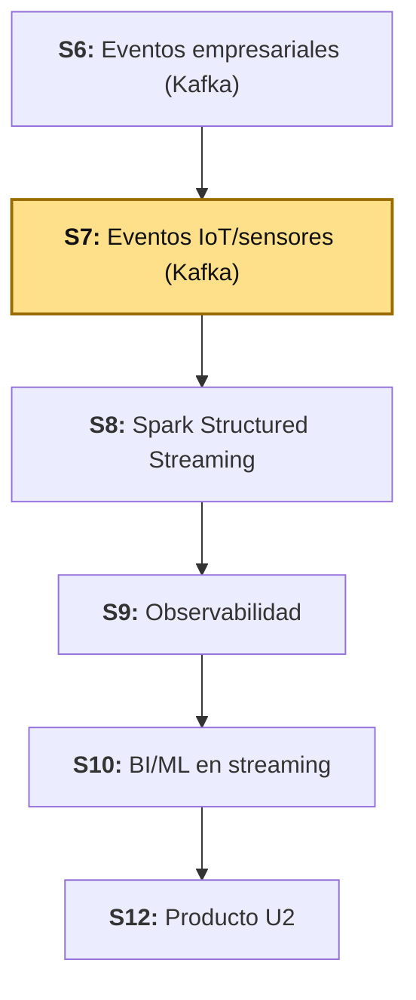
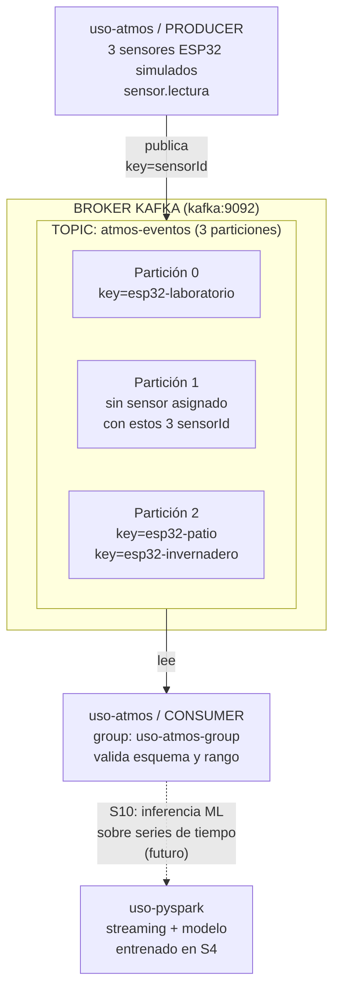
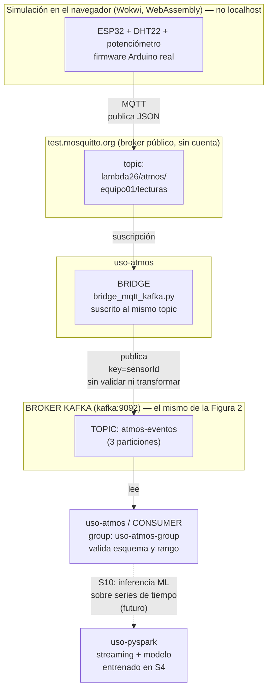
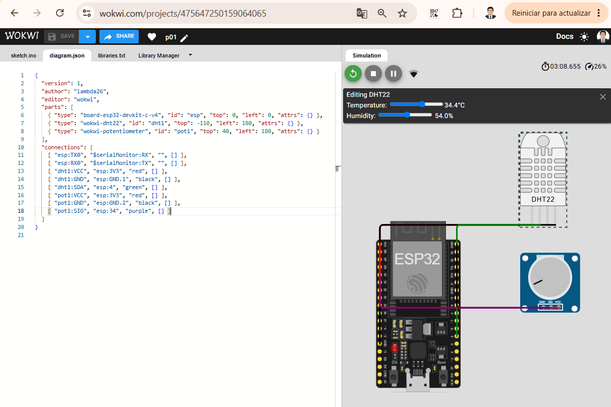
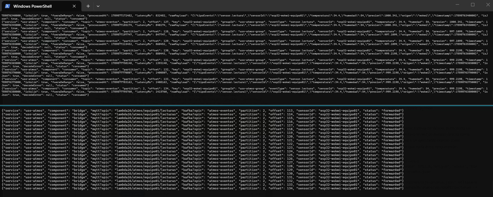

# S7 - Ingesta de Eventos IoT/Sensores en Tiempo Real

## 1. Introducción

### 1.1 Presentación de la sesión

S6 dejó Kafka operativo con un flujo de eventos empresariales: bajo volumen, esquema estable, un evento cada vez que alguien registra una orden. Esta sesión reutiliza exactamente la misma infraestructura de Kafka — el mismo `kafka/compose.yml`, el mismo Kafka UI — para un productor de naturaleza distinta: **telemetría de sensores IoT**. Un sensor no espera a que ocurra un evento de negocio para publicar; publica todo el tiempo, a un ritmo fijo, sin que nadie se lo pida. Esa diferencia de frecuencia y volumen es lo que esta sesión pone a prueba, no un concepto nuevo de Kafka.

El módulo `uso-atmos` trabaja en dos niveles, igual que S6 separó `uso-rapido` (Python simple) de `uso-microserv` (Java "real"). Primero, un simulador en Python publica lecturas de tres sensores atmosféricos ESP32 (temperatura, humedad, presión) directamente en el topic `atmos-eventos` — rápido de levantar, útil para verificar el patrón productor-consumidor y el particionado por dispositivo sin depender de hardware. Segundo, un ESP32 **real simulado en Wokwi** (firmware Arduino de verdad, sensor DHT22 virtual — temperatura y humedad — más un potenciómetro que hace de sensor de presión, ya que Wokwi no tiene una pieza de presión barométrica nativa) publica sus lecturas por **MQTT** — el protocolo que sí habla un microcontrolador — hacia un puente que las reenvía a ese mismo topic de Kafka, sin cambiar ni el esquema ni el consumer. El sílabo de esta sesión pide "simular eventos de sensores o telemetría"; Wokwi es precisamente ese tipo de simulación — de hardware, no solo de datos — y es la que se acerca más a como un dispositivo real terminaría publicando en Kafka: nunca hablando el protocolo de Kafka directamente, siempre a través de un puente. Esta misma fuente de datos es la que S10 va a consumir para entrenar e inferir un modelo de series de tiempo — todo lo que se construye hoy sigue en pie en esa sesión.

### 1.2 Índice

1. Diferencias entre un evento de negocio (S6) y telemetría IoT: frecuencia, volumen, esquema.
2. Particionado por dispositivo (`sensorId` como key), con partición real observada en Kafka UI.
3. Simulación de sensores ESP32 en Python, con lecturas que varían gradualmente (no aleatorias e independientes).
4. Validación de esquema y de rango físico en el consumer.
5. Un ESP32 real simulado en Wokwi, publicando por MQTT a través de un puente hacia Kafka.

### 1.3 Propósito de aprendizaje

Al concluir la clase, estarás en condiciones de:

- **Simular y consumir** eventos de telemetría IoT de alta frecuencia con Apache Kafka, aplicando particionado por dispositivo y validaciones de esquema y de rango físico sobre los datos recibidos, con evidencia verificable de la distribución real de los eventos entre particiones.

### 1.4 Producto de sesión

El módulo `uso-atmos` funcional en sus dos niveles: un productor Python que simula tres sensores ESP32 (`esp32-patio`, `esp32-invernadero`, `esp32-laboratorio`) publicando lecturas de temperatura, humedad y presión en el topic `atmos-eventos` (creado con 3 particiones, una por dispositivo); un ESP32 real simulado en Wokwi (DHT22 + potenciómetro) publicando por MQTT hacia un puente que reenvía sus lecturas al mismo topic; y un consumidor único que valida el esquema y el rango físico de cualquiera de los dos orígenes, con el contrato del evento documentado.

### 1.5 Metodología

**Tabla 1. Metodología de la sesión**

| Actividades a Realizar en el Periodo | Orientaciones generales (Orientaciones Metodológicas) | Material de estudio recomendado |
|---|---|---|
| Revisión previa individual | Confirmar que Kafka (S6) sigue corriendo o volver a levantarlo; crear cuenta gratuita en [wokwi.com](https://wokwi.com); revisar el contrato del evento `orden.creada` de S6 como referencia de formato. Trabajo individual, antes de clase. | Silabo Unidad II, guía de S6 (sección 2.2), este mismo documento (1.1-1.7). |
| Clase presencial | Construcción guiada de `uso-atmos`: productor simulador, consumidor validador, particionado por dispositivo en Kafka UI, y el puente MQTT que conecta un ESP32 real simulado en Wokwi con Kafka. Trabajo individual, siguiendo al docente paso a paso; consulta inmediata ante un evento que no se distribuye como se espera, o ante un ESP32 que no logra publicar. | Pasos 3.1 a 3.8 de esta guía. |
| Evaluación formativa | Revisión en clase de Kafka UI mostrando `atmos-eventos` con sus 3 particiones y mensajes reales, y de los logs del consumer marcando lecturas válidas, inválidas y fuera de rango. La evidencia se completa y sustenta de forma individual, fuera del aula, según los criterios mínimos de la sección 4.4. | Indicaciones de entrega (4.3), rúbrica de evaluación (4.6). |

### 1.6 Motivación de la sesión

#### 1.6.1 Caso: el sensor que mandó un dato imposible

Una planta de monitoreo ambiental instala sensores de temperatura en distintos puntos de su instalación, cada uno publicando una lectura por segundo a un sistema central. Meses después de operar sin problemas, un sensor con un cable suelto empieza a enviar lecturas erráticas: unas veces `null`, otras veces `-999`, otras veces `4500.0` grados. El sistema central, escrito asumiendo que "un sensor siempre manda un número de temperatura válido", explota con una excepción no controlada cada vez que llega uno de esos valores — y como los sensores publican una vez por segundo, el proceso se cae varias veces por minuto hasta que alguien lo nota.

El problema no es el sensor defectuoso — eso va a pasar tarde o temprano con cualquier hardware real. El problema es un consumer que no distingue entre "el dato no tiene la forma esperada" (falta un campo, no es JSON) y "el dato tiene la forma esperada pero el valor no tiene sentido físico" (una temperatura de 4500°C). Los dos son fallas reales y distintas, y ambas necesitan su propio manejo — exactamente lo que construye esta sesión.

**Preguntas de análisis**

**Activación de conocimientos previos**

1. En S6 viste un consumer que no se cae ante un mensaje que no es JSON válido. ¿Alcanza esa misma validación para detectar una temperatura de `4500.0` grados, si el mensaje sí es JSON válido y tiene todos los campos?
2. ¿Por qué un sensor que publica una lectura por segundo representa un problema de volumen distinto al de una orden que se crea cada varios minutos?

**Comprensión de particionado por dispositivo**

1. Si tres sensores publican en el mismo topic `atmos-eventos` usando su propio `sensorId` como `key`, ¿pueden dos sensores distintos terminar en la misma partición? Relaciónalo con 2.2.
2. ¿Qué se rompe si, en vez de usar `sensorId` como key, cada evento se publicara sin key (key nula)?

### 1.7 Ubicación en el curso

- Unidad: U2 - Sistema Big Data en tiempo real: ingesta, streaming, observabilidad y BI/ML.
- Producto del curso: Proyecto Sello: sistema Big Data distribuido end-to-end para procesamiento batch y streaming, analítica/ML, observabilidad y visualización BI para la toma de decisiones.
- Producto de unidad: pipeline en tiempo real con ingesta de eventos empresariales e IoT/sensores, procesamiento streaming con Spark, observabilidad/costos y salidas BI/ML distribuidas.
- Avance del producto en esta sesión: ingesta de telemetría IoT/sensores con Kafka — la fuente de datos que S10 usa para la inferencia de series de tiempo.

**Figura 1. Roadmap del producto de la Unidad II**



## 2. Explica

### 2.1 Arquitectura de la sesión

Esta sesión trabaja únicamente con estos componentes, dentro de `lambda26`:

- `uso-atmos` — simulador Python de sensores ESP32 (productor) y su consumidor validador, sobre el mismo `kafka/` de S6. También aquí vive el puente hacia el broker MQTT público (3.7).
- `uso-atmos/wokwi` — firmware de un ESP32 real simulado en Wokwi (DHT22 + potenciómetro).

En total, **cuatro dispositivos** publican al mismo topic `atmos-eventos`, con el mismo contrato de evento: los 3 sensores ESP32 que simula `producer_sensores.py` en Python (Figura 2) y el ESP32 real simulado en Wokwi (Figura 3), que llega por una ruta distinta — MQTT y un puente — en vez de publicar directo a Kafka.

**Figura 2. Flujo del simulador Python: 3 sensores simulados, particionados por `sensorId`**



El particionado por `key` garantiza **orden**, no reparto parejo: los tres `sensorId` de esta simulación no caen uno por partición — `esp32-patio` y `esp32-invernadero` hashean a la misma partición (2), mientras que `esp32-laboratorio` cae solo en la partición 0, y la partición 1 queda sin uso con este conjunto exacto de 3 llaves. Cada `sensorId` sí conserva su propio orden interno entre lecturas (Kafka nunca reordena los eventos de una misma key dentro de una partición) — solo no reparte el volumen total en partes iguales entre particiones. Con más sensores o con otra elección de `key`, la distribución cambiaría; esto se verifica con datos reales en 3.5, no se memoriza como una regla fija.

**Figura 3. Flujo del dispositivo real simulado: ESP32 (Wokwi) → broker MQTT público → puente → mismo Kafka y consumer de la Figura 2**



Ni el ESP32 (simulado en tu navegador vía Wokwi) ni el bridge (corriendo en tu máquina) exponen nada a internet — los dos solo abren conexiones **salientes** hacia el mismo broker público, que ya está en internet. No hace falta Mosquitto propio, ni túnel, ni tarjeta de crédito, ni cuenta de ningún tipo: es exactamente el mismo patrón productor→broker→consumidor de toda la sesión, con la única diferencia de que este broker no es tuyo — es compartido por cualquiera en internet, por eso el topic incluye un identificador de equipo (`equipo01`), para no mezclar tus mensajes con los de otro grupo del curso que use el mismo broker al mismo tiempo.

El puente no valida nada — reenvía el payload de MQTT a Kafka tal cual llegó. La validación de esquema y de rango físico sigue viviendo en un solo lugar (`consumer_sensores.py`, 3.4): para el consumer, no hay diferencia entre un evento que vino del simulador Python (Figura 2) o de un ESP32 real simulado (Figura 3) — ambos terminan en el mismo topic, con el mismo contrato.

### 2.2 Telemetría IoT: qué cambia frente a un evento de negocio

**Tabla 2. Conceptos de esta sesión**

| Concepto | Qué es |
|---|---|
| `telemetría` | Flujo continuo de mediciones que un dispositivo publica por su cuenta, a un ritmo propio — a diferencia de un evento de negocio (S6), que solo se publica cuando alguien realiza una acción concreta (crear una orden). |
| `frecuencia de publicación` | Cada cuánto tiempo un productor publica un nuevo evento. En `uso-atmos` la controla `SENSOR_INTERVAL_MS`; en un evento de negocio la controla la actividad de los usuarios, no un temporizador. |
| `volumen de eventos` | Cantidad de eventos que llegan a un topic por unidad de tiempo. Escala con la frecuencia y con la cantidad de dispositivos (`SENSOR_IDS`) — un sensor adicional multiplica el volumen sin cambiar el esquema del evento. |
| `esquema evolutivo` | Un esquema de telemetría IoT tiende a cambiar más seguido que uno de negocio: se agregan sensores nuevos, se suman variables (por ejemplo, calidad del aire), o cambia la unidad de una medición. El consumer necesita validar el esquema que sí espera sin asumir que nunca va a cambiar. |
| `validación de rango físico` | Verificar que un valor, además de tener el tipo de dato correcto, tenga sentido físico (una temperatura de `4500.0` es un número válido, pero no una lectura real) — distinta de la validación de esquema (S6, 2.2), que solo confirma que el campo existe. |
| `MQTT` | Protocolo de mensajería liviano, diseñado para hardware con poca memoria y red inestable — el que sí habla un microcontrolador real, a diferencia de Kafka (pensado para brokers de servidor, no para firmware). |
| `puente (bridge)` | Servicio que traduce entre dos sistemas de mensajería que no se hablan directamente — aquí, entre MQTT (lo que publica el ESP32) y Kafka (lo que consume el resto del pipeline). No es parte de Kafka ni de MQTT: es la pieza que los conecta. |

Esta sesión reutiliza sin cambios el resto de conceptos de Kafka de S6 (`topic`, `producer`, `consumer`, `broker`, `partition`, `offset`, `consumer group`, `key`) — ninguna herramienta ni concepto nuevo de Kafka aparece hoy; lo que cambia es el productor y la naturaleza del dato.

**Error frecuente**: validar que un evento tenga la forma correcta (JSON válido, todos los campos presentes) y asumir que eso ya garantiza que los datos "tienen sentido" — un sensor puede enviar JSON perfectamente válido con `"temperatura": 4500.0`, y ese valor va a pasar cualquier validación de esquema sin problema. La validación de rango (2.2, Tabla 2) es un paso aparte, sobre el valor, no sobre la forma del mensaje.

### 2.3 Observabilidad y diagnóstico

Revisar Kafka UI (topic `atmos-eventos`, sus 3 particiones, mensajes por partición y *lag* del consumer group `uso-atmos-group`) y los logs de `uso-atmos` (líneas `component=producer` con `partition`/`sensorId` reales, y `component=consumer` con `status` en `consumed`, `invalid` o `alerta`, según el resultado de cada validación).

## 3. Aplica: actividad práctica guiada

Tiempo: 3h.

**Actividad:** construcción guiada del módulo `uso-atmos` en sus dos niveles — el simulador Python y el ESP32 real simulado en Wokwi conectado por MQTT — sobre la misma infraestructura de Kafka construida en S6 (Producto de la sesión en 1.4).

**Propósito de la actividad:** dejar un productor de alto volumen funcionando con particionado por dispositivo verificado, un consumidor que distingue entre un evento malformado y un evento válido pero fuera de rango físico, y ese mismo consumidor recibiendo datos de un ESP32 real simulado a través de un puente MQTT.

**Orientaciones metodológicas:** en el laboratorio, el docente guía la construcción paso a paso frente a la clase; los estudiantes replican cada paso en su propia laptop, verificando el resultado en Kafka UI antes de avanzar al siguiente.

**Actividades para realizar:**

- **3.1** Verificar que Kafka (S6) sigue corriendo.
- **3.2** Crear `uso-atmos`: Dockerfile, compose y dependencias.
- **3.3** Construir el productor de sensores.
- **3.4** Construir el consumidor de sensores.
- **3.5** Levantar y probar `uso-atmos`.
- **3.6** Documentar el contrato del evento.
- **3.7** Conectar el puente a un broker MQTT público.
- **3.8** Simular un ESP32 real en Wokwi y verificar sus lecturas de punta a punta.

### 3.1 Verificar que Kafka sigue corriendo

**Producto del paso:** confirmación de que el stack de Kafka de S6 sigue disponible, sin volver a construirlo desde cero.

```powershell
docker compose -f kafka/compose.yml ps
```

Debes tener disponibles `lambda26-kafka`, `lambda26-kafka-ui` y `lambda26-kafka-exporter`. Si no aparecen, vuelve a levantarlos (mismo comando de S6, 3.1):

```powershell
docker compose -f kafka/compose.yml up -d
```

### 3.2 Crear `uso-atmos`: Dockerfile, compose y dependencias

**Producto del paso:** carpeta `uso-atmos/` con su propio contenedor Python, conectado a la red de Kafka.

**`uso-atmos/Dockerfile`:**

```dockerfile
FROM python:3.11-slim

ENV PYTHONUNBUFFERED=1

WORKDIR /app

COPY app/requirements.txt .
RUN pip install --no-cache-dir -r requirements.txt

CMD ["sleep", "infinity"]
```

`PYTHONUNBUFFERED=1` evita que Python retenga la salida en un buffer interno antes de imprimirla — sin esto, si alguna vez ves los logs con `docker compose logs -f` en vez de una terminal interactiva, los mensajes pueden tardar en aparecer o llegar todos de golpe.

**`uso-atmos/app/requirements.txt`:**

```text
kafka-python==2.0.2
```

**`uso-atmos/compose.yml`:**

```yaml
name: lambda26-uso-atmos

services:
  uso-atmos:
    build: .
    container_name: lambda26-uso-atmos
    volumes:
      - ./app:/app
    working_dir: /app
    command: sleep infinity
    networks:
      - lambda26-kafka-net

networks:
  lambda26-kafka-net:
    external: true
    name: lambda26-kafka-net
```

Mismo patrón que `uso-rapido/ec-eventos-py` (S6): un contenedor liviano que se queda dormido (`sleep infinity`) y se usa para ejecutar el productor y el consumidor a mano, cada uno en su propia terminal.

### 3.3 Construir el productor de sensores

**Producto del paso:** `producer_sensores.py` simulando 3 sensores ESP32 con lecturas que varían gradualmente.

Crea el topic `atmos-eventos` con **3 particiones** — una por sensor simulado, a diferencia de `orden-eventos`/`pago-eventos` en S6, que usaron 1 sola partición porque el volumen era bajo:

```powershell
docker compose -f kafka/compose.yml exec kafka bash
```

```bash
/opt/kafka/bin/kafka-topics.sh --create \
  --topic atmos-eventos \
  --bootstrap-server kafka:9092 \
  --partitions 3 \
  --replication-factor 1
```

```bash
exit
```

**`uso-atmos/app/producer_sensores.py`:**

```python
import json
import os
import random
import time

from kafka import KafkaProducer


TOPIC_ATMOS = os.getenv("KAFKA_TOPIC_ATMOS", "atmos-eventos")
BOOTSTRAP_SERVERS = os.getenv("KAFKA_BOOTSTRAP_SERVERS", "kafka:9092")
INTERVAL_MS = int(os.getenv("SENSOR_INTERVAL_MS", "3000"))
SENSOR_IDS = os.getenv(
    "SENSOR_IDS", "esp32-patio,esp32-invernadero,esp32-laboratorio"
).split(",")

RANGOS = {
    "temperatura": (5.0, 40.0),
    "humedad": (20.0, 95.0),
    "presion": (995.0, 1025.0),
}
PASO_MAXIMO = {
    "temperatura": 0.3,
    "humedad": 1.0,
    "presion": 0.5,
}

producer = KafkaProducer(
    bootstrap_servers=BOOTSTRAP_SERVERS,
    key_serializer=lambda key: key.encode("utf-8"),
    value_serializer=lambda value: json.dumps(value).encode("utf-8"),
)

print(json.dumps({
    "service": "uso-atmos",
    "component": "producer",
    "bootstrapServers": BOOTSTRAP_SERVERS,
    "sensorIds": SENSOR_IDS,
    "intervalMs": INTERVAL_MS,
    "status": "connected",
}))

# Estado inicial de cada sensor — un ESP32 real no salta de golpe entre
# lecturas; cada ronda avanza un poco desde el valor anterior (caminata
# aleatoria acotada), no un número independiente y sin relación con el previo.
estado = {
    sensor_id: {
        variable: round(random.uniform(*rango), 1)
        for variable, rango in RANGOS.items()
    }
    for sensor_id in SENSOR_IDS
}


def siguiente_valor(valor_actual, variable):
    minimo, maximo = RANGOS[variable]
    paso = PASO_MAXIMO[variable]
    nuevo = valor_actual + random.uniform(-paso, paso)
    return round(min(max(nuevo, minimo), maximo), 1)


while True:
    for sensor_id in SENSOR_IDS:
        lectura = estado[sensor_id]
        for variable in RANGOS:
            lectura[variable] = siguiente_valor(lectura[variable], variable)

        data = {
            "tipoEvento": "sensor.lectura",
            "sensorId": sensor_id,
            "temperatura": lectura["temperatura"],
            "humedad": lectura["humedad"],
            "presion": lectura["presion"],
            "origen": "uso-atmos",
            "timestamp": int(time.time() * 1000),
        }

        metadata = producer.send(TOPIC_ATMOS, key=sensor_id, value=data).get(timeout=10)

        log = {
            "service": "uso-atmos",
            "component": "producer",
            "topic": metadata.topic,
            "partition": metadata.partition,
            "offset": metadata.offset,
            "eventType": data["tipoEvento"],
            "sensorId": sensor_id,
            "timestamp": data["timestamp"],
            "status": "published",
        }

        print(json.dumps(log))

    time.sleep(INTERVAL_MS / 1000)
```

A diferencia del productor de S6 (`producer_ordenes.py`, valores aleatorios independientes en cada mensaje), este productor mantiene un **estado** por sensor (`estado`) y lo hace avanzar de a poco (`siguiente_valor`, una caminata aleatoria acotada al rango físico de `RANGOS`) — así la temperatura de `esp32-patio` no salta de 20°C a 38°C entre una lectura y la siguiente, como no lo haría un sensor real. La `key` del mensaje es el propio `sensorId`, no un campo dentro del payload — eso es lo que permite el particionado por dispositivo de 2.1.

### 3.4 Construir el consumidor de sensores

**Producto del paso:** `consumer_sensores.py` que valida esquema y rango físico, sin caerse ante ninguno de los dos tipos de dato inválido del caso 1.6.1.

**`uso-atmos/app/consumer_sensores.py`:**

```python
import json
import os
import time

from kafka import KafkaConsumer


TOPIC_ATMOS = os.getenv("KAFKA_TOPIC_ATMOS", "atmos-eventos")
GROUP_ID = os.getenv("KAFKA_GROUP_ID", "uso-atmos-group")
BOOTSTRAP_SERVERS = os.getenv("KAFKA_BOOTSTRAP_SERVERS", "kafka:9092")

# Rango físicamente plausible para un sensor real — más ancho que el rango
# simulado del producer (RANGOS en producer_sensores.py), que ya clampea sus
# propios valores. Una lectura fuera de este rango indica un sensor en mal
# estado o un dato corrupto, no una variación climática normal.
RANGO_FISICO = {
    "temperatura": (-20.0, 60.0),
    "humedad": (0.0, 100.0),
    "presion": (900.0, 1100.0),
}


def fuera_de_rango(event):
    for variable, (minimo, maximo) in RANGO_FISICO.items():
        valor = event.get(variable)
        if valor is not None and not (minimo <= valor <= maximo):
            return True
    return False


def deserialize_message(value):
    text = value.decode("utf-8")
    try:
        return {
            "payload": json.loads(text),
            "raw": text,
            "isJson": True,
            "decodeError": None,
        }
    except json.JSONDecodeError as ex:
        return {
            "payload": None,
            "raw": text,
            "isJson": False,
            "decodeError": str(ex),
        }


consumer = KafkaConsumer(
    TOPIC_ATMOS,
    bootstrap_servers=BOOTSTRAP_SERVERS,
    auto_offset_reset="earliest",
    enable_auto_commit=True,
    group_id=GROUP_ID,
    value_deserializer=deserialize_message,
    key_deserializer=lambda key: key.decode("utf-8") if key is not None else None,
)

print(json.dumps({
    "service": "uso-atmos",
    "component": "consumer",
    "topic": TOPIC_ATMOS,
    "groupId": GROUP_ID,
    "bootstrapServers": BOOTSTRAP_SERVERS,
    "status": "listening",
}))

for msg in consumer:
    decoded = msg.value
    event = decoded["payload"] if decoded["isJson"] else {}
    timestamp = event.get("timestamp")
    processed_at = int(time.time() * 1000)
    latency_ms = processed_at - timestamp if timestamp is not None else None
    is_valid = (
        decoded["isJson"]
        and event.get("tipoEvento") is not None
        and event.get("sensorId") is not None
        and event.get("temperatura") is not None
        and event.get("humedad") is not None
        and event.get("presion") is not None
        and timestamp is not None
    )
    alerta = is_valid and fuera_de_rango(event)

    log = {
        "service": "uso-atmos",
        "component": "consumer",
        "topic": msg.topic,
        "partition": msg.partition,
        "offset": msg.offset,
        "key": msg.key,
        "groupId": GROUP_ID,
        "eventType": event.get("tipoEvento"),
        "sensorId": event.get("sensorId"),
        "temperatura": event.get("temperatura"),
        "humedad": event.get("humedad"),
        "presion": event.get("presion"),
        "timestamp": timestamp,
        "isValid": is_valid,
        "fueraDeRango": alerta,
        "processedAt": processed_at,
        "latencyMs": latency_ms,
        "rawPayload": decoded["raw"],
        "isJson": decoded["isJson"],
        "decodeError": decoded["decodeError"],
        "status": "alerta" if alerta else ("consumed" if is_valid else "invalid"),
    }

    print(json.dumps(log))
```

`is_valid` es la misma validación de esquema de S6 (JSON válido, todos los campos requeridos presentes). `fuera_de_rango` es un chequeo aparte, que solo corre **después** de confirmar que el esquema es válido — un evento sin `temperatura` es `invalid` (falla de esquema), mientras que uno con `"temperatura": 4500.0` es `alerta` (esquema correcto, valor físicamente imposible). El `status` final del log distingue los tres casos: `consumed`, `invalid` o `alerta`.

### 3.5 Levantar y probar `uso-atmos`

**Producto del paso:** flujo completo verificado — sensores publicando, particionado real observado en Kafka UI, y los tres estados del consumer (`consumed`, `invalid`, `alerta`) provocados a propósito.

```powershell
docker compose -f uso-atmos/compose.yml up -d --build
```

Contenedor esperado:

```powershell
docker compose -f uso-atmos/compose.yml ps
```

```text
lambda26-uso-atmos
```

Entra al contenedor y ejecuta el consumer primero (queda escuchando):

```powershell
docker compose -f uso-atmos/compose.yml exec uso-atmos python /app/consumer_sensores.py
```

En otra terminal, ejecuta el producer:

```powershell
docker compose -f uso-atmos/compose.yml exec uso-atmos python /app/producer_sensores.py
```

Verifica en la consola del producer una línea por sensor y por ronda:

```text
{"service": "uso-atmos", "component": "producer", "topic": "atmos-eventos", "partition": 2, "offset": 0, "eventType": "sensor.lectura", "sensorId": "esp32-patio", "timestamp": 1789697567664, "status": "published"}
```

Anota la `partition` que aparece junto a cada `sensorId` durante un par de rondas. Con los 3 `sensorId` de esta guía, la distribución real observada es: `esp32-patio` y `esp32-invernadero` caen en la **misma** partición (2), y `esp32-laboratorio` cae solo en la partición 0 — la partición 1 queda sin uso. Esto no es un error: confirma lo explicado en 2.1, que el particionado por `key` garantiza orden por dispositivo, no un reparto parejo entre particiones.

Verifica en la consola del consumer que cada lectura aparece con `status: "consumed"` y su `latencyMs`:

```text
{"service": "uso-atmos", "component": "consumer", "topic": "atmos-eventos", "partition": 2, "offset": 0, "key": "esp32-patio", "groupId": "uso-atmos-group", "eventType": "sensor.lectura", "sensorId": "esp32-patio", "temperatura": 21.3, "humedad": 46.8, "presion": 1007.3, "timestamp": 1789697567664, "isValid": true, "fueraDeRango": false, "processedAt": 1789697568100, "latencyMs": 436, "status": "consumed"}
```

Abre Kafka UI y verifica el topic:

```text
http://localhost:48085
```

- `atmos-eventos` tiene **3 particiones**, con mensajes distribuidos de forma desigual entre ellas (2.1).
- El consumer group `uso-atmos-group` aparece consumiendo las 3 particiones, con *lag* cercano a `0`.

**Error frecuente**: un mensaje malformado. Sin detener el consumer, publica texto plano desde Kafka UI (o desde consola, 3.2 de S6) al topic `atmos-eventos`. El consumer no se cae — lo marca `status: "invalid"` con `rawPayload`/`decodeError` (mismo patrón de S6, 3.4).

Ahora provoca el segundo caso del 1.6.1 — un evento con la forma correcta pero un valor imposible. Sin detener el consumer, publica este mensaje desde Kafka UI (o desde consola):

```json
{"tipoEvento":"sensor.lectura","sensorId":"esp32-patio","temperatura":4500.0,"humedad":50.0,"presion":1010.0,"origen":"uso-atmos","timestamp":1789700000000}
```

Verifica en la consola del consumer que este mensaje sí es JSON válido y tiene todos los campos (`isValid: true`), pero queda marcado aparte:

```text
{"service": "uso-atmos", "component": "consumer", ..., "temperatura": 4500.0, "isValid": true, "fueraDeRango": true, ..., "status": "alerta"}
```

### 3.6 Documentar el contrato del evento

**Producto del paso:** contrato de `sensor.lectura` documentado, mismo formato que S6.

**Tabla 3. Contrato del evento `sensor.lectura`**

Topic:

```text
atmos-eventos
```

Particiones: 3 (una por sensor simulado, ver 2.1 y 3.3).

Productores:

- `uso-atmos` (simulador Python, 3.3).
- ESP32 real simulado en Wokwi, vía el puente MQTT-Kafka (3.7-3.8) — mismo esquema, `origen: "wokwi"` en vez de `"uso-atmos"`.

Consumidor:

- `uso-atmos` (en esta sesión). S10 agrega un segundo consumidor: el streaming de `uso-pyspark` que entrena/aplica el modelo de series de tiempo.

Payload:

```json
{
  "tipoEvento": "sensor.lectura",
  "sensorId": "esp32-patio",
  "temperatura": 21.3,
  "humedad": 46.8,
  "presion": 1007.3,
  "origen": "uso-atmos",
  "timestamp": 1789697567664
}
```

Campos:

| Campo | Tipo | Descripción |
|---|---|---|
| `tipoEvento` | string | Nombre del evento publicado. |
| `sensorId` | string | Identificador del dispositivo — también es la `key` de Kafka. |
| `temperatura` | number | Temperatura en grados Celsius. |
| `humedad` | number | Humedad relativa, en porcentaje. |
| `presion` | number | Presión atmosférica, en hPa. |
| `origen` | string | Quién publicó el evento: `"uso-atmos"` (simulador Python) o `"wokwi"` (ESP32 real simulado). |
| `timestamp` | number | Fecha/hora en milisegundos epoch. |

Key recomendada:

```text
sensorId
```

**Tabla 4. Configuración de `uso-atmos` (variables de entorno)**

| Variable de entorno | Valor por defecto | Aplica a |
|---|---|---|
| `KAFKA_BOOTSTRAP_SERVERS` | `kafka:9092` | producer, consumer y bridge |
| `KAFKA_TOPIC_ATMOS` | `atmos-eventos` | producer, consumer y bridge |
| `SENSOR_INTERVAL_MS` | `3000` | producer — pausa entre rondas de lectura |
| `SENSOR_IDS` | `esp32-patio,esp32-invernadero,esp32-laboratorio` | producer — lista separada por comas |
| `KAFKA_GROUP_ID` | `uso-atmos-group` | consumer |
| `MQTT_HOST` | `test.mosquitto.org` | bridge |
| `MQTT_PORT` | `1883` | bridge |
| `MQTT_USERNAME` | *(vacío, no hace falta en el broker público)* | bridge |
| `MQTT_PASSWORD` | *(vacío, no hace falta en el broker público)* | bridge |
| `MQTT_TOPIC` | `lambda26/atmos/equipo01/lecturas` | bridge |

### 3.7 Conectar el puente a un broker MQTT público

**Producto del paso:** el puente suscrito a un broker MQTT que ya está en internet, sin infraestructura propia — sin Mosquitto, sin túnel, sin tarjeta de crédito.

Un ESP32 simulado en Wokwi corre por completo en tu navegador (la CPU del ESP32 se emula en WebAssembly, del lado del cliente, no en un servidor de Wokwi) — pero sigue sin poder llegar a tu `localhost`: la red WiFi simulada (`Wokwi-GUEST`) solo sale a internet real a través del gateway de Wokwi, nunca hacia tu propia máquina. La alternativa a exponer tu propio broker con un túnel (ngrok exige tarjeta de crédito verificada para túneles TCP incluso en cuenta gratis) es no exponer nada tuyo: que el ESP32 y el puente se conecten los dos, cada uno por su cuenta, a un broker que **ya es público** — `test.mosquitto.org`, sin necesidad de cuenta ni credenciales.

`test.mosquitto.org` es compartido por cualquiera en internet — cualquiera puede publicar o suscribirse a cualquier topic. Para no mezclar tus mensajes con los de otro equipo del curso que use el mismo broker al mismo tiempo, el topic incluye un identificador de equipo:

```text
lambda26/atmos/equipo01/lecturas
```

Cambia `equipo01` por tu propio identificador, tanto acá como en el firmware (3.8).

**`uso-atmos/app/bridge_mqtt_kafka.py`:**

```python
import json
import os
import uuid

import paho.mqtt.client as mqtt
from kafka import KafkaProducer


# test.mosquitto.org es un broker PÚBLICO — cualquiera en internet puede
# publicar o suscribirse a cualquier topic. "equipo01" evita que tus mensajes
# se mezclen con los de otro equipo del curso; cámbialo por tu propio ID.
MQTT_HOST = os.getenv("MQTT_HOST", "test.mosquitto.org")
MQTT_PORT = int(os.getenv("MQTT_PORT", "1883"))
MQTT_USERNAME = os.getenv("MQTT_USERNAME", "")
MQTT_PASSWORD = os.getenv("MQTT_PASSWORD", "")
MQTT_TOPIC = os.getenv("MQTT_TOPIC", "lambda26/atmos/equipo01/lecturas")

KAFKA_BOOTSTRAP_SERVERS = os.getenv("KAFKA_BOOTSTRAP_SERVERS", "kafka:9092")
KAFKA_TOPIC_ATMOS = os.getenv("KAFKA_TOPIC_ATMOS", "atmos-eventos")

# El puente no valida ni transforma el payload — lo reenvía tal cual llegó
# por MQTT. Esquema, rango físico y JSON malformado se validan en un solo
# lugar (consumer_sensores.py), sin duplicar esa lógica aquí.
producer = KafkaProducer(
    bootstrap_servers=KAFKA_BOOTSTRAP_SERVERS,
    key_serializer=lambda key: key.encode("utf-8"),
    value_serializer=lambda value: value,
)


def on_connect(client, userdata, flags, reason_code, properties=None):
    print(json.dumps({
        "service": "uso-atmos",
        "component": "bridge",
        "mqttHost": MQTT_HOST,
        "mqttTopic": MQTT_TOPIC,
        "status": "connected" if reason_code == 0 else f"connect_failed:{reason_code}",
    }))
    client.subscribe(MQTT_TOPIC)


def on_message(client, userdata, msg):
    raw = msg.payload
    try:
        event = json.loads(raw.decode("utf-8"))
        sensor_id = event.get("sensorId") or "desconocido"
    except json.JSONDecodeError:
        sensor_id = "desconocido"

    metadata = producer.send(KAFKA_TOPIC_ATMOS, key=sensor_id, value=raw).get(timeout=10)

    log = {
        "service": "uso-atmos",
        "component": "bridge",
        "mqttTopic": msg.topic,
        "kafkaTopic": metadata.topic,
        "partition": metadata.partition,
        "offset": metadata.offset,
        "sensorId": sensor_id,
        "status": "forwarded",
    }
    print(json.dumps(log))


client = mqtt.Client(mqtt.CallbackAPIVersion.VERSION2, client_id=f"uso-atmos-bridge-{uuid.uuid4().hex[:8]}")
if MQTT_USERNAME and MQTT_PASSWORD:
    client.username_pw_set(MQTT_USERNAME, MQTT_PASSWORD)
client.on_connect = on_connect
client.on_message = on_message

print(json.dumps({
    "service": "uso-atmos",
    "component": "bridge",
    "mqttHost": MQTT_HOST,
    "mqttPort": MQTT_PORT,
    "kafkaBootstrapServers": KAFKA_BOOTSTRAP_SERVERS,
    "status": "starting",
}))

client.connect(MQTT_HOST, MQTT_PORT, keepalive=60)
client.loop_forever()
```

El `client_id` incluye un sufijo aleatorio (`uuid.uuid4().hex[:8]`) por la misma razón que el topic incluye `equipo01`: en un broker público, si dos personas usan el mismo `client_id`, el broker desconecta a la primera cuando la segunda se conecta — MQTT exige que cada `client_id` sea único por broker.

Levanta el contenedor (ya no necesita Mosquitto):

```powershell
docker compose -f uso-atmos/compose.yml up -d --build
```

Ejecútalo:

```powershell
docker compose -f uso-atmos/compose.yml exec uso-atmos python /app/bridge_mqtt_kafka.py
```

Debes ver `status: "connected"`. Prueba el puente sin depender todavía de Wokwi, publicando un mensaje de prueba desde otra terminal. Escribe el JSON a un archivo en vez de pasarlo directo como argumento — PowerShell maltrata las comillas dobles al pasarlas a un ejecutable externo como `docker.exe`, y el mensaje puede llegar a Kafka sin comillas, sin que nada avise ningún error:

```powershell
'{"tipoEvento":"sensor.lectura","sensorId":"esp32-wokwi-equipo01","temperatura":23.4,"humedad":55.2,"presion":1012.8,"origen":"wokwi","timestamp":1789700900000}' | Set-Content -Encoding ascii -NoNewline mensaje-prueba.json

docker run --rm -v "${PWD}\mensaje-prueba.json:/tmp/mensaje-prueba.json" eclipse-mosquitto:2.0.18 mosquitto_pub -h test.mosquitto.org -p 1883 -t lambda26/atmos/equipo01/lecturas -f /tmp/mensaje-prueba.json
```

En la consola del bridge debe aparecer `status: "forwarded"`, y en la del `consumer_sensores.py` (3.4, si lo tienes corriendo), `status: "consumed"` — el consumer no distingue si el mensaje vino de este comando de prueba o de un ESP32 real.

**Error frecuente**: en Kafka UI aparece un mensaje con `key: "desconocido"` y el valor sin comillas (`{tipoEvento:sensor.lectura,...}` en vez de `{"tipoEvento":"sensor.lectura",...}`). No es un bug del bridge ni del consumer — es la prueba de que el JSON ya llegó roto por MQTT, típicamente porque se publicó con `-m "..."` directo en PowerShell en vez del método de archivo (`-f`) de arriba. El bridge reenvía el payload tal cual, sin corregirlo (2.1: "sin validar ni transformar") — por eso el dato malformado también queda malformado en Kafka.

### 3.8 Simular un ESP32 real en Wokwi

**Producto del paso:** un ESP32 real simulado (firmware Arduino, sensor DHT22 virtual — temperatura y humedad) publicando lecturas de punta a punta hasta Kafka. La presión se simula con un **potenciómetro** (gíralo en vivo durante la simulación para cambiar el valor) — Wokwi no tiene ninguna pieza de sensor de presión barométrica nativa (los `chip-bmp280` que aparecen en proyectos de otras personas son *Custom Chips* con archivos propios, no piezas disponibles por defecto).

1. Entra directo a [wokwi.com/projects/new/esp32](https://wokwi.com/projects/new/esp32) — te lleva a un proyecto en blanco con el ESP32 genérico y el sketch de ejemplo (`Hello, ESP32!`). Si en cambio entras a `wokwi.com/esp32` y navegas a mano, **cuidado**: la sección "Featured projects" (arriba) son proyectos de ejemplo de otras personas, no plantillas en blanco — la plantilla correcta está más abajo, en "Starter Templates", y ahí elige la tarjeta que dice solo **"ESP32"** (no S2/S3/C3/C6/H2: son otro chip, con otros pines por defecto, y `diagram.json`/`sketch.ino` no calzan igual).
2. Reemplaza el `sketch.ino` generado por el de `uso-atmos/wokwi/sketch.ino`.
3. Reemplaza el `diagram.json` generado por el de `uso-atmos/wokwi/diagram.json` (agrega el DHT22 en el pin `4` y el potenciómetro en el pin `34` — sin el prefijo `D` que usan otras placas de Wokwi; esta plantilla (`board-esp32-devkit-c-v4`) nombra los GPIO con el número pelado).
4. Click en la pestaña **"Library Manager"** (al lado de `diagram.json`) y agrega, una por una, las 3 librerías de `uso-atmos/wokwi/libraries.txt`: búscalas por nombre y agrega la que coincida exactamente (`PubSubClient` es la de **Nick O'Leary**). No basta con que el archivo `libraries.txt` exista en el proyecto — cada librería se agrega manualmente desde esta pestaña, o la compilación falla con `fatal error: ....h: No such file or directory` aunque el código esté bien. Verifica en "Installed Libraries" que las 3 aparezcan antes de compilar.
5. En `sketch.ino`, cambia `equipo01` (en `MQTT_TOPIC` y en `SENSOR_ID`) por tu propio identificador de equipo — el mismo que usaste en 3.7.
6. Click en **Start Simulation**.

En el Monitor Serial de Wokwi deberías ver la conexión a la red simulada `Wokwi-GUEST` (sin contraseña, con salida real a internet), la sincronización de reloj por NTP, la conexión MQTT, y una línea `Publicado: {...}` cada 5 segundos. Si no ves texto en el Monitor Serial aunque la simulación esté corriendo, revisa la esquina inferior derecha del panel de Simulation — a veces ese panel queda colapsado detrás de un pequeño ícono de flecha (`⌄`).

Tanto el DHT22 como el potenciómetro se pueden ajustar en vivo mientras la simulación corre: click sobre el DHT22 abre un panel "Editing DHT22" con sliders de **Temperature** y **Humidity**; arrastrar el potenciómetro cambia la lectura de presión simulada (`leerPresion()` en `sketch.ino`). Sirve para probar casos de borde — valores fuera de rango físico — y ver cómo los rechaza `consumer_sensores.py`, sin tocar una línea de código.

**Figura 4. Circuito simulado en Wokwi (ESP32 + DHT22 + potenciómetro) con el panel "Editing DHT22"**



El `diagram.json` real, ya cableado: DHT22 (`VCC`→`3V3`, `GND`→`GND`, `SDA`→pin `4`) y potenciómetro (`VCC`→`3V3`, `GND`→`GND`, `SIG`→pin `34`), ambos alimentados por el ESP32 (`board-esp32-devkit-c-v4`).

Verifica de punta a punta: el log del bridge (3.7) debe mostrar `status: "forwarded"` por cada lectura del ESP32 simulado, y `consumer_sensores.py` (3.4) debe procesarla con `status: "consumed"` — mismo esquema, misma validación de rango, sin ningún cambio de código respecto al simulador Python. En dos terminales separadas, con la simulación de Wokwi corriendo:

```powershell
docker compose -f uso-atmos/compose.yml exec uso-atmos python /app/consumer_sensores.py
```

```powershell
docker compose -f uso-atmos/compose.yml exec uso-atmos python /app/bridge_mqtt_kafka.py
```

**Figura 5. Verificación de punta a punta: consumer (arriba, `status: "consumed"`) y bridge (abajo, `status: "forwarded"`) recibiendo las lecturas reales del ESP32 simulado**



Cada lectura del ESP32 (`sensorId: esp32-wokwi-equipo01`) pasa primero por el bridge (`status: "forwarded"`, con el `offset` de Kafka asignado) y luego por el consumer (`status: "consumed"`, con `isValid: true` y `fueraDeRango: false`) — la misma cadena que ya se probó con el mensaje de prueba manual (3.7), ahora con datos reales del dispositivo simulado.

**Error frecuente**: las lecturas dejan de llegar (el consumer y el bridge quedan sin mensajes nuevos) sin ningún error visible en el Monitor Serial. Como la CPU del ESP32 se emula en el navegador, Wokwi **pausa la simulación entera** (WiFi y MQTT incluidos) en cuanto la pestaña deja de estar activa — al minimizar la ventana, cambiar de pestaña o bloquear la pantalla. Es una limitación conocida y sin solución del lado de Wokwi (no de tu firmware ni de tu cuenta): mantén la pestaña de Wokwi visible y en primer plano mientras dure la prueba de punta a punta.

**Error frecuente**: `fatal error: ....h: No such file or directory` — alguna librería del paso 4 no quedó realmente agregada (revisa "Installed Libraries" en el Library Manager). **Error frecuente**: una pieza aparece como un recuadro verde que dice "Missing chip Breakout" en vez de dibujarse — esa pieza no existe de verdad en el catálogo de Wokwi (le pasó a `wokwi-bmp280` y a otros nombres inventados de BMP280); usa solo piezas confirmadas como las de esta guía. **Error frecuente**: el Monitor Serial también puede quedar tapado por el panel "Editing DHT22" si lo dejaste abierto — ciérralo con la `X` de su esquina superior derecha.

## 4. Crea: actividad autónoma

Tiempo: 3h fuera del aula.

### 4.1 Actividad

Aplicación del patrón de ingesta IoT de esta sesión al **Proyecto Sello**, con un sensor **real** — no simulado en Wokwi.

Completa y evidencia estas tareas:

1. Sobre el problema de datos de tu propio Proyecto Sello (brief técnico-analítico de S2), identifica qué variable física necesita medir tu sistema (temperatura, humedad, distancia, luz, vibración, u otra según tu dominio) y consigue un sensor **real** que la mida — un ESP32/Arduino con un sensor físico de verdad conectado, el sensor propio de tu celular publicado por MQTT, o cualquier otra fuente de datos física real. No vale un componente simulado en Wokwi.
2. Diseña el contrato de evento **propio de tu Proyecto Sello** (no `sensor.lectura` de `atmos-eventos`), con el mismo criterio de 3.6: campos, tipos y unidades explícitos.
3. Construye tu propio productor o puente que publique las lecturas reales de tu sensor hacia un topic de Kafka propio de tu Proyecto Sello, replicando el patrón dispositivo→MQTT→puente→Kafka de 3.7-3.8 (o dispositivo→Kafka directo, si tu sensor sí puede correr un cliente Kafka).
4. Construye el consumer correspondiente, separando validación de esquema y de rango físico (2.2) igual que `consumer_sensores.py`, pero sobre tu propio contrato.
5. Verifica de punta a punta con datos **reales** (no simulados) y evidencia la distribución de particiones en Kafka UI.

### 4.2 Propósito

Que cada estudiante demuestre, con hardware o datos reales de su propio Proyecto Sello — sin depender de un simulador como Wokwi —, que puede replicar el patrón completo de ingesta IoT (dispositivo → MQTT/Kafka → puente → validación de esquema y rango) sobre su propia fuente de datos, dejando lista la ingesta real que su Proyecto Sello va a necesitar en las unidades siguientes.

### 4.3 Indicaciones

Entrega un PDF:

```text
S07_Equipo##_ApellidoNombre.pdf
```

#### 4.3.1 Estructura del informe

**Datos del estudiante**

- Nombre:
- Equipo:
- Sesión: S07 - Ingesta de Eventos IoT/Sensores en Tiempo Real
- Rol o aporte realizado:
- Link de GitHub:

**Evidencia técnica**

1. Sensor físico real conectado y funcionando (foto o video corto del hardware real — no de una simulación en Wokwi).
2. Kafka UI con el topic propio del Proyecto Sello y su distribución de particiones.
3. Logs de tu productor/puente y de tu consumer, con lecturas reales (no simuladas) llegando de punta a punta.
4. Contrato de evento propio del Proyecto Sello, documentado (4.1, punto 2).
5. Evidencia de al menos una validación de rango físico provocada sobre un valor real fuera de rango.

**Reflexión técnica breve**

```text
¿Qué tuviste que resolver para pasar de un sensor simulado en Wokwi a uno
real que tu Proyecto Sello va a usar de verdad, y por qué el mismo patrón
dispositivo -> MQTT/Kafka -> puente -> validación siguió funcionando sin
cambios de fondo?
```

### 4.4 Criterios mínimos de aceptación

- El archivo respeta el nombre solicitado.
- Sensor real conectado y publicando datos reales — no un componente simulado en Wokwi.
- Contrato de evento propio del Proyecto Sello, documentado.
- Productor/puente y consumer propios, con separación de validación de esquema y de rango físico.
- Evidencia de al menos una alerta de rango provocada sobre un valor real.
- Reflexión técnica breve incluida.

### 4.5 Preguntas de defensa

1. ¿Por qué tu sensor real no puede publicar directamente en Kafka, y qué rol cumple tu propio puente MQTT-Kafka?
2. ¿Qué diferencia hay, en tu consumer, entre un evento `invalid` (falla de esquema) y uno con una alerta de rango físico?
3. ¿En qué te basaste para definir el rango físico plausible de tu sensor real, y qué pasaría si lo dejaras sin validar?
4. ¿Qué cambiaría en tu contrato de evento si tu Proyecto Sello agrega un segundo sensor real de otra naturaleza?
5. ¿Por qué esta sesión simuló primero el dispositivo en Wokwi antes de pedirte conectar el sensor real de tu Proyecto Sello?

### 4.6 Rúbrica de evaluación

**Tabla 5. Rúbrica de evaluación**

| Criterio | Peso (%) | A (20 pts) | B (15 pts) | C (10 pts) | D (5 pts) | Nivel obtenido |
|---|---:|---|---|---|---|---:|
| 1. Sensor real conectado | 25 | Sensor físico real funcionando y evidenciado con claridad (no simulado). | Sensor real funcionando, evidencia parcial. | Sensor real conectado con fallas o evidencia insuficiente. | No conecta un sensor real. | |
| 2. Contrato de evento propio | 25 | Contrato propio del Proyecto Sello bien definido y documentado. | Contrato definido, documentación incompleta. | Contrato incompleto o poco claro. | No define un contrato propio. | |
| 3. Productor/puente y consumer propios | 25 | Implementados y funcionando de punta a punta con datos reales. | Implementados, con al menos un tramo simulado o incompleto. | Implementación parcial. | No implementa productor/puente ni consumer propios. | |
| 4. Validación de rango y reflexión | 25 | Alerta de rango provocada y evidenciada con claridad; reflexión sólida sobre real vs. simulado. | Evidencia parcial de la alerta o reflexión genérica. | Uno de los dos ausente. | No presenta ninguno de los dos. | |

Nota final = suma de (`Peso` / 100 × `Puntos del nivel obtenido`) = ____ / 20.

## 5. Cierre

Tiempo: 10 min.

**Resumen breve:** hoy el mismo Kafka de S6 recibió un productor de naturaleza distinta — alta frecuencia, mayor volumen, particionado real por dispositivo — y el consumer aprendió a distinguir un dato con la forma incorrecta de un dato con la forma correcta pero un valor imposible. Además, un ESP32 real simulado en Wokwi llegó hasta ese mismo topic a través de un puente MQTT-Kafka, sin que el consumer necesitara enterarse de la diferencia.

**Dinámica participativa:** cada estudiante comparte en qué partición cayó `esp32-laboratorio` en su propia ejecución de 3.5 — ¿coincidió con la partición 0 de esta guía, o el hash dio un resultado distinto en su máquina?

**Metacognición:** ¿en qué momento de hoy hubieras validado solo el esquema de un evento, sin pensar en validar también el rango de sus valores — y qué símbolo concreto del caso 1.6.1 se te habría pasado por alto?

**Proyección:** S8 conecta Spark Structured Streaming como un segundo consumidor de estos mismos topics (`orden-eventos`, `pago-eventos`, `atmos-eventos`), aplicando ventanas y watermarking sobre el volumen que hoy se generó. S10 va un paso más allá: entrena e infiere un modelo de series de tiempo directamente sobre `atmos-eventos`.

## Bibliografía

1. Apache Software Foundation. (2024). *Apache Kafka Documentation*. https://kafka.apache.org/documentation/
2. Kreps, J., Narkhede, N., & Rao, J. (2011). *Kafka: A Distributed Messaging System for Log Processing*. LinkedIn.
3. Confluent. (2024). *Kafka Python Client Documentation*. https://kafka-python.readthedocs.io/
4. OASIS. (2019). *MQTT Version 5.0 Specification*. https://docs.oasis-open.org/mqtt/mqtt/v5.0/mqtt-v5.0.html
5. Eclipse Foundation. (2024). *Eclipse Mosquitto Documentation*. https://mosquitto.org/documentation/
6. Wokwi. (2024). *Wokwi Documentation*. https://docs.wokwi.com/
