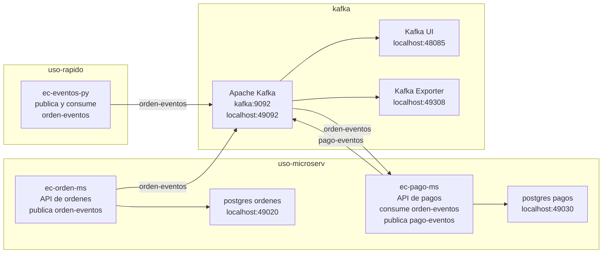
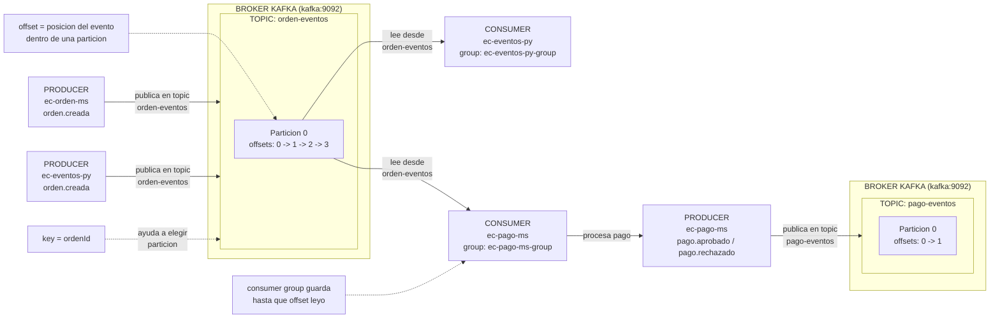

# Taller: Aplicaciones de Microservicios Orientados a Eventos

## 1. Titulo

Implementacion de un flujo orientado a eventos con Apache Kafka, Python y microservicios Spring Boot para un caso de e-commerce.

## 2. Alcance del taller

Este taller trabaja unicamente con estos modulos del repositorio `lambda26`:

- `kafka`
- `uso-rapido/ec-eventos-py`
- `uso-microserv/ec-orden-ms`
- `uso-microserv/ec-pago-ms`

## 3. Objetivo

Implementar y validar una aplicacion de microservicios orientada a eventos usando Apache Kafka, mediante tres niveles de practica:

- pruebas manuales con producer y consumer dentro del contenedor Kafka
- pruebas rapidas con producer y consumer en Python
- integracion entre microservicios Spring Boot, donde un servicio publica eventos de ordenes y otro los consume para generar eventos de pagos

## 4. Herramientas utilizadas

- Apache Kafka
- Docker Compose
- Kafka UI
- Python
- Spring Boot
- Java 21
- Maven Wrapper
- PostgreSQL
- PowerShell
- Navegador web

## 5. Arquitectura del taller

Este taller usa solo una parte de la arquitectura lambda26 v2026-1. Aqui se muestran unicamente los componentes necesarios para trabajar eventos con Kafka, Python y microservicios Spring Boot.

Para ver la arquitectura completa del laboratorio, revisa la [documentacion general de lambda26](https://262bigdata.github.io/lambda26/).



Lectura del diagrama:

- `kafka` es el broker central donde se publican y consumen eventos.
- `ec-eventos-py` permite practicar rapido el patron producer/consumer.
- `ec-orden-ms` expone una API para crear ordenes y publica `orden.creada`.
- `ec-pago-ms` consume `orden.creada`, simula el pago y publica un evento de pago.
- Los microservicios no tienen puerto fijo en la arquitectura; en esta practica se usan puertos locales solo por el perfil `dev`.
- Kafka UI permite inspeccionar topics, mensajes y consumer groups desde el navegador.

### 5.1 Caso de uso final

Al final del taller se simula un flujo simple de e-commerce. No se empieza por aqui; primero se valida Kafka manualmente y luego se practica con Python.

1. `ec-orden-ms` registra una orden.
2. `ec-orden-ms` publica un evento `orden.creada` en el topic `orden-eventos`.
3. Kafka distribuye el evento.
4. `ec-pago-ms` consume `orden-eventos`.
5. `ec-pago-ms` procesa un pago simulado.
6. `ec-pago-ms` publica `pago.aprobado` o `pago.rechazado` en el topic `pago-eventos`.

### 5.2 Fundamento teorico breve

Ten presentes estos conceptos:

- `topic`: canal logico donde se publican mensajes.
- `producer`: aplicacion que envia eventos a Kafka.
- `consumer`: aplicacion que lee eventos desde Kafka.
- `broker`: servidor Kafka que almacena y distribuye eventos.
- `consumer group`: grupo que comparte el avance de lectura de un topic.
- `event`: registro de algo que ya ocurrio en el sistema.
- `key`: clave usada por Kafka para decidir la particion del mensaje.

El siguiente grafico resume la relacion entre producer, broker, topics, particiones, offsets y consumer:



Lectura rapida del grafico:

- El grafico separa los topics en dos bloques para facilitar la lectura; ambos bloques representan el mismo servicio Kafka `kafka:9092`.
- Un `producer` envia eventos hacia un `topic`.
- Una aplicacion puede ser `producer` y `consumer` a la vez; en este taller `ec-pago-ms` consume ordenes, procesa el pago internamente y publica el resultado.
- Un `topic` puede dividirse en `particiones`; en esta practica se trabaja con una sola particion por topic para simplificar la lectura.
- Kafka ubica cada evento en una particion; si el producer envia una `key`, Kafka la usa para decidir esa particion.
- Cada evento dentro de una particion recibe un `offset`.
- La `key`, por ejemplo `ordenId`, ayuda a decidir en que particion cae el evento.
- Un `consumer group` recuerda hasta que offset avanzo su lectura.

## 6. Flujo de trabajo del taller

El flujo del taller va de lo simple a lo integrado:

1. **Entorno de trabajo:** abrir Docker Desktop, verificar `docker ps` y ubicarse en la carpeta donde se descargo o clono el repositorio `lambda26`.
2. **Kafka base:** levantar el stack Kafka desde `kafka/compose.yml`.
3. **Kafka en consola:** entrar al contenedor Kafka con Bash, crear topics y probar producer/consumer manuales.
4. **Kafka UI:** verificar topics, mensajes y consumer groups desde el navegador.
5. **Python rapido:** ejecutar `uso-rapido/ec-eventos-py` para publicar y consumir eventos desde Python.
6. **Microservicios Spring Boot:** ejecutar `ec-orden-ms` y `ec-pago-ms` en perfil `dev` para validar el flujo orientado a eventos.

En este taller se usa el stack `kafka/`, que es el entorno liviano sin CDC/Debezium. Otros modulos del laboratorio, como PySpark, CDC u observabilidad, se revisan en la documentacion completa de lambda26.

## 7. Desarrollo 6.1: Entorno de trabajo

Ubicate en la raiz del repositorio `lambda26`. En este laboratorio la ruta de ejemplo es:

```powershell
cd C:\262\2629bigdata\lambda26
```

Si descargaste o clonaste el repositorio en otra ubicacion, usa tu propia ruta.

### 7.1 Instalacion minima en Windows

Para este taller se necesita Docker Desktop desde el inicio, porque Kafka, PostgreSQL, Python y los microservicios se levantan con contenedores.

Instala Docker Desktop desde:

[Docker Desktop](https://www.docker.com/products/docker-desktop)

En Windows, Docker Compose se instala junto con Docker Desktop. Para verificar que Docker esta funcionando, abre PowerShell y ejecuta:

```powershell
docker ps
```

Si el comando responde con una tabla de contenedores, Docker esta listo. Si muestra error de conexion, abre Docker Desktop y espera a que el motor termine de iniciar.

Java 21 y VS Code se usan en el paso final para ejecutar los microservicios Spring Boot localmente. En otros escenarios se puede construir la aplicacion dentro de Docker, pero ese modo `prod` no forma parte del alcance operativo de este taller.

Instalar Java 21 con winget:

```powershell
winget install --id EclipseAdoptium.Temurin.21.JDK --exact
```

Cierra y vuelve a abrir PowerShell. Verifica la version de Java:

```powershell
java --version
javac --version
```

Tambien puedes descargar Java 21 desde:

[Adoptium Temurin](https://adoptium.net)

Instalar VS Code con winget:

```powershell
winget install -e --id Microsoft.VisualStudioCode
```

No hace falta instalar Maven aparte: cada microservicio ya trae su propio Maven Wrapper (`mvnw.cmd`), que descarga la version correcta de Maven la primera vez que lo ejecutas. Ubicate en la carpeta donde esta el `pom.xml` del microservicio y ejecuta:

```powershell
.\mvnw.cmd spring-boot:run
```

### 7.2 Como leer los comandos Docker de este taller

En este taller se usan dos tipos de terminal:

| Terminal | Donde se ejecuta | Como reconocerla |
|---|---|---|
| PowerShell | En Windows, fuera de Docker | Los comandos usan `docker compose`, `cd`, `Invoke-RestMethod` |
| Bash del contenedor | Dentro del contenedor Kafka | Los comandos usan rutas como `/opt/kafka/bin/...` |

Cuando veas un bloque `powershell`, ejecutalo en PowerShell:

```powershell
docker compose -f kafka/compose.yml up -d
```

Cuando veas un bloque `bash`, primero debes entrar al contenedor Kafka:

```powershell
docker compose -f kafka/compose.yml exec kafka bash
```

Despues de entrar, ya puedes ejecutar comandos internos de Kafka:

```bash
/opt/kafka/bin/kafka-topics.sh --list --bootstrap-server kafka:9092
```

Comandos Docker Compose que se repetiran:

| Comando | Para que sirve |
|---|---|
| `docker compose -f <archivo> up -d` | Levanta servicios en segundo plano |
| `docker compose -f <archivo> up -d --build` | Construye imagenes y levanta servicios |
| `docker compose -f <archivo> ps` | Muestra si los contenedores estan activos |
| `docker compose -f <archivo> exec <servicio> <comando>` | Ejecuta un comando dentro de un contenedor |
| `docker compose -f <archivo> logs -f <servicio>` | Muestra logs en tiempo real |
| `docker compose -f <archivo> down` | Detiene y elimina los contenedores del stack |

> Importante: Docker debe estar abierto antes de ejecutar los comandos. Si Docker Desktop no esta iniciado, `docker compose` no podra conectarse al motor Docker.

Servicios principales:

| Componente | Valor |
|---|---|
| Kafka broker desde Docker | `kafka:9092` |
| Kafka broker desde el host | `localhost:49092` |
| Kafka UI | `http://localhost:48085` |
| Red Docker compartida | `lambda26-kafka-net` |
| Orden MS | aplicacion Spring Boot `ec-orden-ms` en perfil `dev` |
| Pago MS | aplicacion Spring Boot `ec-pago-ms` en perfil `dev` |

### 7.3 Perfiles y puertos de los microservicios

La arquitectura del taller no fija puertos para los microservicios. En un escenario de despliegue, el puerto de cada instancia puede ser dinamico y la exposicion se resuelve con componentes de plataforma, gateway o descubrimiento de servicios.

En este taller se usa el perfil `dev` para ejecutar los microservicios desde Maven o desde el IDE. Por eso aparecen puertos locales de apoyo:

| Microservicio | Perfil usado en el taller | Puerto local de prueba |
|---|---|---|
| `ec-orden-ms` | `dev` | `http://localhost:49021` |
| `ec-pago-ms` | `dev` | `http://localhost:49031` |

El perfil `prod` no forma parte del alcance operativo del taller. Puede existir en los archivos del proyecto como referencia para despliegue, pero no se desarrolla ni se evalua en esta practica.

Topics del taller:

| Topic | Uso |
|---|---|
| `orden-eventos` | Eventos publicados cuando se crea una orden |
| `pago-eventos` | Eventos publicados cuando se procesa el pago |

## 8. Desarrollo 6.2: Kafka base

Desde la raiz del repositorio:

```powershell
docker compose -f kafka/compose.yml up -d
```

Que hace este comando:

- lee el archivo `kafka/compose.yml`
- descarga las imagenes necesarias si no existen localmente
- crea la red Docker `lambda26-kafka-net`
- levanta Kafka, Kafka UI y Kafka Exporter
- deja los contenedores ejecutandose en segundo plano por el uso de `-d`

Verifica los contenedores:

```powershell
docker compose -f kafka/compose.yml ps
```

Debes tener disponibles:

- `lambda26-kafka`
- `lambda26-kafka-ui`
- `lambda26-kafka-exporter`

## 9. Desarrollo 6.3: Kafka en consola

### 9.1 Crear el topic de trabajo

Desde PowerShell, ingresa al contenedor Kafka:

```powershell
docker compose -f kafka/compose.yml exec kafka bash
```

Este comando no crea topics todavia. Solo abre una terminal Bash dentro del contenedor Kafka.

A partir de este punto, los siguientes comandos se ejecutan dentro del contenedor. Por eso aparecen como `bash`.

Crea el topic `orden-eventos`:

```bash
/opt/kafka/bin/kafka-topics.sh --create \
  --topic orden-eventos \
  --bootstrap-server kafka:9092 \
  --partitions 1 \
  --replication-factor 1
```

Lista los topics:

```bash
/opt/kafka/bin/kafka-topics.sh --list \
  --bootstrap-server kafka:9092
```

Resultado esperado:

```text
orden-eventos
```

> Nota: si un topic ya existe, Kafka mostrara un mensaje de error indicando que ya fue creado. En ese caso continua con el siguiente paso.

Para salir del Bash del contenedor y volver a PowerShell:

```bash
exit
```

### 9.2 Probar producer y consumer manuales

Para esta prueba se necesitan dos terminales.

Terminal 1: desde PowerShell, entra al contenedor Kafka:

```powershell
docker compose -f kafka/compose.yml exec kafka bash
```

Luego, dentro del contenedor, ejecuta un consumer para `orden-eventos`:

```bash
/opt/kafka/bin/kafka-console-consumer.sh \
  --topic orden-eventos \
  --bootstrap-server kafka:9092 \
  --from-beginning
```

Terminal 2: desde PowerShell, entra nuevamente al contenedor Kafka:

```powershell
docker compose -f kafka/compose.yml exec kafka bash
```

Luego, dentro del contenedor, ejecuta el producer:

```bash
/opt/kafka/bin/kafka-console-producer.sh \
  --topic orden-eventos \
  --bootstrap-server kafka:9092
```

Escribe un mensaje de prueba:

```text
hola kafka
```

Verifica que el mensaje aparezca en el consumer.

Si quieres limpiar todo al terminar solo la practica manual, primero sal de los contenedores con `exit` y luego ejecuta desde PowerShell:

```powershell
docker compose -f kafka/compose.yml down -v
```

> Si vas a continuar con Python y microservicios, no ejecutes este comando todavia. Kafka debe permanecer levantado para los siguientes pasos.

## 10. Desarrollo 6.4: Kafka UI

Abre Kafka UI:

```text
http://localhost:48085
```

Verifica:

- el cluster `lambda26` este disponible
- el topic `orden-eventos` exista
- los mensajes manuales aparezcan en `orden-eventos`

## 11. Desarrollo 6.5: Python rapido

El modulo `ec-eventos-py` contiene un producer y un consumer simples para reforzar el flujo Kafka antes de usar Spring Boot.

Desde la raiz del repositorio, levanta el contenedor:

```powershell
docker compose -f uso-rapido/ec-eventos-py/compose.yml up -d --build
```

Ejecuta el consumer:

```powershell
docker compose -f uso-rapido/ec-eventos-py/compose.yml exec ec-eventos-py python /app/consumer_ordenes.py
```

En otra terminal, ejecuta el producer:

```powershell
docker compose -f uso-rapido/ec-eventos-py/compose.yml exec ec-eventos-py python /app/producer_ordenes.py
```

El producer publica eventos continuamente en `orden-eventos`.

Ejemplo de evento:

```json
{
  "tipoEvento": "orden.creada",
  "ordenId": 321,
  "total": 180.0,
  "estado": "PENDIENTE",
  "origen": "python",
  "timestamp": 1713350000000
}
```

Verifica que:

- el producer registre mensajes con `status=published`
- el consumer registre mensajes con `status=consumed`
- Kafka UI muestre mensajes en el topic `orden-eventos`

## 12. Desarrollo 6.6: Microservicios Spring Boot

### 12.1 Levantar el microservicio de ordenes

`ec-orden-ms` registra ordenes en PostgreSQL y publica eventos en `orden-eventos`.

En el alcance del taller se trabaja con el perfil `dev`: Docker Compose levanta solo PostgreSQL y la aplicacion Spring Boot se ejecuta localmente con Maven. El puerto `49021` corresponde a este perfil de practica, no a una regla de arquitectura ni a un despliegue `prod`.

Desde la raiz del repositorio, levanta PostgreSQL de desarrollo:

```powershell
docker compose -f uso-microserv/ec-orden-ms/compose-dev.yml up -d
```

Verifica el contenedor de PostgreSQL:

```powershell
docker compose -f uso-microserv/ec-orden-ms/compose-dev.yml ps
```

Prueba la conexion a la base de datos:

```powershell
docker exec -it lambda26-postgres-ec-orden-dev psql -U ecom -d db_ec_orden_ms -c "SELECT current_database();"
```

Lista las tablas existentes:

```powershell
docker exec -it lambda26-postgres-ec-orden-dev psql -U ecom -d db_ec_orden_ms -c "\dt"
```

> Si aun no ejecutaste la aplicacion, es normal que todavia no aparezca la tabla `ordenes`.

En otra terminal, ubicate en la carpeta del microservicio:

```powershell
cd C:\262\2629bigdata\lambda26\uso-microserv\ec-orden-ms
```

Ejecuta la aplicacion:

```powershell
.\mvnw.cmd spring-boot:run
```

Prueba el endpoint:

```powershell
Invoke-RestMethod `
  -Method Post `
  -Uri "http://localhost:49021/ordenes" `
  -ContentType "application/json" `
  -Body '{"usuarioId":1,"total":100}'
```

Respuesta esperada:

```json
{
  "id": 1,
  "usuarioId": 1,
  "total": 100.0,
  "estado": "PENDIENTE"
}
```

Vuelve a listar las tablas para confirmar que la aplicacion creo la tabla `ordenes`:

```powershell
docker exec -it lambda26-postgres-ec-orden-dev psql -U ecom -d db_ec_orden_ms -c "\dt"
```

Consulta los datos registrados en la tabla `ordenes`:

```powershell
docker exec -it lambda26-postgres-ec-orden-dev psql -U ecom -d db_ec_orden_ms -c "SELECT * FROM ordenes;"
```

Revisa la terminal donde esta corriendo `.\mvnw.cmd spring-boot:run`. Ahi aparecen los logs del productor.

Busca una linea similar:

```text
service=ec-orden-ms component=producer topic=orden-eventos partition=0 offset=0 eventType=orden.creada ordenId=1 timestamp=1713350000000 status=published
```

### 12.2 Levantar el microservicio de pagos

`ec-pago-ms` consume `orden-eventos`, registra el pago en PostgreSQL y publica eventos en `pago-eventos`.

En el alcance del taller se trabaja con el perfil `dev`. El puerto `49031` corresponde a este perfil de practica; `prod` queda fuera del alcance operativo.

En la practica manual solo se creo `orden-eventos`. El topic `pago-eventos` aparecera cuando `ec-pago-ms` publique el primer evento de pago, porque el stack Kafka del taller tiene habilitada la creacion automatica de topics.

Desde la raiz del repositorio, levanta PostgreSQL de desarrollo:

```powershell
docker compose -f uso-microserv/ec-pago-ms/compose-dev.yml up -d
```

Verifica el contenedor de PostgreSQL:

```powershell
docker compose -f uso-microserv/ec-pago-ms/compose-dev.yml ps
```

Prueba la conexion a la base de datos:

```powershell
docker exec -it lambda26-postgres-ec-pago-dev psql -U ecom -d db_ec_pago_ms -c "SELECT current_database();"
```

Lista las tablas existentes:

```powershell
docker exec -it lambda26-postgres-ec-pago-dev psql -U ecom -d db_ec_pago_ms -c "\dt"
```

> Si aun no ejecutaste la aplicacion, es normal que todavia no aparezca la tabla `pagos`.

En otra terminal, ubicate en la carpeta del microservicio:

```powershell
cd C:\262\2629bigdata\lambda26\uso-microserv\ec-pago-ms
```

Ejecuta la aplicacion:

```powershell
.\mvnw.cmd spring-boot:run
```

Vuelve a crear una orden:

```powershell
Invoke-RestMethod `
  -Method Post `
  -Uri "http://localhost:49021/ordenes" `
  -ContentType "application/json" `
  -Body '{"usuarioId":2,"total":150}'
```

Busca en los logs de `ec-pago-ms` lineas similares:

```text
service=ec-pago-ms component=consumer topic=orden-eventos groupId=ec-pago-ms-group eventType=orden.creada ordenId=<id-generado> timestamp=1713350000000 processedAt=1713350000120 latencyMs=120 status=consumed
service=ec-pago-ms component=processor ordenId=<id-generado> estadoPago=APROBADO status=processed
service=ec-pago-ms component=producer topic=pago-eventos partition=0 offset=0 eventType=pago.aprobado ordenId=<id-generado> timestamp=1713350000130 status=published
```

> El pago es simulado. Por eso el evento puede ser `pago.aprobado` o `pago.rechazado`.

Vuelve a listar las tablas para confirmar que la aplicacion creo la tabla `pagos`:

```powershell
docker exec -it lambda26-postgres-ec-pago-dev psql -U ecom -d db_ec_pago_ms -c "\dt"
```

Consulta los datos registrados en la tabla `pagos`:

```powershell
docker exec -it lambda26-postgres-ec-pago-dev psql -U ecom -d db_ec_pago_ms -c "SELECT * FROM pagos;"
```

### 12.3 Verificar eventos desde Kafka UI

Abre:

```text
http://localhost:48085
```

Verifica:

- el topic `orden-eventos` contiene eventos `orden.creada`
- el topic `pago-eventos` contiene eventos `pago.aprobado` o `pago.rechazado`
- el consumer group `ec-pago-ms-group` aparece asociado al consumo de `orden-eventos`

## 13. Contratos de eventos

### 13.1 Evento `orden.creada`

Topic:

```text
orden-eventos
```

Productores:

- `ec-eventos-py`
- `ec-orden-ms`

Consumidor:

- `ec-pago-ms`

Payload:

```json
{
  "tipoEvento": "orden.creada",
  "ordenId": 1,
  "total": 100.0,
  "estado": "PENDIENTE",
  "origen": "ec-orden-ms",
  "timestamp": 1713350000000
}
```

Campos:

| Campo | Tipo | Descripcion |
|---|---|---|
| `tipoEvento` | string | Nombre del evento publicado |
| `ordenId` | number | Identificador de la orden |
| `total` | number | Monto total de la orden |
| `estado` | string | Estado inicial de la orden |
| `origen` | string | Servicio que publico el evento |
| `timestamp` | number | Fecha/hora en milisegundos epoch |

Key recomendada:

```text
ordenId
```

### 13.2 Evento de pago

Topic:

```text
pago-eventos
```

Productor:

- `ec-pago-ms`

Payload aprobado:

```json
{
  "tipoEvento": "pago.aprobado",
  "ordenId": 1,
  "monto": 100.0,
  "estado": "APROBADO",
  "origen": "ec-pago-ms",
  "timestamp": 1713350000000
}
```

Payload rechazado:

```json
{
  "tipoEvento": "pago.rechazado",
  "ordenId": 1,
  "monto": 100.0,
  "estado": "RECHAZADO",
  "origen": "ec-pago-ms",
  "timestamp": 1713350000000
}
```

Campos:

| Campo | Tipo | Descripcion |
|---|---|---|
| `tipoEvento` | string | `pago.aprobado` o `pago.rechazado` |
| `ordenId` | number | Orden relacionada con el pago |
| `monto` | number | Monto procesado |
| `estado` | string | Resultado del pago |
| `origen` | string | Servicio que publico el evento |
| `timestamp` | number | Fecha/hora en milisegundos epoch |

Key recomendada:

```text
ordenId
```
